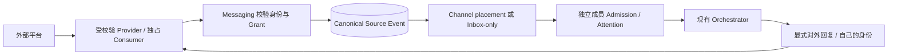

# IM Provider 接入与资格验证

本指南说明 BotHarness 已实现的接入边界，以及新增平台所需的验证证据。产品含义以[产品术语](../../../CONTEXT.zh.md)、[Messaging 架构](../../architecture/botharness-architecture.md)和规范 [#629](https://github.com/BotHarness/BotHarness/issues/629) / [#693](https://github.com/BotHarness/BotHarness/issues/693) 为准。代码契约在 `packages/core/src/messaging/provider.ts`、`dsh-im.ts`；公开 RPC Reference 从代码生成。

面向用户的配置步骤见已验证的 [Lark／飞书接入指南](../../lark-connection.zh.md)。

用户接入 Slack 请参见[带截图的连接指南](../../slack-connection.zh.md)。

## 区分平台层与产品层

DSH 原生 Plugin／Fiber 管理连接与 Service 注册。Service Definition → Provider → Consumer 提供受校验的外部操作；API Gateway 管理 Host／Client 通信。PersonaBot 身份、Grant、Source Event、Channel placement、Inbox Admission 和 Outbox intent 是 **BotHarness 应用定义的持久记录**。

BotHarness 占有账号接收入口时，Provider 不再另起 dsh-im Session。先提交来源、投递位置和适用的 Admission，再确认接收；进程内通知在提交之后发出。接收入口按账号独占，BotHarness 在其内部向已授权会话和路由分发。重试与销毁也必须保持该边界。

## 身份与收件分开

- 每个 PersonaBot 在每个支持的平台绑定最多一个身份，可以同时绑定多个平台。凭据只保留在 DSH 凭据服务，不进入 Client DTO、Git、模型提示或公开证据。
- 授权绑定已检查的账号 fingerprint 和目标 digest，而不是仅凭显示名称或令牌。更换应用、账号或目标需要重新检查并明确绑定；保持身份不变的令牌刷新是另一种情况。
- 频道连接器决定**哪些内容进入哪里**。Group 与 DM Channel 可以有多个路由；Inbox-only 不镜像 PersonaBot DM 历史。同一外部来源可以投递到多个 Channel，但仍只有一个来源权威。
- 共享 Channel 成员可以读取共享来源；外部历史、文件和回复还要求该成员自己有已启用、已授权到原会话的身份。能读来源不代表可以借用接收账号。
- 普通本地 Channel 回复留在本地，只有显式外部回复／文件操作才跨 bridge。平台回执不意味着原生客户端“已读”名单会显示 Bot。

## 明确各平台的字段映射

| 字段     | Lark／飞书                             | 已资格验证的 Slack adapter                                             |
| -------- | -------------------------------------- | ---------------------------------------------------------------------- |
| 账号     | 应用／Bot 身份                         | 已验证的 workspace、App、Bot 与 Bot-user；Socket hello 的 App 必须匹配 |
| 会话     | 原生 chat ID                           | 原生 channel ID，并校验 workspace 与成员资格                           |
| 消息     | 原生 message ID                        | 消息 `ts` 字符串，不转换成浮点数或取整                                 |
| 投递证据 | 原生 event ID                          | 原生 `event_id`；重复投递可能指向同一消息                              |
| 发送人   | 原生 sender ID，尽力解析名字           | 原生 user ID，有界 `users.info` 名称投影                               |
| 话题回复 | 保留平台提供的 thread／root／parent ID | 有 `thread_ts` 时使用它，否则以消息 `ts` 推导回复 root                 |
| Parent   | 平台提供时保留原生 parent message ID   | 没有 Lark 式 parent ID，不虚构                                         |

Thread、root、parent 是路由元数据，不是新的本地 Channel 或独立 Session 存储。子消息仍属于外部会话，并携带准确回复路由。回复一次不会自动跟进话题。无子话题的平台仅使用会话级策略，不制造话题 UI。

Slack 显式跟进复用来源锚定的话题策略。Root 消息可作为未来话题的锚点，但只有 `ts != thread_ts` 的无 @ 子回复才能证明当前接收 lease 的普通回复投递。Slack 要求 root／thread 时间戳相同且没有 parent 字段；Lark 保留原生 parent 要求。Human 的明确跟进／排除优先于 Bot 修改，恢复继承后 Bot 才可再次选择。Grant 迁移至频道连接器后，Profile 仍提供话题表和策略 Modal。跟进复用数量／时间 harvest；退出后未来普通回复恢复群收件规则。重启保留策略，但重新验证进程内投递证明。

名字只用于展示，始终保留 sender ID、外部 message ID 与 canonical Source Event ID 便于定位。Channel bubble 显示原始内容，bubble 外的作者位置显示平台和来源名称；点击来源打开详情 Modal。原始 ID 留在详情中，不作为日常来源名称。

## 收件、唤醒与参与分别判断

内置默认只收 @。全量普通文字收件同时要求原生权限／事件订阅和当前接收 lease 下的新鲜普通消息投递验证。继承“全量收件”本身不证明权限或投递已经有效。

连接器筛选与投递消息。Group 各成员沿用现有 Attention，独立设置按数量／时间汇总、下一安全轮、仅随 @ 阅读或静默读取；Inbox-only 使用外部群策略。Steer／turn 边界与有界、最旧优先的 harvest 仍由现有 runtime 管理。全局默认变更作用于仍继承的配置及后续事件，不改显式覆盖或已提交的 Admission 快照。

停用保留配置与历史，停止新投递；恢复建立新收件边界，不补收暂停期间延迟到达的消息。删除路由不删除历史。身份、Grant 与单条路由开关有不同作用范围。撤销授权或退出 Channel 会使未来操作失效，包括已到发送 fence 前等待的操作。

## 读取、文件与发送保持受校验

- 群／附近／话题历史是有界的、Provider 可见的人类文字覆盖，不是完整 workspace 档案。保留 `omitted`、`hasMore`、coverage 与不透明 cursor。Cursor 必须绑定账号、会话、路由和查询，拒绝跨范围或身份复用。读取历史不会自动形成实时 Inbox Admission。
- Nearby 结合已验证时间窗口与请求的前／后消息最低数量，并服从页数硬上限；繁忙窗口仍可能需要分页，不承诺无限返回全部附近消息。Bot 可在暴露的边界内选择数量。Lark 与 Slack 的分页机制不同。
- 读取文件重新校验来源、账号、附件归属与 resource key，限制字节数并验证下载地址。发送文件在不可逆上传／分享前运行授权 fence。Slack 托管文件与 Lark 父消息文件引用采用不同映射。
- 回复前检查同一账号／目标和准确来源路由，实际发送前检查最新 BotHarness 授权 fence，持久记录已校验的原生回执。网络／结果不确定时标为 **unknown**，不自动重发或改发群主线。
- 抑制或关联自己消息的 echo，避免递归收件。提供稳定、有界的生命周期日志、错误码和耗时，不泄露 token 或整段消息。

## 当前资格验证记录

下表是**开发源码资格验证**，不表示所有已发布安装包都具有相同能力。每次 E2E 记录不可变 Provider SHA 与实际运行产物 hash。[产品 IM 安装](../../product-im-installation.md)固定的是独立验证过的产物；不替换成 fork tip，也不把上游 merge 当成已安装 Profile 自动升级。

| 能力                              | Lark／飞书                                                                                                                                                                                   | Slack                                                                                     | Discord    |
| --------------------------------- | -------------------------------------------------------------------------------------------------------------------------------------------------------------------------------------------- | ----------------------------------------------------------------------------------------- | ---------- |
| 受校验 @ 收件／自己身份原话题回复 | 已验证 [#12](https://github.com/BotHarness/BotHarness/issues/12)                                                                                                                             | 已验证 [#802](https://github.com/BotHarness/BotHarness/issues/802)                        | 未资格验证 |
| 有界群／附近／话题读取            | 已验证 [#612](https://github.com/BotHarness/BotHarness/issues/612)、[#793](https://github.com/BotHarness/BotHarness/issues/793)                                                              | 已验证 [#819](https://github.com/BotHarness/BotHarness/issues/819)                        | 未资格验证 |
| 托管附件处理                      | 已验证 [#657](https://github.com/BotHarness/BotHarness/issues/657)                                                                                                                           | 已验证单个带 @ 附件 [#831](https://github.com/BotHarness/BotHarness/issues/831)           | 未资格验证 |
| 普通群文字与 harvest              | 已验证 [#613](https://github.com/BotHarness/BotHarness/issues/613)                                                                                                                           | 已验证公开频道文字 [#837](https://github.com/BotHarness/BotHarness/issues/837)            | 未资格验证 |
| 全局默认／Profile 覆盖            | 已验证 [#701](https://github.com/BotHarness/BotHarness/issues/701)                                                                                                                           | 已验证 [#843](https://github.com/BotHarness/BotHarness/issues/843)                        | 未资格验证 |
| 共享 Channel 投递                 | 已验证 [#634](https://github.com/BotHarness/BotHarness/issues/634)、[#635](https://github.com/BotHarness/BotHarness/issues/635)、[#638](https://github.com/BotHarness/BotHarness/issues/638) | 已验证 [#845](https://github.com/BotHarness/BotHarness/issues/845)                        | 未资格验证 |
| 自主跟进／退出原生话题            | 已验证 [#614](https://github.com/BotHarness/BotHarness/issues/614)                                                                                                                           | 已验证 [#854](https://github.com/BotHarness/BotHarness/issues/854)                        | 未资格验证 |
| 带 canonical 回执的主动发消息     | 已验证 [#639](https://github.com/BotHarness/BotHarness/issues/639)                                                                                                                           | 已验证根报告与 Human 话题追问 [#863](https://github.com/BotHarness/BotHarness/issues/863) | 未资格验证 |

Slack 私有频道／DM、修改／撤回、普通附件消息、workspace 全局搜索和缺口补收不属于目前公开频道验收范围。已确认范围不包含同步外部撤回；后续读取可报告来源已消失。dsh-im 声称支持某平台不等于 BotHarness 已资格验证。

## 下一平台可复用的验收流程

1. 固定官方 API／源码参考与不可变 Provider build。核对真实 App／账号、会话成员资格、传输身份和 capability 版本。确认准确权限与原生事件订阅；需要扩大安全敏感访问时，在最终步骤取得 Human 确认。
2. 启动隔离、已验证的 DSH Profile，保持一个 receiver；用真实模型 DM 证明模型可用，再判断凭据问题。保留其他任务的 receiver 与凭据。
3. 贯通原生 @ → Provider → canonical Messaging → Inbox／Channel → model → 自己身份原生回复。独立读取回复，确认作者、会话、话题、内容和回执。
4. 验证重复投递、错误账号／会话、旧 Grant／身份、成员退出、路由停用、恢复和重启。一条来源／placement，各成员独立 Admission；不得借身份、意外镜像 DM 或自动重发。
5. 将普通消息 harvest、有界读取、附件与原生话题跟进分别做成可运行切片；验证实际能力，不因为 SDK 有某个方法就全部开放。
6. 基于最新 main 截取支持语言／主题的真实 UI；只公开合成测试消息、去敏断言和准确版本。私密日志／凭据留在本机。PR 附截图或录屏后暂停 Human QA，再扩展下一切片。

Slack 后接入 Discord。其 Gateway 事件／intents、guild／channel／thread 权限、身份与名称映射、消息内容可见性、历史上限和附件处理都需要官方文档与真实、已授权 QA App 的逐项验证。不把 Slack `thread_ts` 或 Lark parent ID 当成 Discord 契约。适合复用的 checked Provider 契约尽量贡献上游；已资格验证的固定 fork 可以继续推进，不依赖上游 merge 时间。

## 原生参考与权限检查

新增能力时重新检查官方契约：[Slack message.channels](https://docs.slack.dev/reference/events/message.channels/)、[Slack 历史与话题](https://docs.slack.dev/messaging/retrieving-messages/)、[Discord Gateway](https://docs.discord.com/developers/events/gateway) 和 [Discord threads](https://docs.discord.com/developers/topics/threads)。这些描述原生行为，实际开放范围仍由更窄的 BotHarness checked Provider 契约控制。

Slack 公开频道 QA App 的 Bot scopes 为 `app_mentions:read`、`chat:write`、`channels:read`、`channels:history`、`users:read`、`files:read`、`files:write`；Socket Mode 单独使用 App-level `connections:write` token。`app_mention` 与 `message.channels` 事件订阅和 scopes 是不同配置；重新安装新增 scope 和保存事件订阅也是不同步骤。纯文字切片不要求文件权限，不借 Human 凭据绕过 Bot 能力拒绝。Lark 群历史权限 `im:message.group_msg` 必须给**应用身份**开通并发布，Human OAuth 登录取得同名权限不代表 Bot 有权限。配置后核对原生成员资格与真实 API 结果，不凭绿色开关推断能力。

## Discord @ 收件／回复检查点 — 2026-10-06

[#855](https://github.com/BotHarness/BotHarness/issues/855) 的实现已合并，但 **Discord 仍未资格验证**。[BotHarness #870](https://github.com/BotHarness/BotHarness/pull/870) 增加 checked @ 收件与原位置回复，[#876](https://github.com/BotHarness/BotHarness/pull/876) 修复身份／Grant／接收状态变化后相邻视图不刷新的问题。[Provider #6](https://github.com/DoodleBears/dsh-im/pull/6) 合并提交为 `1a605b11fa8d321110540de42d58a77bdcd60f13`，与实测候选 `8cf705ea474cdef8e658f7756ee48d5c936bd404` 的 tree 相同。专用 QA Host 使用 `4138eeebffbf7abda53d9cd1ba1ccc98f95e16b1`、DSH `0.2.0-rc.1`；394 个 Provider 运行文件的 SHA-256 为 `69c513ff44fb802377ec7648e9c9075d2fc2c63b6f1c3205ee1d6012f956e58e`。这些是 QA 版本，不表示产品依赖已升级。

真实频道及已有公开 thread 的 @ 消息已贯通一条 canonical Source Event／Inbox Admission、既有 Orchestrator 模型和一条独立原生读回的本身份原位置回复。后续有界检查覆盖身份暂停／恢复、Grant 撤销、真实 Provider Service 丢失／恢复、独占 consumer 冲突、来源编辑，以及发送中的身份／Grant／Provider 丢失。恢复后的新频道和原 thread 模型回复均通过；旧中断请求没有自动重发。Provider 在发送中丢失仍保留 `unknown-outcome`，不能因原生读回未见回复就改称确定未发送。

Human 已明确确认，首次身份绑定与来源授权**尚未由 Human 亲自操作界面完成**。已有配置由授权的 Host 命令建立，不能代替这项验收。来源删除、错误凭据／Application／guild 和强制 Gateway 重投／缺口仍缺少新的原生／模型证据。错误原生路由与真实权限丢失通过调用 Discord API 的 Provider preflight 检查过；这比真实模型尝试回复并被拒绝的证据范围更窄。

见[当前验证范围及历史首片检查点](../verification/discord-855-mention-reply.md)和 [#876 的成对 UI 证据](../../evidence/issue-855-messaging-refresh/README.md)。[ADR-0128](../../adr/0128-discord-checked-replies-preserve-native-child-channel-routing.md) 记录父会话／原生子频道映射。已验证的产品 Provider 和 Discord 其他能力表行保持不变。

早期只读检查使用 [Provider `abaee436`](https://github.com/DoodleBears/dsh-im/tree/abaee436e707c7d9cc7e5cefaa7bd5227321ff55)，其通用 token controller 没有 checked 身份／consumer／回复能力，可能新建独立 thread；该历史输入不是已合并的 checked Provider。当前仅 @ QA 配置使用 `GUILDS`、`GUILD_MESSAGES`，不请求特权 Message Content intent。[Gateway 文档](https://docs.discord.com/developers/events/gateway#message-content-intent) 将提及 App 的消息列为内容限制例外；普通文字与历史读取继续独立验证。[Thread](https://docs.discord.com/developers/topics/threads) 是原生子频道，`parent_id` 不是父消息 ID，发言需要 `SEND_MESSAGES_IN_THREADS`。保留 Snowflake 字符串，核对 guild、父子关系、权限、原消息及回复回执；不能失败后转发父频道或开启 standalone Session。

## 仅在外部发布报告与原话题追问

Bot 显式调用 `bridge_post`，使用自己的已授权 Grant 和稳定 request ID。既有 Outbox 保存报告原文及真实回执；报告不会产生 Channel placement 或自己的 Inbox Admission。重启后仍可通过 `bridge_outbox` 查询。相同 request ID 不会重发已接受或结果不明的意图；结果不明时先核对，不能换 ID 自动重试。

本次 Slack 切片使用既有 `chat:write`，向已加入的公开频道发送纯文本根消息。Provider 在一次不重试的请求前重新核对已认证 Bot 身份、独占 Consumer lease、公开频道成员资格及取消状态。回执使用 Slack 的 `channel` 与 `ts`；后续被收件的 Human 回复通过 `thread_ts`／root ID，在同一 Bot 身份、fingerprint 和频道范围内关联 Outbox 报告。不伪造 Lark 的 `parentId`。追问仍遵守连接器与唤醒策略，发报告不会自动跟进话题；Bot 显式调用 `bridge_reply` 时留在原生话题里。

这项验证没有增加晨报调度器、DM／私密频道发送、富文本 blocks 或自己发言的 echo 补全。自己的 Socket 消息仍不进入收件。固定 fork 的可选契约不依赖上游合并；通用 checked 回执扩展可在此切片审查后贡献上游。

产品 Provider `4.32.0-botharness.3` 独立固定已验证的 Slack 输入 `a0300e97`；#868 验证本地打包后的实际安装。开发源码资格、产品压缩包资格与 npm 发布分别保留证据。开发版固定值变化不会隐式改变产品资格记录。
