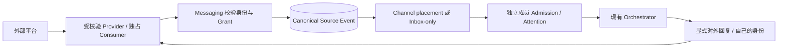

# IM Provider 接入与资格验证

本指南说明 BotHarness 已实现的接入边界，以及新增平台所需的验证证据。产品含义以[产品术语](../../../CONTEXT.zh.md)、[Messaging 架构](../../architecture/botharness-architecture.md)和规范 [#629](https://github.com/BotHarness/BotHarness/issues/629) / [#693](https://github.com/BotHarness/BotHarness/issues/693) 为准。代码契约在 `packages/core/src/messaging/provider.ts`、`dsh-im.ts`；公开 RPC Reference 从代码生成。

面向用户的配置步骤见已验证的 [Lark／飞书接入指南](../../lark-connection.zh.md)。

用户接入 Slack 请参见[带截图的连接指南](../../slack-connection.zh.md)。

## 区分平台层与产品层

DSH 原生 Plugin／Fiber 管理连接与 Service 注册。Service Definition → Provider → Consumer 提供受校验的外部操作；API Gateway 管理 Host／Client 通信。PersonaBot 身份、Grant、Source Event、Channel placement、Inbox Admission 和 Outbox intent 是 **BotHarness 应用定义的持久记录**。

BotHarness 占有账号接收入口时，Provider 不再另起 dsh-im Session。先提交来源、投递位置和适用的 Admission，再确认接收；进程内通知在提交之后发出。接收入口按账号独占，BotHarness 在其内部向已授权会话和路由分发。重试与销毁也必须保持该边界。

## 身份与收件分开

- 每个 PersonaBot 在每个支持的平台绑定最多一个身份，可以同时绑定多个平台。凭据只保留在 DSH 凭据服务，不进入 Client DTO、Git、模型提示或公开证据。
- 授权绑定已检查的账号 fingerprint 和目标 digest，而不是仅凭显示名称或令牌。更换应用、账号或目标需要重新检查并明确绑定；保持身份不变的令牌刷新是另一种情况。
- 频道连接器决定**哪些内容进入哪里**。Group 与 DM Channel 可以有多个路由；Inbox-only 不镜像 PersonaBot DM 历史。同一外部来源可以投递到多个 Channel，但仍只有一个来源权威。
- 共享 Channel 成员可以读取共享来源；外部历史、文件和回复还要求该成员自己有已启用、已授权到原会话的身份。能读来源不代表可以借用接收账号。
- 普通本地 Channel 回复留在本地，只有显式外部回复／文件操作才跨 bridge。平台回执不意味着原生客户端“已读”名单会显示 Bot。

## 明确各平台的字段映射

| 字段     | Lark／飞书                             | 已资格验证的 Slack adapter                                             |
| -------- | -------------------------------------- | ---------------------------------------------------------------------- |
| 账号     | 应用／Bot 身份                         | 已验证的 workspace、App、Bot 与 Bot-user；Socket hello 的 App 必须匹配 |
| 会话     | 原生 chat ID                           | 原生 channel ID，并校验 workspace 与成员资格                           |
| 消息     | 原生 message ID                        | 消息 `ts` 字符串，不转换成浮点数或取整                                 |
| 投递证据 | 原生 event ID                          | 原生 `event_id`；重复投递可能指向同一消息                              |
| 发送人   | 原生 sender ID，尽力解析名字           | 原生 user ID，有界 `users.info` 名称投影                               |
| 话题回复 | 保留平台提供的 thread／root／parent ID | 有 `thread_ts` 时使用它，否则以消息 `ts` 推导回复 root                 |
| Parent   | 平台提供时保留原生 parent message ID   | 没有 Lark 式 parent ID，不虚构                                         |

Thread、root、parent 是路由元数据，不是新的本地 Channel 或独立 Session 存储。子消息仍属于外部会话，并携带准确回复路由。回复一次不会自动跟进话题。无子话题的平台仅使用会话级策略，不制造话题 UI。

Slack 显式跟进复用来源锚定的话题策略。Root 消息可作为未来话题的锚点，但只有 `ts != thread_ts` 的无 @ 子回复才能证明当前接收 lease 的普通回复投递。Slack 要求 root／thread 时间戳相同且没有 parent 字段；Lark 保留原生 parent 要求。Human 的明确跟进／排除优先于 Bot 修改，恢复继承后 Bot 才可再次选择。Grant 迁移至频道连接器后，Profile 仍提供话题表和策略 Modal。跟进复用数量／时间 harvest；退出后未来普通回复恢复群收件规则。重启保留策略，但重新验证进程内投递证明。

名字只用于展示，始终保留 sender ID、外部 message ID 与 canonical Source Event ID 便于定位。Channel bubble 显示原始内容，bubble 外的作者位置显示平台和来源名称；点击来源打开详情 Modal。原始 ID 留在详情中，不作为日常来源名称。

## 收件、唤醒与参与分别判断

内置默认只收 @。全量普通文字收件同时要求原生权限／事件订阅和当前接收 lease 下的新鲜普通消息投递验证。继承“全量收件”本身不证明权限或投递已经有效。

连接器筛选与投递消息。Group 各成员沿用现有 Attention，独立设置按数量／时间汇总、下一安全轮、仅随 @ 阅读或静默读取；Inbox-only 使用外部群策略。Steer／turn 边界与有界、最旧优先的 harvest 仍由现有 runtime 管理。全局默认变更作用于仍继承的配置及后续事件，不改显式覆盖或已提交的 Admission 快照。

停用保留配置与历史，停止新投递；恢复建立新收件边界，不补收暂停期间延迟到达的消息。删除路由不删除历史。身份、Grant 与单条路由开关有不同作用范围。撤销授权或退出 Channel 会使未来操作失效，包括已到发送 fence 前等待的操作。

## 读取、文件与发送保持受校验

- 群／附近／话题历史是有界的、Provider 可见的人类文字覆盖，不是完整 workspace 档案。保留 `omitted`、`hasMore`、coverage 与不透明 cursor。Cursor 必须绑定账号、会话、路由和查询，拒绝跨范围或身份复用。读取历史不会自动形成实时 Inbox Admission。
- Nearby 结合已验证时间窗口与请求的前／后消息最低数量，并服从页数硬上限；繁忙窗口仍可能需要分页，不承诺无限返回全部附近消息。Bot 可在暴露的边界内选择数量。Lark 与 Slack 的分页机制不同。
- 读取文件重新校验来源、账号、附件归属与 resource key，限制字节数并验证下载地址。发送文件在不可逆上传／分享前运行授权 fence。Slack 托管文件与 Lark 父消息文件引用采用不同映射。
- 回复前检查同一账号／目标和准确来源路由，实际发送前检查最新 BotHarness 授权 fence，持久记录已校验的原生回执。网络／结果不确定时标为 **unknown**，不自动重发或改发群主线。
- 抑制或关联自己消息的 echo，避免递归收件。提供稳定、有界的生命周期日志、错误码和耗时，不泄露 token 或整段消息。

## 从实现到连接文档的交付记录

从第一张接入 ticket 就开始积累文档证据，不等功能全部合并后再补截图。以下是每个新 IM 的固定交付流程，本身不代表平台已通过资格验证。

1. **资格验证与配置。** 记录选择的产品／渠道类型、官方契约、原生字段与不可变 Provider 基线。在 IM 协调父票下先开一张首片 tracer，Human 反馈后再扩展能力。实际配置时留存原入口、应用／Bot 创建或扫码入口、权限与安装步骤。区分应用连接、外部身份绑定和频道连接器路由。
2. **持续截图。** 在 `.humanlayer/tasks/<issue>-<provider>/` 维护证据清单。每项标明用途、日期、准确 BotHarness／Provider／运行产物版本、语言、主题、视口与验证状态；适用时关联合成测试输入、canonical Source Event／Admission 和原生回执断言。私密关联值与原始日志不进入公开清单。留存已连接状态、身份绑定、明确来源授权、Inbox／Channel 来源详情以及独立确认的原生回复。空表单、候选构建与真实成功结果分别标注。
3. **每张 tracer 的 PR。** 附 GitHub 可渲染的真实截图或录屏、Human 可操作路径和聚焦回归结果。UI 改动保留条件匹配的前后截图；使用不可变图片 URL，不让后续改动覆盖旧证据。发布前逐张检查图像和说明：不含 token、有效扫码配对码、私密登录链接、凭据、无关聊天或私密账号详情。一次性配对界面可保留脱敏入口／过期状态，并说明省略内容。PR 后暂停等待 Human QA，再扩展范围；合并与部署分别取得授权。
4. **连接指南交付。** 相关运行时和可安装产品路径真实验收后，编写 `docs/<provider>-connection.md` 与维护的 `.zh.md`。说明前置条件、平台专属配置、本机连接、PersonaBot 身份绑定、明确来源授权／路由、简短真实收发验证、排错及尚未验证的能力。选取已审查截图放入 `apps/docs/public/guides/<provider>/`，配步骤说明、有用的替代文字和证据来源。源码构建成功不代表 npm 产品已发布。
5. **文档与线上检查。** 在 `scripts/sync-docs.mjs` 注册中英文版本，不修改生成内容。关联本接入资格指南，保持双语 Release Ledger 一致；页面中文文案改动后重建中文 OG 字体，完成相关文档检查和构建。检查桌面／窄屏、明暗主题、语言切换、干净 `.md` 入口及每张截图。另行授权部署后，核对线上页面／资源与部署源码，并在 issue 记录结果。发布文档不提升未验证能力的状态。

已完成的 [Lark 指南](../../lark-connection.zh.md)和 [Slack 指南](../../slack-connection.zh.md)是范例。历史截图仍保留历史来源；若 UI 变化会误导新用户，就基于最新 main 和已验证数据重拍该步骤，不抹掉旧证据。只有用户能按维护中的指南操作、截图也能在官网正常显示，这个平台的文档交付才算完成。

## 当前资格验证记录

下表是**开发源码资格验证**，不表示所有已发布安装包都具有相同能力。每次 E2E 记录不可变 Provider SHA 与实际运行产物 hash。[产品 IM 安装](../../product-im-installation.md)固定的是独立验证过的产物；不替换成 fork tip，也不把上游 merge 当成已安装 Profile 自动升级。

| 能力                              | Lark／飞书                                                                                                                                                                                   | Slack                                                                                     | Discord                                                                                                         |
| --------------------------------- | -------------------------------------------------------------------------------------------------------------------------------------------------------------------------------------------- | ----------------------------------------------------------------------------------------- | --------------------------------------------------------------------------------------------------------------- |
| 受校验 @ 收件／自己身份原话题回复 | 已验证 [#12](https://github.com/BotHarness/BotHarness/issues/12)                                                                                                                             | 已验证 [#802](https://github.com/BotHarness/BotHarness/issues/802)                        | 已验证 [#855](https://github.com/BotHarness/BotHarness/issues/855)                                              |
| 有界群／附近／话题读取            | 已验证 [#612](https://github.com/BotHarness/BotHarness/issues/612)、[#793](https://github.com/BotHarness/BotHarness/issues/793)                                                              | 已验证 [#819](https://github.com/BotHarness/BotHarness/issues/819)                        | 未资格验证                                                                                                      |
| 托管附件处理                      | 已验证 [#657](https://github.com/BotHarness/BotHarness/issues/657)                                                                                                                           | 已验证单个带 @ 附件 [#831](https://github.com/BotHarness/BotHarness/issues/831)           | 未资格验证                                                                                                      |
| 普通群文字与 harvest              | 已验证 [#613](https://github.com/BotHarness/BotHarness/issues/613)                                                                                                                           | 已验证公开频道文字 [#837](https://github.com/BotHarness/BotHarness/issues/837)            | 未资格验证                                                                                                      |
| 全局默认／Profile 覆盖            | 已验证 [#701](https://github.com/BotHarness/BotHarness/issues/701)                                                                                                                           | 已验证 [#843](https://github.com/BotHarness/BotHarness/issues/843)                        | 未资格验证                                                                                                      |
| 共享 Channel 投递                 | 已验证 [#634](https://github.com/BotHarness/BotHarness/issues/634)、[#635](https://github.com/BotHarness/BotHarness/issues/635)、[#638](https://github.com/BotHarness/BotHarness/issues/638) | 已验证 [#845](https://github.com/BotHarness/BotHarness/issues/845)                        | 已验证一个绑定成员，仅收提及／Message Content OFF [#1054](https://github.com/BotHarness/BotHarness/issues/1054) |
| 自主跟进／退出原生话题            | 已验证 [#614](https://github.com/BotHarness/BotHarness/issues/614)                                                                                                                           | 已验证 [#854](https://github.com/BotHarness/BotHarness/issues/854)                        | 未资格验证                                                                                                      |
| 带 canonical 回执的主动发消息     | 已验证 [#639](https://github.com/BotHarness/BotHarness/issues/639)                                                                                                                           | 已验证根报告与 Human 话题追问 [#863](https://github.com/BotHarness/BotHarness/issues/863) | 未资格验证                                                                                                      |

Slack 私有频道／DM、修改／撤回、普通附件消息、workspace 全局搜索和缺口补收不属于目前公开频道验收范围。已确认范围不包含同步外部撤回；后续读取可报告来源已消失。dsh-im 声称支持某平台不等于 BotHarness 已资格验证。

Discord 共享 Channel [#1054](https://github.com/BotHarness/BotHarness/issues/1054) 验证一个绑定成员、原公开 thread 提及、重叠 Inbox／Channel 去重、暂停／恢复不补录和冷重启，Message Content 保持 OFF。[实际模型／原生证据与恢复](https://github.com/BotHarness/BotHarness/blob/main/docs/dev/verification/discord-1054-shared-channel.zh.md) 区分真实结果与额外成员／重复投递 fixture；不提升普通共享收件资格，也不更新产品 Provider pin。

## 下一平台可复用的验收流程

1. 固定官方 API／源码参考与不可变 Provider build。核对真实 App／账号、会话成员资格、传输身份和 capability 版本。确认准确权限与原生事件订阅；需要扩大安全敏感访问时，在最终步骤取得 Human 确认。
2. 启动隔离、已验证的 DSH Profile，保持一个 receiver；用真实模型 DM 证明模型可用，再判断凭据问题。保留其他任务的 receiver 与凭据。
3. 贯通原生 @ → Provider → canonical Messaging → Inbox／Channel → model → 自己身份原生回复。独立读取回复，确认作者、会话、话题、内容和回执。
4. 验证重复投递、错误账号／会话、旧 Grant／身份、成员退出、路由停用、恢复和重启。一条来源／placement，各成员独立 Admission；不得借身份、意外镜像 DM 或自动重发。
5. 将普通消息 harvest、有界读取、附件与原生话题跟进分别做成可运行切片；验证实际能力，不因为 SDK 有某个方法就全部开放。
6. 基于最新 main 截取支持语言／主题的真实 UI；只公开合成测试消息、去敏断言和准确版本。私密日志／凭据留在本机。PR 附截图或录屏后暂停 Human QA，再扩展下一切片。

Slack 后接入 Discord。其 Gateway 事件／intents、guild／channel／thread 权限、身份与名称映射、消息内容可见性、历史上限和附件处理都需要官方文档与真实、已授权 QA App 的逐项验证。不把 Slack `thread_ts` 或 Lark parent ID 当成 Discord 契约。适合复用的 checked Provider 契约尽量贡献上游；已资格验证的固定 fork 可以继续推进，不依赖上游 merge 时间。

## Discord 有界上下文候选 — 2026-10-06

[#937](https://github.com/BotHarness/BotHarness/issues/937) 在独立开发 Provider 候选中增加显式、受校验的 `bridge_context` group／已有公开 thread Human 文本页。真实模型频道与 thread 读取／回复、原生 cursor 检查及恢复 Message Content 后的拒绝均已通过；重建 Profile 后的最终模型续页（13 + 5 条不重复 Human 消息）、精确原生编辑冲突及整页回滚也已通过，组合的 history/nearby/topic 行保持未取得资格。历史读取需要原生 App Message Content 正文可见性及 `VIEW_CHANNEL`／`READ_MESSAGE_HISTORY`，并继续检查原 Binding/Grant；不启用普通实时收件。已编辑的留存来源拒绝读取冲突，不覆盖证据。参见[最终验收、截图及不可变运行版本](../verification/discord-937-context-reads.zh.md)；产品 Provider pin 不变。

## Discord 原文件候选 — 2026-10-06

[#1002](https://github.com/BotHarness/BotHarness/issues/1002) 在独立开发 Provider 中增加一个直接提及的托管文件与经过校验的原位置结果回复。安全元信息明确 opt-in；重新查询原消息刷新私有 CDN 签名地址，下载和唯一一次不自动重试的 multipart 回复保留身份、原生权限、lease 与 Host 授权校验。输入／输出上限 20 MiB。既有 canonical 保存、原生文件处理、导入及 Bridge Tool 流程继续拥有数据。自动化与真实模型保存／读取／写入／导入／原 thread 文件回复均通过；独立验证 41 字节输入／输出、原件不变、canonical 增量、临时写权限撤销与稳定冷重启。见[候选范围与当前检查](../verification/discord-1002-source-files.zh.md)。产品 Provider pin 和能力表不变。

## 原生参考与权限检查

新增能力时重新检查官方契约：[Slack message.channels](https://docs.slack.dev/reference/events/message.channels/)、[Slack 历史与话题](https://docs.slack.dev/messaging/retrieving-messages/)、[Discord Gateway](https://docs.discord.com/developers/events/gateway) 和 [Discord threads](https://docs.discord.com/developers/topics/threads)。这些描述原生行为，实际开放范围仍由更窄的 BotHarness checked Provider 契约控制。

Slack 公开频道 QA App 的 Bot scopes 为 `app_mentions:read`、`chat:write`、`channels:read`、`channels:history`、`users:read`、`files:read`、`files:write`；Socket Mode 单独使用 App-level `connections:write` token。`app_mention` 与 `message.channels` 事件订阅和 scopes 是不同配置；重新安装新增 scope 和保存事件订阅也是不同步骤。纯文字切片不要求文件权限，不借 Human 凭据绕过 Bot 能力拒绝。Lark 群历史权限 `im:message.group_msg` 必须给**应用身份**开通并发布，Human OAuth 登录取得同名权限不代表 Bot 有权限。配置后核对原生成员资格与真实 API 结果，不凭绿色开关推断能力。

## Discord @ 收件／回复检查点 — 2026-10-06

[#855](https://github.com/BotHarness/BotHarness/issues/855) 的实现已合并，**开发源码的 checked @ 收件／原位置回复已通过资格验证**。[BotHarness #870](https://github.com/BotHarness/BotHarness/pull/870) 增加 checked @ 收件与原位置回复，[#876](https://github.com/BotHarness/BotHarness/pull/876) 修复身份／Grant／接收状态变化后相邻视图不刷新的问题。[Provider #6](https://github.com/DoodleBears/dsh-im/pull/6) 合并提交为 `1a605b11fa8d321110540de42d58a77bdcd60f13`，与实测候选 `8cf705ea474cdef8e658f7756ee48d5c936bd404` 的 tree 相同。此前 QA 检查点使用 Host `4138eeebffbf7abda53d9cd1ba1ccc98f95e16b1`、DSH `0.2.0-rc.1`；394 个 Provider 运行文件的 SHA-256 为 `69c513ff44fb802377ec7648e9c9075d2fc2c63b6f1c3205ee1d6012f956e58e`。这些是 QA 版本，不表示产品依赖已升级。

真实频道及已有公开 thread 的 @ 消息已贯通一条 canonical Source Event／Inbox Admission、既有 Orchestrator 模型和一条独立原生读回的本身份原位置回复。后续有界检查覆盖身份暂停／恢复、Grant 撤销、真实 Provider Service 丢失／恢复、独占 consumer 冲突、来源编辑，以及发送中的身份／Grant／Provider 丢失。恢复后的新频道和原 thread 模型回复均通过；旧中断请求没有自动重发。Provider 在发送中丢失仍保留 `unknown-outcome`，不能因原生读回未见回复就改称确定未发送。

Human 后续明确要求代理直接完成 E2E 验收，取消本人操作与人工 QA 等待条件。代理通过既有 Profile 界面解绑并重新绑定同一已认证账号、授权同一目标、开启仅 @ 收件。随后在真实 Discord 输入框发送的新频道与已有 thread 提及，各产生一次 canonical Admission、一次模型 `bridge_reply` Intent 和一条独立原生读回的本 Bot 原位置回复。这是代理操作界面的验收，不声称 Human 亲自完成了设置。后续真实 Gateway 恢复在 `RESUMED` 前重发同一原生消息 ID，仍只有一次 Admission、一次模型 Intent 和一条原生回复。重连期间的一条真实提及没有补收；移除全部临时观察器并恢复原 Profile 后，新模型回复通过。原生 HTTP 401／404 与已注册 Service 的错误指纹拒绝也已检查，受控输入与完整模型／绑定路径明确区分。后续经授权删除一条真实来源，发现旧 Host 的适配器把确定的 `source-not-found` 误转为结果未知。本次修复保留 `source-not-found` 与 `reply-permission-denied` 的失败状态，旧未知请求保持原样。重启修复后的 Host 后，真实模型在发送权限不足时明确失败；精确恢复全部原权限后，一条新消息收到本 Bot 的原位置回复。修复后的原生 preflight 对实际已删除来源在发送前拒绝。Human 另行确认删除新准备的一条来源后，修复后的真实模型读取保留的原始历史并只回复一次：单个 Intent 明确失败为 `source-not-found`，无回执、无原生回复。随后一条新原生来源收到本 Bot 的原频道唯一回复。随后，两个经原生 API 检查的真实 App／Bot 身份对均连接成功；交叉账号指纹的 Host 绑定命令在 canonical 写入前以 `rebind-required` 拒绝。这验证身份对边界，不声称 Token 互换或分别修改 App／user 字段。Human 创建第二个 QA 服务器并安装原 QA Bot 后，原生检查确认成员身份和回复权限，但该服务器没有 BotHarness Grant：真实提及使已消费 Gateway 计数增加一次，全部 canonical 记录保持一致，原生回复为零。原频道的新模型回复随后通过；最终为 41 条 Admission／36 条 Intent，原授权和历史结果保持一致。Human 最新保存的 Boundary Token 有效；刷新同一账号原先存储的旧凭证后，两个 QA 连接恢复，授权未变。验证页分别记录此前 Host revision 与重新构建的修复后运行版本。

见[当前验证范围及历史首片检查点](../verification/discord-855-mention-reply.md)和 [#876 的成对 UI 证据](../../evidence/issue-855-messaging-refresh/README.md)。[ADR-0128](../../adr/0128-discord-checked-replies-preserve-native-child-channel-routing.md) 记录父会话／原生子频道映射。已验证的产品 Provider 和 Discord 其他能力表行保持不变。

早期只读检查使用 [Provider `abaee436`](https://github.com/DoodleBears/dsh-im/tree/abaee436e707c7d9cc7e5cefaa7bd5227321ff55)，其通用 token controller 没有 checked 身份／consumer／回复能力，可能新建独立 thread；该历史输入不是已合并的 checked Provider。当前仅 @ QA 配置使用 `GUILDS`、`GUILD_MESSAGES`，不请求特权 Message Content intent。[Gateway 文档](https://docs.discord.com/developers/events/gateway#message-content-intent) 将提及 App 的消息列为内容限制例外；普通文字与历史读取继续独立验证。[Thread](https://docs.discord.com/developers/topics/threads) 是原生子频道，`parent_id` 不是父消息 ID，发言需要 `SEND_MESSAGES_IN_THREADS`。保留 Snowflake 字符串，核对 guild、父子关系、权限、原消息及回复回执；不能失败后转发父频道或开启 standalone Session。

## 仅在外部发布报告与原话题追问

Bot 显式调用 `bridge_post`，使用自己的已授权 Grant 和稳定 request ID。既有 Outbox 保存报告原文及真实回执；报告不会产生 Channel placement 或自己的 Inbox Admission。重启后仍可通过 `bridge_outbox` 查询。相同 request ID 不会重发已接受或结果不明的意图；结果不明时先核对，不能换 ID 自动重试。

本次 Slack 切片使用既有 `chat:write`，向已加入的公开频道发送纯文本根消息。Provider 在一次不重试的请求前重新核对已认证 Bot 身份、独占 Consumer lease、公开频道成员资格及取消状态。回执使用 Slack 的 `channel` 与 `ts`；后续被收件的 Human 回复通过 `thread_ts`／root ID，在同一 Bot 身份、fingerprint 和频道范围内关联 Outbox 报告。不伪造 Lark 的 `parentId`。追问仍遵守连接器与唤醒策略，发报告不会自动跟进话题；Bot 显式调用 `bridge_reply` 时留在原生话题里。

这项验证没有增加晨报调度器、DM／私密频道发送、富文本 blocks 或自己发言的 echo 补全。自己的 Socket 消息仍不进入收件。固定 fork 的可选契约不依赖上游合并；通用 checked 回执扩展可在此切片审查后贡献上游。

此前已验收的产品 Provider `4.32.0-botharness.3` 固定已验证的 Slack 输入 `a0300e97`；#868 验证了该本地打包安装。开发源码资格、产品压缩包资格与 npm 发布分别保留证据。开发版固定值变化不会隐式改变产品资格记录。

## 个人微信扫码者文字私聊

微信首片（#878）采用扫码绑定者的文本私聊，不模拟群、@ 或话题。收件前明确绑定身份并授权私聊。原始来源续接信息留在 Provider 私有状态；发送成功记录客户端确认 ID，不伪称原生消息 ID。开发候选为 `589e5507`。源码版已通过真实 Inbox／模型／回复 E2E，并独立核对原生回复。本机安装的产品候选 `0.0.0-test.878`／Provider `4.32.0-botharness.4` 恢复同一授权连接，并通过新一轮文本／模型／回复验证：一条收件记录处理完成、一条回复被接受、无本地 DM 镜像，Human 已确认微信收到回复。Human 已验收首个切片并提供原生截图；公开发布与部署仍是独立动作；上下文、其他联系人和群能力均未开放。

连接步骤与真实截图见[个人微信指南](../../wechat-connection.zh.md)。

### 扫码者文件（#903）

本机安装文件候选固定 fork `8852e87f`，Provider 为 `4.32.0-botharness.5`。单个原生 type-4 文件及可选文字复用 canonical Source Event 与 Bot Inbox。保留精确十进制原生 ID 和平台元数据，MIME 缺失时保持通用类型。AES 密钥、CDN 票据与来源续接信息不能进入模型或 Client；私有来源票据须匹配当前账号、lease、路由及完整保留元数据。流式密文字节与解密后字节都限制为 25 MiB，传输只额外允许加密填充；超限声明仍可展示，但不能下载。

结果文件单独导入既有 canonical 附件。此微信契约要求 `reply-file-fence-checked`：上传完成后、原生发送前再核对应用当前授权。撤销 Grant、身份／lease 替换或来源过期均拒绝发送；诚实记录客户端接受，结果不明不重试。本机安装产品和真实模型已回传 224 字节 ZIP，Human 从微信下载后独立验证内容完全一致，207 字节输入未变；撤销、无效媒体及实际下载上限另有聚焦回归覆盖。这不代表完整原生生命周期矩阵、远端历史、群、图片或主动发送已完成。

### 图片资格验证候选（#904）

微信图片候选独立协商 `sourceImages`；文件收件开关不自动收图片。原生 type-2 图片的 AES 密钥与 CDN 票据留在私有状态；公开元数据不猜扩展名、明文字节数或具体 MIME。先对有界解密字节判断格式，再形成 canonical Attachment 或预览；不能把原生密文的 `mid_size` 当作明文大小。能预览不等于模型已收到图片输入：需要实际调用模型的 DSH 图像能力、原生 `read_image` 和新一轮盲内容识别。模型不支持时应明确拒绝，显式切换模型后再验证恢复。

结果单独导入 canonical 附件。仅微信 checked Provider 接收由实际字节确定的额外 MIME，并选择原生图片发送；其他平台保持已有文件参数形状。CDN 上传后、最终发送前再次检查授权。回归覆盖无效字节／MIME、元数据伪造、独立 opt-in／lease、上传期间撤销、预览拒绝／恢复／资源释放。本机安装产品已通过真实 DeepSeek Flash 图像输入验证：原生 `read_image` 返回 JPEG，模型独立识别实际应用、布局与多处文字。固定官方工具遗漏 scoped `fs` 依赖的问题已通过真实 Cordis Tool Runtime 复现，并用受版本控制的包补丁修复；安装产品随后在同一路径成功读取。独立导入的未修改图片回传同一来源，Human 已确认原微信收到内容一致的原生图片。详见带图[图片指南](../../wechat-connection.zh.md#6-查看图片并回传图片结果)。接收端独立字节核对、最终 PR Human QA 和公开部署仍独立管理。

## 平台原生语音转写

微信 #905 候选增加默认关闭的 `source-voice-transcript-checked` 能力和 `sourceVoiceTranscripts` Consumer 选项。单个已完成的原生语音项沿用现有 Source Event 和 Inbox；Provider 必须保留扫码者、账号指纹、原生消息 ID 与原私聊续接能力。`voice.transcript` 标记 `platform` 或 `unavailable`，可选原生语音项 ID 和时长作为来源信息保留。Client 和模型必须区分平台转写与 Bot 生成内容；同一来源的语音元数据发生变化属于冲突，不能覆盖已提交证据。

原生 `voice_item.text` 可缺失。不得暗中用 ASR 补齐、从附带说明伪造转写、暴露媒体密钥，或在没有独立 checked 音频能力时提供播放器／下载。缺失转写必须明确呈现。未完成／生成中的消息及多项歧义消息不会由此候选收件。首次真实测试提供了平台转写和 7,377 毫秒时长，但沿用的 QA Session 保留上一轮不回复指令；该次仅证明收件，不能证明回复送达。新 QA Session 中的第二条原生语音提供 5,180 毫秒时长，真实 DeepSeek Flash 模型调用 `bridge_read` 与 `bridge_reply`，自身身份 Outbox 被平台接受，Human 确认在原微信私聊收到“蓝色灯塔37”。浅色／深色截图呈现同一来源。这证明 checked 平台转写路径，不是 BotHarness 自行识别音频。

## 受检查的原生视频（#907）

独立协商 `sourceVideos`，并同时要求 `source-video-checked` 与 `reply-video-fence-checked`。保留原生视频项 ID 与平台报告值，不猜测语义：此次收件的 `video_size` 等于解密字节数，官方发送实现却填写加密长度，因此使用 `reportedSizeBytes`；`playLength` 保留原值，不假设单位。不能为了重命名字段改写已有 canonical 证据。

来源播放与处理沿用既有 checked Attachment 路径，原件上限 25 MiB，私有 CDN 票据和密钥留在 Provider。保守核对 MP4 字节后显示浏览器原生控件，不自动播放，保留正文，提供拒绝／重试，关闭时取消请求并释放 Blob URL。播放器、文件检查或模型自述不代表理解视频。结果单独导入 canonical 附件，由行动 Bot 使用当前身份与原 Source 路由回传，在上传后、发送前再次检查授权；Provider 接受不能代替接收端送达证据。

本机安装候选已验证真实视频收件、输入字节完全一致、原生播放，以及经审批的模型文件处理，生成三秒 H.264 结果。Human 已确认原生视频送达，接收端截图呈现相同画面的三秒结果；未宣称接收端下载后的字节完全一致。详见带图[视频指南](../../wechat-connection.zh.md#9-接收原生视频并回传视频结果)。更广的 Channel 历史媒体渲染属于独立切片。

## Discord nearby 开发切片 — #981

下一个隔离 Provider 候选在来源的原生频道或准确公开 thread 中实现 `bridge_context(nearby)`：读取前后五分钟；消息稀疏时，补足所请求的前后 Human 文本最小条数（默认 10／5）。锚点独立于两侧计数；密集窗口需要有界续页，已耗尽的稀疏历史允许少于最小条数，不等待未来消息。签名 cursor 保留固定查询快照，每次成功续页续期 30 分钟；每次读取均检查当前权限和授权。

[#981](https://github.com/BotHarness/BotHarness/issues/981) 跟踪自动化和真实模型资格验证。代理执行的真实模型原生资格验证已在 Core `7edd33e0`／Provider `5ae8bb3b` 通过：三页（11／0／5 条文本）、16 条唯一 Human 文本、准确原 thread 原生回复，无历史 Admission，临时 Message Content 已完整恢复 OFF。最终冷重启保留六张 canonical 表全部字节相同。详见[有界证据报告](../verification/discord-981-nearby-context.zh.md)。产品 Provider pin 和 history／nearby／topic 组合行资格保持不变；不增加普通消息收件或 thread 订阅。

## 原生引用与本地保留上下文（#908）

独立协商 `sourceQuotes`／`source-quote-checked`。分开保留一层原生 `serverMessageId`、`itemId`、内嵌正文、显示摘要、附件类型和局部引用信息；数字 `svr_id` 在 JavaScript 精度丢失前按 JSON 原始字面量保存。去掉 continuation token、媒体密钥和嵌套引用。相同 canonical 原生消息的引用发生改变时，返回来源冲突。

正文缺失时，只由 Messaging 解析：同一当前账号指纹／私聊的可读 canonical Source Event，或带真实服务器回执的已接受 Outbox。不能用 Provider standalone Session 历史、时间就近猜测、客户端确认、摘要或条目 ID 替代。Client／模型区分原生正文、本地解析与不可用；不可用不能证明远端已删除，引用也不是 Thread。

`retained`／`retained-nearby` 沿用 `bridge_context`，明确返回 `coverage: retained-local-sources`，不修改远端 Provider history 契约。Keyset 分页固定首次 canonical 记录边界；进程内 opaque cursor 绑定 Bot、来源、Grant revision、身份指纹、范围与条数。每页重新核对自身身份、当前 Grant／lease 和 Provider 检查结果，在锚点 Source Event 记录有界读取审计，不创建新 Admission 或唤醒。记录／条数限制、过期／重启、字符预算恢复与本地覆盖缺口均应明确。它不是微信远端历史／搜索；原生引用变体以实际收件为证，合成回归不能证明当前客户端的线上字段形状。

微信 #909 把已授权扫码者的**原生私聊**接入既有连接器多目标路由。收件为该授权私聊的消息，不虚构 @ 或话题。本地群聊沿用成员 Attention，私聊 Inbox 与明确的本地 DM 投递沿用 `human-dm`；原生会话类型与本地投递类型独立。共享来源可读不授予接收身份、私密续接或已校验附件读取权限，仍需逐平台真实 E2E。

## 已授权微信纯外部报告（#910）

协商 `receiptVersion: 1` 和 `postFenceVersion: 1`，以及账号能力 `proactive-receipt-checked`、`proactive-fence-checked`。已验证的扫码者私聊复用 canonical post／Outbox；既有独占 Consumer 仍独自拥有轮询和私有上下文，不增加 standalone Session、聊天存储、本地 DM 镜像或新定时系统。

通过公开 Service 契约传递最终应用回调，在原生发送前检查 Provider Registration、账号指纹、启用 Binding／当前 Grant 和取消状态，并与账号切换串行化。只缓存真实扫码者上下文，绑定指纹及原生顺序，不进入公开状态。本地 30 天只限制存储，不承诺服务器有效期；缺失／本地过期在发送前拒绝，原生拒绝明确失败并提示新扫码者消息恢复，网络结果不明保持 unknown，不自动重试。

实际返回的原生 `message_id` 以无损十进制 `serverMessageId` 保存，与标为 `client-acknowledgement` 的生成 ID 分开；二者都不是送达／已读证明。源码和压缩包资格验证须覆盖无新微信触发的唯一报告、Human 独立收件、canonical 后续消息、本地 DM 未变及拒绝／恢复。参见 [ADR-0138](../../adr/0138-wechat-external-reports-use-private-owner-context.md) 和[配图指南](../../wechat-connection.zh.md#12-发送纯外部主动文字报告)。
