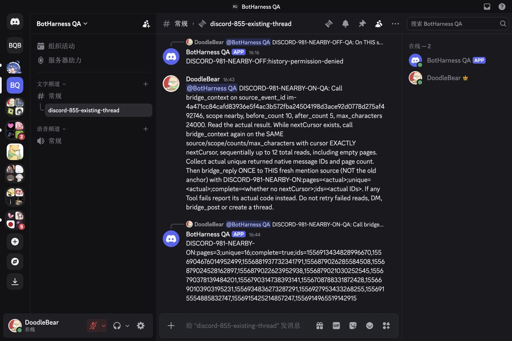
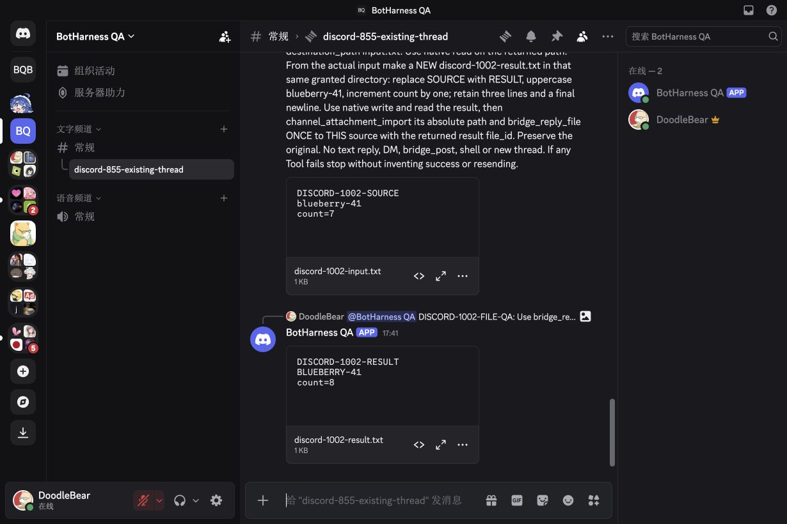
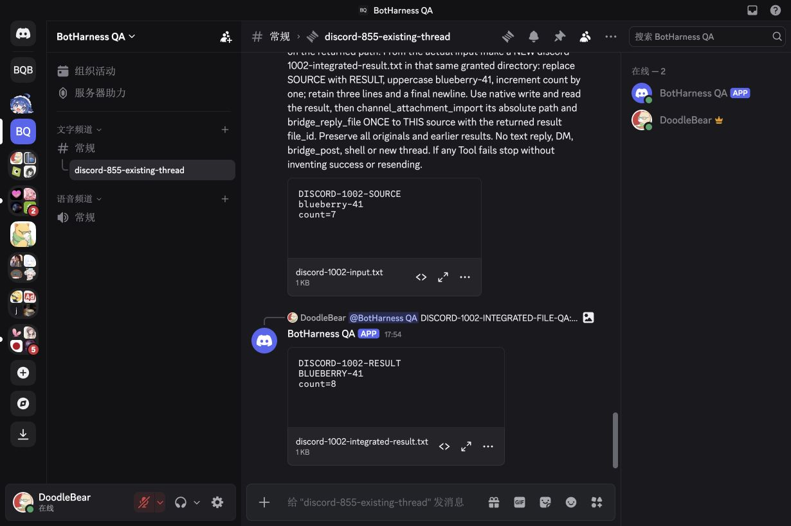

# Discord source file candidate — #1002

This is development-source qualification after merged #981. Agent-operated real model file acceptance passed in the existing public thread with Message Content OFF. Independent byte, native identity/reference, canonical and cold-restart checks passed; the authorized synthetic-file Workspace write permission was revoked afterwards. Product Provider promotion and release remain separate actions.

## Candidate and current checks

- Core runtime/test input: `ed3b385e1c2447184defcf96cd7679edbb75d3cd`, based on merged `2ea403f5910e798023f57cdec8babcfb3f423f68`.
- Provider: `71be2edbe69bcf8cb160af2a812565134383551e`, based on merged Provider #8 `8e1ee97e4b52b062b1ef0f81d1b30ae884f4f5db`.
- Provider build/package verification, 78 Discord checks and 3,606 full tests pass. Host lint, format, type checks, 24 focused tests, full 2,753 tests / 9 skipped and build pass. Evidence/document-only changes are checked separately before PR publication.
- DSH `0.2.0-rc.1`; the persistent Profile reuses the original App, own Bot, Binding, external receiving Grant, parent channel and exact existing public thread. Read-only native permissions already include file upload and thread send; native App flags remain `0`, with Message Content OFF.
- Activating the file candidate preserves all six canonical tables byte-for-byte. The final loaded Provider `lib/index.js` SHA-256 is `341bd577f5510f7f529f9912416c840cf801e7de479df17e93590c21fedee1c1`, matching the exact tested candidate and its installed Profile copy; this final input ran the real file E2E.

## Native file and authority boundary

An opted-in exclusive consumer admits one directly mentioned Human source with one hosted attachment in a guild text channel or existing public thread. It retains opaque attachment identity, original message ID, native resource ID, safe name, positive declared size and optional MIME, never signed URLs. Bot/webhook/ordinary sources and unsupported multi-attachment/ephemeral/malformed sources do not gain file admission. Legacy text consumers keep their envelope.

Reading re-fetches the exact native source and matches its author, parent/thread route, own mention and all retained file metadata. The fresh signed URL must name the exact HTTPS `cdn.discordapp.com/attachments/<channel>/<attachment>/<filename>` route. It receives no Bot credentials, follows no redirects and streams with cancellation, current lease and declared/actual-size checks, bounded to 20 MiB. Revocation cancels a stalled reader and releases its body; missing/replaced/foreign sources refuse before bytes can commit.

A selected independent result rechecks the native source plus VIEW_CHANNEL, READ_MESSAGE_HISTORY, SEND_MESSAGES (or SEND_MESSAGES_IN_THREADS) and ATTACH_FILES. Host authority is checked immediately before one non-retrying multipart send with `fail_if_not_exists=true`. A successful native response must match own Bot author, exact channel, original-message reference and one attachment's identity/name/size. Definite rejection differs from `reply-result-unknown`; unknown outcomes never cause blind retry or fallback.

These are application-defined checked Service capabilities over existing canonical Attachment/Workspace Grant/Outbox contracts. There is no new durable store, schema, native Session, recipient or thread. [Discord's attachment/message contract](https://docs.discord.com/developers/resources/message), [signed CDN and multipart contract](https://docs.discord.com/developers/reference#signed-attachment-cdn-urls) and [permissions](https://docs.discord.com/developers/topics/permissions) are the native references.

## Accepted real file path and cleanup

A real browser upload/direct mention created native Human source `1556949377308954655`, canonical source `im-2f0f979e6a57b4d870a2f23774c3fff6d6bdc27696d55ac4a4a770f60a40df22`. The actual DeepSeek Pro/off model ran seven successful tools: `bridge_read`, `bridge_attachment_save`, native `read`, native `write`, native `read`, `channel_attachment_import`, and one `bridge_reply_file`. It read the three-line original, made a separate result changing SOURCE to RESULT, uppercasing `blueberry-41` and incrementing count 7 to 8, then read that result before importing it. No Shell, text reply, DM post or new thread was used.

Independent native message `1556949481541472256` comes from own Bot `1556613973846007899` in exact existing thread `1556622420222283798`, referencing the fresh Human source, with one new `discord-1002-result.txt` attachment. Credential-free independent native downloads match the expected **41-byte input and 41-byte output**. The canonical original and its working copy retain SHA-256 `ad8c254acefa4370f2f733b7bad0bc05982fc7aa82b6eb7b4877933bc1048285`; the imported result and native output match `3b84ec649ef4be88bf9619adcfa7f1597c25f82ace7a5b28b09218620f631328`. The original and result have distinct canonical file identities.

Canonical comparison adds one Source Event, one Admission and one provider-accepted file Intent. Every prior row remains byte-identical; Binding, receiving Grant and Channel placements are unchanged. Settled counts are 1 Binding / 1 external Grant / 26 Sources / 8 Admissions / 6 Outbox replies / 2 placements; cumulative counts include earlier DM and Memory setup. This result adds no local DM mirror.

The dedicated synthetic-file Workspace write Grant was enabled under explicit Human authorization, then its write permission was revoked after byte verification. Both revocation and a cold restart preserve all six canonical tables byte-for-byte; the Workspace write permission remains false after restart. Native App flags remain `0`, with Message Content OFF throughout. This is one real small hosted text file in a public thread; malformed/multiple/size/permission/revocation/unknown receipt cases have automated coverage, rather than a claim of a complete fresh native matrix or image vision.

**Before — same 1230 × 820 dark Chinese native thread, accepted text checkpoint; no file request/result yet.**

**After — the received original and new own-Bot original-thread result, with native file previews.**

[Sanitized actual Tool/native/byte/canonical/restart proof](../../assets/pr/1002-discord-files/file-model-native-proof.json) includes actual call IDs, distinct file identities, native source/reply/attachment IDs, hashes and authority cleanup without signed URLs or credentials. Agent E2E acceptance is complete; merge, product Provider promotion, publication and deployment remain separate actions.

## Latest Provider integration

Provider main subsequently merged the independent Lark private-chat locator (#9). The candidate preserves that source/test change and regenerates its Host artifact; integrated Provider `7a2f01ff18bd6a185796ed950352f751fd445149` passes build, package verification and **3,607 tests**. The new loaded artifact SHA-256 is `38c08d20f48157525aa4247621f51c5e674f9aec6d388f5c1764bc153b6336f6`.

A separate fresh browser file/direct mention on Core runtime input `82d14bbe3c6aff34ed9bf3b058880deaa562f489` ran the same seven actual successful tools in Turn 8. Native Human trigger `1556952778536919162` has one original attachment; own-Bot result `1556952872799969311` references that exact trigger in the same existing thread and attaches `discord-1002-integrated-result.txt`. Independent downloads again match the same 41-byte golden input/output and hashes. New original `file:2fcd64b4-9af7-48a3-8334-b699986ec7ec` and imported result `file:9b467bb9-da5f-4010-93d4-35ccb8edd4f7` remain distinct. Intent `4b9217cb-a966-4d74-832f-0aeac82180a9` is provider-accepted.

This fresh case independently adds 1 Source / 1 Admission / 1 Outbox, while preserving every earlier row and the Binding, external Grant and placements. Settled counts become 1 / 1 / 27 / 9 / 7 / 2. The same authorized synthetic-directory write permission was revoked again; all six tables remain identical through revocation and cold restart, write stays false and Message Content remains OFF. Original files and the first result remain untouched.

[Sanitized integrated Tool/native/byte/canonical/restart proof](../../assets/pr/1002-discord-files/integrated-file-model-native-proof.json) binds this second real case to its actual Core/Provider inputs; the first proof remains the earlier independently accepted case.

## Core main integration

Core integration `9584e20bf8517149da14bb4a0428c49392b2399a` preserves current main `1f9f6458f7e92654c5b88d87036ad70352a7e8c8`. Real file proofs retain the two actual runtime inputs above. Integration checks found a telemetry-test false positive when a random UUID happened to contain the short fixture name `ada`; the test recorder now uses a fixed anonymous ID while retaining all event-content privacy assertions. No runtime code changes for this test correction. Final PR CI/build results are reported independently and do not replace actual Tool/native-file evidence.
