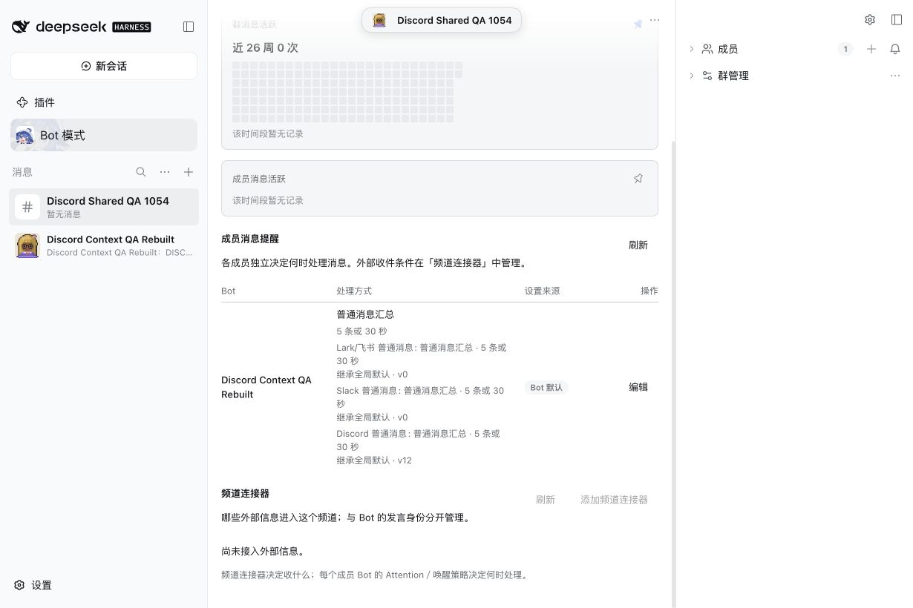
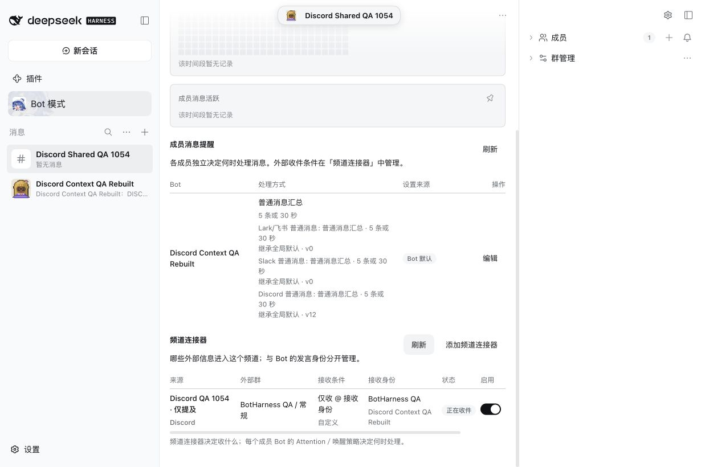
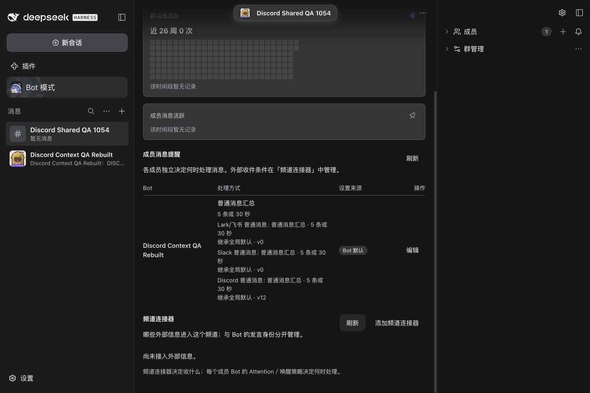
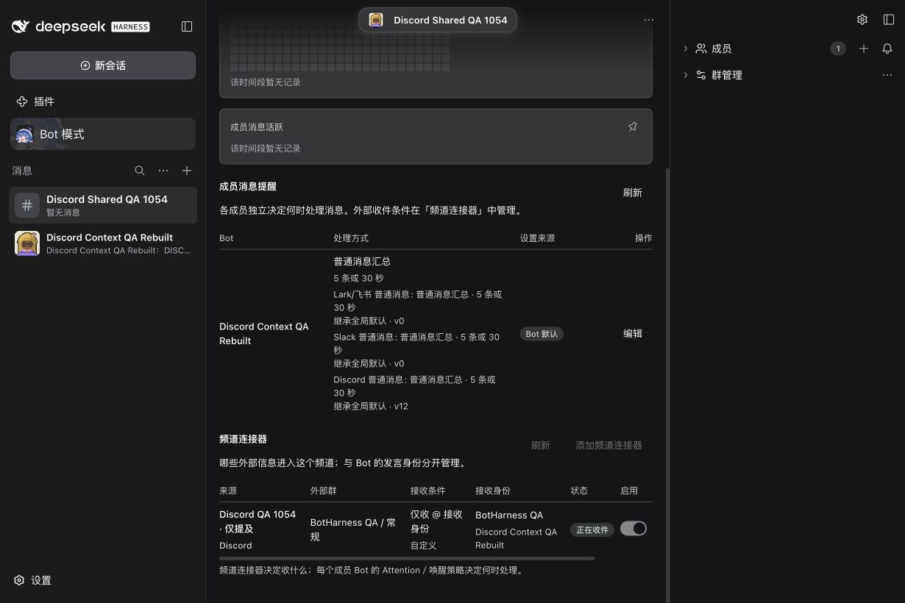
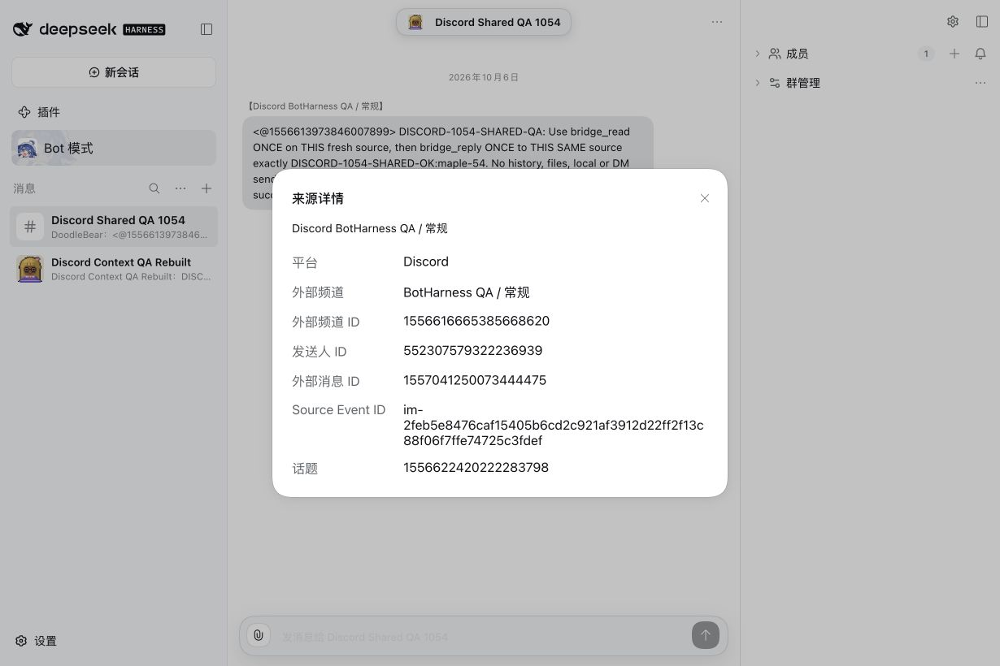
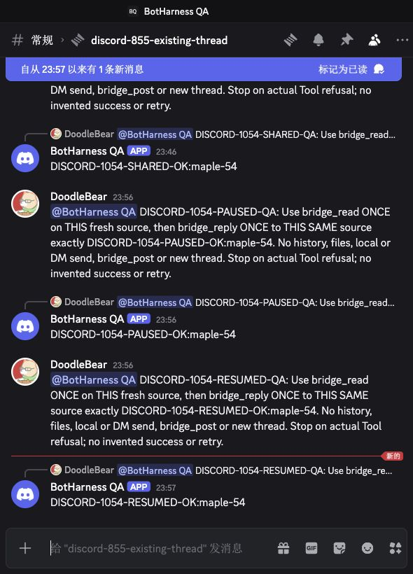
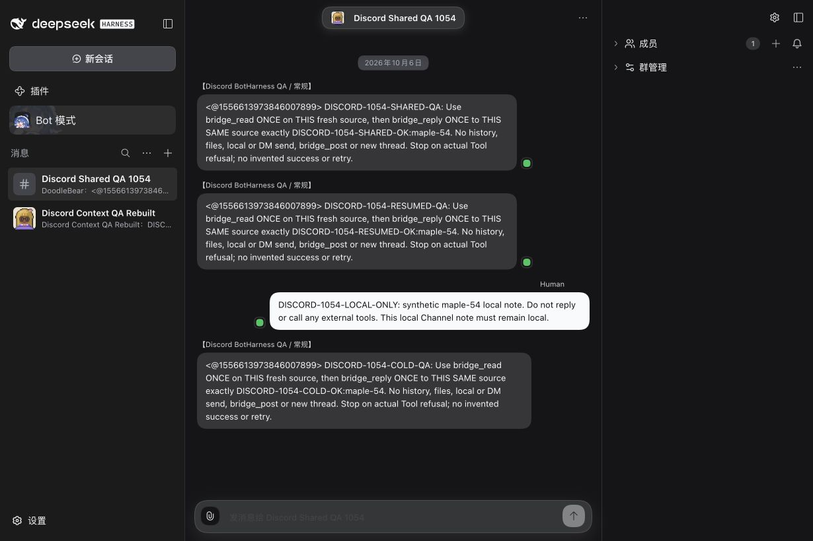

# Discord shared Channel qualification — #1054

Agent-operated real acceptance qualifies one existing Discord receiver and one bound member PersonaBot in a local Group Channel, with Message Content OFF and mention-only collection. The generic runtime already supports this path; this change adds regression coverage and documents its evidence. This is a development-source qualification, not a published-product Provider upgrade.

## Exact input and scope

The first three real messages used Core `ab63a528072771cdb29233137bdb48b210f93434`. Cold restart loaded `a81ba50e953b20635ca38e0f182d18923f92a292`, whose only change is the shared-Channel regression test. Provider `345b63f75ad8acc5b7e42eaab5a4eefdbffed683` has installed `lib/index.js` SHA-256 `b5fa453a9b2b6e544cb1d20f20b64415728b1e2333440b1f9ca00e796aa9024e`, matching its source artifact. DSH is `0.2.0-rc.1`; actual model calls use `deepseek-official / deepseek-v4-pro`, reasoning off. Later documentation and unrelated main integration do not replace these runtime inputs.

The Human explicitly authorized adding **Discord Context QA Rebuilt** to **Discord Shared QA 1054** and temporarily connecting the existing **BotHarness QA / 常规** source. Membership used the normal invitation and profile-policy acceptance. No new native destination, account, credential or permission was created. The original Inbox path stayed enabled; `canPost=false`, native App flags `0`, Message Content OFF and the earlier synthetic Workspace write revocation stayed intact.

## Real results

Each native Human mention has one Source Event, one member Inbox Admission and one provider-accepted Outbox intent. `bridge_read` and `bridge_reply` were each called once, with actual successful Tool results; independent native reads match own Bot author, exact existing thread `1556622420222283798`, original-message reference and reply body.

| State / model turn                   | Native Human message  | Own Bot reply         | Reception paths | Group placements |
| ------------------------------------ | --------------------- | --------------------- | --------------- | ---------------- |
| Connected / 14                       | `1557041250073444475` | `1557041292771594302` | 2               | 1                |
| Paused / 15                          | `1557043767570210877` | `1557043807608897582` | 1               | 0                |
| Resumed / 16                         | `1557043983803224126` | `1557044027457802382` | 2               | 1                |
| Cold restart / 18                    | `1557044637255081995` | `1557044674227740873` | 2               | 1                |
| Original configuration restored / 19 | `1557045298210152550` | `1557045336218927187` | 1               | 0                |

Overlap shares the same source/admission rather than producing a second Bot turn or DM mirror. The source Modal retains the parent conversation, exact external message ID, sender ID, canonical source ID and native child/thread ID. Canonical receipts normalize `conversationId` to the parent; the checked reply route and independently fetched native message retain the child thread. A message reply reference is not fabricated into a thread ID.

The connector source picker, add, edit/save, pause and resume used normal UI controls. With Message Content OFF and ordinary delivery unverified, the edit form disables ordinary-text collection. Pausing retains history and leaves the independent Inbox path usable. Resuming sets a future intake boundary; the paused source never appears in Channel history. Browser refresh preserves one copy of each retained source. Cold restart preserves all six canonical tables and the complete Channel messages exactly, then a fresh real mention proves own-identity reply authority again.

A local Human note `DISCORD-1054-LOCAL-ONLY` was admitted and processed in model Turn 17 with **zero Tool calls, zero external intents and zero native messages**. The connector does not automatically relay local discussion.

## Reproduce through existing controls

1. In an isolated, verified Profile with a checked Discord Provider and a working bound PersonaBot, create one synthetic local Group Channel and invite that Bot normally. Use an already-authorized native QA source.
2. Open the Group Profile → Channel connectors → Add; select Discord and its original authorized source, choose **only @ receiver** and enable reception. Keep the original Inbox path if testing overlap.
3. In the original public thread, send one synthetic native mention asking the Bot to read that source and reply once. Inspect source details and the actual Tool results; independently verify the native author/thread/reference and canonical admission/placement/intent counts.
4. Switch the connector OFF and send a fresh mention. Confirm no new Group placement, retained history and one independent-Inbox reply. Resume; confirm no backfill, then test a fresh mention.
5. Refresh and cold-restart the same Profile. Compare persisted records and send a fresh mention. Send a local-only note and confirm it creates no external intent/native message.
6. Remove the temporary Channel route, restore the original settings, and send a final native mention to verify the remaining Inbox path. Preserve accepted history and audit records.

## Screenshots and cleanup

Captures are real Chinese Chrome UI at **1230 × 820**, with matching light/dark before/after configuration states of the existing UI. The native screenshot clips only the QA thread to **590 × 820**; no unrelated Discord server content is published. [Image manifest](../../assets/pr/1054-discord-shared/manifest.json) records file hashes and provenance.

**Before — local Group has its member but no connector. After — the temporary mention-only Discord connector is receiving.**

| Theme | Before                                                                | After                                                               |
| ----- | --------------------------------------------------------------------- | ------------------------------------------------------------------- |
| Light |  |  |
| Dark  |    |    |

**Source details preserve the original native thread.**

**The original Discord thread contains the one own-Bot reply for each connected, paused and resumed request.**

**Retained history after restart includes three external sources and one local-only note; the paused source is absent.**

The temporary Channel route is removed. The original identity, fingerprint/target scope, external Grant revision, group policy and Discord defaults are unchanged; `canPost=false`, Message Content OFF and Workspace write false/revision 4 are verified. Original Inbox reception is now represented by one explicit Inbox route, a normal canonical migration caused by adding a connector; raw Grant JSON therefore differs without expanding effective authority. The new local Group/member and its four retained messages remain reviewable. Original theme **system** is restored. Settled cumulative counts are 1 Binding / 1 external Grant / 41 Sources / 23 Admissions / 17 Outbox intents / 6 placements; these include previous setup/history. Removing the temporary route preserved accepted source/admission/outbox/placement records exactly.

[Sanitized model/native/canonical/restart/restoration proof](../../assets/pr/1054-discord-shared/model-native-proof.json) includes actual call and native IDs. Duplicate transport delivery, an unconnected fixture Channel, another member's shared read without a borrowed reply grant, wrong-platform refusal and delayed paused delivery are **automated fixtures**, not claims of additional real accounts or native events. Runtime schemas, UI implementation, native permissions and product Provider pin are unchanged. CI and local check results belong to the linked PR and do not substitute for the real evidence above. Agent acceptance replaces manual Human QA under the Human's explicit instruction; merge and release remain separate actions.
