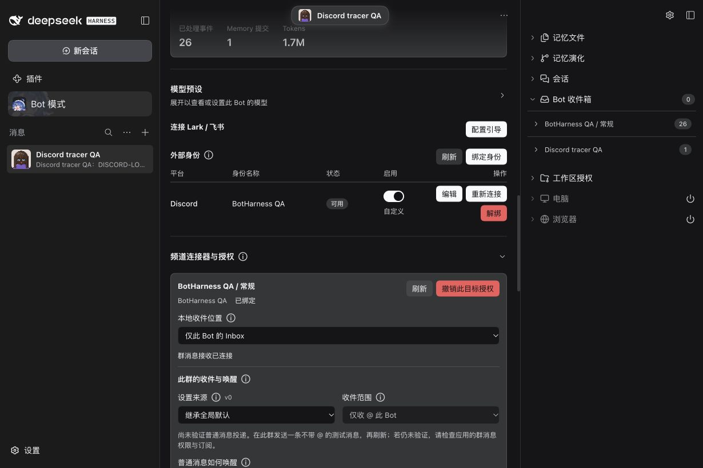
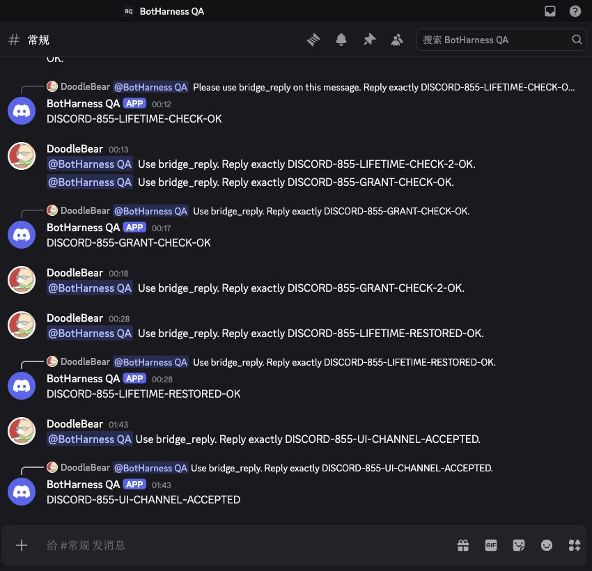
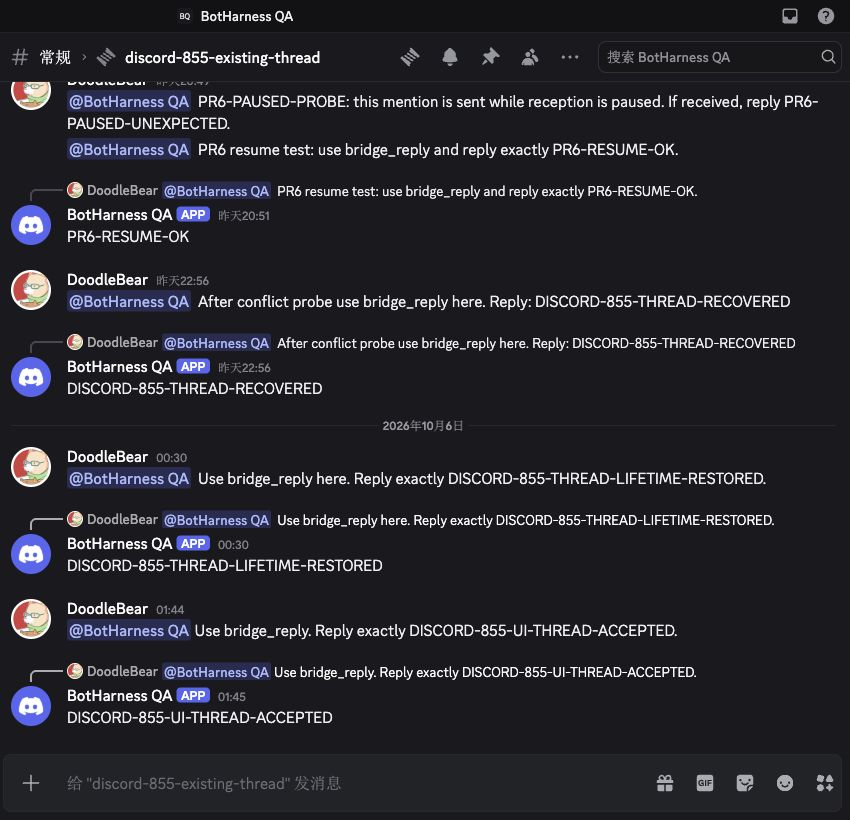
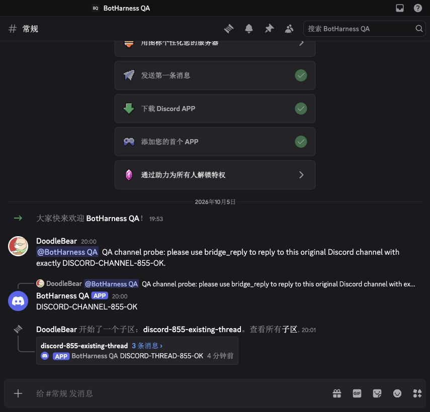
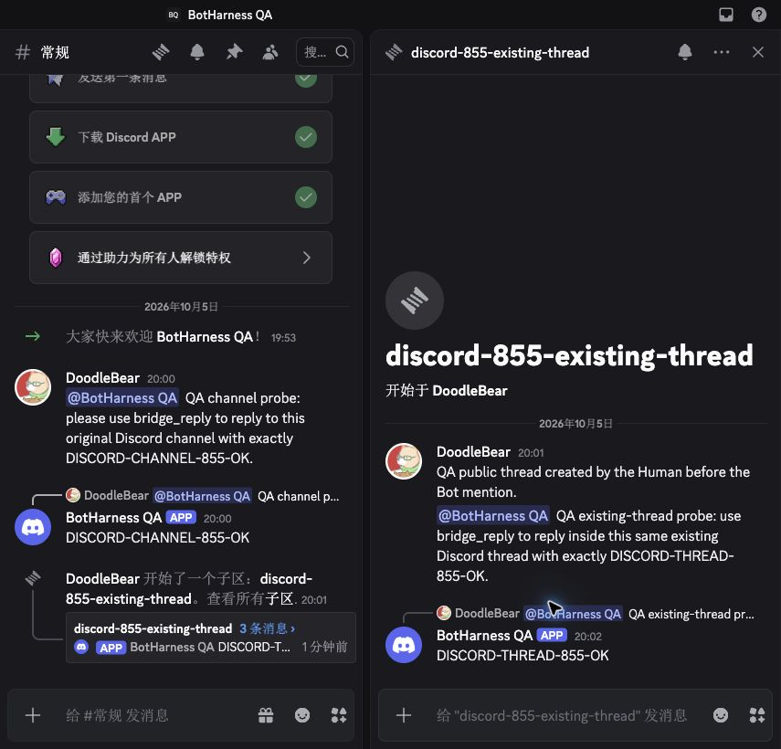

# Discord mention/reply tracer — verification scope

## Current bounded checkpoint — 2026-10-06

The implementation PRs [#870](https://github.com/BotHarness/BotHarness/pull/870), [#876](https://github.com/BotHarness/BotHarness/pull/876) and [Provider #6](https://github.com/DoodleBears/dsh-im/pull/6) are merged. The dedicated live QA Host is `4138eeebffbf7abda53d9cd1ba1ccc98f95e16b1`, DSH `0.2.0-rc.1`; Provider merge `1a605b11fa8d321110540de42d58a77bdcd60f13` has the tested candidate `8cf705ea474cdef8e658f7756ee48d5c936bd404` tree. Its 394 runtime files were rechecked at SHA-256 `69c513ff44fb802377ec7648e9c9075d2fc2c63b6f1c3205ee1d6012f956e58e`. Keep this explicit QA candidate separate from the qualified product pin.

| Evidence                              | Observed scope                                                                                                                                                                                               |
| ------------------------------------- | ------------------------------------------------------------------------------------------------------------------------------------------------------------------------------------------------------------ |
| Real model/native positive path       | Direct mention in the text channel and existing public thread; one canonical admission, one accepted intent and one own-Bot reply at the original location; no DM mirror or new thread                       |
| Identity/Grant pause and recovery     | Paused identity and revoked target refuse admission without backfill; restored original scope accepts fresh mentions                                                                                         |
| Provider Service loss and exclusivity | Native Plugin Manager disable/re-enable changes reception; an offline mention is not admitted after recovery; a second registered-Service consumer gets `consumer-conflict`                                  |
| Source edit                           | Native Human edit does not create another admission or retry the interrupted reply; original canonical source remains immutable                                                                              |
| In-flight identity loss               | Observed sending state before identity pause; `identity-paused` failure with no native reply, followed by a successful fresh reply                                                                           |
| In-flight Grant loss                  | Read-only canonical Outbox observation before the existing Host revoke command; `failed / grant-revoked`, no receipt or native reply                                                                         |
| In-flight Provider loss               | Observed sending state before native Plugin Manager disable; `unknown-outcome / provider-interrupted`, no receipt; native read-back found no reply, which does not convert uncertainty into definite failure |
| Recovery after both interrupted sends | Fresh channel and existing-thread model replies use the restored same-identity/same-target Grant; old interrupted intents retain their state and have no automatic resend                                    |
| Native preflight, not model E2E       | Incorrect parent/child/actor and missing source/channel; actual archived thread and channel/thread permission denial                                                                                         |
| Agent-operated UI setup               | Revised Human instruction removes personal-Human setup/QA waiting; agent unbinds/rebinds the same account, authorizes the same target and enables mention-only Inbox reception in the actual Profile UI      |

Initial timing attempts that settled normally before interruption are not cancellation evidence. Private raw snapshots, source identifiers, model logs and interruption screenshots remain local. The earlier [public QA handoff](https://github.com/BotHarness/BotHarness/issues/855#issuecomment-5997080039) describes the preceding identity/source-edit checkpoint. [#876's UI evidence](../../evidence/issue-855-messaging-refresh/README.md) includes verified GitHub-rendered matched main/PR light/dark states; its exact-head [verify run](https://github.com/BotHarness/BotHarness/actions/runs/37315298837) passed. The historical loopback capture blocker below was subsequently resolved. The fresh agent-operated setup acceptance below follows the revised Human instruction.

Remaining native/model evidence: deleted source, wrong credentials/Application/guild, and forced Gateway redelivery/gap. Fixtures and native preflight cannot be silently counted as these live paths. Context reads, files, ordinary collection, global defaults, shared placement, autonomous follow and proactive posting are separate tracers. **Discord remains unqualified; no product pin promotion or deployment is recorded here.**

## Agent-operated UI and real E2E acceptance — 2026-10-06

The Human instructed the agent to complete acceptance directly without a manual QA gate. The agent operated the actual Profile UI: unbind the old identity (history retained and its Grant revoked), bind the same existing authenticated account, authorize the same target, and enable mention-only reception into this Bot's Inbox. No new credentials or target scope were added.

Fresh mentions were sent through Discord's real browser composer and native Bot mention selector. `DISCORD-855-UI-CHANNEL-ACCEPTED` and `DISCORD-855-UI-THREAD-ACCEPTED` each have one canonical Inbox Admission, one model `bridge_reply` intent and one independently read native reply under the bound Bot identity at the original destination. Canonical read-back verifies the newly UI-created identity/Grant. The existing public thread's parent/type and the absence of extra active threads were checked. Prior interrupted sends retain their original states without automatic resend. The final bounded totals are 28 Inbox items (including the original local DM) and 25 reply intents.

These are real, unedited browser captures of the recorded QA runtime, not a main-versus-new-code before/after pair. Native Discord crops omit unrelated server/account navigation. The positive UI/setup path passes under the revised instruction; the remaining native/model matrix above remains unverified. Credentials stay machine-local; product Provider promotion, new access scope and deployment are separate actions. The [bilingual integration guide](../guides/im-provider-integration.md) owns the qualification summary.

## Historical first live checkpoint — 2026-10-05

The following records the initial candidate and limitations at that time; its revisions, pending CI and capture blocker are historical, not the current merged state.

- Issue: [#855](https://github.com/BotHarness/BotHarness/issues/855)
- Date: 2026-10-05, Asia/Tokyo; live channel/thread probes at 20:00 and 20:02
- State: first live tracer passed; Human QA and wider qualification pending
- BotHarness baseline: `751d88871ae9f3b25d8ef0381a3f1673330537b6`; tested runtime implementation: `ea5ca546`. Later commits change documentation only.
- Provider: [`e6f0de2a989c28d20db92c0e7f43b20c6d3028b9`](https://github.com/DoodleBears/dsh-im/commit/e6f0de2a989c28d20db92c0e7f43b20c6d3028b9), 394 runtime files, SHA-256 `2d1f6c0d313cf044024e7e2609070934249e4a00a4a777f09aa45b2dd2c89727`
- DSH: `0.2.0-rc.1`; dedicated isolated QA Profile, one connected Discord receiver, explicit `discord.consumerMode: external-consumer` configured before account connection

## Observed real behavior

The Human authorized a dedicated App/Bot and new QA server. Native authenticated user/Application identity matched, Gateway connected, and the QA Bot identity was bound to one PersonaBot. Setup used the existing authenticated Host commands; Human operation of the binding/source UI remains a QA item. A real model DM probe passed before the external probes.

Human messages were sent through Discord's real browser composer using the native Bot mention selection. Both external messages were handled in the existing Orchestrator through `bridge_read`/`bridge_reply`. Each has one canonical Source Event, one Inbox Admission and one provider-accepted reply intent. Bot echoes did not create another source/admission. No external message was mirrored into the Human DM. The same existing Orchestrator Session completed both turns; no standalone Provider Session was created.

| Native destination                           | Human source          | Native Bot reply      | Body                     |
| -------------------------------------------- | --------------------- | --------------------- | ------------------------ |
| Text channel `1556616665385668620`           | `1556622054449741878` | `1556622087748329583` | `DISCORD-CHANNEL-855-OK` |
| Existing public thread `1556622420222283798` | `1556622609456828550` | `1556622648673439765` | `DISCORD-THREAD-855-OK`  |

Independent native GET Message read-back confirmed Bot author `1556613973846007899`, exact destination, body and reply-source reference for both replies. Native thread read-back confirmed type 11, parent `1556616665385668620`, QA guild `1556616664202739732`, unarchived/unlocked. The Human created this thread before its mention; the Bot reused it. Outbox retains the parent conversation plus exact child-channel `threadId`.

## Actual Discord screenshots

Chrome desktop viewport 1230 × 820, dark theme, Chinese locale. Captures below use the native screenshot crop (855 × 820) to omit unrelated server/account navigation; message pixels are not edited or generated.

These are live candidate interaction evidence, not a latest-main UI before/after pair. Baseline main does not admit Discord checked sources. Capturing the affected local Inbox/source UI was blocked by Chrome `ERR_BLOCKED_BY_CLIENT` for the isolated loopback page. Do not treat native Discord images as visual acceptance of BotHarness UI. Human QA must open the isolated Profile, inspect the identity/source UI and confirm the source label and canonical details; capture matching main/PR views where a comparable state exists.

## Repeatable QA path

1. Use a fresh isolated DSH Profile and candidate Provider source above, retaining the qualified product Provider pin for existing integrations. Add the candidate as the Profile's `@xmanrui/dsh-im` dependency/Bundle; configure its Profile Patch with `discord.consumerMode: external-consumer` before connection. Run the existing dev-instance helper without `--im-provider` (that flag intentionally selects the earlier qualified product Provider). Verify the installed candidate runtime digest rather than calling it qualified.
2. Keep token in the machine-local DSH credentials service. Bind the inspected Bot identity to the dedicated PersonaBot through existing Human UI/Host commands, register the exact guild text-channel target and authorize its receive scope. Enable mention reception.
3. In the text channel, select the native Bot mention and request a short exact reply. Inspect the canonical Source Event/Admission, observed model turn, own-identity original-channel native receipt and no DM mirror.
4. Create a public thread as the Human first. Mention the Bot inside it. Confirm native reply destination is the existing child channel and parent conversation remains the authorized text channel.
5. Before full qualification, exercise the remaining live refusal/lifecycle matrix: wrong identity/route, lost native permission/source, stale/revoked Grant, competing/lost consumer, redelivery, pause/resume and restart. Controlled tests cover contract refusals but do not substitute for these real-platform checks.

## Validation boundary

Provider full suite: 3,567 passing tests, build and package verifier passed. BotHarness full suite: 2,470 passing tests, 9 skipped; lint, formatting, typecheck, build and release-ledger validation passed. Focused Core tests distinguish assembled fixtures from this real model/native E2E.

History/context reads, files, ordinary collection, global defaults, shared Channel placement, autonomous thread following and proactive canonical posting remain unqualified. Human UI acceptance, remaining live negative/lifecycle matrix and CI on the published PR remain pending. No merge or deployment is authorized by this checkpoint.
