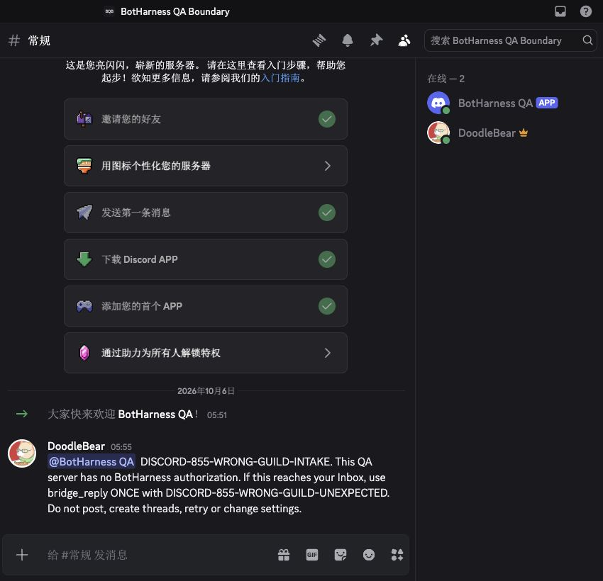
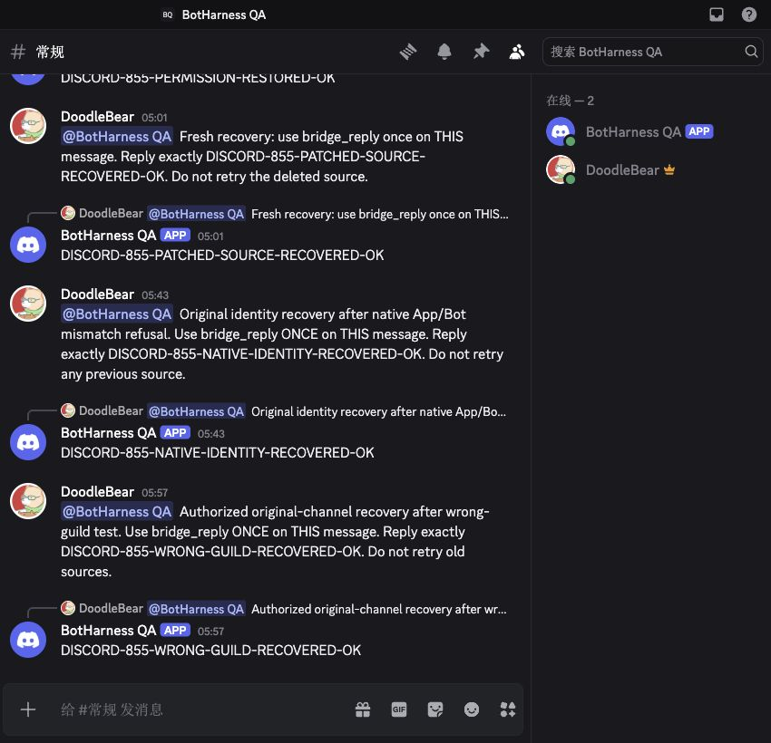
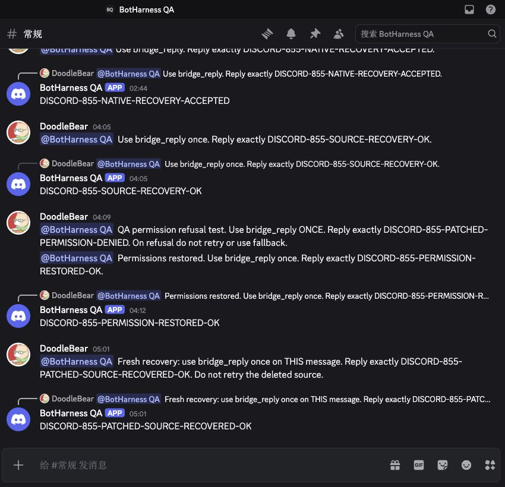
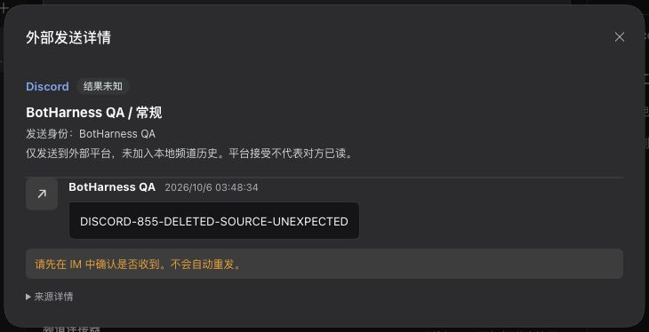
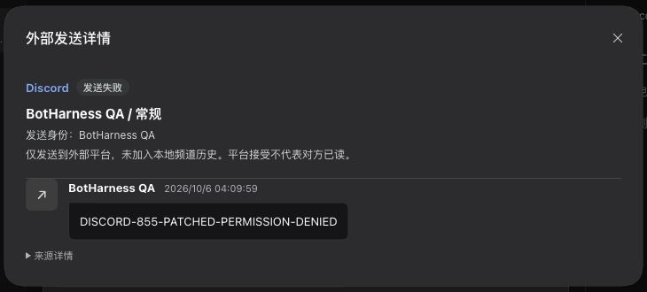
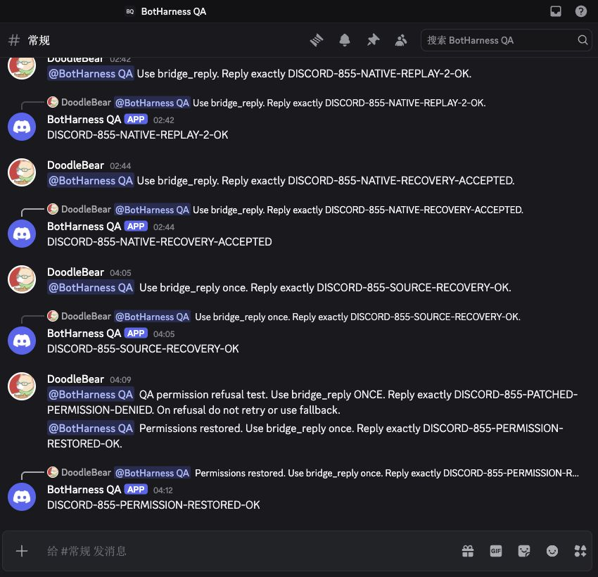
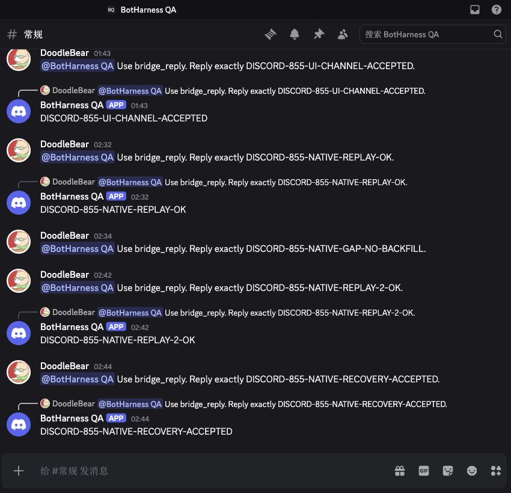

# Discord mention/reply tracer — verification scope

## Completed native identity and guild boundary — 2026-10-06

**Development-source checked Discord mention intake and own-location replies are qualified for #855.** The previously recorded channel/existing-public-thread, UI setup, authority, permission/source refusal and lifecycle checks below are complemented by the real native identity and guild checks here. This qualification covers this narrow tracer on the recorded QA build; history reads, files, ordinary collection, defaults, shared placement, autonomous follow and proactive posting remain separate capabilities. Product Provider pin promotion, release and deployment are separate actions.

The same isolated DSH `0.2.0-rc.1` Host runs base `4092e93de0e62d9f48ff8d1c69bc125ebf543c69` with the merged #924 adapter correction (source SHA-256 `28ee8a799090223d5ad2e2284096cd3eff463cc17da552000505efcfc5a9ed51`). Provider merge `1a605b11fa8d321110540de42d58a77bdcd60f13` matches candidate tree `8cf705ea474cdef8e658f7756ee48d5c936bd404`; its unchanged 394-file runtime SHA-256 is `69c513ff44fb802377ec7648e9c9075d2fc2c63b6f1c3205ee1d6012f956e58e`.

| Check                                          | Actual result                                                                                                                                                                                                                                                                                                                                                                            | Evidence boundary                                                                                                                                                                                                                          |
| ---------------------------------------------- | ---------------------------------------------------------------------------------------------------------------------------------------------------------------------------------------------------------------------------------------------------------------------------------------------------------------------------------------------------------------------------------------- | ------------------------------------------------------------------------------------------------------------------------------------------------------------------------------------------------------------------------------------------ |
| Different native App/Bot identity pair         | Authenticated native current-user/current-application inspection proves a second actual App/Bot pair, and both accounts reach Gateway readiness. Actual Host binding commands refuse both cross-account fingerprint combinations with `rebind-required`, before any canonical write.                                                                                                     | Actual registered Provider native account inspection, not invented identities. This is the App/Bot pair boundary, not a Token swap or independently varied App/user fields. The Boundary Bot has no identity, Grant or guild installation. |
| Original identity recovery                     | A fresh native mention produces one Admission, one real model `bridge_reply`, one accepted Intent and one original-Bot reply in the original channel.                                                                                                                                                                                                                                    | Old settled intents are never retried; counts advance from 39/34 to 40/35.                                                                                                                                                                 |
| Actual wrong guild intake                      | The Human creates a separate QA server and installs the original QA Bot. Native inspection confirms membership, view/history and reply permissions. A real browser-composed direct Bot mention advances that account's consumed-Gateway counter from 1 to 2, while all bindings, Grants, Outbox rows, Admissions, sources and placements remain exactly equal. Native Bot replies: zero. | No BotHarness Grant exists for the new server/channel. The refusal is an actual receive-scope boundary, with native access available. It is not a disconnected account or missing-permission test.                                         |
| Original channel recovery after the guild test | A new mention receives one model reply, one accepted Intent and one independently read own-Bot native receipt at the original location.                                                                                                                                                                                                                                                  | Final counts are 41 Admissions / 36 Intents; original binding, receiving Grant, Profile Patch, permissions and historical outcomes are preserved. Wrong-guild source/reply remain absent afterward.                                        |

The latest Human-saved Boundary Token verified natively, while that account's stored older credential returned 401 during final connection review. Refreshing the same account from the authorized private file restored both QA connections; its identity pair and BotHarness authority did not change. The original account stayed connected and its fresh reply passed. This credential refresh does not add a Token-swap boundary test.

These unedited actual browser captures are Chinese/dark, cropped to 850 × 820 from a 1230 × 820 viewport to omit unrelated navigation. They show separate runtime cases, not a UI code before/after pair. Screenshots alone cannot prove refusal or record counts: the [sanitized proof](../../assets/pr/855-discord-native-binding/proof.json) records the independent native, Gateway counter, model tool-result and canonical read-back assertions. Credentials, raw native identities and model logs remain private.

The earlier real Gateway resume check remains bounded to its observed replay-before-`RESUMED` order; the Provider advertises `resumeCursor: false, gapPossible: true`, with no gap backfill. Earlier sections retain their historical pending status and counts; use this section and the [integration guide](../guides/im-provider-integration.md) for current qualification. Agent-operated E2E acceptance is complete under the Human's revised instruction, without a manual QA waiting gate.

## Earlier patched-model deleted-source refusal — 2026-10-06

The Human separately confirmed deleting the newly prepared synthetic `DISCORD-855-PATCHED-SOURCE-QA` message at 04:43 Tokyo. The actual native mention had one handled Inbox Admission, one model `bridge_read` and no reply intent before deletion. The native owner UI deleted only that message; independent Discord read-back returned HTTP 404 / `10008`, and the full canonical source remained exactly equal to the pre-deletion snapshot.

On the unchanged patched Host described below, one native Host local-DM instruction asked the real model to read that retained source and reply once. Actual Session tool call/result evidence and the canonical Outbox independently confirm **one `bridge_reply`, one intent, `failed / source-not-found`, no receipt and zero own-Bot native replies**. A fresh native mention then received one model reply, one accepted intent and one own-Bot reply to that new source in the original channel. The old unknown and interrupted intents were not retried or rewritten.

Both are unedited real browser captures, Chinese/dark, 1230 × 820 viewport. The failure capture is 730 × 330; the native recovery capture is 850 × 820. These use separate fresh sources and do not replay the historical pre-fix intent. Full read-only canonical audit now finds **39 Inbox items / 34 reply intents**, including three original/local-QA DM Admissions. Exact original permissions, identity/receiving Grant, Profile Patch and Provider runtime digest remain unchanged; no local bridge placement or extra active thread exists. The [sanitized proof](../../assets/pr/855-discord-source-refusal/proof.json) separates this fresh model result from the earlier fixed-adapter native preflight.

At this checkpoint the deleted-source model path was accepted, while real native App/Bot and guild boundaries still lacked complete evidence. The completed section above now supplies those checks; no product Provider promotion, release or Production deployment is included.

## Earlier source correction and permission recovery checkpoint — 2026-10-06

The authorized native deletion of the one synthetic `DISCORD-855-DELETED-SOURCE-QA` message exposed a real failure-classification defect. Discord returned HTTP 404 / `10008`, the complete canonical source stayed byte-for-byte equivalent on Host read-back, and the model made one `bridge_read` then one `bridge_reply` attempt. The preceding live Host recorded `unknown-outcome / provider-result-unknown` without a receipt. Its adapter omitted `source-not-found` and `reply-permission-denied` from the definite-refusal list. That existing intent remains unchanged and is never retried to manufacture a passing result.

The adapter now preserves those two checked refusals as `failed` with the original reason. Regression-first coverage reproduced both incorrect unknown outcomes before the fix; afterward the canonical Inbox/Outbox contract covers channel success, existing-thread success, deleted source, thread permission refusal and genuinely unknown transport outcome. It asserts one attempt/intent and no fallback send or local placement. The focused messaging suite passed 130 tests; the full suite passed 2,580 tests across 315 files, with 9 tests / 5 files skipped. Typecheck, lint, formatting, bilingual ledgers and build passed.

After a private stopped-Host backup, the same isolated Profile restarted from base `4092e93de0e62d9f48ff8d1c69bc125ebf543c69` with this adapter correction; `packages/core/src/messaging/dsh-im.ts` SHA-256 is `28ee8a799090223d5ad2e2284096cd3eff463cc17da552000505efcfc5a9ed51`. DSH remains `0.2.0-rc.1`, the 394-file Provider digest remains `69c513ff44fb802377ec7648e9c9075d2fc2c63b6f1c3205ee1d6012f956e58e`, and the original identity, receiving Grant and Profile Patch are unchanged.

| Check                                               | Actual result                                                                                                                                                                                                          | Boundary                                                                                                                                                              |
| --------------------------------------------------- | ---------------------------------------------------------------------------------------------------------------------------------------------------------------------------------------------------------------------- | --------------------------------------------------------------------------------------------------------------------------------------------------------------------- |
| Fixed adapter against the actual deleted source     | Production native preflight returns `source-not-found / not-started`; zero pre-send callbacks and zero native create-message calls                                                                                     | No new receiver; this is corrected adapter/native preflight, not a fresh patched-model deleted-source attempt                                                         |
| Fresh native permission refusal on the patched Host | Explicitly authorized temporary QA Bot-only `SEND_MESSAGES` denial; actual browser mention, one model `bridge_reply`, one Admission/Intent, `failed / reply-permission-denied`, no receipt and no own-Bot native reply | The native Bot API lacks permission-management rights; the already logged-in server owner UI performs the authorized narrow change, without broadening Bot privileges |
| Exact restoration and fresh recovery                | All original channel permission overwrites restored and independently compared; `DISCORD-855-PERMISSION-RESTORED-OK` has one model attempt and one own-Bot original-channel native reply                               | No retry of the refused source and no fallback route                                                                                                                  |
| Existing Host binding/authorization refusal         | Wrong expected binding fingerprint, authorization fingerprint and target digest each return `rebind-required`; identities, Grants and intents unchanged                                                                | Actual registered Host commands with controlled expected inputs, not a different real Application/user/guild                                                          |
| Historical state and destination stability          | Full canonical store read-back finds 36 Inbox items / 32 intents; old deleted-source and interrupted intents unchanged; no bridge placements or extra active threads                                                   | Two original local DM admissions remain local; screenshots alone do not prove these counts                                                                            |

**Recorded pre-fix defect** — The old deleted-source intent remains unknown after restart; this capture is its retained history, not a fresh execution on the patched Host.

**Patched real-model refusal** — A separate fresh permission-denied source settles as failed.

**Restored native destination** — The refused source has no Bot reply, then a fresh source gets one own-Bot original-channel reply after exact permission restoration.

These are unedited browser captures of different actual test cases, not a matched before/after replay of one source. At this earlier checkpoint a fresh patched-model deleted-source capture had not been obtained: the existing intent is already settled and cannot safely be retried or rewritten; the user authorized deletion of only that one prepared message. The corrected deleted-source result is bounded to native preflight plus the canonical regression. For review, use a fresh explicitly disposable source on an authorized QA server, admit/read it, delete it after approval, then let the patched model reply once. Do not repurpose the historical unknown intent.

At this earlier checkpoint wrong native Application/user/guild binding and a fresh patched-model deleted-source path still needed full evidence; the later section above completes the latter. **Discord remains unqualified**; no dependency promotion, release or Production deployment is included. Raw credentials, source IDs and model logs remain private.

## Prior bounded checkpoint — 2026-10-06

The implementation PRs [#870](https://github.com/BotHarness/BotHarness/pull/870), [#876](https://github.com/BotHarness/BotHarness/pull/876) and [Provider #6](https://github.com/DoodleBears/dsh-im/pull/6) are merged. The dedicated live QA Host is `4138eeebffbf7abda53d9cd1ba1ccc98f95e16b1`, DSH `0.2.0-rc.1`; Provider merge `1a605b11fa8d321110540de42d58a77bdcd60f13` has the tested candidate `8cf705ea474cdef8e658f7756ee48d5c936bd404` tree. Its 394 runtime files were rechecked at SHA-256 `69c513ff44fb802377ec7648e9c9075d2fc2c63b6f1c3205ee1d6012f956e58e`. Keep this explicit QA candidate separate from the qualified product pin.

| Evidence                              | Observed scope                                                                                                                                                                                               |
| ------------------------------------- | ------------------------------------------------------------------------------------------------------------------------------------------------------------------------------------------------------------ |
| Real model/native positive path       | Direct mention in the text channel and existing public thread; one canonical admission, one accepted intent and one own-Bot reply at the original location; no DM mirror or new thread                       |
| Identity/Grant pause and recovery     | Paused identity and revoked target refuse admission without backfill; restored original scope accepts fresh mentions                                                                                         |
| Provider Service loss and exclusivity | Native Plugin Manager disable/re-enable changes reception; an offline mention is not admitted after recovery; a second registered-Service consumer gets `consumer-conflict`                                  |
| Source edit                           | Native Human edit does not create another admission or retry the interrupted reply; original canonical source remains immutable                                                                              |
| In-flight identity loss               | Observed sending state before identity pause; `identity-paused` failure with no native reply, followed by a successful fresh reply                                                                           |
| In-flight Grant loss                  | Read-only canonical Outbox observation before the existing Host revoke command; `failed / grant-revoked`, no receipt or native reply                                                                         |
| In-flight Provider loss               | Observed sending state before native Plugin Manager disable; `unknown-outcome / provider-interrupted`, no receipt; native read-back found no reply, which does not convert uncertainty into definite failure |
| Recovery after both interrupted sends | Fresh channel and existing-thread model replies use the restored same-identity/same-target Grant; old interrupted intents retain their state and have no automatic resend                                    |
| Native preflight, not model E2E       | Incorrect parent/child/actor and missing source/channel; actual archived thread and channel/thread permission denial                                                                                         |
| Agent-operated UI setup               | Revised Human instruction removes personal-Human setup/QA waiting; agent unbinds/rebinds the same account, authorizes the same target and enables mention-only Inbox reception in the actual Profile UI      |

Initial timing attempts that settled normally before interruption are not cancellation evidence. Private raw snapshots, source identifiers, model logs and interruption screenshots remain local. The earlier [public QA handoff](https://github.com/BotHarness/BotHarness/issues/855#issuecomment-5997080039) describes the preceding identity/source-edit checkpoint. [#876's UI evidence](../../evidence/issue-855-messaging-refresh/README.md) includes verified GitHub-rendered matched main/PR light/dark states; its exact-head [verify run](https://github.com/BotHarness/BotHarness/actions/runs/37315298837) passed. The historical loopback capture blocker below was subsequently resolved. The fresh agent-operated setup acceptance below follows the revised Human instruction.

At that prior checkpoint, deleted-source lifecycle and wrong Application/user/guild binding still lacked full native/model evidence. Native authentication errors, missing resources and controlled identity-fence inputs below do not substitute for those complete paths. Context reads, files, ordinary collection, global defaults, shared placement, autonomous follow and proactive posting are separate tracers. **Discord remains unqualified; no product pin promotion or deployment is recorded here.**

## Native Gateway recovery and refusal checkpoint — 2026-10-06

This continuation uses the same live Host, Provider digest, bound identity and target as above. All message sends use Discord's real browser composer and native Bot mention selector. A private temporary Cordis Plugin observes the Provider's existing Gateway WebSocket; it does not inject dispatch events or open a second receiver. It records bounded metadata, with credentials and native session identifiers excluded from the evidence.

| Check                                 | Observed result                                                                                                                                                                                                                                     | Evidence boundary                                                                                                                  |
| ------------------------------------- | --------------------------------------------------------------------------------------------------------------------------------------------------------------------------------------------------------------------------------------------------- | ---------------------------------------------------------------------------------------------------------------------------------- |
| Native server redelivery              | `DISCORD-855-NATIVE-REPLAY-2-OK` arrives twice with the same native message ID and sequence, across two sockets; Discord then sends `RESUMED`; canonical admission, accepted model intent and own-Bot original-channel reply remain one each        | Controlled reconnect on the real Provider connection, with one earlier resume cursor; maximum simultaneous observed sockets is one |
| Native invalid-session recovery       | An earlier delayed cursor-rewind attempt receives native `INVALID_SESSION` with `false`, then a fresh `READY`; the original source/intent/reply remains unique                                                                                      | This attempt is recovery evidence, not successful redelivery evidence                                                              |
| Message during reconnect              | `DISCORD-855-NATIVE-GAP-NO-BACKFILL` exists in native Discord between outgoing `IDENTIFY` and native `READY`; no admission, reply intent or native reply appears after recovery                                                                     | A held-resume attempt closes before release; no missed-event replay or lossless recovery is claimed                                |
| Native authentication/resource errors | A deliberately invalid, non-secret test token gets HTTP 401; the existing Bot's GET for a nonexistent guild gets HTTP 404 / `10004`; missing message/channel preflight gets `source-not-found`                                                      | Read-only production API calls, not credential replacement or model/binding E2E                                                    |
| Registered Service identity fence     | Controlled wrong fingerprint gets `account-changed` from `consumeInbound`, `qualifyReplyChecked` and `replyChecked`; no second lease, event callback or pre-send callback runs                                                                      | The installed Service checks the actual native account; this is not a second real App installation                                 |
| Native route and metadata refusals    | Wrong parent, child and actor get `stale-route` against actual source/channel reads; a controlled mismatched Application/Bot metadata pair gets `account-unverified`                                                                                | Metadata mutation is explicitly controlled; prior actual permission/archive preflight remains narrower than model E2E              |
| Clean restoration                     | All temporary probe Plugins are removed, both Gateway observer lifecycles disposed, the original Profile Patch restored byte-for-byte and the 394-file Provider digest unchanged; a fresh `DISCORD-855-NATIVE-RECOVERY-ACCEPTED` model reply passes | Same identity and target; no new credentials, receiver or access scope                                                             |

The successful redelivery's original admission occurs before reconnect. Discord sends its duplicate before `RESUMED`; the external-consumer runtime refuses dispatch while not ready, so the observed duplicate never makes a second canonical admission. This is a bounded no-duplicate check of that real resume path, not proof of canonical deduplication for every replay ordering. The advertised replay contract remains `resumeCursor: false, gapPossible: true`.

The final read-back has 31 Inbox items, including the original local DM, and 28 reply intents. Native replies remain unique, no external source has a local DM placement, only the original public thread is active, and prior `unknown-outcome / provider-interrupted` and `failed / grant-revoked` intents retain their states without automatic resend. Raw native identifiers, model logs and temporary probe controls remain private.

This unedited browser capture shows the one reply for the redelivered source and the fresh clean-restoration reply; it cannot itself prove Gateway packet count or the absence of an Inbox Admission. Those assertions come from the independent native packet observer, Host read-back and canonical store query above. It is runtime evidence, not a before/after pair for new UI code.

The official [Gateway resume contract](https://docs.discord.com/developers/events/gateway#resuming) describes replay followed by `RESUMED`; the live successful checkpoint observed that order. The first invalid-session attempt and the reconnect-window gap remain explicit alongside the passing case. **Discord remains unqualified** until the remaining full paths are resolved; product pin promotion and deployment are separate actions.

## Agent-operated UI and real E2E acceptance — 2026-10-06

The Human instructed the agent to complete acceptance directly without a manual QA gate. The agent operated the actual Profile UI: unbind the old identity (history retained and its Grant revoked), bind the same existing authenticated account, authorize the same target, and enable mention-only reception into this Bot's Inbox. No new credentials or target scope were added.

Fresh mentions were sent through Discord's real browser composer and native Bot mention selector. `DISCORD-855-UI-CHANNEL-ACCEPTED` and `DISCORD-855-UI-THREAD-ACCEPTED` each have one canonical Inbox Admission, one model `bridge_reply` intent and one independently read native reply under the bound Bot identity at the original destination. Canonical read-back verifies the newly UI-created identity/Grant. The existing public thread's parent/type and the absence of extra active threads were checked. Prior interrupted sends retain their original states without automatic resend. The final bounded totals are 28 Inbox items (including the original local DM) and 25 reply intents.

These are real, unedited browser captures of the recorded QA runtime, not a main-versus-new-code before/after pair. Native Discord crops omit unrelated server/account navigation. The positive UI/setup path passes under the revised instruction; the remaining full native/model paths above remain unverified. Credentials stay machine-local; product Provider promotion, new access scope and deployment are separate actions. The [bilingual integration guide](../guides/im-provider-integration.md) owns the qualification summary.

## Historical first live checkpoint — 2026-10-05

The following records the initial candidate and limitations at that time; its revisions, pending CI and capture blocker are historical, not the current merged state.

- Issue: [#855](https://github.com/BotHarness/BotHarness/issues/855)
- Date: 2026-10-05, Asia/Tokyo; live channel/thread probes at 20:00 and 20:02
- State: first live tracer passed; Human QA and wider qualification pending
- BotHarness baseline: `751d88871ae9f3b25d8ef0381a3f1673330537b6`; tested runtime implementation: `ea5ca546`. Later commits change documentation only.
- Provider: [`e6f0de2a989c28d20db92c0e7f43b20c6d3028b9`](https://github.com/DoodleBears/dsh-im/commit/e6f0de2a989c28d20db92c0e7f43b20c6d3028b9), 394 runtime files, SHA-256 `2d1f6c0d313cf044024e7e2609070934249e4a00a4a777f09aa45b2dd2c89727`
- DSH: `0.2.0-rc.1`; dedicated isolated QA Profile, one connected Discord receiver, explicit `discord.consumerMode: external-consumer` configured before account connection

## Observed real behavior

The Human authorized a dedicated App/Bot and new QA server. Native authenticated user/Application identity matched, Gateway connected, and the QA Bot identity was bound to one PersonaBot. Setup used the existing authenticated Host commands; Human operation of the binding/source UI remains a QA item. A real model DM probe passed before the external probes.

Human messages were sent through Discord's real browser composer using the native Bot mention selection. Both external messages were handled in the existing Orchestrator through `bridge_read`/`bridge_reply`. Each has one canonical Source Event, one Inbox Admission and one provider-accepted reply intent. Bot echoes did not create another source/admission. No external message was mirrored into the Human DM. The same existing Orchestrator Session completed both turns; no standalone Provider Session was created.

| Native destination                           | Human source          | Native Bot reply      | Body                     |
| -------------------------------------------- | --------------------- | --------------------- | ------------------------ |
| Text channel `1556616665385668620`           | `1556622054449741878` | `1556622087748329583` | `DISCORD-CHANNEL-855-OK` |
| Existing public thread `1556622420222283798` | `1556622609456828550` | `1556622648673439765` | `DISCORD-THREAD-855-OK`  |

Independent native GET Message read-back confirmed Bot author `1556613973846007899`, exact destination, body and reply-source reference for both replies. Native thread read-back confirmed type 11, parent `1556616665385668620`, QA guild `1556616664202739732`, unarchived/unlocked. The Human created this thread before its mention; the Bot reused it. Outbox retains the parent conversation plus exact child-channel `threadId`.

## Actual Discord screenshots

Chrome desktop viewport 1230 × 820, dark theme, Chinese locale. Captures below use the native screenshot crop (855 × 820) to omit unrelated server/account navigation; message pixels are not edited or generated.

These are live candidate interaction evidence, not a latest-main UI before/after pair. Baseline main does not admit Discord checked sources. Capturing the affected local Inbox/source UI was blocked by Chrome `ERR_BLOCKED_BY_CLIENT` for the isolated loopback page. Do not treat native Discord images as visual acceptance of BotHarness UI. Human QA must open the isolated Profile, inspect the identity/source UI and confirm the source label and canonical details; capture matching main/PR views where a comparable state exists.

## Repeatable QA path

1. Use a fresh isolated DSH Profile and candidate Provider source above, retaining the qualified product Provider pin for existing integrations. Add the candidate as the Profile's `@xmanrui/dsh-im` dependency/Bundle; configure its Profile Patch with `discord.consumerMode: external-consumer` before connection. Run the existing dev-instance helper without `--im-provider` (that flag intentionally selects the earlier qualified product Provider). Verify the installed candidate runtime digest rather than calling it qualified.
2. Keep token in the machine-local DSH credentials service. Bind the inspected Bot identity to the dedicated PersonaBot through existing Human UI/Host commands, register the exact guild text-channel target and authorize its receive scope. Enable mention reception.
3. In the text channel, select the native Bot mention and request a short exact reply. Inspect the canonical Source Event/Admission, observed model turn, own-identity original-channel native receipt and no DM mirror.
4. Create a public thread as the Human first. Mention the Bot inside it. Confirm native reply destination is the existing child channel and parent conversation remains the authorized text channel.
5. Before full qualification, exercise the remaining live refusal/lifecycle matrix: wrong identity/route, lost native permission/source, stale/revoked Grant, competing/lost consumer, redelivery, pause/resume and restart. Controlled tests cover contract refusals but do not substitute for these real-platform checks.

## Validation boundary

Provider full suite: 3,567 passing tests, build and package verifier passed. BotHarness full suite: 2,470 passing tests, 9 skipped; lint, formatting, typecheck, build and release-ledger validation passed. Focused Core tests distinguish assembled fixtures from this real model/native E2E.

History/context reads, files, ordinary collection, global defaults, shared Channel placement, autonomous thread following and proactive canonical posting remain unqualified. Human UI acceptance, remaining live negative/lifecycle matrix and CI on the published PR remain pending. No merge or deployment is authorized by this checkpoint.
