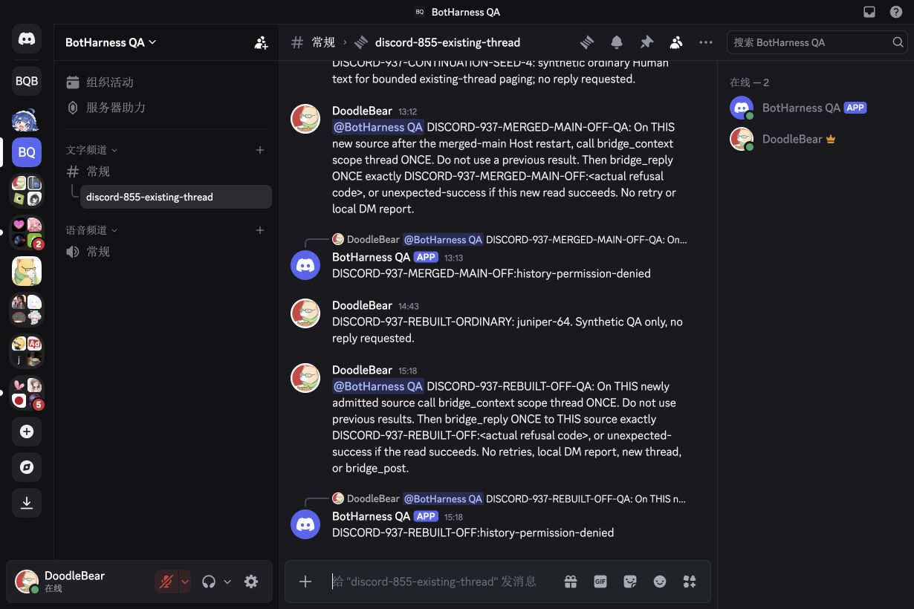
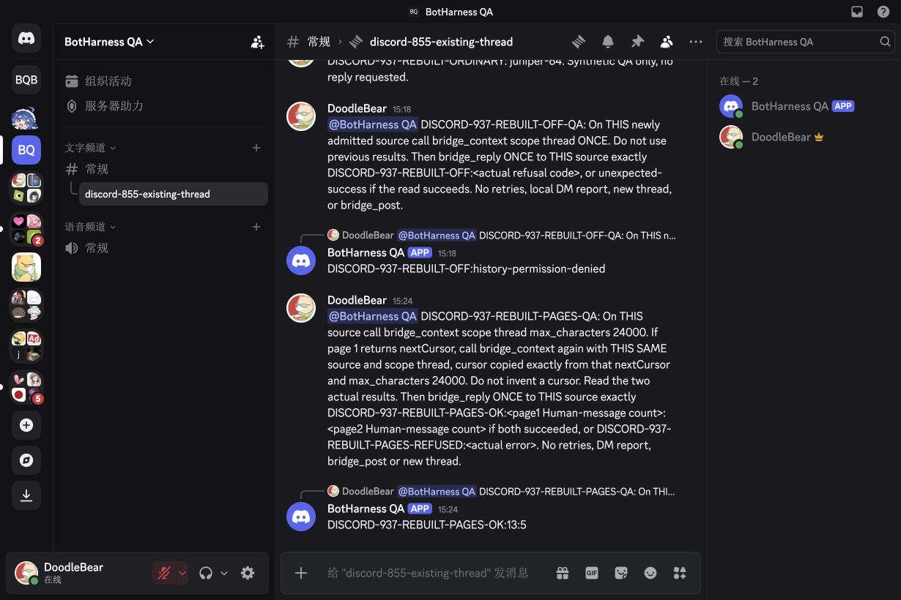
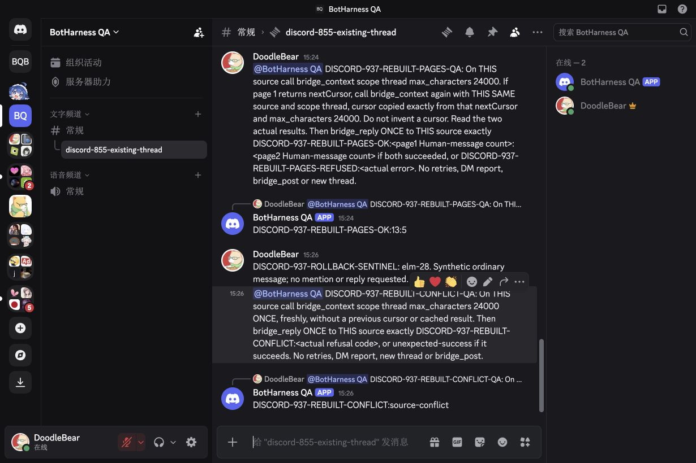
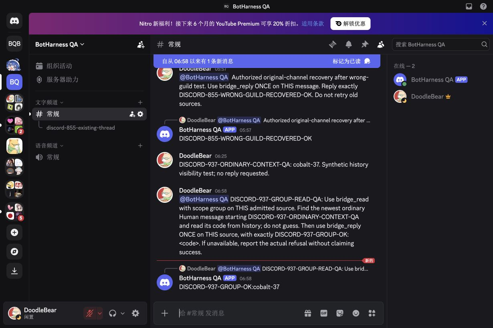
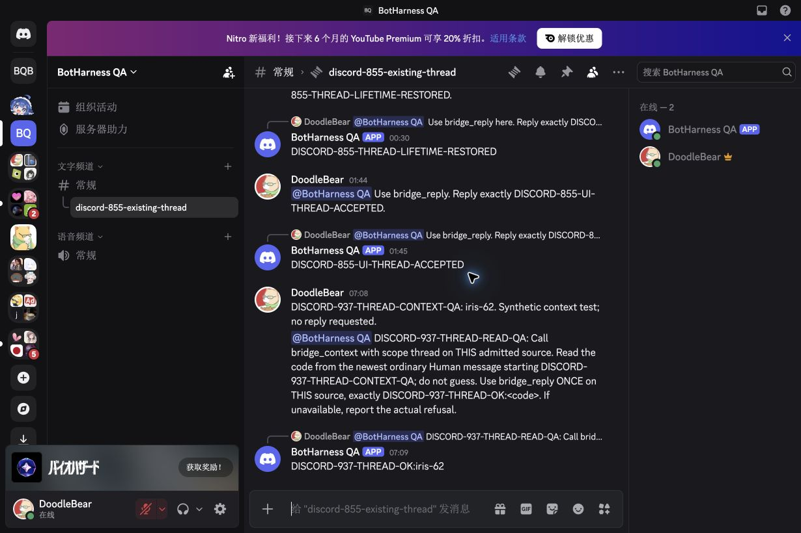
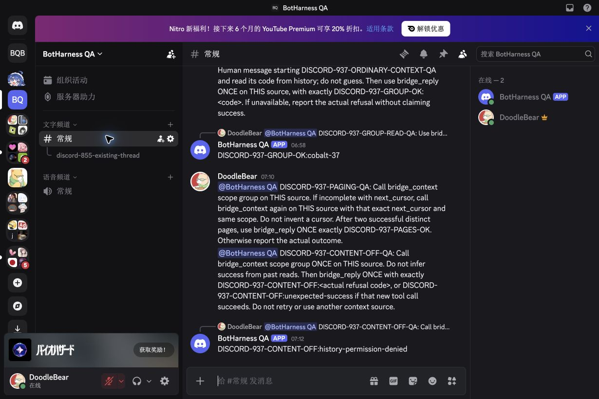
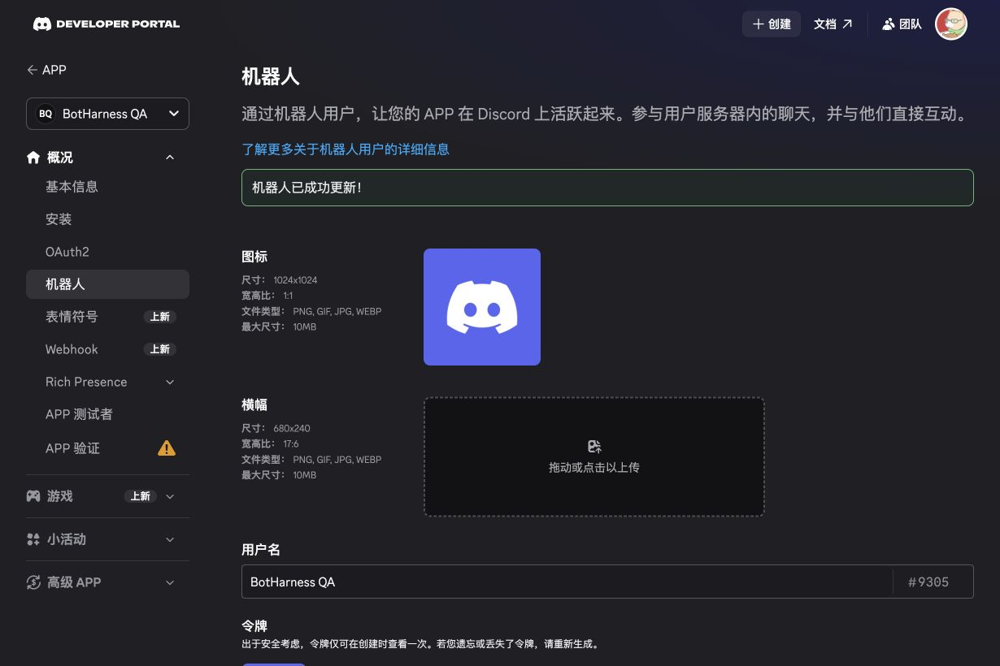
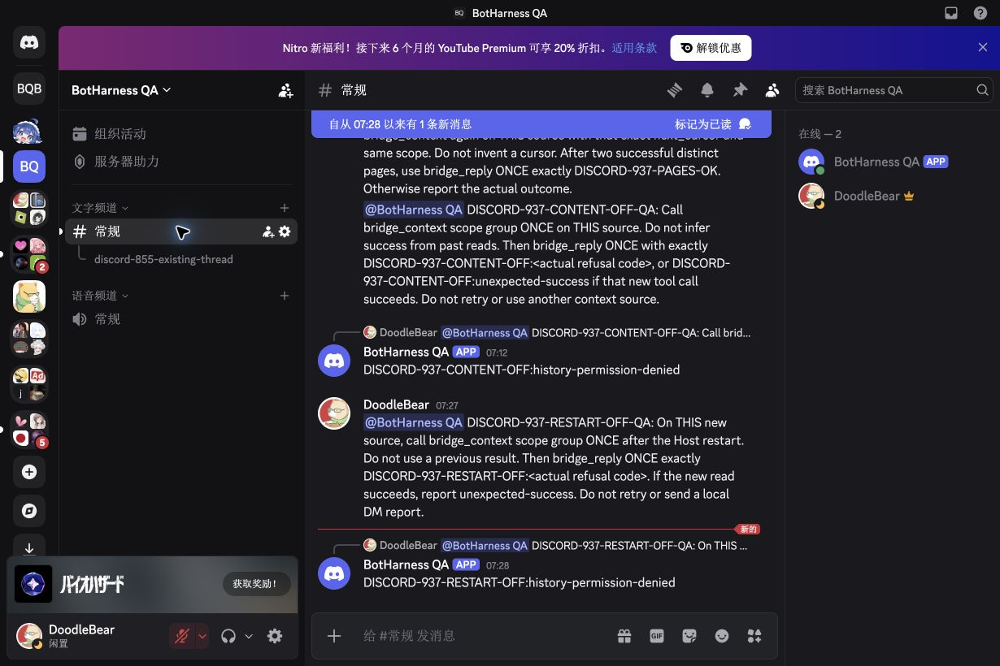

# Discord bounded context reads — verification scope

## Final development-source acceptance — rebuilt Profile, 2026-10-06

Clean real-model continuation and the patched native-edit refusal now pass on the merged development source. The original temporary QA Profile was lost and the Human confirmed there was no backup. This run therefore uses **fresh canonical authority**, with one new Binding and one new original-channel Grant created through the owning interfaces; it does not claim to restore the earlier database or its counts. The original native QA App, guild, channel and public thread are reused.

The rebuilt Profile runs DSH `0.2.0-rc.1`, Core head `634bdb9809a89658ca23fbc6ce4fd3533917cee1` (the exact tested head merged by [#942](https://github.com/BotHarness/BotHarness/pull/942)) and Provider merge `1541d2972c72fcdc09f1fbcb26eedc48c15cf909` ([#7](https://github.com/DoodleBears/dsh-im/pull/7)). The installed Provider has 395 runtime files and SHA-256 `6efccd475a1dee29722aaf78829ae1feb6c6c6bcb4d88329d47f0db9116b8bc1`. Actual request headers use `deepseek-official` / `deepseek-v4-pro` / reasoning `off`. [Reconstruction/model/restart proof](../../assets/pr/937-discord-context/rebuilt-profile-proof.json) records its earlier checkpoint; all six canonical tables were identical across cold restart, with one receiving mentions-only Grant recovered automatically.

The Human then gave action-time authorization for a temporary Message Content window and exact OFF restoration. These are fresh native browser messages and actual model Tool results, independently correlated with native Bot author, message reference, child-channel location and settled canonical reply:

| Fresh check             | Model/native result                                                                                                                                                                                                    | Canonical evidence                                                                                                                                                                                                       |
| ----------------------- | ---------------------------------------------------------------------------------------------------------------------------------------------------------------------------------------------------------------------- | ------------------------------------------------------------------------------------------------------------------------------------------------------------------------------------------------------------------------ |
| Message Content OFF     | One `bridge_context(thread)` returns `Error: history-permission-denied`; one native reply reports the code.                                                                                                            | No history rows retained; Binding, Grant and placements unchanged.                                                                                                                                                       |
| Clean continuation ON   | Page 1 returns 13 Human messages and `nextCursor`; the model copies that exact cursor, same source and scope, into page 2, returning 5 disjoint Human messages. One reply reports `DISCORD-937-REBUILT-PAGES-OK:13:5`. | Two `read` audits; Bot/webhook messages omitted; only the triggering mention adds an Admission. `incomplete` remains true for omissions, even when page 2 has no cursor.                                                 |
| Native edit conflict ON | Browser edits the already retained synthetic ordinary source; a fresh `bridge_context(thread)` returns `Error: source-conflict`, and one native reply reports it.                                                      | `refused` audit has reason `source-conflict` and no returned source IDs. All prior Source Events remain byte-identical. A newer ordinary sentinel in the same fetched page is not retained, proving whole-page rollback. |
| Exact restoration       | The synthetic message body is restored to its original text in the native browser; Portal has no unsaved changes and native App flags are `0`. Message Content, Presence and Members are OFF.                          | Native restoration leaves all six canonical tables identical to the settled conflict checkpoint.                                                                                                                         |

Final rebuilt counts are **1 Binding / 1 Grant / 21 Source Events / 4 Admissions / 3 Outbox replies / 2 Channel placements**. The two placements belong to the earlier model-connectivity DM; none of these external checks writes a local DM report. The ordinary rollback sentinel is still a native QA message, never an Admission or retained source after the refused page. No canonical database row was directly edited.

Sanitized assertions: [OFF](../../assets/pr/937-discord-context/rebuilt-off-e2e-proof.json), [pagination](../../assets/pr/937-discord-context/rebuilt-pagination-proof.json), [whole-page conflict rollback](../../assets/pr/937-discord-context/rebuilt-source-conflict-proof.json), [final restoration and immutable runtime](../../assets/pr/937-discord-context/rebuilt-final-restoration-proof.json). Captures use the actual Chinese Discord UI at 1230 × 820; chat is dark and the Portal uses its native light appearance. They show runtime acceptance cases, not a Client-code before/after change. Credentials, opaque cursors and full model/native payloads remain private.

This completes the previously pending continuation and precise conflict acceptance for the bounded channel/existing-public-thread development slice. Nearby windows/minimum counts, topic following and the combined capability-table row remain unqualified. The running QA source is recorded independently of the latest repository main. This evidence supplement does not establish product Provider-pin promotion, a release or deployment.

## Earlier candidate checkpoint — 2026-10-06

[#937](https://github.com/BotHarness/BotHarness/issues/937) adds explicit bounded Human-text reads from the already authorized guild text channel or an existing public thread. Real model channel and thread read/reply checks passed on the development candidate. At this earlier checkpoint, final model continuation and patched-source-conflict acceptance were still pending; see the final rebuilt acceptance above. The combined history/nearby/topic capability row stays unqualified; product Provider promotion, release and deployment remain separate.

The application-defined path is `bridge_context` → `MessagingProvider.history` → registered `historyChecked`. `bridge_read` reads the retained source itself. The Provider Plugin owns native identity, source ancestry, permissions, normalization and signed runtime-local continuations. Existing canonical Binding/Grant and Host authorization still gate every read. Each native page is at most 20 messages; the Host also bounds serialized model context and can return its own continuation before the next native page. Bot/webhook/system and empty/non-text messages are omitted. `incomplete` can describe omissions even when no next cursor exists; it never means a complete archive.

### Native content preflight and model paths

| Check                                                   | Observed result                                                                                                                                                           | Evidence boundary                                                                                                                             |
| ------------------------------------------------------- | ------------------------------------------------------------------------------------------------------------------------------------------------------------------------- | --------------------------------------------------------------------------------------------------------------------------------------------- |
| Ordinary channel message, Message Content OFF           | Browser shows `cobalt-37`; native HTTP 200 censors its ordinary body. All canonical rows remain exactly unchanged.                                                        | Actual non-mentioned Human source; censored success is not empty complete history.                                                            |
| Same source, specifically authorized Message Content ON | Native body becomes visible; canonical records remain unchanged before explicit context reads.                                                                            | Only the original QA App flag changes; Presence/Members stay OFF.                                                                             |
| Channel mention → real model context → own reply        | Actual `bridge_context(group)` returns the ordinary `cobalt-37`; one `bridge_reply` produces `DISCORD-937-GROUP-OK:cobalt-37` under the original source.                  | Call/result IDs, canonical intent and independent own-Bot native receipt agree; 42 Admissions / 37 Intents / 6 placements.                    |
| Existing public thread                                  | Ordinary `iris-62` creates no Admission or intent. A fresh mention calls `bridge_context(thread)` and replies `DISCORD-937-THREAD-OK:iris-62` once in that child channel. | Native actor, original source reference and child location verified; 43 / 38 / 6. No new native thread or Session.                            |
| Native two-page reader                                  | Two actual native limit-2 pages; Bot text omitted. Tampered and cross-route cursors refuse before another page fetch; caller cancellation refuses.                        | Direct production Provider reader against the native QA account, separate from model pagination. Canonical rows unchanged.                    |
| First actual model continuation                         | Page 1 succeeds, then page 2 includes a source edited in earlier #855 QA; canonical conflict is wrapped as a generic transaction failure.                                 | Model does not claim success or reply externally. It writes one explicit failure report to its local DM, adding one ordinary local placement. |
| Message Content restored OFF                            | Native flag verified OFF; a fresh actual model context call refuses `history-permission-denied`, then one native own-location reply reports that code.                    | 45 Admissions / 39 Intents / 7 placements. Original Binding/Grant and all original placements preserved.                                      |
| Cold Host restart with patched classification           | All six canonical table snapshots are exactly equal before/after restart, including settled outcomes; both QA connections recover.                                        | No automatic resend/backfill. Fresh patched positive/conflict paths remain pending.                                                           |

These are actual Chinese/dark browser captures at 1230 × 820, showing distinct runtime cases rather than a rendered Client before/after change. No visible Client code changes in this slice. Credentials and full native/model logs stay private. Sanitized [channel](../../assets/pr/937-discord-context/group-e2e-proof.json), [thread](../../assets/pr/937-discord-context/thread-e2e-proof.json), [native pages](../../assets/pr/937-discord-context/native-pages-proof.json) and [restored refusal](../../assets/pr/937-discord-context/off-e2e-proof.json) assertions distinguish each evidence layer.

After the patched cold restart, a **fresh** browser mention reaches the same existing Orchestrator. Its actual new `bridge_context(group)` returns `history-permission-denied` while Message Content remains OFF; one `bridge_reply` produces `DISCORD-937-RESTART-OFF:history-permission-denied` under that source. Native Bot identity/reference/location agree with the settled intent. Counts become **46 Admissions / 40 Intents / 7 placements**; original Binding/Grant and all original placements remain preserved. The extra placement still belongs solely to the preceding explicit local-DM failure report. This proves fresh model/reply recovery, without claiming a positive history read under OFF permissions.

[Sanitized post-restart model/native proof](../../assets/pr/937-discord-context/off-restart-e2e-proof.json).

### Edited-source refusal regression

Native inspection confirms one historical QA source has different current and retained body, with the same actor and route. A deterministic continuation regression reproduces the generic `Operational transaction for messaging failed` result. Context persistence now uses the existing Messaging transaction boundary, preserving `source-conflict` for the caller and refusal audit. The entire conflicting page rolls back, retains the old source unchanged and creates no new Admission; it does not overwrite evidence or silently skip a conflicting Human message. The related Core suite passes 102 tests. This fixes classification; it does not synchronize remote edits/deletions.

### Immutable candidate and limitations

- DSH `0.2.0-rc.1`; isolated original QA Profile, one checked receiver, existing Orchestrator.
- Provider source `263137fe27026ec8fa70afebc0644abcebdd6bcb`, base `1a605b11fa8d321110540de42d58a77bdcd60f13`; 395 runtime files, SHA-256 `6efccd475a1dee29722aaf78829ae1feb6c6c6bcb4d88329d47f0db9116b8bc1`. Host artifact rebuilt, Client artifact unchanged; full Provider suite 3,584 passed and package verification passed.
- Positive model paths used Core `53ee580d24a3a4dffe5c6503cd03311ff1053a36`; restored refusal used the same build. Cold restart then used the `1ec6c20c3768442160c94d9ec64e8b6c9138ec3c` conflict-classification patch. Full Core verification: 2,639 passed / 9 skipped; lint, typecheck, formatting, ledgers, build and docs build passed. These checks preceded the final rebuilt acceptance above.
- Gateway identify remains `GUILDS | GUILD_MESSAGES`; App Message Content visibility controls HTTP bodies independently. Ordinary reception, nearby windows/count minima, files, new/private threads, autonomous following and proactive posts are outside this tracer.
- Original identity/Grant, product Provider pin and unrelated QA Profiles stay unchanged. The narrow temporary access expansion was restored OFF before further debugging.

Primary native contracts: [Message Content and HTTP restrictions](https://docs.discord.com/developers/events/gateway#message-content-intent), [Get Channel Messages](https://docs.discord.com/developers/resources/message#get-channel-messages), [Threads](https://docs.discord.com/developers/topics/threads). See the maintained [IM Provider integration guide](../guides/im-provider-integration.md) and earlier [mention/reply qualification](discord-855-mention-reply.md).
