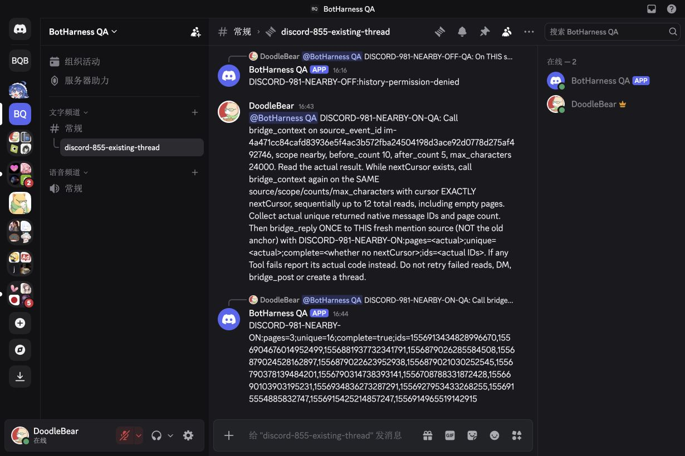
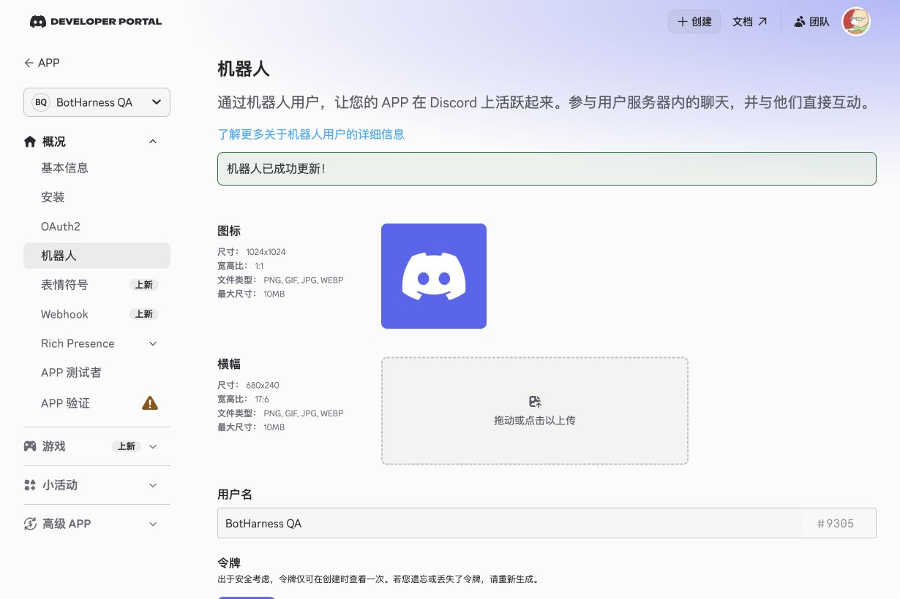

# Discord nearby 上下文候选 — #981

这是已验收 #937 后的独立开发源切片。代理执行的真实原生 nearby 正向续页、原 thread 回复和临时权限精确恢复均已通过；产品 Provider pin、普通收件和 history／nearby／topic 组合行资格保持不变。

## 运行版本与检查

- OFF 证据 Core：`74cb0678752c6e48aefd3450186a92a8c12df39e`，基于已合并 main `632e79821e9f8d6cde996134a4986065cbb08ef2`。
- 隔离 Provider：`5ae8bb3b1b0bb4067bf240e0dfb6fbe38d582c32`；已加载 `lib/index.js` 的 SHA-256 为 `a59c18c5323cc2852f43f88187237fcc6e997e520520fb18bc0c47151816221b`，与候选产物相同。
- DSH `0.2.0-rc.1`；真实 Session 请求为 DeepSeek Pro／off。同一持久 QA Profile 保留 #937 的原 Binding／Grant、原生 App／频道／已有公开 thread。
- Provider 构建、3,594 个完整测试及包检查通过，覆盖密集／稀疏／边界／计数／遗漏／快照／cursor／过期／重启／取消。Host lint、格式、类型、104 个上下文／canonical 回归、完整 2,740 个测试（9 个跳过）、构建、双语账本及 366 页文档通过。以上为初始本机检查。合入 main `c7a7ddacc02eb7acb44a50ea3416f97319889528` 后，正向 E2E 使用 Core `7edd33e03876c7638fa781deb968fe565851d193`：lint／格式／类型／账本／幻灯片、2,745 个测试（9 个跳过）、构建及 368 页文档通过；精确 head 的 [CI 37430597789](https://github.com/BotHarness/BotHarness/actions/runs/37430597789) 也通过。随后仅补证据的提交另有 PR 检查，不改变本次运行输入。CodeRabbit 跳过 draft，其绿色状态不是已审查证据。

## 查询行为

`bridge_context(nearby)` 读取来源所在的准确原生频道或公开 thread。通过每页有界、从新到旧的原生请求组装前后五分钟窗口；两侧稀疏时，补足最接近窗口的可见 Human 文本到请求的最小条数（默认前 10／后 5），锚点独立计数。密集窗口不受这些最小值截断；历史耗尽时允许少于最小条数，不等待未来消息。

续页保留签名、无正文的进程内状态和固定快照上限，每次成功读取续期 30 分钟。每次均重检原生账号、父子关系、正文／历史权限和既有 Host 授权；重启或查询／身份变化使旧 cursor 失效。Bot／webhook／系统／不支持文本如实计入遗漏。既有 canonical 对账／审计拥有留存上下文，不增加第二份记录、普通 Admission、placement、监听器或 Session。

[Discord 原生契约](https://docs.discord.com/developers/resources/message#get-channel-messages) 规定从新到旧的页和互斥的 before／after／around 边界。当前实现提供更窄的有界 nearby 组装，不是全平台搜索或完整归档。

## 已通过拒绝路径与稳定冷启动

原生 App flags 为 `0` 时，真实浏览器提及触发真实模型 `bridge_context`，参数为 nearby、before_count 10、after_count 5。实际结果为 `Error: history-permission-denied`；一次 `bridge_reply` 获得 provider-accepted，独立原生读回确认本 Bot 在原公开 thread 回复 `DISCORD-981-NEARBY-OFF:history-permission-denied`，引用这条新 Human 来源。来源审计为 nearby／refused，无历史 source ID。原有所有 canonical 行保持字节相同；仅新增本次提及的 Source Event、Admission 和一次回复 Intent。Binding／Grant／placement 不变。

首次运行最新 main 新增一次 Memory-change Source Event 和 Admission，无外部来源或回复；它单独记录，不能称为全表不变的重启。初始化结束后的第二次冷启动，六张 canonical 表全部字节相同。OFF 验收后的累计数量：1 Binding／1 Grant／23 Source Events／6 Admissions／4 Outbox replies／2 placements，包含此前 DM 和 Memory 初始化。

[模型／原生／canonical 证明](../../assets/pr/981-discord-nearby/nearby-off-proof.json) · [稳定冷启动证明](../../assets/pr/981-discord-nearby/cold-restart-proof.json)

## 已通过正向续页与恢复

新的浏览器提及要求同一真实模型，在原公开 thread 中对已有被接纳来源读取 nearby 10／5，并逐字使用上次返回的 cursor。三个真实 `bridge_context` 结果分别返回 **11／0／5** 条 Human 文本，原生遗漏分别为 **8／3／0**。中间空页保留合法续页，最终无 cursor 且 `incomplete=false`。独立原生读取与全部 16 条正文、发送者身份及准确 thread 相符；锚点只出现一次，其余为最近 10 条前文与 5 条后文。这项稀疏原生用例证明最近补足和真实续页；密集窗口完整性、边界／重启／取消另有自动化 fixture，不冒充新一轮密集原生验收。

一次 `bridge_reply` 回复**新的触发来源**，而非已回复的旧锚点。原生消息 `1556935049557966871` 来自本 Bot `1556613973846007899`，留在准确 thread `1556622420222283798`，引用新触发消息 `1556934836273287291`。独立读回的正文包含 `pages=3;unique=16;complete=true` 与全部准确返回 ID。

canonical 对比只新增两个 Source Event（新触发来源和一条此前未留存的历史消息）、触发来源的一条 Admission 和一条 Outbox 回复；历史 Admission、placement 与 Binding／Grant 均未增加或改变。唯一变化的旧 Source 行是在绑定锚点上追加三次读取审计；其 canonical 正文及其他所有旧行不变。随后 Message Content 恢复 OFF，原生 App flags 从 `524288` 回到 `0`，Presence／Members 保持 OFF，门户无未保存状态。恢复权限与最终冷重启之后，六张表全部字节相同：1 Binding／1 Grant／25 Sources／7 Admissions／5 Outbox replies／2 placements。

[脱敏实际 Tool／原生／canonical／恢复证明](../../assets/pr/981-discord-nearby/nearby-positive-proof.json) 记录 call ID、准确原生引用、cursor 哈希（不公开可用 cursor）、数量和不可变输入。代理 E2E 验收已完成；合并、产品 Provider 提升、发布及部署仍为独立动作。
