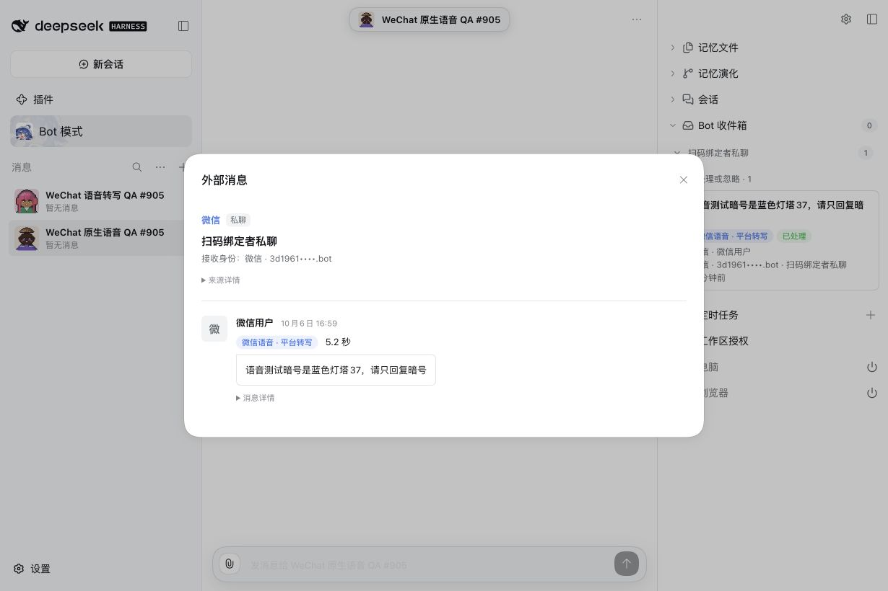
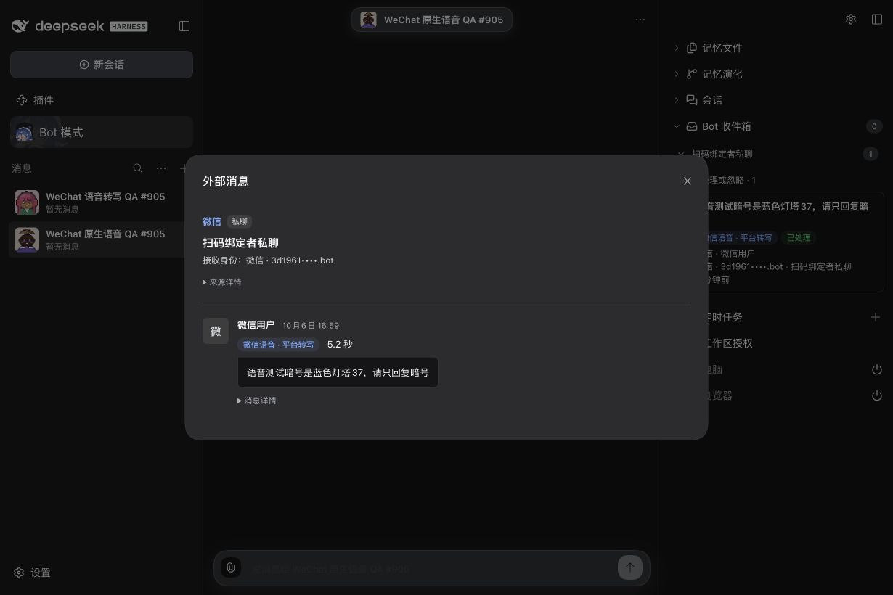

# WeChat native voice transcript — #905 verification

## Qualified candidate

On 2026-10-06, the installed product `0.0.0-test.905` on DSH `0.2.0-rc.1` received a native WeChat voice message in the explicitly authorized QR-paired owner's DM. WeChat supplied the transcript. The actual DeepSeek Flash model read the canonical Source Event and replied through its own bound identity. **The Human confirmed receipt of “蓝色灯塔37” in the original WeChat DM.** This qualifies the transcript tracer, not BotHarness ASR, raw-audio access, other contacts, groups or a public release.

The maintained Provider fork is pinned to `6f8cc9b2713a03b1340e604461900a474adacfa3`, managed artifact `4.32.0-botharness.7`, 395 runtime files, source runtime SHA-256 `e16e51b87c1133ce351dd7c3ec11bacc6a90f73f3c7cf3cddcb1f2da2f511ec7`. The source change and rebuilt Host library are both in that pin. The existing checked WeChat Consumer baseline is not present at the inspected upstream path, so this narrow extension is currently delivered on the maintained fork; an upstream submission would need that baseline first.

## Actual exchange

| Evidence                | Recorded result                                                                        |
| ----------------------- | -------------------------------------------------------------------------------------- |
| Native message/event ID | `7513145866473984520`, retained as a string                                            |
| Native voice item ID    | `v1:8917486407957620914`                                                               |
| Platform duration       | 5,180 ms; the UI shows 5.2 seconds                                                     |
| Platform transcript     | “语音测试暗号是蓝色灯塔37，请只回复暗号”                                               |
| Canonical Source Event  | `im-c3da49f415e7c7dc6596e6b963fef5884e13f1c8a7b9177faf1abf4297d6ddc0`                  |
| Model                   | Native request header records `deepseek-official/deepseek-flash/off`                   |
| Native model events     | `bridge_read` call/result at sequences 19/20, then `bridge_reply` call/result at 25/26 |
| Outbox                  | `38ec1bc2-e671-430c-8066-61c1fb6e6013`, provider-accepted                              |
| Receipt                 | `client-acknowledgement`; this is not a native message ID or delivery/read proof       |
| External delivery       | Human separately confirmed the actual original-DM reply “蓝色灯塔37”                   |
| Local DM                | Authenticated `channelMessages` read-back returns zero messages                        |

Private conversation/user identifiers, credentials, media keys, continuation tokens, full Session logs and authentication URLs are excluded from this report. No audio attachment, player or ASR tool participated in the exchange.

## Source UI

The same actual source is shown in the Inbox and source Modal with explicit platform-transcript provenance and duration. Native identifiers remain in collapsed details.

The Human controls the external WeChat client. Its original voice/reply screenshot remains pending; Human receipt confirmation and local source screenshots are separate evidence.

Before capture was attempted with the prior accepted #904 artifact on the preserved QA Profile. Its launcher could not qualify the API (`HTTP 200`, `gateway/internal`) and stopped the failed Host. No comparable baseline image was obtained. After proving there was no remaining task Host, listener or writer, the #905 candidate was restored with one verified Host. This is a concrete baseline-capture limitation, not an invented before state.

## Retained first failure and recovery

The first real voice supplied the same phrase and 7,377 ms duration. Intake reached canonical Inbox, but the reused application-owned Session retained the preceding image QA role's no-external-reply instruction. The model did not call a reply tool and the Human received nothing. That attempt remains recorded as an intake-only result; handled Inbox does not prove delivery.

A fresh QA Bot/Session was created through the normal application lifecycle. The preceding receiver and binding were stopped before the same paired account was rebound and the same owner DM explicitly authorized. No extra concurrent receiver, edited Session history, weakened permission or repeated send of the first source was used. The Human sent the second native voice, and the exchange above succeeded. The trap is recorded in `dsh-dev`.

## Regression and package checks

- Focused BotHarness messaging, Client and artifact coverage: 6 files / 142 passed. Includes platform/unavailable provenance, account and lease opt-in, original route, deduplication, conflicting metadata, revocation and no local DM placement.
- Provider: 3,583 passed, zero failed/skipped, including malformed/oversized/multipart/partial voice refusal and private audio-key fences.
- Lint, format check, typecheck, bilingual product/Skill ledgers, Host/Client build, product pack and docs build passed on the candidate worktree.
- Full default-parallel run retained worker-start and test timeouts: 2,728 passed / 16 failed / 9 skipped. A bounded two-worker full run reached 2,746 passed / 1 failed / 9 skipped; its remaining `human-dm-steer.test.ts` case timed out at the existing 15-second limit. That unchanged file independently reran with one worker: 8 passed. Assertions and timeouts were not loosened. A clean full-suite result is not claimed.
- Missing native transcript is covered automatically as `unavailable`, with explicit UI/model provenance; the live success event contained a transcript. Real absence or raw-audio recognition is not claimed.

## Runnable Human review

Open the preserved local QA at `http://127.0.0.1:32609/`. Select **WeChat 原生语音 QA #905**, expand **Bot 收件箱 → 扫码绑定者私聊 → 已处理或忽略**, and open the voice source. Inspect the transcript label, duration and folded native/source identifiers. The local DM remains empty. In the Human-controlled **微信 ClawBot** conversation, inspect the second native voice and “蓝色灯塔37” text reply. Do not reinterpret the client acknowledgement or handled state as read proof.

For a fresh exchange, send a new native voice with a new short phrase and a clear instruction to reply only with that phrase. Use the existing paired-owner authorization and Bot identity; do not retry a settled source or send client-converted text as a substitute for voice. Final PR Human QA, merge and deployment are separate steps.
