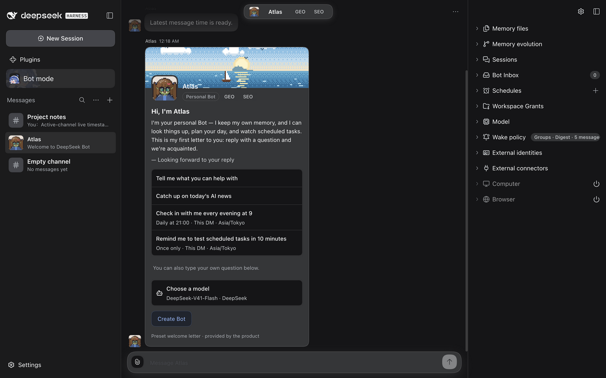
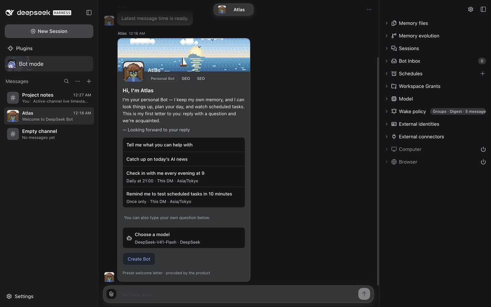

# Conversation title visual evidence

Tracks [#1354](https://github.com/BotHarness/DeepSeekBot/issues/1354).

## Comparable captures

- Before: main revision `ef4d3374f9bde67cbbed970d66e4b7ebc7f5aad4`.
- After: the same revision plus this PR's conversation-title changes.
- Both images are real DSH `0.2.0-rc.1` Web Client captures, not component mockups.
- Both use the same isolated Profile, persisted Channels and messages, selected Atlas DM, dark theme, English locale, Asia/Tokyo timezone, and scroll position.
- PNG dimensions: 1280 × 800. The collaborative preview reports a 1402 × 877 CSS viewport at device pixel ratio 2 and scales its saved capture to 1280 × 800.
- Atlas has the GEO and SEO tags; Project notes contains a Human message; Empty channel has no messages. These are synthetic review records created through the real Host API, not production/customer data.
- Atlas's reply was produced by a real native model turn. The product also appended its welcome letter, which is the latest DM message visible in both captures.

**Before:** neither sidebar title has a time; the header chip includes GEO and SEO.

**After:** Atlas ends in 12:18 AM and Project notes ends in 12:27 AM; Empty channel has no time; the header chip shows Atlas without tags. The welcome letter still shows tags, demonstrating that only the header chip changed.

## Runtime checks

- The DM title's `time[datetime]` matches the canonical latest message at `2026-10-10T15:18:11.789Z`.
- The Group title's `time[datetime]` matches the canonical latest message at `2026-10-10T15:27:05.291Z`.
- Both time elements end at the title-row's right edge; Empty channel has no time element.
- Clicking the Atlas chip still opens its Profile popover, where GEO and SEO remain visible.
- The timestamp colors are also readable in the real light-theme Group view.
- A new message in the active Group Channel updates the title time through the existing live Channel stream without reload.
- Inactive rows retain the existing message-preview refresh behavior; this PR adds no subscription or new durable state.
- The final Client diagnostic attempt reports `shell-ready`, and the captured DOM has no console errors. The earlier document recorded `shell-lost` during Client rebuild/reload; that earlier event is retained, not represented as a product fix. The preview also had a resize timeout and one disconnected capture attempt before successful capture.

## Human review

1. Build this branch and launch an isolated Profile with `scripts/dev-instance.mjs` as documented in `docs/client-bridge.md`.
2. Open a Bot DM whose PersonaBot has tags. Confirm the header chip omits them, while the Profile still shows them and the companion action remains usable.
3. Compare the latest message timestamp with the App sidebar title, then send another message in the selected Channel and confirm its time updates.
4. Open a populated Group Channel and an empty Channel. Confirm only the populated Channel has a time.

## Automated checks

- After rebasing on the recorded main revision: 89 focused Client tests, lint, format, typecheck, changelog checks and build passed.
- The earlier full suite completed with 3,793 passing tests, 9 skipped tests and 5 timeouts in three untouched core test files; this is not a green full-suite result.
- All 18 tests in those three files passed when rerun separately with one worker after rebase. This does not replace a complete final-head suite or CI run.

Human visual acceptance, CI, merge and deployment remain pending.
