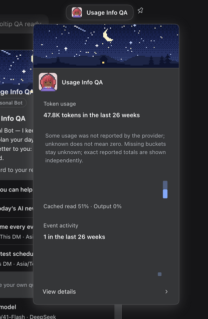
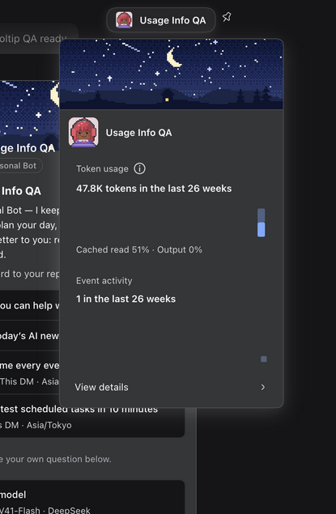
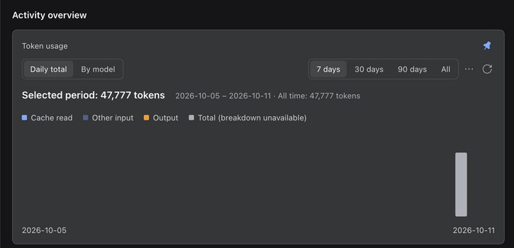
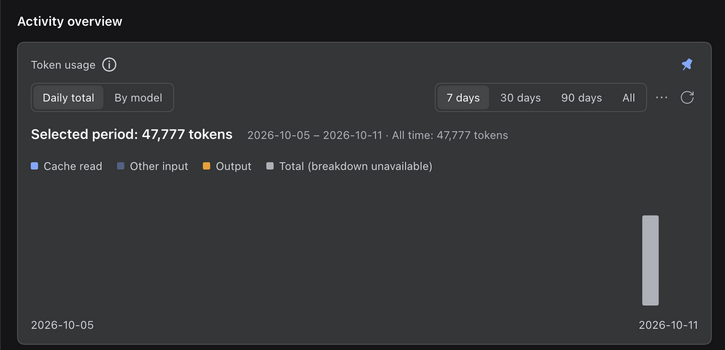
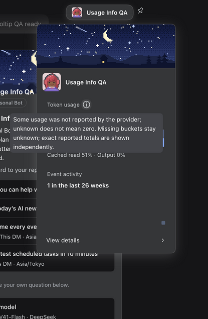
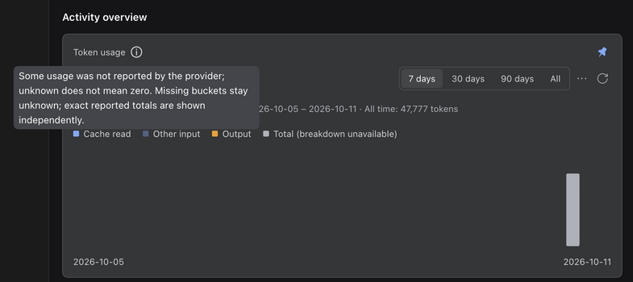

# Profile token-usage title help

Issue: [#1355](https://github.com/BotHarness/DeepSeekBot/issues/1355).

## Capture provenance

- Before: Client built from `4b3099e66bfbeebd325b8302556f4beb7b7d5337`.
- After: the same checkout with this PR's source changes and a rebuilt Client.
- Both run inside a real isolated DSH `0.2.0-rc.1` Host, not a standalone component mock.
- The same test PersonaBot, Profile, English locale, dark theme and browser viewport are used for both sides. The Host is not restarted between the before and after captures.
- Browser DOM viewport: 1402 × 877 CSS pixels. T3 captures are 1280 × 800 pixels; the comparable images use identical rectangular crops of those captures. No text, numbers or UI elements were painted into the screenshots.
- A real isolated Bot DM produced a model reply and reported usage. Its test-only daily usage projection was then seeded with one unknown cache-write flag to exercise the missing-provider state. The images are real runtime rendering of that fixture, **not proof that the live Provider omitted a field**. The same reported total, 47,777 tokens, remains visible before and after.
- Only the isolated Profile was changed. No production Profile, external IM receiver, credential or private conversation is included in these assets.

## Comparison

| View                    | Before                                    | After                                 |
| ----------------------- | ----------------------------------------- | ------------------------------------- |
| Compact Profile popover |  |  |
| Full Profile token card |  |  |

### Explanation on demand

## Interaction evidence

- The compact card's body no longer contains the missing-provider explanation.
- Clicking **About Token usage** opens the complete explanation and gives the button `aria-describedby`; the enclosing Profile popover stays open.
- Escape dismisses that tooltip without dismissing the Profile popover.
- Enter activates the full Profile's focused info button.
- Dispatching a DOM mouseover to the full Profile's info button exercises the native delayed-hover handler and displays the explanation. This is handler-level browser evidence, not a physical-pointer test.
- Automatic tooltip opening during keyboard Tab focus was not established in this browser run; Enter activation was verified. Human QA should also check pointer hover and focus traversal.
- Focused component regressions cover unknown and partial usage, removal of the inline paragraph, title button accessibility, and absence of the button for complete or unloaded usage.

## Validation

- Focused Profile/style tests: 4 files, 30 tests passed.
- All Client tests: 159 files, 1,146 tests passed; jsdom emits an existing unsupported-navigation warning without failing the suite.
- `pnpm typecheck`, `pnpm lint`, `pnpm format:check`, `pnpm changelog:check`, and `pnpm build` passed in the isolated worktree. Lint reports existing warnings.
- These checks do not claim a full repository test run, physical mobile QA, merge or deployment.

## Human review path

1. Build the PR checkout and use `scripts/dev-instance.mjs` with an isolated `--home` and unused `--port`.
2. Select a PersonaBot with a missing token bucket in its usage query. Use only test data in an isolated Profile if seeding this state.
3. Open the Bot's Profile popover. Check that **Token usage** and its info icon share one row, and that the former explanation is absent from the body.
4. Hover or click the info icon, read the explanation, and dismiss it with Escape or an outside click.
5. Open **View details** and repeat the info-button interaction in the full Profile. Test keyboard focus and Enter as well.
6. With complete or not-yet-loaded usage, check that the unnecessary info icon is absent.

Human QA is pending. This task does not merge or deploy the PR.
