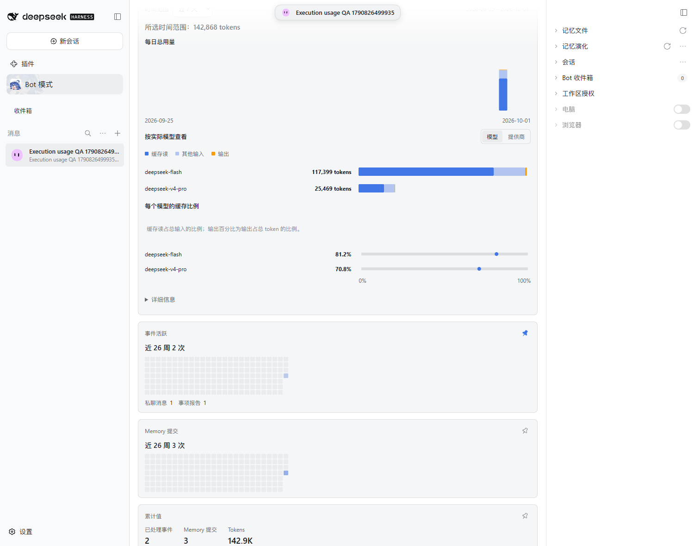

# #502 — retained model usage on a real DSH Host

The production Host/Profile path used DSH 0.2.0-rc.1 in a fresh isolated profile on port 3276. Real Orchestrator, Assignment and DSH Subagent calls produced **142,868 tokens**, verified bucket by bucket against native provider usage reports before the retention experiment.

| Step                                                            | Source histories          | Public Profile total |
| --------------------------------------------------------------- | ------------------------- | -------------------: |
| Initial real calls                                              | All three available       |              142,868 |
| Host stopped, owned log files temporarily moved, Host restarted | All three unavailable     |              142,868 |
| Bot archived through the public `pause` command                 | All three unavailable     |              142,868 |
| Host stopped, original logs restored, Host restarted            | All three available again |              142,868 |
| Bot resumed; Profile refreshed                                  | All three available       |              142,868 |

This is a controlled source-unavailability experiment, **not a new native Session deletion command**. Only the three owned fixture log files were moved while the isolated Host was stopped; the canonical BotHarness database and aggregate rows were not edited. Restoring the logs proves replay does not inflate statistics. The public `profileActivity` rows were compared exactly after each step; see [results.json](results.json).

The model totals remained **117,399** for DeepSeek Flash and **25,469** for DeepSeek V4 Pro. Execution categories remain folded in Details. Default range remains the latest seven days.

## Initial model usage

## Missing histories after Host restart

## Archived Bot

## Restored histories after another restart

## Reproduce

Run `scripts/e2e-execution-usage.mjs` to create the real three-role fixture and verify native usage. Then run `scripts/e2e-retained-usage.mjs` with `BH_E2E_PHASE=baseline` and that fixture's `BH_E2E_BOT_SLUG`. The script keeps its source-file manifest only inside the private isolated home. Stop the exact isolated Host, validate each manifest path is under that home's Sessions directory, temporarily move only those owned log files, and restart the same profile. Run phases `missing` and `archive`; stop the Host again, restore the same files, restart, then run `restored` and `unarchive`. Each phase requires `BH_E2E_HOME`, `BH_E2E_ORIGIN`, and `BH_E2E_SCREENSHOT`.

Public Usage/Host lifecycle regression tests also cover durable replay across repeated restart, late attempts, inherited prefixes, snapshot/live races, transaction rollback, legacy aggregate upgrade, archive, and complete Bot usage Purge. Purge removes that Bot's counters/receipts/baseline without touching another Bot; anonymous root retirement prevents old Session replay or late descendants from repopulating a purged or recreated Bot. No Purge UI is added by this issue.

Upgrade boundary: generation 40 preserves existing aggregates as a baseline. Pre-upgrade events seed receipts without adding tokens again because the old deployment had no durable accounting receipts; unverifiable historic backfill is diagnosed explicitly. Newly recorded attempts have durable exactly-once accounting.
