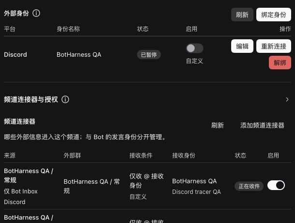
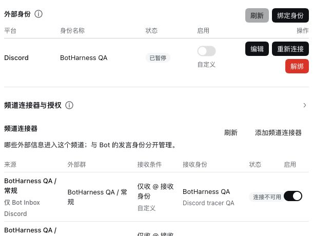
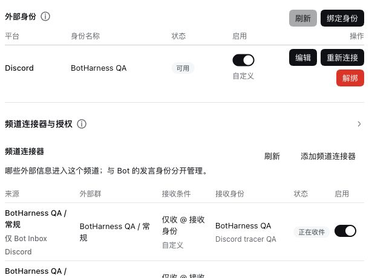
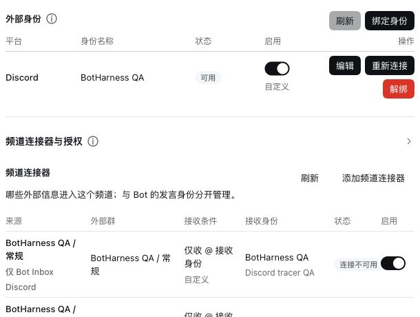
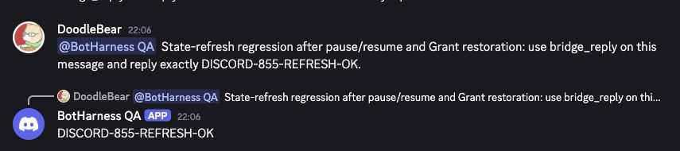
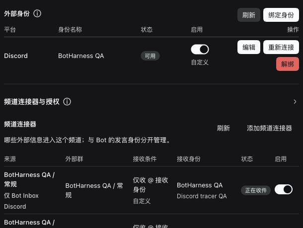

# Messaging status refresh — real Discord regression

- Issue: [#855](https://github.com/BotHarness/BotHarness/issues/855)
- Date: 2026-10-05; native reply read-back at 13:08 UTC
- Baseline: `5e91748ef485b16a1f7fd62ae9768a5423263592`
- Tested Host implementation: `360a85725ad032b09b797444fbe241713dfeef43`; subsequent changes contain evidence only.
- DSH: `0.2.0-rc.1`, same isolated Profile and exact Discord account/channel used before and after.
- Candidate Provider: merged [DoodleBears/dsh-im#6](https://github.com/DoodleBears/dsh-im/pull/6), commit `1a605b11fa8d321110540de42d58a77bdcd60f13`; its tree equals the tested candidate `8cf705ea474cdef8e658f7756ee48d5c936bd404`. Runtime: 394 files, SHA-256 `69c513ff44fb802377ec7648e9c9075d2fc2c63b6f1c3205ee1d6012f956e58e`.

## Observed behavior

The baseline real Profile leaves its adjacent Channel connector showing “正在收件” after pausing the identity, although the canonical Host query reports reception unavailable. A regression test reproduced the missing authenticated roster notification before implementation.

On the PR implementation, the same mounted Profile automatically shows “连接不可用” after identity pause and “正在收件” after resume. Revoking the active target Grant automatically shows the connector unavailable while leaving the identity available. No Refresh button or page reload was used between these actions and their observed state changes.

The existing UI restored the same account and exact target and enabled mention reception. This creates a new active Grant; revoked historical Grant rows remain visible and unavailable. Original Follow system appearance was restored after light/dark captures. The product Provider pin is unchanged.

## Matching baseline / PR captures

Chrome viewport 1230 × 820, Chinese locale; native screenshot crop 610 × 460. Both pause pairs use the same two Grant rows, identity, channel, section state and crop. Images are native pixels, with no generated or edited content.

| Theme | Before: identity paused, stale receiving connector                      | After: identity paused, connector unavailable                         |
| ----- | ----------------------------------------------------------------------- | --------------------------------------------------------------------- |
| Dark  |    |    |
| Light |  |  |

PR-only interaction checkpoints, captured before restoring the Grant:

| Resume identity: reception restored                                | Revoke target Grant: identity retained, connector unavailable      |
| ------------------------------------------------------------------ | ------------------------------------------------------------------ |
|  |  |

## Real model and native reply

A Human message sent through the real Discord composer with native Bot mention requested `DISCORD-855-REFRESH-OK` after pause/resume, Grant restoration and Host restart. The model produced one provider-accepted reply intent. Independent authenticated native GET Message confirmed the Bot author, exact channel, body and source-reference. The corresponding canonical Source Event has one handled Inbox item. Totals changed from 9 to 10 Inbox items and 7 to 8 intents, with one native reply and no extra inbound Bot echo.

| Source message        | Native reply          | Destination                            | Body                     |
| --------------------- | --------------------- | -------------------------------------- | ------------------------ |
| `1556653907319586817` | `1556653929763307601` | Original channel `1556616665385668620` | `DISCORD-855-REFRESH-OK` |

The isolated Profile was left available and receiving after restoring the original target:

## Automated coverage and Human acceptance

Lint (existing warnings only), formatting, typecheck, release-ledger validation, full suite (2,505 passing tests; 9 skipped), and build passed. Four new real Core/state-stream regressions cover identity pause/resume/revoke, an off Grant without a lease, and asynchronous consumer connection success/failure. The unavailable-consumer case is a controlled fixture, not a native Discord outage test.

1. Open the isolated PersonaBot Profile; identify the active connector (historical revoked rows remain unavailable).
2. Pause the identity and confirm the connector becomes unavailable without Refresh. Resume and confirm it returns to receiving.
3. Revoke the active target Grant; confirm the identity remains usable and the connector becomes unavailable. Restore the same account/target through the existing controls and enable mention reception.
4. Mention the QA Bot in the native channel and inspect the original-channel reply and Inbox source.

Human UI acceptance and broader Discord qualification remain separate from this fix. Source deletion, consumer-ownership races, redelivery/gap behavior, additional capabilities and product Provider promotion are not established by this checkpoint.
