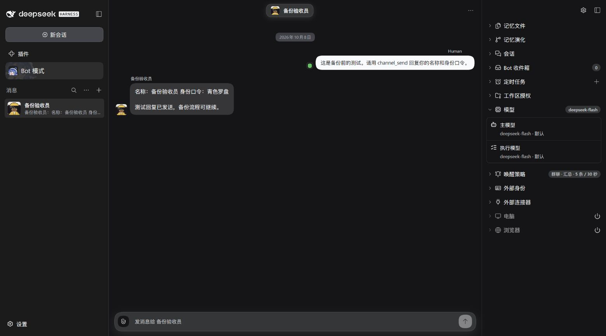
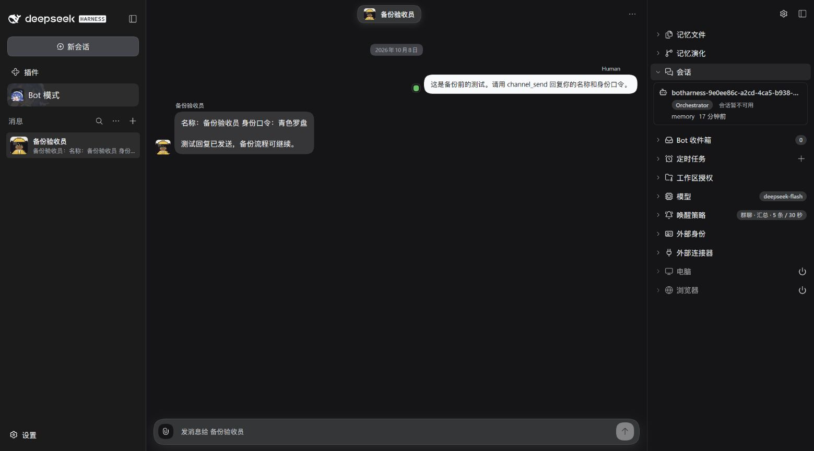

# Profile backup and restore verification — #886

Verified on Windows on 2026-10-08 with the worktree-pinned DSH `0.2.0-rc.1` CLI. All content below is synthetic. Credentials, login URLs, raw logs and backup files remain machine-local and are not published.

## Real runtime round trip

1. Started an isolated source with `scripts/dev-instance.mjs`, created **备份验收员** in the actual Bot UI, saved the reusable **恢复验收模型** preset and an independent Bot Model Plan for `deepseek-official/deepseek-flash`.
2. A real source DM returned its name and Soul identity phrase **青色罗盘**. The Settings backup entry and disclosures were exercised. Initial preview exposed an RC1 streaming-GET bridge failure; switching GET/JSON routes to buffered requests fixed it, verified by authenticated Host responses.
3. The real Host preview/export returned a verified package with 40 files, one Bot and one explicitly unsupported native Session. Final compressed size: **42,172 bytes**. SHA-256: `567155cd895423ece279516d418e830a227dbcc13ab8221f530a7beaf25aa8be`.
4. The local restore command created a previously nonexistent stopped destination. The source Host was stopped, then the destination was launched through the pinned helper. Actual Bot UI showed the original DM, preserved identity, disabled Browser/Computer access and unavailable historical native Session.
5. The readiness UI blocked execution pending target-local authorization. The Human explicitly authorized this isolated acceptance run. The target model authorization succeeded through the UI; acknowledgement/activation and subsequent DM were completed through the same real authenticated Host HTTP interfaces after browser control disconnected.
6. The activated Bot retained ID `bot-01db0e2f64684ae9b55eef0a7e2e3188` and replied **“名称：备份验收员 / 身份口令：青色罗盘 / 恢复后真实回复成功”**. Fresh Orchestrator: `botharness-900ebe9e-f8a5-4a7f-a5dc-e231fceba6d9`; historical Orchestrator: `botharness-9e0ee86c-a2cd-4ca5-b938-d3c64ce21e30`.
7. Cold-restarted the destination without reauthorization or reactivation. Readiness retained the same activated Session and exact route. A second real DM returned **“冷重启真实回复成功”** with the same name and identity phrase. The new native Session file exists under the restored Memory working directory; the old Session remains an unavailable ownership reference.

### Captured UI — 1559 × 865, Chinese, dark

**Source, before backup:**

**Restored cold destination, before activation:**

These compare the same synthetic identity and history. They are not a baseline Settings before/after pair. A separate unchanged `92965cf1` checkout was built and launched for that pair, but Chrome control disconnected before capture; the in-app browser rejected the loopback URL with `ERR_BLOCKED_BY_CLIENT`. Consequently the final Settings preview/download, file chooser, localized readiness, activation and English UI screenshots remain **Human QA capture work**. No mockup or screenshot from a stale loading page is substituted.

## Automated evidence

`packages/core/test/profile-backup.test.ts` exercises the actual database, Registry, Memory, Attachment, Purge, recovery and HTTP owners:

- Complete round trip includes a custom Memory path, retained deleted identity, canonically erased identity, current editable attachment bytes/identity, real nonempty purge checkpoint, templates and independent plans; verifies cold restart and fresh Session ownership.
- Missing retained Memory or referenced attachment refuses export. Self-consistent hashes cannot conceal an omitted database attachment dependency.
- Mutable-file changes, insufficient space and cancellation leave no output and release the Backup Barrier. Existing output is preserved byte for byte.
- Unsafe paths, damaged hashes, internally corrupt SQLite, unsupported newer generation, cancelled restore and a destination appearing during staging refuse publication.
- A second real Writer Lease cannot mount the source; reentrant writes are refused while its owner holds the Backup Barrier.
- Current preview tokens gate HTTP export, file inspection verifies the result, target model authorization/acknowledgement gate activation, and Plan drift or missing target credentials block execution.
- A real registered provider with an issued in-flight Outbox request is captured. Restore suspends its grant and preserves `unknown-outcome` without a second send. Newly created identities after restore do not inherit a restore-only activation requirement.

Final checks: lint, formatting, typecheck, product build, bilingual release/Skill ledgers, Chinese OG font regeneration and docs build passed. Four existing owner suites passed **70 tests**, and the backup suite passed **8 tests**. The dedicated backup suite uses `--maxWorkers=1 --testTimeout=60000` on this loaded Windows machine.

The full default-concurrency test attempt overloaded this machine; the bounded full attempt also stalled and was cancelled. Two failing groups were reproduced unchanged on baseline `92965cf1`: `bridge-rpc` has 10 Windows `EPERM` fixture-cleanup failures; `npm-prerelease` has 3 missing-packed-entry failures. This is **not a green full-suite claim**. Human/CI must complete the required full-suite check before merge.

## Human QA path

Use two new, isolated directories and the pinned helper described in [Settings](../../settings.md#complete-environment-backup-and-restore). In the source, save a Bot with an explicit Model Plan and reusable preset, exchange a real DM, then open **Bot Settings → Manage backups**. Review counts/disclosures, download the verified file and inspect that exact file. Restore with the shipped `botharness-profile` command into the new stopped target; stop the source before starting the target. Inspect cold history, repair credentials/Plan if needed, authorize that exact target model, acknowledge the Disaster Restore warning and activate. Send a new DM, then cold-restart and send another.

Also inspect the error/retry state with a damaged file and cancel an operation. The automated suite covers space and Writer Lease refusal without modifying real device permissions. Capture matched baseline/final Settings screenshots and English/Chinese readiness before declaring visual acceptance complete. Existing-target replacement, Session transcript import and Managed Transfer remain outside this slice.
