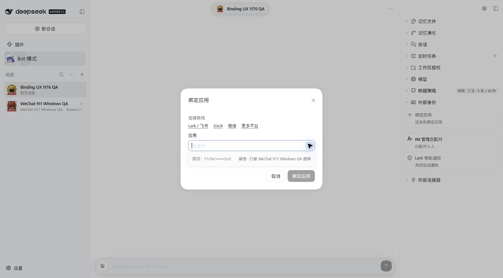
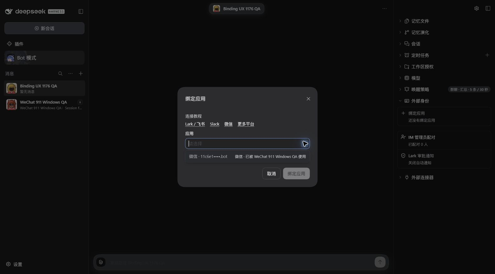
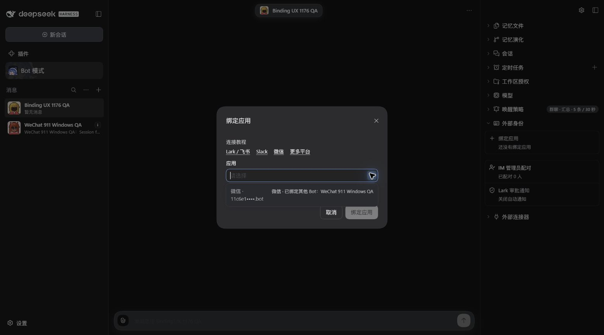
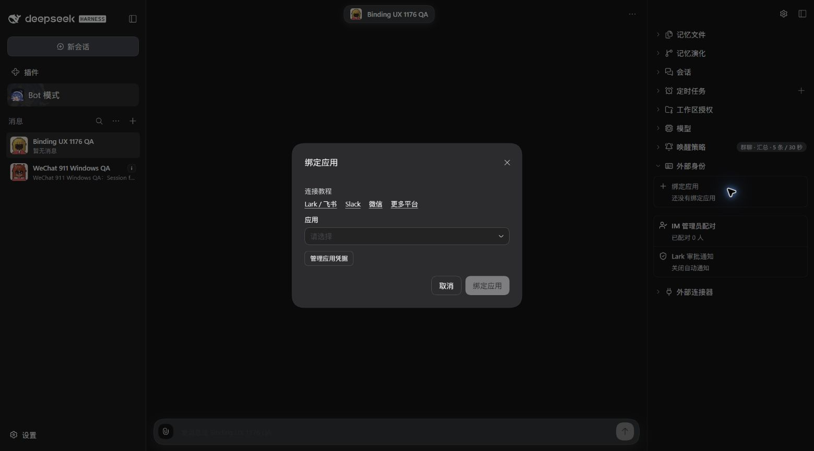
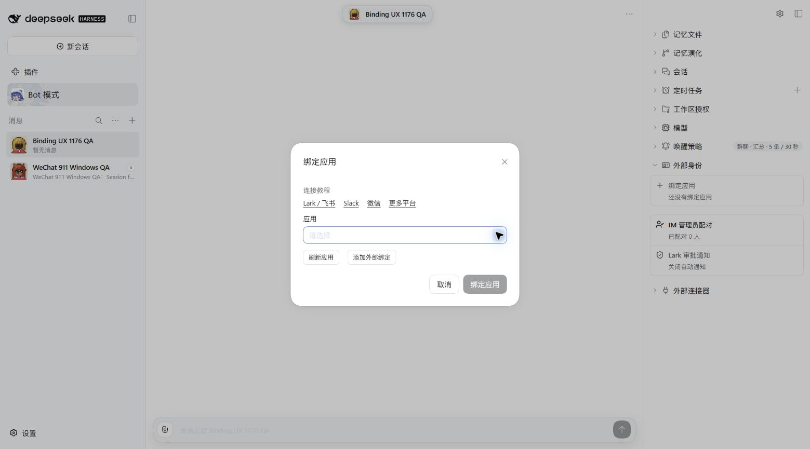

# Bind app Windows QA — #1176

Implementation: `32b801e646a9060ceb047405996176b1fc35d549`, based on merged main
`895153357ba11c1729a8f9df2c3e5093401ab968`.

## Automated verification

- Windows Client suite: 934 tests across 127 files passed, including 17 focused binding/navigation tests.
- Lint, typecheck, targeted formatting, build, bilingual Release Ledger check and Chinese OG font generation passed.
- [Full CI](https://github.com/BotHarness/DeepSeekBot/actions/runs/37749984810): 3,222 tests passed, nine skipped; lint, formatting, types, build and docs checks passed.
- Independent Standards and Spec code reviews found no confirmed code defects or scope violations.

The integration tests exercise the actual Client entry, snapshot store and native Settings DOM bridge:
newly paired apps appear in the returned snapshot, selection survives the round trip, occupied apps
remain disabled, failed refresh supports retry, and cancel/unmount prevents late reopening.

## Real packaged UI

Candidate `0.0.0-test.1176.1` and baseline `0.0.0-test.911.8` ran sequentially in the same isolated
Windows Profile with the same paired WeChat account, two QA Bots and Chinese locale. Their Host
JavaScript artifacts have identical SHA-256 hashes; the comparison changes the Client, without a
schema downgrade, copying pairing tickets or changing binding ownership.

The unbound **Binding UX 1176 QA** Bot exposes the app owned by **WeChat 911 Windows QA**.
Screenshots use a 1559 × 865 viewport. The account name is masked by the product.

| Check                            | Observed result                                                                                                     |
| -------------------------------- | ------------------------------------------------------------------------------------------------------------------- |
| Occupied app                     | Visible, explicitly names the other Bot, and disabled in both themes.                                               |
| Setup action                     | Displays **添加外部绑定** alongside **刷新应用**.                                                                   |
| Native Settings navigation       | Opens IM Bots without forcing Feishu; the existing WeChat receiver remains online.                                  |
| Return from Settings             | Closing native Settings restores the original Bind app dialog.                                                      |
| New paired-app snapshot          | Covered by the real Client integration test; no additional Human QR scan was requested for this UI-only comparison. |
| Cancellation and refresh failure | Covered by integration regressions.                                                                                 |
| Light/dark appearance            | Both captured; existing primitives, dimensions and theme tokens retained.                                           |

### Occupied app

### Setup and refresh actions

The light action-only baseline capture caught a transition and was discarded; its recapture was
blocked by a browser connection timeout. The comparable dark pair and both occupied-picker pairs
are retained. This is the remaining capture exception; the steps below are runnable in either theme.

### Reproduce the Settings round trip

1. Open the unbound QA Bot's DM, expand **External identities**, and open **Bind app**.
2. Open **App**; confirm the other Bot's occupied app is visible and disabled.
3. Dismiss the picker and choose **Add external binding**.
4. In native **Settings → IM Bots**, connect an app if needed; personal WeChat QR scanning remains a Human action.
5. Close native Settings. The candidate restores **Bind app** and refreshes its authoritative snapshot.
6. Use **Refresh apps** to refresh again; cancel the dialog to finish.

## Startup observation

One initial browser load failed with `SlotAssemblyError: renderSlot('root') before any 'root'
registration (boot order)`, followed by cancelled inspect-manifest calls and an unknown-session
restore error. A normal reload restored the page without changing data. Browser console inspection
then showed no new errors during the verified Settings round trip. This is a recorded startup
failure, not a claimed root-cause fix; autonomous browser diagnostics and follow-up investigation
are separate AX work. Earlier browser-control and screenshot timeouts also recovered long enough
to capture the comparison; they are not product-success evidence.

No merge or deployment was performed by this task. The independent #911 native typing matrix and
its final Human QA decision remain on #911.
