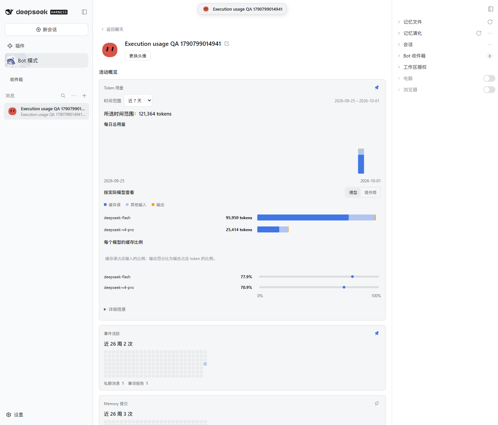
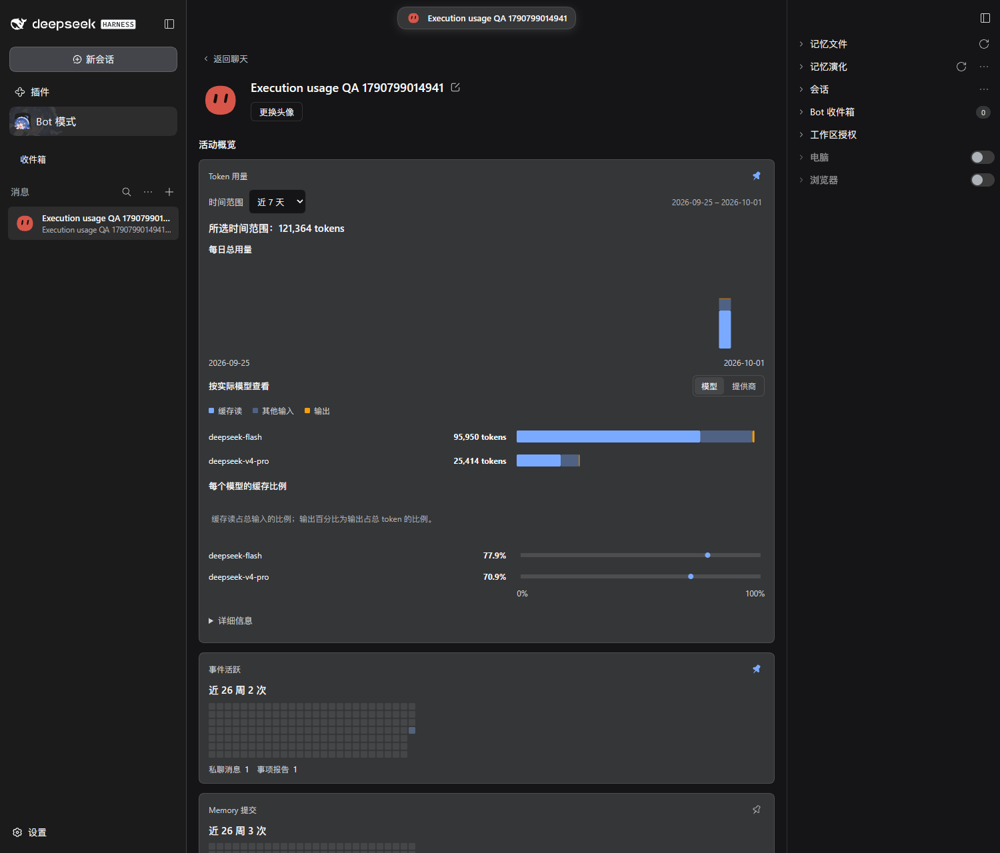
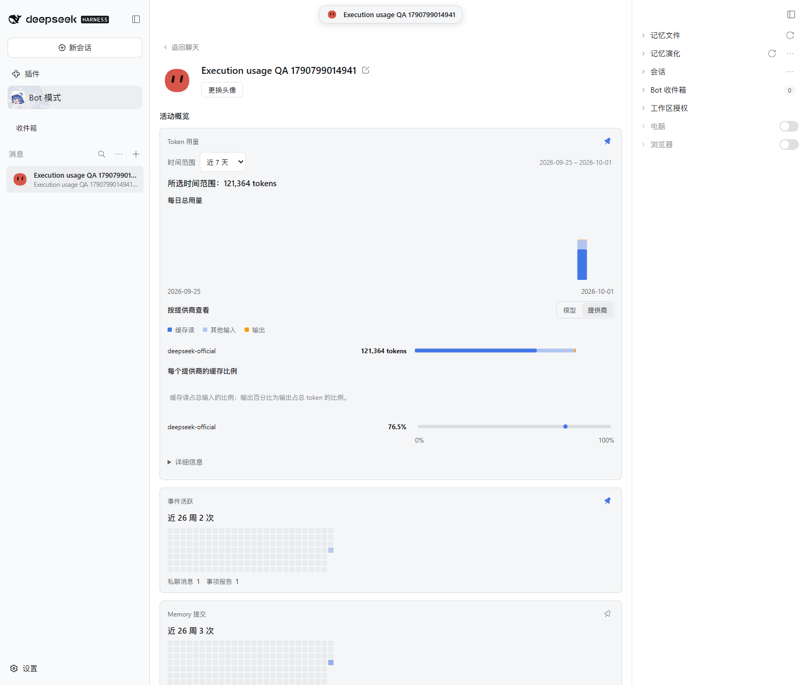
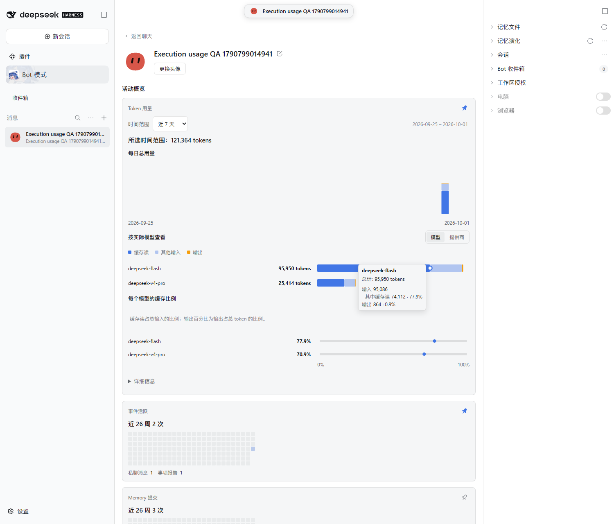
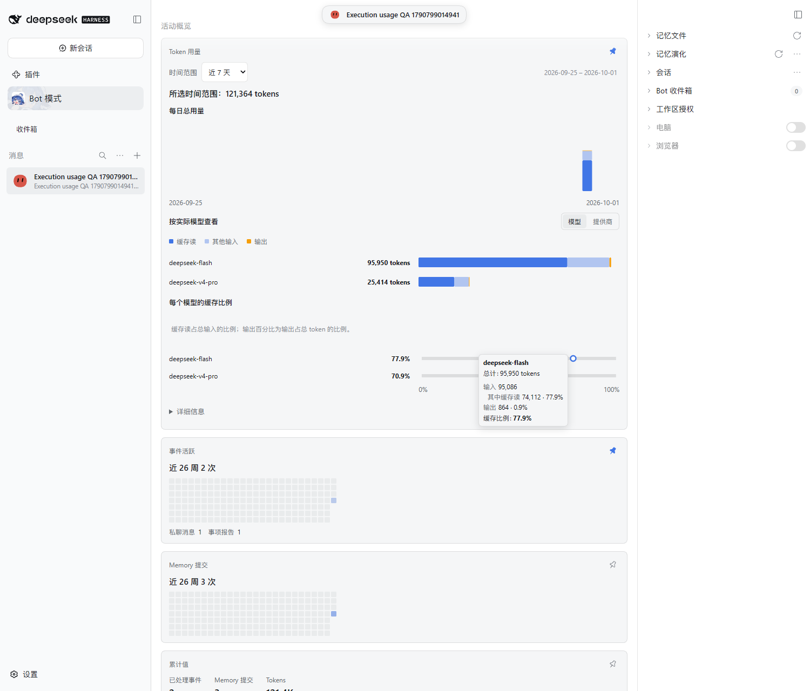
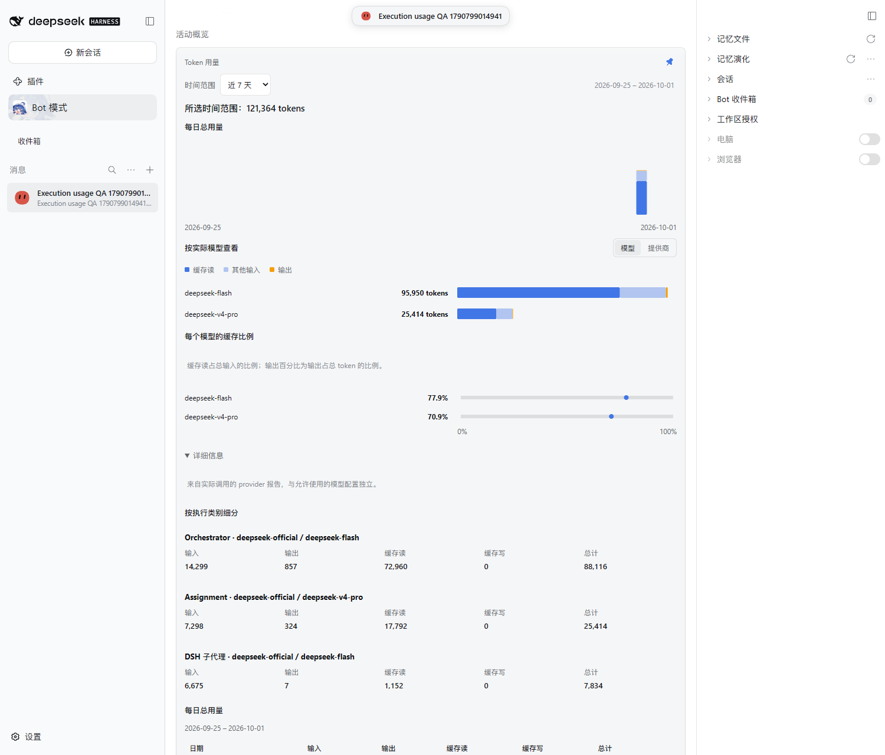
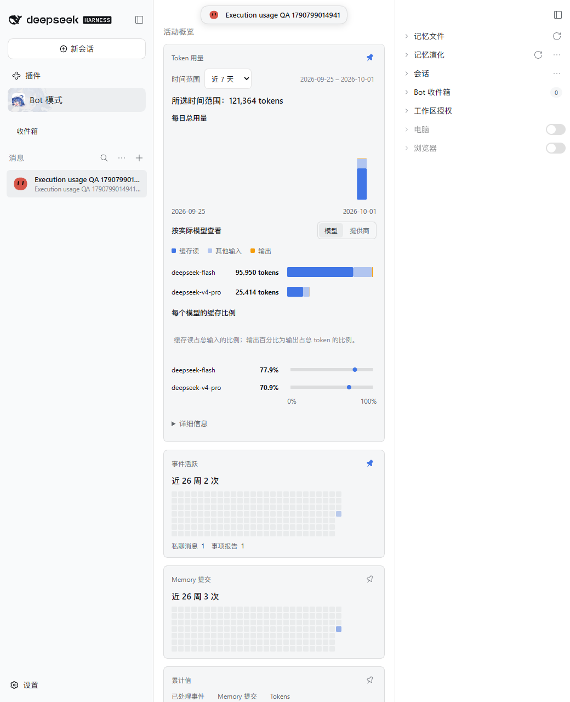
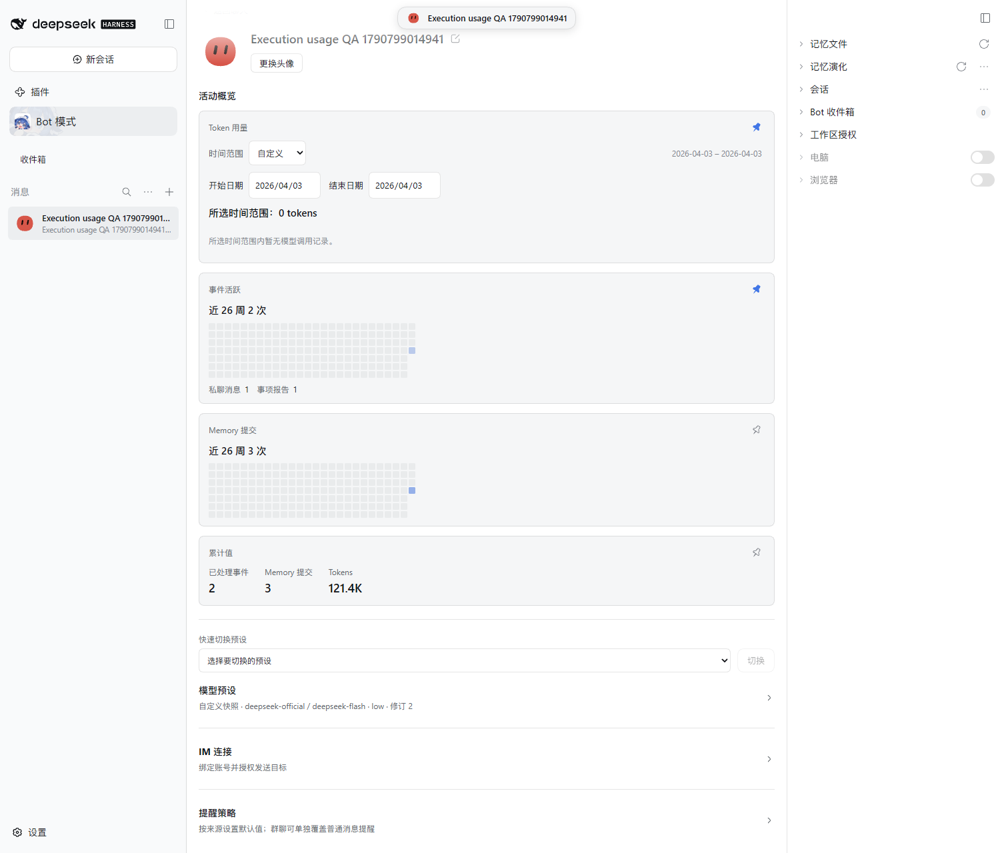

# Coordinated PersonaBot model usage QA

Issue: [#592](https://github.com/BotHarness/BotHarness/issues/592). Human prioritized this presentation after approving #503 / PR #598. It uses the existing bounded 26-week public Profile usage query; retained history, expanded Host filters and all-time totals remain #502 / #507.

## Real DSH evidence

Verified against the pinned DSH 0.2.0-rc.1 in a new isolated Profile. **Execution usage QA 1790799014941** made real Orchestrator (Flash/low), Assignment (V4 Pro/off) and DSH Subagent (Flash/low) requests. The real child reply reached the Assignment report and the parent DM. Public daily aggregates independently match all owned native settlement reports on **2026-10-01**:

| Execution    | Actual model (deepseek-official) |  Input | Output | Cache read | Cache write |  Total |
| ------------ | -------------------------------- | -----: | -----: | ---------: | ----------: | -----: |
| Orchestrator | deepseek-flash                   | 14,299 |    857 |     72,960 |           0 | 88,116 |
| Assignment   | deepseek-v4-pro                  |  7,298 |    324 |     17,792 |           0 | 25,414 |
| DSH Subagent | deepseek-flash                   |  6,675 |      7 |      1,152 |           0 |  7,834 |

Default model totals merge execution roles: **Flash 95,950**, **V4 Pro 25,414**, overall **121,364 tokens**. The three TanStack Charts (daily usage, model composition and cache ratio) use the same selected range, defaulting to the most recent 7 calendar days including today. Execution labels are absent from the default view; native Details is closed. Keyboard Enter opens it and exposes all three execution rows plus daily bucket data.

The real script verified Today keeps the same fixture total, a custom unused day clears all charts and displays the empty state, and restoring 26 weeks returns the model rows. Refresh preserves the public aggregates. The 1500px and 1040px captures use a 1280px viewport height to show the full coordinated card. The full Profile measures 900px wide with 18px normal inset at a 1500px viewport; the 1040px viewport has no usage-section horizontal overflow. Both themes were inspected, including compact 36px single-line name/total rows aligned to stacked model bars and 32px cache-ratio rows and cache markers on a fixed 0–100% scale. The Model / Provider switch exposes exactly one grouping dimension: model names only by default, provider names only in the alternate view. Same model IDs across providers merge in the default view; the raw public Host rows and collapsed execution details still retain both identities.

Per-model hover counts and weighted ratios:

| Actual model    | Total input | Cache reads | Cache / input | Output | Output / total |
| --------------- | ----------: | ----------: | ------------: | -----: | -------------: |
| deepseek-flash  |      95,086 |      74,112 |         77.9% |    864 |           0.9% |
| deepseek-v4-pro |      25,090 |      17,792 |         70.9% |    324 |           1.3% |

Input includes uncached input, cache reads and cache writes. Ratios use summed counts across the selected period, never an average of per-call percentages. Missing denominators and zero input retain Unknown; exact reported totals with incomplete buckets receive a neutral bar rather than a fabricated stack. The screenshot composition borrows [OpenCode Data](https://opencode.ai/data/)'s per-model comparison and cache-ratio tracks, expressed using native DSH tokens. Real model-bar and cache-marker hovers expose the same counts and percentages for both models; provider hover verifies its combined counts. These details are absent from the compact default rows.

The real keyboard switch merges both used models into the single **deepseek-official** provider: **121,364 total**, **120,176 input**, **91,904 cached reads / 76.5%**, **1,188 output / 1%**. The default model view has no provider subrows, and the provider view has no model subrows. Switching back preserves the selected week and restores the two model rows.

## Reproduce and Human QA

Launch an isolated Host with `scripts/dev-instance.mjs`. Set `BH_E2E_ORIGIN`, `BH_E2E_HOME`, `BH_E2E_SCREENSHOT`, and `BH_E2E_EXPECT_COORDINATED=1`, then run `node scripts/e2e-execution-usage.mjs`. An optional `BH_E2E_BOT_SLUG` rechecks an existing fixture without extra provider calls. The script waits for the Bot's public aggregate state to become idle, compares reported settlements within the same date window, and captures the default, expanded, empty and narrow presentations.

1. Open Bot mode, select the fixture above, and open its complete Profile.
2. Default Token usage should show Last 7 days, daily usage, compact single-line model names and totals aligned with stacked bars, and a compact cache-ratio chart; input/cache/output details appear only on chart hover and Details stays collapsed.
3. Select Today: all charts and the overall total describe that range. Choose Custom and set both dates to an unused day: no stale bars remain. Try Last 26 weeks, then return to Last 7 days.
4. Hover the Flash cache marker: input 95,086, cache reads 74,112 / 77.9%, output 864 / 0.9% should agree with the independently reported counts above. Hover the model bar to see the same token buckets and percentages.
5. Focus the Provider segment and press Space: one provider row should replace the two models, with 121,364 total and 76.5% cache ratio. Switch back to Model.
6. Focus Details and press Enter. Orchestrator, Assignment and DSH Subagent appear with input/output/cache buckets and reported totals. Close it to return to the model overview.

Focused public Host-query and Client tests verify exclusive model/provider grouping, combined execution roles, range synchronization, known totals with missing buckets, unknown totals, invalid ranges, unavailable versus empty results, cache-write-inclusive input, weighted shares, range changes and zero denominators. No Client reads private Session logs and no second statistics store is introduced.
