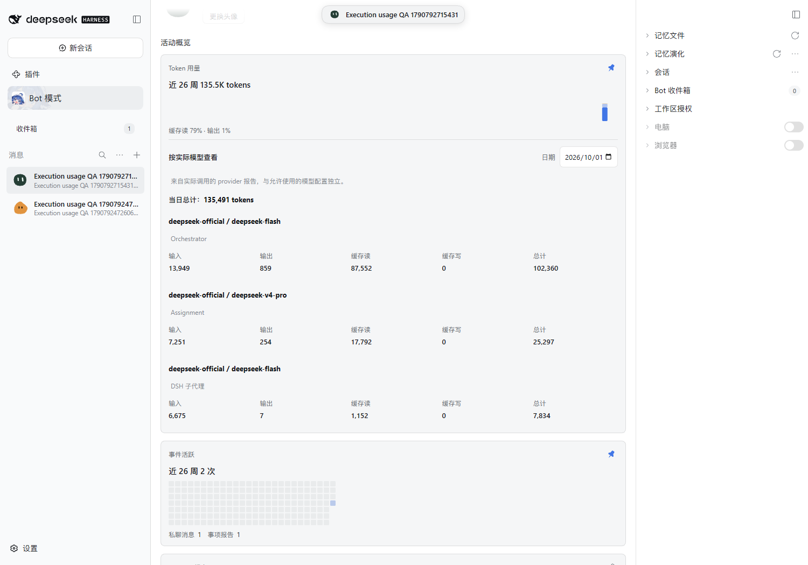
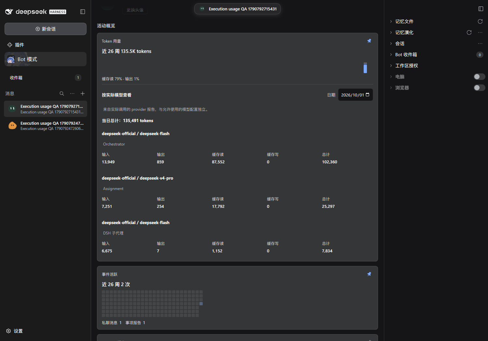

# Execution-role and actual-model usage QA

Issue: [#503](https://github.com/BotHarness/BotHarness/issues/503). This slice attributes reported usage to trusted Session ownership and each settled request's actual provider/model; retained statistics after ordinary history deletion remain #502.

## Real DSH scenario

Verified against the pinned DSH 0.2.0-rc.1 in an isolated `web-dev` Profile. The Human DM starts an Orchestrator using DeepSeek Flash / low, which creates an Assignment using DeepSeek V4 Pro / off. That Assignment creates a native DSH Subagent using Flash / low and reports its real `USAGE_CHILD_REAL` reply back to the Orchestrator. The Channel receives `USAGE_ROLES_CONFIRMED`.

The public `botharness/profileActivity` query for **Execution usage QA 1790792715431**, on **2026-10-01**, returns these exact rows, all under `deepseek-official`:

| Execution    | Actual model    |  Input | Output | Cache read | Cache write |   Total |
| ------------ | --------------- | -----: | -----: | ---------: | ----------: | ------: |
| Orchestrator | deepseek-flash  | 13,949 |    859 |     87,552 |           0 | 102,360 |
| Assignment   | deepseek-v4-pro |  7,251 |    254 |     17,792 |           0 |  25,297 |
| DSH Subagent | deepseek-flash  |  6,675 |      7 |      1,152 |           0 |   7,834 |

The day's total is **135,491**. A read-only comparison against native Session projections independently matched the four reported token buckets and actual dispatch routes. Native `tokenUsage.totals` has no `totalTokens` field, so the verification adds the four buckets only after checking they are all known. The Client receives daily aggregates, without Session IDs or private logs.

The same rows survived a browser refresh and a cold restart of the latest Host build without duplicate counting. The full Profile measures 900px wide with 18px normal inset at the captured 1500px viewport.

## Reproduce and review

1. Build and launch an isolated instance with `scripts/dev-instance.mjs`, using a machine-local provider credential.
2. Set `BH_E2E_ORIGIN` to its origin, `BH_E2E_HOME` to its isolated home, and `BH_E2E_SCREENSHOT` to the desired PNG path; run `node scripts/e2e-execution-usage.mjs`. This creates the real three-role scenario and captures both themes.
3. Open Bot mode, select the newly created **Execution usage QA** PersonaBot, open its Profile, and choose the full detail view. The token usage card must show separate Orchestrator, Assignment and DSH Subagent rows, with the day total equal to their sum. Flash appears separately for Orchestrator and Subagent.
4. Refresh and check the same values. To verify a Host restart without issuing more model calls, rerun the script with `BH_E2E_BOT_SLUG` set to that existing Bot's slug.

## Focused automated coverage

The public Host-query tests cover two models within one Turn, failed and retried settlements, missing usage/route fields, explicit zero and invalid totals, duplicate delivery, surface replacements, inherited fork prefixes, snapshot/live overlap, and a late settlement arriving after a newer route event. Unowned Sessions contribute no usage; trusted Orchestrator, Assignment and Subagent roots remain distinct. The Client test keeps execution roles separate when they share a provider/model and preserves unknown token buckets.

These failure, retry and mixed-Turn cases are automated Host tests; the real provider scenario above validates three execution roles using two actual model routes.
