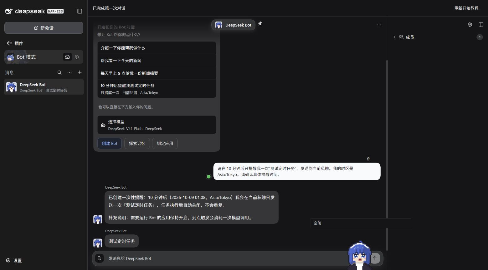
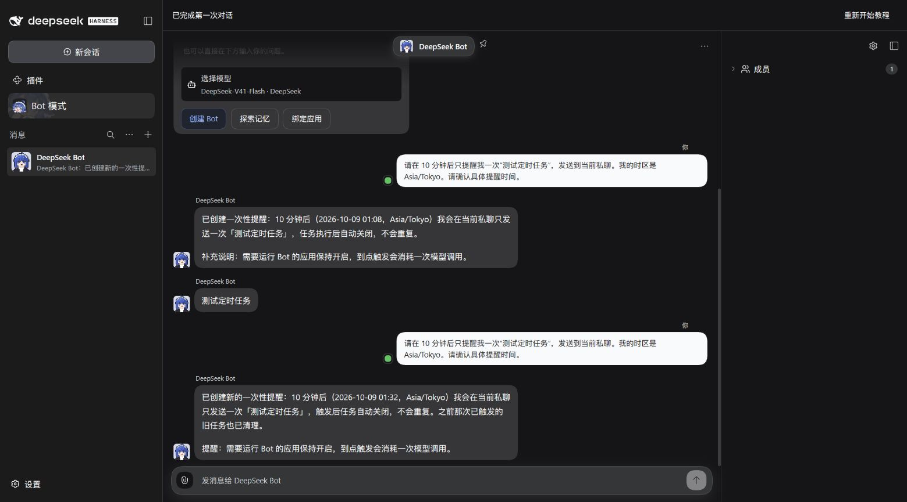
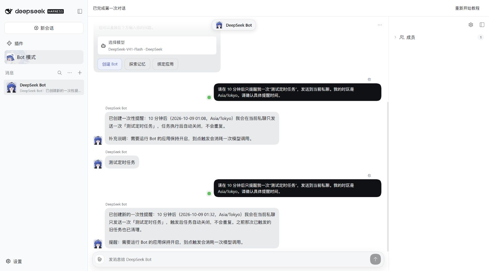

# Issue #1208: one-time onboarding reminder

This tracer belongs to [the Bot-mode onboarding spec #1174](https://github.com/BotHarness/DeepSeekBot/issues/1174).

## Runtime path

Use the pinned DSH 0.2.0-rc.1 launcher with a fresh isolated Profile and a usable native model, enter Bot mode, and choose the welcome's ten-minute reminder. The option shows **Once only · This DM · the browser time zone** before selection. If a model needs setup, save it, review the preserved request and explicitly send. With no detected time zone, the request asks the Bot to confirm one first.

The ordinary Human message reaches the real PersonaBot Orchestrator. Its existing `bot_schedule_create` Tool accepts `once_in_minutes` with an explicit `time_zone`; the Bot Schedule owner computes a local `once` trigger from its clock. Native minute precision rounds the deadline up, never down. The owner checks that the native occurrence matches the computed instant; an ambiguous autumn clock overlap is refused rather than silently selecting an earlier occurrence. Existing absolute `once_at` and recurring forms remain available.

The scheduled prompt retains the exact current DM destination. Creation confirmation names the actual local date/time, time zone and DM, explains that the app must remain running and that firing may use the model, and avoids internal IDs. A real planned firing must then deliver in that DM, disable the schedule and clear its next due time. Confirmation alone does not prove firing.

## Evidence and limits

- Final implementation: 70 focused Client/controller, adapter Tool and Bot Schedule tests passed. They cover deliberate dispatch, duplicate-click protection, missing-model setup without auto-send, unknown time zone, explicit relative Tool arguments, midnight, minute rounding, spring DST and refusal of ambiguous autumn deadlines.
- Production build, type checking, lint, formatting and bilingual Release Ledger checks pass. A full local Windows test run was stopped after repeated Group/runtime timeouts under parallel load; it is not a full-suite pass. The PR's CI is the complete-suite check.
- In the isolated real Host using `deepseek-official/deepseek-flash`, the final request was admitted at **2026-10-08 15:57:22 UTC**. The model created one PersonaBot-owned, enabled `once` task at **15:57:29 UTC**, due **16:08:00 UTC / 2026-10-09 01:08 Asia/Tokyo**, with the exact DM destination retained in its prompt. Its concise confirmation arrived at **15:57:30 UTC** and completed onboarding through the canonical Bot reply.
- The real Session records show the model called `bot_schedule_create` with `once_in_minutes: 10` and `time_zone: Asia/Tokyo`. No reminder was present at **16:07:50 UTC**, before the deadline. The final task fired naturally at **16:08:00.003 UTC** and delivered exactly one「测试定时任务」message in the same DM at **16:08:05.288 UTC**. Its single firing was `planned` and `handled`, with canonical Source Event and handling Session references; the schedule became disabled and its next due time cleared. The final result is also recorded in [PR #1221](https://github.com/BotHarness/DeepSeekBot/pull/1221) and the issue handoff.

## Real Client click and screenshots

Chrome reconnection restored real page control on 2026-10-08. The welcome's actual reminder button was clicked at **16:21:50 UTC**, dispatching the concise translated Human request through the Client. The real model created a new canonical one-time task at **16:21:55 UTC**, due **16:32:00 UTC / 2026-10-09 01:32 Asia/Tokyo**, and confirmed at **16:21:57 UTC** that it would send once to the current DM. This is a distinct follow-up to the naturally fired 16:08 acceptance above; the screenshot's older reminder is not presented as delivery for this new click.

The screenshots below are unmodified browser captures, **1559 × 865**, Chinese locale and the native light/dark themes. The welcome image retains the earlier real conversation and natural delivery. The confirmation images show the new Client click's actual Human request and Bot response, with the window companion removed through its visible control.

## Remaining matched-baseline capture exception

The final real Client click and light/dark confirmation captures now pass. A clean isolated PR instance and a separately built base revision (the merged #1205 revision) were prepared for matched welcome screenshots. Both Hosts passed authenticated API health checks, but Chrome's next page read timed out, reset page control and then reported Debugger unattached. Opening another fresh Chrome tab also timed out. The in-app browser again returned net::ERR_BLOCKED_BY_CLIENT for loopback. No browser restriction was bypassed and no synthetic render is presented.

Matched before/after welcome screenshots remain outstanding, so the PR remains draft. To finish, open separate isolated Profiles for the base and PR revisions using scripts/dev-instance.mjs, use each launcher's local login URL in a connected browser, enter Bot mode with the same default Bot/model and no conversation, and capture the same viewport in light/dark themes. The base has the single-line reminder label; the PR adds the one-time/current-DM/browser-time-zone line. The existing runtime evidence is retained independently of this visual-review gap.
