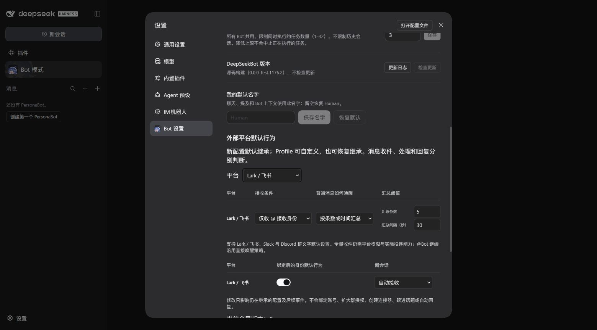
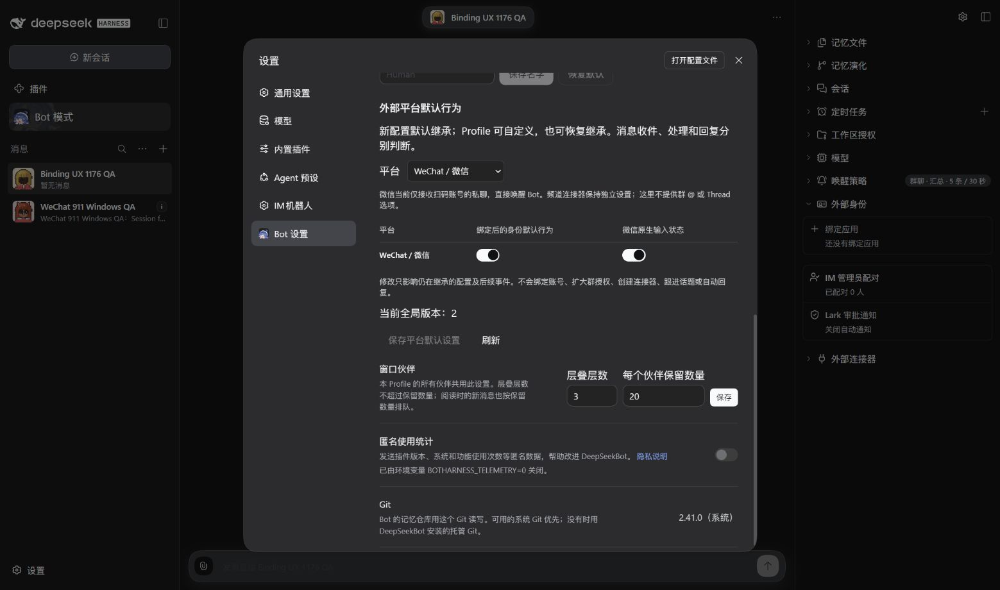
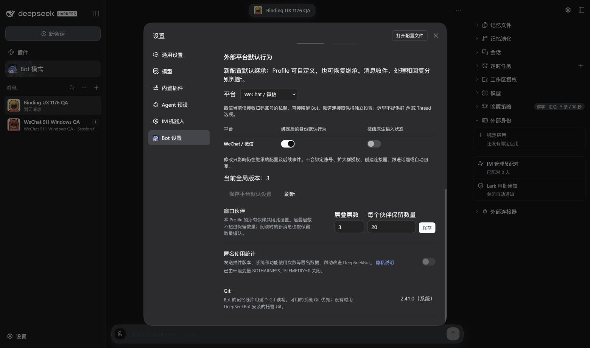

# WeChat defaults — Windows qualification

Issue: [#912](https://github.com/BotHarness/DeepSeekBot/issues/912). Candidate:
`0.0.0-test.912.3`, pinned DSH `0.2.0-rc.1`, qualified IM Provider
`4.32.0-botharness.15`. This is a local candidate record, not release or deployment approval.

The existing isolated Windows Profile retained its paired owner DM. Its generation-67
database was checkpointed and backed up before the canonical upgrade through generation 69;
the resulting database passed its integrity check. No second receiver or paired-account
clone was created for visual comparison.

| Check                               | Observed result                                                                                                                                |
| ----------------------------------- | ---------------------------------------------------------------------------------------------------------------------------------------------- |
| Global editor                       | Real Chrome page exposes WeChat reception and native typing only; unsupported group and Thread controls/help are absent.                       |
| Restore typing inheritance          | Selecting Inherit hides the old custom switch. Saving and reopening retains Inherit; the authenticated Host agrees.                            |
| Inherited typing off                | Global revision 3 disables effective typing. Human reports no visible native indicator and receives the test reply.                            |
| Inherited typing on                 | Global revision 4 restores effective typing. Human confirms the native indicator, successful reply and cleanup.                                |
| Inherited reception pause           | Global revision 5 pauses the identity. Human receives no reply to the paused marker; no matching canonical Source Event is recorded.           |
| Reception resume                    | Revision 6 restores reception and advances the receive boundary. The paused marker remains absent from canonical intake.                       |
| Same-Profile restart                | Both origins remain Inherit, effective preferences remain on, the receiver reconnects, typing starts idle and database integrity remains `ok`. |
| Fresh native exchange after restart | Human confirms native typing appears, the successful result arrives, typing clears and the paused marker receives no delayed reply.            |

The independent Host qualification also verifies preservation of existing custom choices
through global pause, restoration to current defaults, stale-save refusal and unsupported
WeChat intake refusal. Focused automated coverage includes migration, independent overrides,
restart, active-lease cleanup and both Binding and Grant resume boundaries.

## Visible evidence

**Before:** the actual pre-#912 `.1176.2` package in a fresh unpaired Profile exposes
Lark/Slack/Discord defaults. The DOM confirms no WeChat platform option.

**After:** the actual `.912.3` package exposes the two qualified WeChat preferences.

**Saved off state:** the native typing preference is off at global revision 3.

These are inspected, unedited Chinese dark-theme screenshots. The separate browser windows
have different heights and scroll positions, so this is a functional entry-point comparison,
not a matched-viewport layout comparison. The paired identity editor was inspected and its
save/reopen path verified, but its full screenshot contains a private native conversation ID.
The browser's cropped screenshot operation repeatedly closed the dialog and captured the
background instead; those captures were rejected. The private full image is not published.

To review that state, open a paired Bot's External identities → Edit, independently choose
Custom/Inherit for reception and typing, save and reopen, then restart the same Profile.
Keep the conversation identifier, pairing data, local login URL and raw Session data private.
Console inspection after the native exchanges returned no errors or warnings; an earlier
connection-loss warning was observed separately from the later control/screenshot timeouts.
