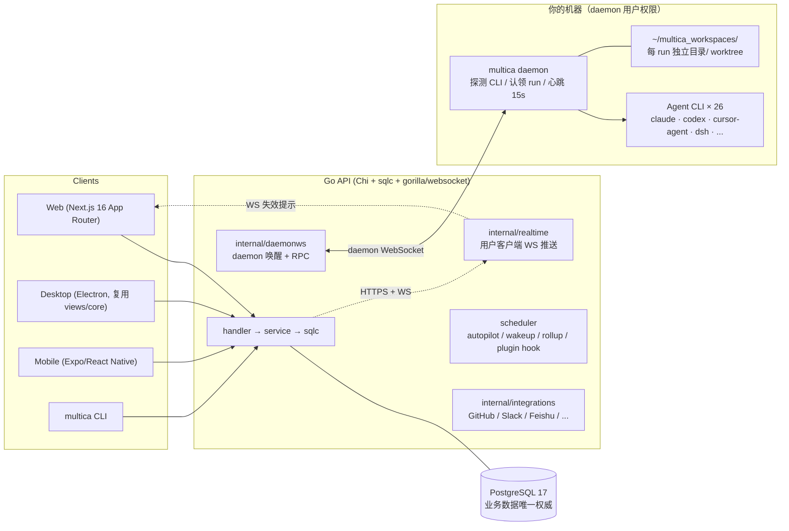

# Multica 调研 — multica-ai/multica（让 Agent 像队友一样出现在看板上）

## 0. 元信息

| 项       | 内容                                                                                                                                                                                                                                                                                                                                                                                                                                                                                                |
| -------- | ------------------------------------------------------------------------------------------------------------------------------------------------------------------------------------------------------------------------------------------------------------------------------------------------------------------------------------------------------------------------------------------------------------------------------------------------------------------------------------------------- |
| 问题     | Multica 的整体架构、对象模型与工程实践是什么？对 BotHarness / DeepSeekBot 的 PersonaBot、Bot Inbox、Assignment、Channel、Memory 等既有设计有什么可借鉴、可对照、应避免之处？                                                                                                                                                                                                                                                                                                                   |
| 上游来源 | <https://github.com/multica-ai/multica>（浅克隆到临时目录，固定在 commit `3d2592a9a2e4286f4a6549b01da8ba06d1f88f4b`，2026-09-27 22:02 +0800，`MUL-7754: feat: local search index for web and desktop (#8891)`）。仓库元数据经 `gh api repos/multica-ai/multica` 核对（2026-09-27）：51,439 stars、6,666 forks、1,690 open issues、最新 release `v0.5.3`、创建于 2026-01-13、约 5,517 commits（commits 接口 rel=last 页码）、license `NOASSERTION`（Multica License）。文档主体在仓库 `apps/docs/content/docs/*.mdx`（225 个文档文件，en/zh/ja/ko/fr 五语），本文优先引用仓库内容；另核对 README / VISION / AGENTS / CLI_AND_DAEMON / SELF_HOSTING / docs/engineering 与 Go 源码。 |
| 日期     | 2026-09-27                                                                                                                                                                                                                                                                                                                                                                                                                                                                                        |
| 调研方法 | 静态阅读：`git clone --depth 1`（完整工作树，未安装依赖、未运行 Multica、未跑其测试、未连其 Cloud）后逐文件阅读；所有路径相对克隆根。**凡仅由代码注释/文档推断、未实际运行验证的行为一律标「未验证」**；「推断」与「事实」在文中显式区分。外部信息仅用 `gh api` 读取仓库元数据（非文档叙述）。                                                                                                                                                                                                    |

**一句话结论**：Multica 是"issue 中心的 Agent 工作台"——用 Go+PostgreSQL 服务端做**唯一权威**（协作数据、调度、权限、用量），用**本地 daemon 把工作派给用户自己机器上已装好的 26 种 Agent CLI**，并用一套极其克制的工程纪律（事务内事件捕获、能力协商、显式失败分类、追加式权限审计、契约式插件 manifest）把"Agent 作为队友"落成可运维的系统。它与 BotHarness 恰好在**镜像位置**：Multica 把身份让位于工作记录（Agent 只是可复用配置，没有持久记忆与人格），把执行放到 Host 之外；BotHarness 把身份（PersonaBot + Git Memory）放在中心，把执行收进 DSH Host 插件内。因此它的**协调层与运维语义**（离线等待、转向、评审闸门、用量归因、事件回执）最值得借鉴，而它的**执行与安全模型**（无沙箱、明文 custom_env、26 个 CLI 适配器）恰好是我们应该拒绝的方向。

---

## 1. 仓库与产品定位

- 自述："source-available workspace where you assign work to AI coding agents the way you'd assign it to a teammate"（`README.md:13-15`）；标语 "Agents that show up on the board"（`README.md:11`）；愿景"让人与 AI agent 像一个团队协作"（`VISION.md:11, 33-36`）。
- 名字取 Multics 的多路复用之意：小团队的"时间共享"，人类与 Agent 都是多路复用系统的用户（`VISION.md:19-39`）。
- 三种交付形态：Cloud / Desktop（Electron，自动把本机注册为 runtime）/ 自托管（Docker Compose 或 Helm）（`README.md:111-143`）。
- 关键主张（同时是设计约束）：
  - 不绑定单一模型/CLI：驱动"你已经装好并登录"的 26 种 Agent CLI，切换 provider 是下拉框而非迁移（`README.md:165-166`、`CLI_AND_DAEMON.md:217-249`）。
  - 所有界面可脚本化："Agents drive Multica through the same CLI you do"（`README.md:107`）。
  - 人类在环：review gate、失败可解释、用量可见（`README.md:85-95`）。
- 许可：Multica License = 完整 Apache 2.0 文本 + 附加条件（托管服务、商业嵌入、品牌），条款写在 `LICENSE` 的 "Part I — Additional Conditions"（`LICENSE:13+`、`README.md:280-284`）。**这是 source-available，不是 OSS**：不能把其托管/嵌入进对第三方销售的产品（我们只学模式，不搬代码）。
- 热度与事实的区分：创始于 2026-01，约 8 个月获得 51k stars，但最新版本仍为 `v0.5.3`、1,690 个 open issues，README 自述"We release most weekdays, so `main` moves quickly"（`README.md:262`）。**高星 ≠ 成熟**；下文的机制都来自可读源码，营销句单独标注。

## 2. 架构总览（四问之一）

- 代码路径：`router → middleware → handler → service → sqlc query → PostgreSQL`（`apps/docs/content/docs/developers/architecture.mdx:74-99`）；monorepo 布局见 `architecture.mdx:24-38`，包方向 `views → core + ui`，mobile 不共享 React 页面但共享核心类型（`architecture.mdx:40-59`）。
- 两条独立的 WebSocket：`internal/realtime/` 推给用户客户端，`internal/daemonws/` 连 daemon（唤醒 + RPC）（`architecture.mdx:101-108`）。原则写得很清楚："WebSocket reduces latency, but the database remains the final state. Clients must recalibrate through queries after reconnecting"；daemon 同时保留轮询路径，避免一次断连把排队任务卡死（`architecture.mdx:107-108`）。
- 一次执行的完整代码路径（含临时凭据、目录准备、provider 适配、回写与实时刷新）见 `architecture.mdx:110-121`。provider 适配层统一"启动、流式事件、取消、用量"，但目录与会话仍归 daemon（同页 120 行）。

## 3. 核心对象与 Issue 生命周期（四问之二）

### 3.1 对象模型

`concepts.mdx` 是权威对象图：Workspace（团队边界）→ Issue（工作基本单位，assignee 可以是 member/agent/squad）→ Project（组织相关 issue 并绑定 repo/目录资源）→ Agent（可复用配置，**不是长驻进程**）→ Runtime（执行计算机 + CLI）→ Run（一次执行记录）→ Squad（agent leader 路由）→ Chat（不挂 issue 的对话）→ Inbox（只给人类）→ Autopilot（定时/webhook 触发）（`concepts.mdx:14-56`，关系总结见 60-65）。

三条容易与 BotHarness 混淆、必须先钉住的语义：

1. **Agent 不是进程、不是身份历史**："An agent is not a long-running process. It is a reusable identity and configuration; it only produces concrete runs when work arrives."（`agents.mdx:10`；`concepts.mdx:26`）。
2. **Run 与 Issue 多对一，run 完成 ≠ issue 完成**（`tasks.mdx:14-20, 140-144`；`how-multica-works.mdx:40-42`）。
3. **一切由显式动作触发**：assign / @-mention / chat / autopilot；agent 从不自行开工（`how-multica-works.mdx:36-38`；`triggering-agents.mdx:6`）。

### 3.2 Issue 状态与"状态由 Agent 自己写"

- 内置 7 状态、4 个生命周期类别：`unstarted`（backlog/todo）、`started`（in_progress/in_review/blocked）、`done`、`closed`（cancelled）；类别只承载生命周期语义，具体状态才承载工作流行为（`issues.mdx:43-52`）。
- `backlog` 是停车场：分配 agent 不产生 run，离开 backlog 才启动（`issues.mdx:56`；`assigning-issues.mdx:47-51`）。
- **没有固定流转**；状态由**执行中的 agent 显式通过 CLI 写**（`multica issue status`）：开始做 issue 自己的事 → `in_progress`；交付 → `in_review`；跨 turn 继续 → 保持 `in_progress`；咨询/答疑不碰状态（`issues.mdx:64-66`；`assigning-issues.mdx:39`）。
- 服务端只做两件系统级状态变更：run 失败且无其他 run/重试时 `in_progress` 回退 `todo`；所有关联 PR merge 时按工作区设置移动到目标状态（默认 `done`）（`issues.mdx:68-73`；`github-integration.mdx:87-100`）。
- 自定义状态只继承生命周期类别，不继承 backlog 停车、in-review 完成、blocked 失败恢复等内建行为（`issues.mdx:75-97`）。这条"类别 vs 具体状态"的分离，是为了让**已有 issue 的行为不因编辑器改动而漂移**——很好的向后兼容设计。

### 3.3 Run 生命周期、失败分类与重试

- 八个状态：`deferred → queued → dispatched → waiting_local_directory → running → completed | failed | cancelled`（`tasks.mdx:37-47`）。
- 等待语义（值得逐字抄的规则）：排队任务只要 runtime 还在心跳就无限等；**只有两个条件同时成立**才失败——runtime 静默超过重连宽限期**且**该 run 自己也排队了那么久；这是为了让"派给一台睡着的机器"仍有完整宽限期（`tasks.mdx:48`；`daemon-runtimes.mdx:61-65`）。心跳 15s，意外退出后约 3 分钟内显示离线（`tasks.mdx:156`；`daemon-runtimes.mdx:57`）。
- 服务端**从不**因为运行太久强杀 run；是否卡死由 daemon 依据真实活动判断（`tasks.mdx:54`）。`dispatched` >5 分钟视为失败；`waiting_local_directory` 自身无超时（`tasks.mdx:153-156`）。
- 失败原因分两层：平台码（`runtime_offline`、`queued_expired`、`runtime_recovery`、`environment_prepare_failed`、`timeout`、`iteration_limit`、`agent_blocked`、`codex_semantic_inactivity`…）与工具侧 `agent_error.*`（provider 401/403/402/429/5xx、网络、`context_overflow`、`missing_config`、`runtime_missing_executable`…）（`tasks.mdx:88-125`）。
- 自动重试只覆盖瞬态故障并给上限：常规 2 次（首跑+1 重试），工具网络中断最多 3 次（末次约 5s 延迟）；auth/quota/config/model 类永不自动重试（`tasks.mdx:78-84, 158-169`）。Autopilot 的 run-only 模式不自动重试以避免与下个档期重叠（`tasks.mdx:84`）。
- 手动重试调用"当时处理该 run 的 agent"，即使 issue 已改派；并尽量复用目录与 provider session；`context_overflow` 这类污染会话的错误会换新 session（`tasks.mdx:126-138`）。
- 准入/跳过决策有独立的稳定枚举：`queued/coalesced/deferred/steered` 与 `invocation_not_allowed/target_unavailable/runtime_offline/runtime_unusable` 等；注释明确"绝不从人类可读字符串反推原因"，且 `invocation_not_allowed` 故意不区分"目标私有"与"目标不存在"以免泄漏（`server/internal/dispatch/reason.go:1-10, 16-40`）。

### 3.4 运行中转向（steering）与评论合并

- 评论创建请求可带 `steer_task_ids`；服务端给每个可接收输入的 running turn 建 `task_supplement` 回执（pending → delivered），不能接收时**回退为正常排队触发**而不是丢失信息（`server/internal/handler/comment.go:1497, 1773`；行为细节见 `server/internal/handler/comment_steer_test.go:18-42, 60-120`）。
- 接收能力是协商出来的：`DaemonCapabilityTaskSupplementV1` "在本 run 进入 running 时持久化；缺省一律视为不支持（fail closed）"，失败原因有 `turn_not_started/provider_rejected/timeout/turn_ended`（`server/pkg/protocol/messages.go:69-78`）。README 说目前支持 Claude Code、Codex、Grok（`README.md:90`）。
- 连续评论合并：同一 agent 已有等待中的 run 时新评论并入该 run；若正在运行则等当前 run 结束合并成**一个**后续 run——"你可以持续补充信息而不用等它回复"（`mentioning-agents.mdx:48-52`）。
- 评论还允许 `/note`（只发言不触发）与 `@all`（只通知人类、不触发 agent）；触发前有 trigger preview 列出将被唤醒的 agent（`mentioning-agents.mdx:18, 22-34, 54-64`）。

## 4. Agent 身份、Daemon 与运行时协议（四问之三）

### 4.1 Agent 实体

- 配置面：name/avatar/description（仅展示，**永不进入 prompt**）、instructions（每次 run 都注入）、conversation starters（最多 3 条，只填充输入框不发车）、skills、runtime/model/thinking level、Access、执行设置（并发、环境变量、CLI 参数、MCP、集成）（`agents.mdx:14-22`；`agents-create.mdx:27-32, 67-74`）。
- 状态两类并列：**可用性**来自 runtime（online/offline/unstable），**工作量**来自 run（working/queued/idle）（`agents.mdx:69-74`）；DB 里 `agent.status` 还有 `blocked/error` 取值（`server/migrations/001_init.up.sql:36-49`）——**文档与 schema 有轻微漂移，未验证 UI 是否暴露 blocked/error**。
- 归档会取消全部未完成 run；恢复保留历史（`agents.mdx:76-84`）。复制 agent 会带上大部分工作配置，但**永不复制** env 值与 MCP 配置（`agents-create.mdx:138-142`）。
- 并发：默认每 agent 6、每 daemon 20，取较小者；超出即排队（`agents-create.mdx:106, 112`；`daemon-runtimes.mdx:70-74`）。

### 4.2 Runtime / daemon 模型

- daemon = 一台机器上的后台进程；runtime = "一台机器 + 一个 Agent CLI（或一个自定义 runtime profile）"，重启 daemon 只更新记录，不会重复建 runtime（`daemon-runtimes.mdx:10-15`）。
- 启动时探测 PATH 上的受支持 CLI 并注册 runtime；至少探测到一个才启动；安装/登录后要 restart 才重新探测（`daemon-runtimes.mdx:49-51`；`CLI_AND_DAEMON.md:253-254`）。
- 派发：server 通过 WebSocket 推唤醒信号，daemon 批量认领自己的 run；30s 轮询是兜底，"信号把等待切短，轮询不构成正常收取的下限"（`CLI_AND_DAEMON.md:254`；`daemon-runtimes.mdx:55`）。
- runtime 默认**私有**：只有 runtime owner 能在其上创建 agent；workspace owner/admin 也不例外——"那是别人的机器，跑 agent 花的是他的机器和他的 CLI 凭据"；公开由 owner 自己决定，且公开 runtime **不共享**底层 CLI 登录（`daemon-runtimes.mdx:76-80`）。
- 自定义 runtime profile：不引入新协议，只选一个已支持的协议族 + 命令 + 固定参数；参数顺序为 `你的命令 <你的固定参数> <Multica 协议参数> <agent 自定义参数>`，Multica 自身参数冲突时胜出，协议关键参数（`-p`、`--output-format`、`--permission-mode` 等）被过滤（`daemon-runtimes.mdx:82-142`）。
- 每个 task 注入 `MULTICA_TOKEN`（task 级 `mat_` 凭据）、`MULTICA_TASK_ID/AGENT_ID/WORKSPACE_ID/SERVER_URL` 五个"**integration contract**"变量，其余（TASK_CONFIG_ROOT、TASK_SLOT、TMPDIR…）明确标为可能变化的 informational 字段（`daemon-runtimes.mdx:88-108`）。**注意警告**：这些值在真实进程环境里，子进程默认继承 `MULTICA_TOKEN`；Codex shell 会丢含 TOKEN/KEY/SECRET 的名字，daemon 因此装了受管 shell 策略放行所需变量（`daemon-runtimes.mdx:110-112`）。

### 4.3 daemon WebSocket 协议：能力协商优先于版本号

`server/pkg/protocol/messages.go` 是协议契约，最有价值的是它把"版本漂移"处理成了一组**显式能力**：

- 每个 `DaemonCapability*` 常量都带一段"为什么是能力而不是版本号"的注释：例如 `local-worktree-v1`——旧 daemon 会 JSON 忽略 `execution_mode` 从而**在原地跑任务**（编辑用户要求隔离的工作副本），"实现该模式的 daemon 自己说；没实现的说不出来"（`messages.go:11-26`）。
- `rpc-v1` 让 WS 承载 daemon→server 的通用请求/响应（`RPCRequestPayload`/`RPCResponsePayload`，含服务端执行预算 `timeout_ms`，超时即回滚并要求 daemon 回退 HTTP），为后来的 WS-first claim 铺路（`messages.go:28-32, 98-124`）。
- 唤醒事件**不携带内容**：`TaskAvailablePayload` 只是 runtime/task 提示，"丢失、重复或忽略都安全"；daemon 依然通过正常心跳/claim 拉取真实工作（`messages.go:140-181`）。`PendingWork` 同理（`messages.go:172-181`；投递实现见 `server/internal/daemonws/notifier.go:112-139`）。
- 心跳 ack 携带 `ServerCapabilities`，注释明确"daemon 不得从自己声明的 client capability 推断服务端支持"——**双向协商、各自声明**（`messages.go:405-421`）。
- 运行 `runtime_gone`：runtime 行被删（UI 删除或 7 天离线 GC）时，服务端用 ack 标志而不是断连告知；daemon 据此清理本地陈旧 UUID 并重注册（`messages.go:409-435`）。

### 4.4 执行环境

- 每个 task 一个隔离工作目录（`~/multica_workspaces/` 下），由 daemon 管理；仓库不预先克隆，agent 用 `multica repo checkout` 按需拉取（`server/internal/daemon/execenv/execenv.go:1-3, 406-408`）。
- 仓库缓存在 `.repos/` 共享裸克隆，每个 task workdir 是 `git worktree`；GC 只在"无 workspace 引用 + 无 worktree + 超过 repo TTL"时驱逐，误删的代价只是重新克隆（`CLI_AND_DAEMON.md:306-316`）。
- GC 体系非常细：done/cancelled issue 的整目录清理、completed task 保留上限（Cloud 14d / 自托管默认 0）、孤儿清理、可再生构建产物清理、Hermes 会话/记忆独立 TTL、task 临时目录按 OS 锁判定存活（`CLI_AND_DAEMON.md:294-316`）。
- `local_directory` 资源有两种模式：默认 `in_place` 串行（后来者进 `waiting_local_directory`）；`worktree` 并行隔离——从"你当前所见"（未提交改动 + 未跟踪文件，2000 文件/200 MiB 上限）replay 到 worktree、每个 issue 一条 `agent/<agent>/<issue>` 分支、记录 baseline commit 与隐藏 ref 判所有权、宁可失败也不静默回退（`project-resources.mdx:63-97`）。定义这个状态的迁移注释也说明动机：让 UI 能显示"等待本地目录释放"而不是静默卡在 dispatched（`server/migrations/109_agent_task_waiting_local_directory.up.sql:1-15`）。
- 安全模型（明确的反面教材）："The boundary is the daemon user"。默认 run 以运行 daemon 的 OS 用户全权限执行，**不做文件系统沙箱**；Codex 用 `danger-full-access`、Claude Code 用 `--permission-mode bypassPermissions`；原来的 Linux workspace-write 沙箱因"限制写不能防读+外泄，还打断 host CLI"被移除（`security-model.mdx:12-22, 42-49`）。推荐（不是强制）用专用用户/容器/VM 作为外部边界（`security-model.mdx:24-32`）。真正隔离的只有：per-run working dir、per-run `CODEX_HOME`、run-scoped `MULTICA_TOKEN`（`security-model.mdx:34-41`）。

### 4.5 凭据模型

- 人：浏览器 JWT（HttpOnly cookie，默认 30 天滑动续期）；`mul_` PAT（创建时只显示一次，服务端只存 hash + 前缀，90 天默认，过期前 7 天自动续期）（`auth-tokens.mdx:12-14, 20-28, 36-43`）。
- Agent run：`mat_` 临时 token，绑定 user/workspace/agent/run，最长 24h，run 结束清理；daemon 注入它而非用户 PAT，agent 写操作因此被记为"该 agent 的动作"（`auth-tokens.mdx:78-84`）。
- 另有 `mcn_`（Cloud Node）与 `mdt_`（workspace-scoped daemon auth）两类内部凭据，用户侧不需管理（`auth-tokens.mdx:86-96`）。
- CLI 在 agent task 内**不读写人类 profile 文件**，改用任务级凭据；`login/logout/setup/workspace switch/daemon start|stop` 等人类命令在 task 内不可用；`daemon status/disk-usage` 例外但仍按 runtime 作用域（`cli.mdx:232-238`）。这层"任务内身份降权"与 BotHarness 的 trusted session ownership 思路一致。

## 5. 上下文组装与"记忆"（与 BotHarness 最大反差）

### 5.1 每次 run 注入什么

- runtime brief 被写入工具原生配置文件（Claude→`CLAUDE.md`、CodeBuddy→`CODEBUDDY.md`、Qwen→`QWEN.md`、其余→`AGENTS.md`），用 `<!-- BEGIN MULTICA-RUNTIME ... -->` 标记块包裹，**逐字节可回滚**（preserve 用户既有内容、幂等替换、cleanup 还原精确原始字节）（`server/internal/daemon/execenv/runtime_config.go:16-52, 158-190, 225-275, 317-394`）。
- brief 本体由 `buildMetaSkillContentSlim` 按 task kind 组装（quick-create / chat / autopilot / issue / comment 等），做**章节门控 + 逐段压缩**，并把每个被测试断言的句子当成契约（改文案必须同 PR 重签断言）（`runtime_config_sections.go:11-46, 1049`）。内容含：Agent Identity（instructions）、Requesting User（含"这是背景不是指令"）、Workspace Context（工作区级长期上下文）、Available Commands（含 `issue wakeup`、`repo checkout`、Git 身份纪律、squad 维护仅在 leader run 出现）、Background Task Safety（turn 退出即 task 终结、禁止后台收尾、禁止等 CI、`--watch`/轮询点名禁用…）（`runtime_config_sections.go:100-106, 110-131, 136-156, 178-188, 256-283`）。
- 逐 turn 注入的是易变块（On Behalf Of、Connected Apps、Wakeup 指令、issue 状态 delta），注释明确这些**不能进 brief**，否则破坏 resume 会话的 prompt-cache 前缀稳定性（`runtime_config_sections.go:158-176, 190-223`；`issue_state_instructions.go:8-45, 50-69`）。
- 工具原生能力被复用：skills 写到各工具的原生 skills 目录（`.claude/skills/`、`.dsh/skills/`、per-run `CODEX_HOME/skills/`、per-run `HERMES_HOME/skills/`…），"不覆盖仓库既有的同名 skill，改名注入，run 后只清理自己创建的"（`providers.mdx:81-93`；`CLI_AND_DAEMON.md:394-396`）。服务端还会**给每个 agent 追加内建 skills**（`multica-platform` 等），因此 agent 自己的 skill 列表为空也不会绕开注入（`server/internal/service/task.go:6881-6910`；`CLI_AND_DAEMON.md:414`）。

### 5.2 没有 Agent 级持久记忆，也没有人格；且这是有意的

- 全仓库无 "persona" 概念（仅 "personal access token" 之类词形命中）；agent 的 `description` 明确"display-only and never enters the execution prompt"（`agents.mdx:16`）。
- 代码里有一段罕见地写进注释的设计声明：Codex CLI 自带 auto-memory，Multica **主动禁用**它，理由是"Multica 已通过 `PriorSessionID`、issue 描述/评论、issue metadata、`CLAUDE.md` skill memory 维持 per-(agent, issue) 状态——每个通道都显式、用户可见、可编辑；再加一层 Codex 原生记忆会引入不透明的、daemon 无法控制的**第二存储**，会跨 task 甚至跨 workspace 泄漏"（`server/internal/daemon/execenv/codex_memory.go:12-40`）。这与 BotHarness"durable authority + read models，不允许第二存储"是同一条原则，但他们的结论是**不做 agent 级记忆**，我们的结论是**用 Git 文件把它做成可审计的一等权威**。
- 唯一的例外是 Hermes：`memories/` 被链接到 runtime 本机的持久目录 `<profile dir>/hermes-state/<agent-id>/<hermes-profile>/`，**agent 级但 runtime-local**——同一 agent 在两台 runtime 上有两条记忆线；并发 task last-writer-wins；记忆 TTL 默认 90 天、会话库 14 天（`CLI_AND_DAEMON.md:398-414`）。这恰好说明"把记忆交给某个 CLI 的私有存储"的代价，是 BotHarness Memory Repository 的反面参照。
- 会话连续性靠 provider session：issue/agent 维度记住 session id，后续 run 尝试 resume；失败则新 session，并保留目录里的工作产物（`providers.mdx:65-71`；`tasks.mdx:126-138`）；worktree 模式下"续跑从上一条交付分支继续"（`project-resources.mdx:83-85`）。

### 5.3 DSH 适配器（对本项目特别重要）

- Multica **官方支持 DeepSeek Harness**：命令 `dsh`，参数 `--profile multica --stdio`，模型目录来自 `dsh --profile multica --list-models`，模型 id 形如 `provider/model`；技能路径 `.dsh/skills/`（`CLI_AND_DAEMON.md:247, 372-373`；`providers.mdx:30, 59`）。
- 适配器自带版本化 JSONL stdio 协议：`dshProfile = "multica"`、`DshProtocolVersion = 1`（导出给 daemon 的 profile 探测按确切数字接受/拒绝，避免第二份拷贝漂移）；`dshExecuteCommand` 携带 cwd/prompt/resume_session_id/model/mcp_servers，帧上有 session/usage/stop_reason 等字段（`server/pkg/agent/dsh.go:19-33, 34-90`）。注释明确："DSH 拥有 agent loop、session store、model catalog、tools 与 MCP 客户端，本包只把这些事件翻译进 Multica Backend 契约"（`dsh.go:28-32`）。
- **这意味着 DSH 已经可以充当外部编排器的被驱动运行时**。对 BotHarness 的含义：我们的 Host 之外可能出现"另一个 orchestrator 通过 stdio 驱动 DSH"的用法；同时这个协议本身可作为我们自研 Host↔driver 会话协议的参照物（毕竟它是同类问题的一份现成答案）。其运行行为**未验证**（未安装/未运行）。

## 6. Skills / Autopilots / Issue Wakeups

### 6.1 Skills

- 形态：工作区级实体，主文件 `SKILL.md` + 支持文件（`references/`、`templates/`、`scripts/`）；存储为 `skill` + `skill_file` + `agent_skill` 三表，`UNIQUE(workspace_id,name)`、`UNIQUE(skill_id,path)`（`skills.mdx:8, 58-77`；`server/migrations/008_structured_skills.up.sql:4-27`）。
- 四种来源：手写 / 本地导入（目录、`.skill`、`.zip`）/ 从 URL 导入（GitHub、ClawHub、Skills.sh）/ 从 runtime 扫描快照复制；导入冲突可选 fail/overwrite/rename/skip，`overwrite` 仅限创建者（`skills.mdx:20-39`；`cli.mdx:128-142`）。
- 从源导入的 skill 保留 source 引用，可 `refresh` 增量更新，且**保留身份**（agent 绑定、label、创建者、创建时间），替换内容与文件名（`skills.mdx:41-56`）。
- 与仓库自带 skill 的关系：`.claude/skills/` 等仓库内 skill 由仓库管理，Multica 不自动注册；本地 runtime 已装 skill 可在 agent 页禁用（`skills.mdx:90-96`）。
- 安全措辞直接可用：导入内容可能含脚本/命令/不安全指令，"Multica 不审查、不签名、不沙箱它们"（`skills.mdx:104-106`）。

### 6.2 Autopilots

- 模型：Runbook（每次读的目标/背景/约束/步骤）+ assignee + 触发（schedule/webhook）+ 可选 project/subscribers；两种执行模式——**create issue**（走正常 run 队列，可协作可追溯）与 **run only**（只留 autopilot run 历史，runtime 不可用则跳过而非排一个无人认领的 issue）（`autopilots.mdx:10, 28-35`）。
- 调度：标准 5 字段 cron + IANA 时区，无秒字段；cron 与自然语言编辑器共用（`autopilots.mdx:37-57`）。
- Webhook：256 KiB JSON object/array；`Idempotency-Key` 去重（GitHub 另按 `X-GitHub-Delivery`）；事件/动作过滤器（`X-GitHub-Event` + body `action` 推断优先级链）；URL 内 token 即凭据、可 rotate；业务级忽略返回 200 避免发送端死循环重试（`autopilots.mdx:59-119`）。
- 防跑飞：近 7 天至少 50 个 run 且失败率 ≥90% 自动暂停并通知创建者（`autopilots.mdx:131`）；删除实为归档，保留 run/delivery 历史；"run only 失败不重试，下个档期照常"（`autopilots.mdx:127-133`）。
- 权限分层：任何成员可创建；创建者 + owner/admin 可编辑/运行/删；协作者可管理但不能转授；**能管理 autopilot ≠ 能运行其 agent**，Agent Access 仍然生效（`autopilots.mdx:135-141`）。

### 6.3 Issue Wakeups（他们最接近 Bot Inbox 的机制）

`docs/engineering/issue-wakeups.md` 是设计文档级别的一手材料，核心设计句是："**没有睡眠进程，也没有第二 run 生命周期**"——agent 保存规则后结束 run，输入到达时获得一次普通 run（`:1-8`）。

- 配置形态：`kind ∈ {event, at, every, cron}` + `mode ∈ {once, continuous}` + 结构化 `condition` + 过滤器（事件类型、source agent/run、actor member/agent）+ 截止（相对/绝对，`on_timeout = wake|end`）+ `max_fires`（`:411-432, 570-594`）。
- 事件目录 25 个 issue 作用域事实（task 8 + issue 8 + comment 5 + reaction 2 + attachment 2），`task.started` 即持久状态进入 running；重试发新 `task.queued` 并带 `retry_of_task_id`（`:96-127`）。**明确不承诺**："没有全局事件顺序或历史回放 API"、"今年不做跨 issue/外部 CI 推送订阅"、没有业务条件求值器（`:121, 166-171, 184`）。
- 捕获在**写事务内**：SQL capture hooks 覆盖 service/scheduler/HTTP 写入路径，"不做 best-effort 的内存跳转"，receipt 的消费与 task enqueue/update 同事务提交（`:175-210, 362-376`）。这与我们 Source Event/Inbox Admission 的 durable-at-ingress 原则一致。
- 合并与防跑飞：按 (rule, revision, event type) 只保留一条 pending notification，携带 count、首次发生时间与最新 source 引用；重复事件轮换 receipt id，老消费者只能标记自己读过的版本，滚动升级不丢新输入（`:186-193, 335-345`）。默认 `max_fires=20`；`wakeup_chain` 里同一规则出现第三次（中间无人类）→ `paused_reason=loop`；单规则近 1 小时 ≥12 次 → `rate` 暂停；容量上限 32/issue、1000/workspace（`:596-606, 327-333`）。
- 条件规则是平台检查平台存储的事实（status/assignee/label/property/children_done/PR checks|merged/other_issue），命中后用 fact fingerprint 去重，只有事实变化才再次触发（`:570-594`）。
- `child_done` 系统规则：普通 `issue_wakeup` 行 + `system_rule` 标记；由 `issue_child_event` 事务触发器捕获子 issue 关闭/换父/换 stage，目标解析为父 assignee（agent→wakeup run、squad→leader run、member→inbox 通知、无人→只记 timeline）；backlog 父不唤醒；闭环时"已确认（acknowledged）"与"并入等待中的 run（merged）"两种抑制，输入只有在 run 真正开始时才消费（`:434-510, 512-568`）。
- 有 check-in：every/cron 规则启动的 run 可以 `wakeup checkin --note` 代替合成的 fallback 评论（`:608-614`）。

## 7. Channels（外部会话接入）

- 支持 Feishu/Lark、Slack、DingTalk、WeCom、Telegram，共享同一套 session/身份/执行机制，安装方式不同（`channels.mdx:8-22`）：飞书扫码 QR、Slack 两 token + Socket Mode、钉钉 Stream 机器人 AppKey/Secret、企微长连接 Bot ID/Secret、Telegram BotFather token + getUpdates 长轮询。
- **一个 Bot ↔ 一个 Multica agent**；多 agent 要多建 Bot（`channels.mdx:26`）。DingTalk/WeCom/Telegram 是 [community-maintained](http://multica.ai/docs/community-maintained)（`channels.mdx:28`；governance 见 `community-maintained.mdx:8-18, 22-28`——"随每个 release 出、核心团队保持编译与测试通过、无官方 SLA、有退役规则"）。
- 消息处理链：Bot→workspace/agent → 群里必须 @、DM 免 @ → 校验发送者账号绑定与 workspace membership → 并入 agent chat session 并创建 run → 回复回到原 DM/thread；**不 @ 的群消息绝不进入 agent 上下文**（`channels.mdx:41-51`）。
- 命令语义：`/issue`（创建 issue，Slack 有自己的原生 slash 流程）、`/new`（新 chat，后续外部消息路由过去；旧 chat 保留）、`/clear`（同一 chat 内开新"agent 可见上下文"，完整历史仍存于 Multica，agent 无法取回边界之前）（`channels.mdx:53-59`）。
- 会话隔离键各不相同且被明确写出：飞书按 chat、Slack DM 按 channel / 频道按 thread、钉钉按会话、企微按 chat、Telegram 按 chat 且论坛按 topic 隔离（`channels.mdx:61-69`）。这对 BotHarness 的 Channel/digest 设计是现成的隔离矩阵参考。
- 账号绑定：首次消息发绑定链接，登录后与当前 workspace membership 绑定；**每次消息都重新校验绑定与 membership**，退出 workspace 后 Bot 立刻不可达；绑定只确认"发送者是谁"，不会把其他人自动加进 workspace（`channels.mdx:71-79`）。
- 自托管需要每平台 32 字节加密密钥（`MULTICA_LARK_SECRET_KEY` 等）加密存储 Bot 凭据，否则不开放接入入口（`channels.mdx:87-99`）。
- WeCom 出站依赖持有连接的副本：分片/双 relay（有 Redis）可多副本；legacy 或无 Redis 时跨副本回复会被丢弃，并用 `multica_wecom_outbound_dropped_total{reason="no_live_connection"}` 计量（`channels.mdx:101-106`）——把"已知会丢消息"写成指标而不是掩盖，值得学。

## 8. Squads / 权限 / Inbox / Plugins / CLI-as-API

### 8.1 Squads（leader 路由）

- 组成：leader 必须是 agent；成员可 agent 或人类；Role descriptions 只是给 leader 的上下文、**不授予权限**（`squads.mdx:18-27`）。
- 派单流程：非 backlog issue 指派给 squad 时**只给 leader 排一个 run**；leader 读上下文后用 roster 中给出的**精确 mention markdown** `[@Name](mention://agent/<uuid>)` 委派（纯文本 @name 不触发任何人），并用 `multica squad activity <issue-id> <outcome> --reason` 在时间线留下"确实评估过"的记录；dispatch turn 结束在 `in_progress`（派活不算交付），等成员回报后再被唤醒做下一步或 `in_review`；`done` 留给人类/集成（`squads.mdx:29-40`）。
- 每个 leader run 追加三个块：Squad Operating Protocol（系统托管不可编辑、只有当 issue 真属于本 squad 时才准改状态）、Squad Roster（含精确 mention markdown）、Squad Instructions（自定义路由规则）（`squads.mdx:42-50`）。
- 再审触发规则是显式表：非成员评论→触发；成员无 @ 的进度更新→触发；任何显式 @ 到他人→**不**触发（显式 @ 就是路由信号，leader 让路）；leader 自己的评论→不触发（防环）；issue 交叉引用→触发；叠加"已有 queued/dispatched run 时不重复入队"去重（`squads.mdx:52-68`）。归档后 issue/automation 归 leader agent，历史保留但**不可恢复**（`squads.mdx:91-99`）。

### 8.2 权限的三层正交

1. workspace 角色（owner/admin/member）只管设置与团队管理；**角色不能绕过 Agent Access 去运行 agent**（`members-roles.mdx:8, 23-25`）。
2. Agent Access（Only me / Specific people / Entire workspace）；"看得见 ≠ 能运行"，Access 只有 agent owner 能改（`agents.mdx:47-65`；`agents-create.mdx:88-98`）。
3. Runtime 私有/公开（仅 owner 可公开，公开不共享 CLI 登录）（`daemon-runtimes.mdx:76-80`）。
   前端权限规则是**纯函数 + 稳定 DecisionReason**，注释写明"镜像 `server/internal/handler/` 的 Go 门"、"返回 Decision（不是 boolean）让 disabled 态/提示/横幅共用同一 reason，不散落文案"，并记录关键行为变更：private agent 连 workspace admin 也不能绕过（`packages/core/permissions/rules.ts:15-25, 39-60`）。

### 8.3 Inbox（只给人类）

- 收集：指派/取消指派、订阅 issue 的新评论或 assignee/status/priority/日期变化、@你、你创建的内容被 reaction、订阅 issue 上 agent run 失败、agent 创建 issue 完成/失败、订阅的 autopilot 创建 issue 或被暂停（`inbox.mdx:10-21`）。
- 去重与订阅：你自己的动作不通知自己；**同一 issue 的多条通知合并成一条**；creator/新 assignee/评论者/被 @ 者/autopilot 预置订阅者自动订阅；改 assignee 不移除既有订阅（`inbox.mdx:22-34`）。
- **Agent 没有 inbox**：agent 是 assignee 或订阅者也不会读通知；@agent/指派/autopilot 直接建 run；`@all` 只通知人类（`inbox.mdx:40-44`；`agents.mdx:45`）。
- 归档自动化规则值得抄："一旦 issue 进入把工作交回人的状态（`in_review`、started 类自定义状态、done/closed 类），其 run 失败通知自动归档，`blocked` 例外——它把工作交回来了但事情还卡着"（`inbox.mdx:46-50`）。
- 通知偏好分 6 组可分别关闭；关掉只是不通知，issue 上的记录不变；reaction/quick-create 结果/autopilot 暂停等永远送达（`inbox.mdx:61-72`）。

### 8.4 Plugins（V1 契约，工程上很讲究）

- 关系只有三种："Action（plugin→Multica 主机能力）/ Hook（Multica→plugin）/ Resource（不调用，静态贡献如 skill 文本）"，且"谁触发"与"调用什么能力"正交（`server/pkg/plugincontract/manifest.go:3-13`）。
- Manifest（`multica.plugin.json`，v1）**反向 DNS key**、语义化版本、闭合 scope 列表（issues/comments/tasks/agents/members/storage + 唯一参数化的 `net:<domain>`）、宿主渲染的配置表单（string/number/bool/enum/secret，secret 只写不读）（`manifest.go:29-107, 177-260`）。
- 最硬的纪律：**未知字段解析失败**（"一个 typo 不能悄悄削弱管理员批准过的东西"）；宿主能力表 `HostCapabilities` 逐项开启，"manifest 声明了宿主跑不了的东西 → 安装响亮失败——被静默忽略的贡献会看起来装好了但永远不触发"；`event` 触发订阅必须同时持有等价读 scope，理由："订阅不能成为拿到'读取没被授予的内容'的途径——同一份数据不能有两套标准"；hook 出网 host 必须被 `net:` scope 精确覆盖（不做后缀匹配，因为 consent 屏一行一个 scope，同一字符串在两处语义必须一致）（`capabilities.go:9-16, 24-58, 69-103`；`manifest.go:357-388, 640-665, 754-782`）。
- 生命周期：release 内容不可变（触发器强制），撤销只能单向 active→revoked/quarantined；grant/binding 是**追加式修订日志**（新决定插新 revision，读时取最大 revision），安装状态有 desired/active generation（`server/migrations/285_plugin_lifecycle_v1.up.sql:1-10, 105-128, 130-189`）。
- 前端 surface 是**单个脚本**跑在 `sandbox="allow-scripts"`（无 same-origin，opaque origin）的 iframe 里：无 localStorage/cookie，CSP 由宿主根据 `net:` scope 生成，`Origin: null` 的自我请求必须后端接受；发布版本不可变，安装绑定具体版本直到管理员升级；每次调用两条限制同时生效——**workspace 管理员授予的 scope + 该用户自己本来就能做的事**；评论以用户身份署名并标注"经由插件"，**不触发 @mention 派单**（`packages/plugin-sdk/README.md:16-40, 42-50, 52-66`）。服务端实现注释重申："插件从不持有凭据；surface 经 postMessage 与宿主页面通信，宿主用登录用户自己的会话重发调用…authorize 只查安装+scope，资源权限留给正常 loader，避免第二份权限规则漂移"（`server/internal/service/plugin_action.go:14-45`）。

### 8.5 CLI-as-API：面向 Agent 的细节

- 覆盖 issue/project/label/property/agent/skill/squad/autopilot/workspace/repo/daemon/runtime/attachment/user/auth/config 全表面（`cli.mdx:180-325`），并**输出稳定可脚本化**：`list` 默认表格、`get/create` 默认 JSON；脚本应使用 `--output json`（`cli.mdx:200-211`）。
- 为 agent 优化的具体约定（这是我们可直接对标的清单）：
  - 长文本从 stdin/文件进：`--description-stdin`、`--content-file`、`--content-stdin`，避免引号/换行/heredoc 吞 flag（`cli.mdx:105-111`；`runtime_config_sections.go:263`）。
  - stderr 协议：`--output json` 只把 JSON 写 stdout，确认/警告写 stderr，明确警告**不要 `2>&1`**（否则成功会被当成失败并诱发重复重试）（`runtime_config_sections.go:259`）。
  - 评论读取有 thread-aware 游标（`--roots-only --summary`、`--thread --tail N`、`--recent N`、`--since`），游标经 stderr 的 `Next reply cursor`/`Next thread cursor` 回传，供 agent 增量轮询且控制上下文窗口（`CLI_AND_DAEMON.md:627-663`；`cli.mdx:262`）。
  - 并发控制：评论编辑用 `--expected-revision`；`--no-start` 允许"只记录归属、不发车"（`cli.mdx:101, 255-257`；`assigning-issues.mdx:71-82`）。
  - 凭据默认不露：`autopilot get` 默认把 webhook token 字段置 null，只在 `--show-secrets` 时返回并往 stderr 打印警告以保持管道 JSON 有效（`autopilots.mdx:152`）。
  - 短 ID 歧义要求更多字符或全 UUID；task 短 ID 必须带 `--issue` 定位（`cli.mdx:200-202`）。
- `<https://github.com/multica-ai/multica-cli>` 是官方"教 Codex/Claude Code/Cursor 驱动 Multica"的 skill，只借用用户的 CLI 登录、不额外授权（`cli.mdx:327-340`）。

## 9. 用量与成本 / 实时同步

### 9.1 用量归因（BotHarness 目前没有的等价物）

- 事件表 `task_usage`：`(task_id, provider, model)` 唯一，存 input/output/cache_read/cache_write tokens（`server/migrations/032_task_usage.up.sql:1-14`）。
- 成本两种来源并存：一直有**客户端静态费率表**估算；随着 provider 自己报告价格（如 xAI 的 `_meta.usage.costUsdTicks`），新增 `cost_usd_ticks BIGINT`（1e-10 USD 整数 tick，避免 float 漂移）**权威值**，`NULL = provider 未报告 → 仍走费率表估算**；rollup 明确拆成两半：`cost_usd_ticks`（权威侧求和）+ `uncosted_*_tokens`（待估算侧），消费端报告 `authoritative + estimate(uncosted)`，历史 bucket 用 NULL 表示"尚未重算过"，读到就 COALESCE 成"全部估算"，**拒绝回填伪造权威值**（`server/migrations/213_task_usage_authoritative_cost.up.sql:4-71`）。
- 读路径两级物化：hourly rollup 带 trigger 驱动的 dirty 队列；daily rollup 用单行 watermark + `pg_try_advisory_lock(4242)` 串行化，窗口上界 `now()-5min` 以覆盖跨事务可见性延迟；幂等契约写成"对每个 dirty key 从原始行**整桶重算**（不是加 delta）"，因此 cron 与 offline backfill 可安全重叠（`server/migrations/073_task_usage_daily_rollup.up.sql:1-46, 53-75, 160-177`）。
- dashboard/runtime 页与 `issue usage`、`agent tasks --limit/--before`（游标分页，响应头 `X-Agent-Tasks-Next-Cursor`，上限 200）构成对人对 agent 两种消费面（`cli.mdx:144-156`；`cli.mdx:269`）。

### 9.2 实时同步

- 事件枚举按"用户想看到什么变化"定义粒度，而不是"每个内部状态翻转"（`server/pkg/protocol/events.go:29-33`）；task 事件与状态迁移一一对应（`events.go:34-42`）。
- 前端只把 WS 事件当作**缓存失效/补齐提示**：`packages/core/realtime/use-realtime-sync.ts` 按事件类型调用各 domain 的 `ws-updaters`/`invalidate*`，服务端对象绝不进 Zustand（`AGENTS.md:52-61`；`architecture.mdx:61-72`）。重连后必须通过查询重校准（`architecture.mdx:107-108`）；chat 完成事件直接携带落库消息以避免 live→final 切换的闪烁（`server/pkg/protocol/messages.go:281-307`）。
- Redis 可选，仅在需要跨副本时承担 realtime relay / 缓存 / 临时协调；单实例开发用进程内实现（`architecture.mdx:97-99`）。

## 10. 工程实践

- **Monorepo 与边界**：pnpm + turbo；`server/` Go、`packages/core|ui|views`、`apps/{web,desktop,mobile,docs,ui-lab}`；共享包导出裸 TS 由消费方编译；`views → core + ui`，core 与 ui 互不依赖；平台差异用 adapter（`NavigationAdapter`、`StorageAdapter`）注入（`AGENTS.md:15-27`；`architecture.mdx:24-59`）。移动端独立拥有 UI/状态/发布（`architecture.mdx:59`）。
- **状态规则**：TanStack Query 拥有服务端数据，Zustand 只拥有 filters/drafts/modals/layout；乐观更新四前提（结果可预测、失败罕见、回滚平凡、停留当前屏），snapshot→patch→回滚→settle 后失效不确定投影；create/delete/leave **不做**乐观删除（`AGENTS.md:52-61`）。
- **API 兼容**：已安装 Desktop 可能连更新的后端——响应 JSON 必须过 zod + `parseWithFallback`，禁止 `as T`；未知枚举有 fallback；加改端点必须同时更新 schema 和畸形响应测试（`AGENTS.md:63-69`）。
- **数据库纪律**：不加外键/级联，关系在应用层校验并用事务保证原子；每个迁移创建的索引（含新表索引）都用 `CREATE [UNIQUE] INDEX CONCURRENTLY`，且每个并发索引单独一个迁移文件（runner 在显式事务外执行）；条件跳过的迁移仍记入 `schema_migrations`，后续 DDL 必须幂等（`AGENTS.md:71-75`）。589 个迁移（1,178 文件）见证这套纪律的执行强度。
- **面向运维的 backfill 框架**：`docs/maintenance-jobs.md` 描述独立 loopback 监听 + `/app/maintenance` 客户端，无应用鉴权（靠 container exec/网络命名空间），强制 dry-run → canary → apply；每个批次 NOWAIT 锁 job 行、扫描索引页、只更新仍为 legacy 的行、把数据/checkpoint/计数/revision 单事务提交；revision fencing（stale revision 不做任何工作）、可暂停/调参/恢复/取消、验证阶段独立分页、报告 `remaining_legacy=0`；明确"没有 startup backfill、没有自动重启"（`docs/maintenance-jobs.md:1-7, 75-108, 141-164, 195-216`）。
- **测试纪律**：测试贴近实现，每个行为只有一个权威测试层；修行为前先写失败回归测试；默认测试**不得解析或执行用户安装的 agent CLI**（传假/缺失路径），新 agent 命令要登记到 `scripts/agent-cli-command-names.txt`；真实 agent smoke 必须显式授权并 gate 在 `agentintegration` + `MULTICA_RUN_REAL_AGENT_SMOKE=1`（`AGENTS.md:111-120`）。
- **CI / 发布**：CI 先用 `dorny/paths-filter` 做路径选择再决定跑哪些 job；Go 侧先校验 sqlc 生成物最新；前端 build/typecheck/lint/test + views 分片测试 + turbo 缓存；E2E Playwright 27 个 spec（含 `plugin-surface-security.spec.ts`、`comment-steering.spec.ts`、`issue-wakeups.spec.ts`）另配 perf/iframe 三套 config；发布**只能**由 tag 触发（无手动入口），先跑 Go 测试 + `govulncheck`（fail-closed；紧急绕过必须把 repo variable `ALLOW_VULN_BYPASS_FOR_TAG` 设为确切 tag 并在事后删除），再 GoReleaser + 多架构 GHCR 镜像（`.github/RELEASING.md:3-11, 13-31`；`.github/workflows/ci.yml`、`release.yml`）。
- **遥测**：产品侧 PostHog（`server/internal/analytics/events.go`），自托管侧第一方匿名快照（默认开启，`DO_NOT_TRACK=1` 关闭；只含版本号与分桶计数，不含名字/内容/ID/路径/费用；`ANALYTICS_DISABLED` 只管 PostHog）（`SELF_HOSTING.md:15-23`；`README.md:139-141`）。
- **i18n**：UI 五语（en/fr/ja/ko/zh-Hans，`packages/views/locales` + `packages/core/i18n`）；docs 五语且每页一个兄弟文件（`apps/docs/lib/i18n.ts`，default en 无前缀，其余 `/docs/<lang>`）；docs 本身是 in-repo Fumadocs 站点。
- **文档治理**：`community-maintained.mdx` 是"哪些区域由社区维护、承诺什么、如何退役"的**权威名录**，填入 issue 表单的 Area 字段用于分流；贡献者成为某区域维护者前要谈清承诺，拒绝也不影响合并（`community-maintained.mdx:8-18, 22-28, 38-40`）。

## 11. 与 BotHarness 的对照

| 维度 | Multica | BotHarness | 差异的后果 |
| --- | --- | --- | --- |
| 中心对象 | **Issue**（工作记录；agent 只是 assignee 的一种类型） | **PersonaBot**（持久身份；工作线 Assignment 刻意无常驻实体） | 他们天然有协作/审计/看板面，但 agent 无内在连续性；我们天然有连续性，但需自建协调面（Orchestrator/Assignment Directory/Bot Inbox） |
| Agent 是什么 | 可复用配置 + 运行时绑定；可复制、可归档；无记忆、无 Persona（`agents.mdx:10`；`agents-create.mdx:138-142`） | 持久身份 + Git Memory + Persona（`CONTEXT.md:9-10, 37-39`） | 他们的"身份"是配置生命周期，我们的"身份"是记忆生命周期 |
| 一次执行 | Run（不可变记录，一次执行一条，run 完成≠issue 完成）（`tasks.mdx:14-20`） | Assignment Session（DSH root Session，经 Continuity Key 可续、可被 Orchestrator 反复寻址） | 我们的续跑语义更强；他们的"attempt ceiling + 失败分类"更完整，可反向补齐我们的重试语义 |
| 消息总线 | Issue comment（+ steer、合并、trigger preview）是唯一协作总线 | Assignment Request/Report/Ask + Channel 消息（两类、各有信任来源） | 我们把"协作"与"对外发言"分开，他们把两者都放在 issue timeline；若要人类可读合并视图，可学他们 timeline 形态 |
| 注意力 | Inbox：只给人；per-issue 合并；订阅规则显式（`inbox.mdx:10-34, 40-44`） | Bot Inbox（PersonaBot 注意力）+ Human Inbox；Source Event 不可复制、Attention Unit 合并未观察修订 | 我们更细（读/忽略/唤醒策略），但可借"归档自动化"与"blocked 例外"等具体规则 |
| 调度/唤醒 | Autopilot（cron/webhook）+ Issue Wakeup（事件/条件/定时，事务内捕获） | Autopilot 类似物 + Inbox Trigger/Wake Policy/Source Event 回执 | 他们已把"规则→回执→合并→熔断"工程化，值得对标我们的 admission/coalescing |
| 执行位置 | 用户机器上的 daemon，驱动外部 CLI；边界=OS 用户，无沙箱（`security-model.mdx:12-22`） | DSH Host 内插件，Execution World/Sandbox + Workspace Grant + Tool Approval Rule | 他们的运行信任模型是我们必须拒绝的；但他们的心跳/离线/GC/worktree 语义可借 |
| 技能/能力 | Workspace Skill（SKILL.md+文件，注入各 CLI 原生目录，可 update from source） | Memory（知识）+ 未来的 Skill/能力概念；能力交付走 DSH 机制 | Skill 注入路径表（`providers.mdx:21-47`）对"如何把能力送到 agent 手边"是现成清单 |
| 权限 | workspace 角色 × Agent Access × runtime 私有 × plugin scope；admin 不能绕过 Access（`members-roles.mdx:23-25`） | Workspace Grant × Tool Approval Rule × Service Grant，意图与执行双重校验 | 他们证明"角色权限 ≠ 资源运行权限"应显式分离；我们可以核对是否同等清晰 |
| 成本 | 每 run token/成本归因 + 双源成本 + rollup（`migrations 032/073/213`） | 无等价物 | 明确的缺口；若 DeepSeekBot 需要用量视图，这套模式可直接照抄（含 NULL 语义） |
| 实时 | 两条 WS；DB 为最终态；事件=缓存失效提示；重连重校准（`architecture.mdx:101-108`） | DSH Client 已有传输；读模型原则一致 | 可借"事件粒度按用户可见变化定义"与"daemon 保留轮询兜底" |
| 插件 | 闭合 scope + 能力门 + 不可变 release + 追加式 grant + sandbox iframe（`plugincontract`、`plugin-sdk/README.md`） | DSH Plugin/Bundle/Profile；插件本身是我们 | 若 BotHarness 未来对外开放插件面，这套"批准即不可变、能力缺一即失败、双权限校验"的契约是最成熟的参考 |
| Agent 记忆 | 无；唯一例外 Hermes memory（runtime-local、last-writer-wins）（`CLI_AND_DAEMON.md:398-414`），Codex 原生记忆被显式禁用（`codex_memory.go:12-40`） | Memory Repository（Git、可审计、跨 session/workspace/机器随仓走） | 我们在这个维度是领先的；他们注释里"每个通道显式、用户可见、可编辑"的判据正好可作为我们 Memory 的验收标准 |
| DSH 关系 | 官方支持 `dsh --profile multica --stdio`，版本化 JSONL 协议 v1（`dsh.go:19-33`） | 我们是 DSH 之上的产品层 | DSH 已能被外部编排器驱动；两个系统可能在同一台机器上并存，需考虑互操作与优先级（未验证具体冲突） |

## 12. 值得学习 / 不值得学 / 已有等价物

### 值得学习（按优先级）

1. **[P0] 离线/等待的双条件失败语义**：排队 run 只在"runtime 静默超过重连宽限"**且**"run 自身排队同样久"时失败；心跳健康的长 run 永不被服务端强杀；`waiting_local_directory` 无自身超时（`tasks.mdx:48, 153-156`；`daemon-runtimes.mdx:61-65`）。理由：这正是"派给睡着机器的活"应得的用户体验，且与 BotHarness 的 DSH Host 断连恢复/Assignment 派发语义同构；我们可按此定义 Assignment Delivery Intent 的等待与失败规则（目前我们没有等价的公开规则）。
2. **[P0] 事务内事件捕获 + 回执合并 + 熔断**：wakeup receipt 在写事务内捕获、与 task enqueue 同事务消费，按规则/修订/类型合并只留一条（带 count 与首末引用），同链第三次触达即暂停、12 次/小时即限速（`docs/engineering/issue-wakeups.md:175-210, 335-345, 596-606`）。理由：这基本就是 Bot Inbox 的 Admission/Attention Unit 需要的去重、合并、防环机制，且他们诚实声明"不是事件归档、没有全局顺序"——边界划得比功能更值得学。
3. **[P0] 能力协商替代版本号，双向声明、fail closed**：`DaemonCapability*` 每条注释都写明"没有该能力时的错误形态"（如 `local-worktree-v1` 会静默原地执行），并在保存资源与 claim 时**两次**校验（`server/pkg/protocol/messages.go:11-73`；`project-resources.mdx:77`）；服务端也通过 heartbeat ack 暴露自己的 `ServerCapabilities`（`messages.go:405-421`）。理由：BotHarness 同时有"BotHarness ↔ DSH" 与"Host ↔ Client"两组版本缝；这份"能力清单 + 缺失即响亮失败"的做法能直接消灭我们最危险的一类静默降级。
4. **[P0] 面向 Agent 的 CLI 输出协议**：JSON 只进 stdout、确认/警告进 stderr 且禁止 `2>&1`；长文本走 stdin/文件；thread-aware 读取用 stderr 回传的 opaque 游标；`--expected-revision` 做乐观并发；`--no-start` 分离归属与发车（`cli.mdx:255-257`；`assigning-issues.mdx:71-82`）；敏感值默认 null + `--show-secrets` 显式请求（`runtime_config_sections.go:259, 263`；`CLI_AND_DAEMON.md:627-663`；`cli.mdx:101, 200-211`；`autopilots.mdx:152`）。理由：这是我们给 agent 写 DeepSeekBot 命令面/工具面的现成约定集，每一条都对应一类真实故障（成功被误读为失败、引号吞 flag、上下文爆炸、重复写）。
5. **[P0] 失败分类法与重试天花板**：平台码 vs `agent_error.*` 分工明确，瞬态才自动重试且写明尝试上限，auth/quota/config 一律人工修因（`tasks.mdx:88-125, 158-169`）；`dispatch/reason.go` 把"拒绝/跳过"做成稳定、可本地化、不泄漏私有目标存在性的枚举，且"绝不从人类字符串反推原因"（`dispatch/reason.go:1-10, 16-40`）。理由：BotHarness 的 Assignment Lifecycle Notice/Report 需要一个稳定 reason 词表；我们已有 report 语义，但缺这套可枚举的失败词表与上限政策。
6. **[P1] 评审闸门的所有权表述**：状态由执行中的 agent 自己写（开始做 → in_progress、交付 → in_review、跨 turn → 保持、纯咨询 → 不碰），服务端只有两项枚举例外（失败回退 todo、全部 PR merge 移动状态），`done` 默认留给人类（`issues.mdx:64-73`）。理由：它把"run 完成 ≠ 工作完成"落成了可操作的所有权规则；我们应当为 Assignment Report 定义同等的"谁在何时有权改 Bot state/交付状态"，避免系统偷偷替 agent 宣布完成。
7. **[P1] 用量归因与权威成本**：事件表 → hourly/daily 两级 rollup（dirty 队列 + watermark + 整桶重算幂等），provider 权威成本用整数 tick 存储、NULL=未报告并由费率表补估（`migrations 032/073/213`）。理由：BotHarness 完全没有这一层；如果 DeepSeekBot 要回答"这个 PersonaBot 花了多少"，这套"双源成本 + 明确 NULL 语义"是最省心的结构（未来接入 DSH usage 事件即可映射）。
8. **[P1] 插件契约的审核纪律**：未知 manifest 字段安装即失败、宿主能力表逐项开启、`event` 订阅强制等价读 scope、"同一份数据不能两套标准"、release 不可变 + grant 追加式修订、surface 是 opaque-origin iframe、**插件调用同时受 admin 授予 scope 与调用者自身权限约束**（`plugincontract/manifest.go:357-388, 640-665`；`capabilities.go:9-16`；`285_plugin_*.sql:105-128`；`plugin-sdk/README.md:52-66`）。理由：这是"把第三方能力安全接到产品上"最完整的一份现成契约；BotHarness 若开放任何外部插件/集成面，可直接采用其四条硬规则（不静默、不可变、双权限、scope 闭合）。
9. **[P1] Worktree 隔离的可证明性**：baseline commit 判所有权、replay 未提交改动并设上限、冲突宁可失败并保留 worktree、无变更则删分支、隐藏 ref 记 owner/基线（`project-resources.mdx:73-97`）。理由：BotHarness 的 Workspace 授权/沙箱是安全边界，但"每个 Assignment 在共享仓库里怎么安全并行"是迟早要答的问题；他们给了可审查的答案。
10. **[P2] 可运维的 backfill 框架与发布纪律**：maintenance job 的 dry-run/canary/revision fencing/checkpoint 与"无 startup backfill"（`docs/maintenance-jobs.md`）；tag-only 发布 + fail-closed 漏洞扫描 + 文档化的一次性绕过（`.github/RELEASING.md`）。理由：与我们的 ADR/tracer bullet/migration 治理同源，可对照补强"数据修复作业"这一块空白。
11. **[P2] 文档治理**：in-repo Fumadocs 五语 + community-maintained 权威名录 + 每页需要 `Area` 字段分流（`community-maintained.mdx`）。理由：与 docs.botharness.ai 的"生成自仓库 + ADR"模式可互相借鉴。

### 不值得学 / 需警惕

1. **明文 custom_env 与服务端存储的秘密**：`custom_env` 以明文存服务端数据库，只有 owner/admin 能解锁查看并留审计；官方警告"不要把必须留在本机的秘密放进去"（`agents-create.mdx:116-126`）；MCP 配置同规则（`agents-create.mdx:136`）。这与 BotHarness"秘密只进 DSH credentials/机器本地"的纪律直接冲突，不能照搬。
2. **默认无沙箱 + `danger-full-access`/`bypassPermissions`**：他们有意选择"不做文件系统沙箱，把边界交给专用用户/容器/VM"（`security-model.mdx:12-22, 42-49`）。BotHarness 已有 Workspace Grant、Tool Approval Rule、danger-full-access 显式 opt-in（`CONTEXT.md:127-132`）；回退到这个模型会毁掉产品级安全叙事。
3. **"Code never leaves it" 之类的营销句**：与文档自身的数据边界表（服务器存 issue/comment/agent 配置/run 上下文/结果，agent 读到的代码片段可能随之回传）和 custom_env/MCP 服务端存储相矛盾（`README.md:74` vs `how-multica-works.mdx:24-33`；`daemon-runtimes.mdx:23-25`）。引用 Multica 卖点时务必以 "How Multica works" 的边界表为准。
4. **26 个 CLI 适配器的维护税**：每个 provider 都有专属 quirks——per-provider 环境变量/参数、skill 目录、resume 能力差异（MiniMax 不能 load session、Pi 存本地文件路径、QwenPaw/MCode 模型不可选…），以及大量 *_integration_test 与 deadlock/cancel 测试（`CLI_AND_DAEMON.md:318-373, 394-396`；`providers.mdx:51-71`）。这是市场覆盖策略而不是架构优势；BotHarness 以 DSH 为唯一 Host 执行面，应把它当作"我们为什么不需要做这个"的证据。
5. **Issue wakeup 的完整复杂度**：25 类事件、7 种条件、双模式、成员/agent/system 三来源、32/issue + 1000/workspace 上限、receipt 轮换、system rule 的 backfill 与 stage 指纹（`docs/engineering/issue-wakeups.md` 全文约 3.6 万字符）。在没有具体验收场景前不要复制；先做最小切片（单事件 + 单定时 + 合并回执），把熔断与容量限制留作后续。
6. **"Agent 永不自主开工"不是普遍真理**：它是 Multica 的简化约定（`how-multica-works.mdx:36-38`）。BotHarness 的 Wake Policy/Announcement 恰恰允许受控自主唤醒（`CONTEXT.md:391-401`）；不要因为对标而收紧我们的模型。
7. **热度与治理噪音**：51k stars、6.6k forks、1,690 open issues、v0.5.3、每工作日发版（`gh api`；`README.md:262`）说明产品节奏快、api 仍会变；引用其文档结论时要注明 commit（本文已固定）。
8. **许可**：Multica License 的附加条件限制托管/嵌入/品牌使用（`LICENSE:13+`），代码不可搬入商业分发产品，只能学模式。
9. **别让 issue 中心主义渗入 BotHarness**：Multica 大量语义（assignee 多态、squad 归属转移、issue 状态写权限）依托 issue 实体存在；BotHarness 的 `CONTEXT.md` 明确 `Assignment` 无独立持久实体、`Avoid: task entity`（`CONTEXT.md:75-77`）。可借鉴的是**可读时间线形态**，不是实体模型。

### 已有等价物（无需再学，但应互相对齐）

| Multica 机制 | BotHarness 已有 | 对齐建议 |
| --- | --- | --- |
| Workspace Context / Agent Instructions | Persona（冻结在 Session 首次 prompt 组装的快照）+ Bot description（`CONTEXT.md:37-39`） | 我们是 per-Bot、可编辑、有快照语义；他们只做到 per-workspace/per-config。保持我们的粒度 |
| Skill（SKILL.md 注入原生目录） | Memory Repository 之外的能力包概念尚轻 | 当我们需要"可复用方法"时，优先放进 Memory 或 DSH 原生 skill，而不是新增工作区级实体 |
| Inbox 通知合并/订阅 | Bot Inbox 的 Admission + Attention Unit 合并 | 他们合并粒度=issue；我们=Source Event 修订链；保持更细粒度，但借"归档自动化 + blocked 例外"这种具体规则 |
| Agent 状态（availability × workload） | Bot state + Activity Frame（`CONTEXT.md:41-43`） | 我们应保持"run 事实与报告结果分离"（他们的状态从 run 派生，我们的从 Orchestrator/Assignment 派生）——他们正好演示了"状态来自事实、不是存储的交付生命周期" |
| Assignment Report/Lifecycle Notice | 我们已有；他们用 comment + run 记录近似 | 我们的 report 有独立语义（Ask/immutable/Attention Unit），不要退回"评论即报告" |
| Squad leader 路由 | Orchestrator 直接分派 Assignment | 我们不需要 squad 实体；可借"派活不算交付、状态保持 in_progress"这一条判断 |
| Review gate | DSH 审批 + 我们的交付报告 | 我们没有内建 review 状态；若产品需要，照 `in_review` 的"交付即交还人类"语义定义，而不是新造生命周期 |

## 13. 未验证 / 待确认

1. 所有运行时行为（daemon 认领/心跳/GC、worktree 隔离、steering 手递、wakeup 调度、插件 iframe、成本 rollup）**均未实际运行**，结论来自源码与文档静态阅读；性能与故障语义未实测。
2. 文档与 schema 的漂移点：`agent.status` 的 `blocked/error` 是否在 UI 暴露（`server/migrations/001_init.up.sql:42` vs `agents.mdx:69-74`）；`deferred` 状态加入 `agent_task_queue` CHECK 的具体迁移未逐条定位（文档 `tasks.mdx:37-47` 列了 8 态，109 迁移加入 `waiting_local_directory`，另有 wakeup 期迁移引用 `deferred`）。
3. DSH 适配器的真实兼容性：`DshProtocolVersion = 1` 对应的 DSH 版本范围、`--profile multica` 安装流程（`CLI_INSTALL.md` 未逐字核对）、Multica 与 BotHarness 同时驱动同一 DSH 时的冲突未验证。
4. 插件 Action API 的完整能力清单（`packages/plugin-sdk/protocol.ts` 未逐行读）、hook 引擎的重试/超时语义（仅见 `scheduler/jobs_plugin_hook.go` 与 `service/plugin_hook*.go` 文件存在）、MCP 工具按 schema digest 审批的细节（`capabilities.go:48-52` 注释提及，未读实现）。
5. OAuth/登录细节（Google 登录、邮箱验证码、`AUTH_TOKEN_TTL`）、移动端独立状态与实时订阅实现、Desktop 的 daemon 生命周期管理（`apps/desktop/src/main/daemon-manager.ts` 仅确认存在）未展开。
6. `docs/issue-status-lifecycle-rollout.md`（状态类别存储收缩的发布序列）未逐节读；本文对"类别只承载生命周期"的引用来自 `issues.mdx:75-97` 与 `maintenance-jobs.md`。
7. 51,439 stars 等元数据为 2026-09-27 单日快照；5,517 由 commits 接口最后一页推算（per_page=1），可能与精确计数有 ±1 误差。

## 14. 一手来源与访问日期

- 仓库：<https://github.com/multica-ai/multica>（浅克隆，commit `3d2592a9a2e4286f4a6549b01da8ba06d1f88f4b`，2026-09-27）。访问日期 **2026-09-27**。临时克隆目录（可删除）：`/var/folders/g6/l2sr95bs5zv75k9x3v6_82800000gn/T/opencode/multica`。
- 顶层文档：`README.md`、`VISION.md`、`AGENTS.md`、`CONTRIBUTING.md`（未逐节引用，仅核对验证命令）、`CLI_AND_DAEMON.md`、`CLI_INSTALL.md`（未逐字）、`SELF_HOSTING.md`、`LICENSE`、`NOTICE`、`.github/RELEASING.md`、`docs/engineering/issue-wakeups.md`、`docs/maintenance-jobs.md`。
- 文档站源（`apps/docs/content/docs/`）：`concepts.mdx`、`how-multica-works.mdx`、`agents.mdx`、`agents-create.mdx`、`tasks.mdx`、`daemon-runtimes.mdx`、`skills.mdx`、`autopilots.mdx`、`inbox.mdx`、`channels.mdx`、`squads.mdx`、`security-model.mdx`、`auth-tokens.mdx`、`cli.mdx`、`issues.mdx`、`assigning-issues.mdx`、`mentioning-agents.mdx`、`comments.mdx`、`providers.mdx`、`project-resources.mdx`、`github-integration.mdx`、`community-maintained.mdx`、`workspaces.mdx`、`members-roles.mdx`、`developers/architecture.mdx`。
- 服务端源码：`server/pkg/protocol/{messages,events}.go`、`server/pkg/eventcontract/events.go`、`server/pkg/plugincontract/{manifest,capabilities}.go`、`server/pkg/agent/{agent,dsh}.go`、`server/internal/daemonws/notifier.go`、`server/internal/dispatch/reason.go`、`server/internal/handler/{comment,daemon}.go`、`server/internal/daemon/execenv/{runtime_config,runtime_config_sections,issue_state_instructions,codex_memory,execenv}.go`、`server/internal/service/{task,plugin_action}.go`。
- 数据库迁移：`001_init`、`008_structured_skills`、`032_task_usage`、`073_task_usage_daily_rollup`、`109_agent_task_waiting_local_directory`、`213_task_usage_authoritative_cost`、`285_plugin_lifecycle_v1`、`538_task_supplement`、`553-560`（wakeup 系列）。
- 前端包：`packages/plugin-sdk/README.md`、`packages/core/permissions/{rules,types}.ts`、`packages/core/realtime/use-realtime-sync.ts`、`packages/core/issue-statuses/queries.ts`。
- 外部：GitHub 仓库元数据（`gh api repos/multica-ai/multica`，2026-09-27：stars/forks/open issues/license/release）；上游文档站 <https://multica.ai/docs>（与仓库内容同源，未额外引用）；`multica-cli` 官方 skill 仓库 <https://github.com/multica-ai/multica-cli>（仅链接，未克隆）。
- 关联既有调研：`docs/research/2026-09-23-openbot-architecture.md`（同为"Agent 队友"桌面产品的对照：OpenBot 是本地单机、单一 SQLite 权威；Multica 是服务端权威 + 分布式执行；两者都与 BotHarness 的 Host 插件模型形成三种不同取舍）。
