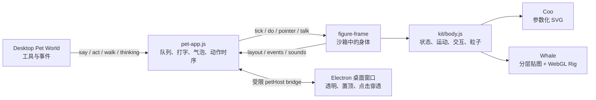
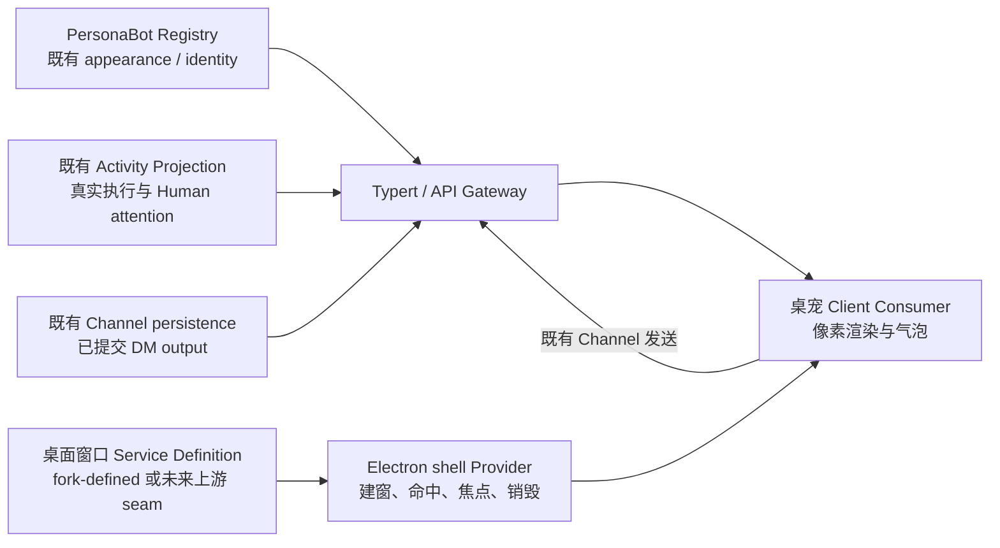

# Coopanion 动画与像素桌宠迁移调研

日期：2026-10-08。问题：Coopanion 的角色为何有丰富动作、表情与消息气泡；这些机制能否用于 BotHarness 的像素角色，以及 DSH Desktop 的桌宠显示。

设计状态：Human 已于 2026-10-08 在 Q23 确认完整共识与第二档默认范围。§1–10 保留最初桌宠调研，§11 是收敛后的窗口内方案；最终权威见 [ADR-0143](../adr/0143-window-companions-consume-owned-activity-and-scoped-output.md)、[实现规格 #1135](https://github.com/BotHarness/BotHarness/issues/1135) 与 [已确认 HTML](evidence/coopanion-animation/window-companion-design.html)。本文不表示运行功能已交付。

## 证据范围

- Coopanion 已克隆到 `reference/Coopanion/`，本次固定提交为 `421e708a8e994897b2c99706284540c86f6bba37`。Coopanion 源码链接均固定到该提交。
- 为核验历史许可，另克隆作者指定的前身到 `reference/cortico-world-desktop-pet/`，固定提交 `7ce70c271add681cbcb19cfebb07c40ac03215e3`（package 0.1.4）；MIT 历史部分的链接固定到该提交。两个 reference 目录均由现有 `.gitignore` 忽略。
- 本文区分**源码已确认**、**作者文档描述**、**独立示例观察**、**迁移建议**与**待运行验证**。未安装第三方依赖、未执行安装器、未运行完整桌宠或模型服务。通过本地静态服务在 Chrome 加载作者的独立鲸鱼示例，核对角色绘制、控制词表、点头控制与说话气泡 DOM；这不等于完成桌面窗口、全部动作或 DSH 集成验证。
- BotHarness 基线：`29dbcd0bd6b756606b8c9b77b7566742077eeac9`；当前像素库 `@botharness/pixel-avatar@0.1.0` 的源码已克隆到 `reference/BotPixel/`，提交 `df53fc8665eac2aa794dfdd8d4d03b7dd48eb92d`。DSH 官方源码已克隆到 `reference/deepseek-harness/`，分别检查项目固定版本 `dsh-v0.2.0-rc.1` / `4878cdabd87d4041bdaff61d04c966883b9fd07a`、调研时主干 `5badb15009ae1756c3afe0ae0cef1faafc290ccc`，以及已有 BotHarness 窗口 fork `aa43257e58dc01f9f56391a4f69e69672bbcdc02`。这些目录均已忽略，不进入产品源码或依赖。
- Cortico 是 Git submodule，Coopanion 固定其提交 `9ad634a298d40cee6ba8b68162ea9f49dd220bab`。动画 renderer 与桌宠窗口代码本身在 Coopanion 的 `packages/cortico-world-desktop-pet/`，本题无需先运行或完整克隆 Cortico。源码所有权必须按文件区分，不能因为名称带 `cortico` 就把当前代码当成 Cortico 的 MIT 文件。[submodule 声明](https://github.com/Pal-AI-Lab/Coopanion/blob/421e708a8e994897b2c99706284540c86f6bba37/.gitmodules#L1-L3)、[网页模块与 Cortico 依赖边界](https://github.com/Pal-AI-Lab/Coopanion/blob/421e708a8e994897b2c99706284540c86f6bba37/packages/cortico-world-desktop-pet/README.md#L217-L220)

## 结论先行

**迁移动效思想可行；当前像素绘制层不能通过换一张图片就拥有鲸鱼的全身动作。** Coopanion 分离了动作模拟、角色绘制、气泡与桌面窗口。Coo 和鲸鱼使用同一套语义动作，分别接到 SVG 参数图形与分层 WebGL 贴图。对于 BotHarness，值得学习的是这个分离方式与消息/动作时序；像素角色应有自己的绘制和动画资源协议。[两种绘制共用 kit](https://github.com/Pal-AI-Lab/Coopanion/blob/421e708a8e994897b2c99706284540c86f6bba37/packages/cortico-world-desktop-pet/web/kit/body.js#L1-L14)

**“只有两个形象”指两个内置形象，不是引擎只能容纳两个。** 已有 manifest/api v2 形象包协议，可以从目录扫描扩展形象、声明独立词表与换装选项。还可以自行实现整个身体，而不使用内置 kit。[扩展扫描](https://github.com/Pal-AI-Lab/Coopanion/blob/421e708a8e994897b2c99706284540c86f6bba37/packages/cortico-world-desktop-pet/src/packs.ts#L233-L256)、[身体协议](https://github.com/Pal-AI-Lab/Coopanion/blob/421e708a8e994897b2c99706284540c86f6bba37/packages/cortico-world-desktop-pet/web/figure-frame.js#L9-L28)

## 1. 架构：丰富变化来自四个独立部分



源码已确认：World 给页面发命令；页面维护气泡与动作队列；沙箱 frame 执行角色代码；kit 计算位置、身体状态与通用粒子；figure 只负责把参数画出来。声音和 World 通信不在 kit 里，沙箱通过事件与声音请求返回页面。[页面指令与动作队列](https://github.com/Pal-AI-Lab/Coopanion/blob/421e708a8e994897b2c99706284540c86f6bba37/packages/cortico-world-desktop-pet/web/pet-app.js#L191-L256)、[kit 分工](https://github.com/Pal-AI-Lab/Coopanion/blob/421e708a8e994897b2c99706284540c86f6bba37/packages/cortico-world-desktop-pet/web/kit/body.js#L102-L124)

## 2. Coo 与鲸鱼的绘制区别

| 维度     | Coo                                                    | DeepSeek 鲸鱼女仆                                |
| -------- | ------------------------------------------------------ | ------------------------------------------------ |
| 角色图形 | 每帧生成 SVG 路径                                      | 25 个 model 基础部件，叠加程序生成脸部与额外层   |
| 表情     | 眼形、C 形开口、眉毛、腮红、符号的参数变化             | 分层眼白/虹膜/睫毛、表情贴图、Canvas 脸部绘制    |
| 动作     | 全组位置、旋转、缩放与两条腿的线段变化                 | 同一身体状态映射到手臂、腿、腰、头和裙子的变形器 |
| 次级运动 | 配件随 `swing` 等参数摆动                              | 头发、刘海、裙摆、尾巴、鲸鳍、呆毛、手臂等弹簧   |
| 外观变化 | manifest 有 7 配色、9 头饰、6 侧饰、4 眼镜、4 颈饰选项 | 8 套 scheme 共享几何，替换整套部件/五官贴图      |

以上计数来自本提交两个 `figure.json` 与鲸鱼 `model.json` 的本地 JSON 解析，而非宣传视频估算。Coo 选项的笛卡尔积为 6,048，但这仅表示声明的组合空间，不证明每个组合都有独立绘制审查；鲸鱼 8 套是同一个身体模型的变色方案。[Coo manifest](https://github.com/Pal-AI-Lab/Coopanion/blob/421e708a8e994897b2c99706284540c86f6bba37/packages/cortico-world-desktop-pet/web/coo/figure.json)、[鲸鱼 manifest](https://github.com/Pal-AI-Lab/Coopanion/blob/421e708a8e994897b2c99706284540c86f6bba37/packages/cortico-world-desktop-pet/web/whale/figure.json)、[model](https://github.com/Pal-AI-Lab/Coopanion/blob/421e708a8e994897b2c99706284540c86f6bba37/packages/cortico-world-desktop-pet/web/whale/model.json)

Coo 的 `figure(fc, frame)` 按当前腿位置、视线、眼形、眨眼、表情和配件拼出 SVG；入口只把该绘制对象接到 `kit.createBody()`。[Coo SVG](https://github.com/Pal-AI-Lab/Coopanion/blob/421e708a8e994897b2c99706284540c86f6bba37/packages/cortico-world-desktop-pet/web/coo/coo.js#L179-L209)、[Coo 入口](https://github.com/Pal-AI-Lab/Coopanion/blob/421e708a8e994897b2c99706284540c86f6bba37/packages/cortico-world-desktop-pet/web/coo/figure.js#L1-L15)

鲸鱼不是导入 Live2D Cubism 模型，而是自写的 **Live2D-like** renderer。每个贴图部件铺到网格，顶点经过父子变形器链：`rot` 提供枢轴旋转/缩放/平移，`warp` 提供位置位移场；每帧更新顶点后画三角形。优先 WebGL2，回退 WebGL1。[rig 定义与上下文](https://github.com/Pal-AI-Lab/Coopanion/blob/421e708a8e994897b2c99706284540c86f6bba37/packages/cortico-world-desktop-pet/web/kit/rig.js#L1-L59)、[网格构建](https://github.com/Pal-AI-Lab/Coopanion/blob/421e708a8e994897b2c99706284540c86f6bba37/packages/cortico-world-desktop-pet/web/kit/rig.js#L99-L127)、[变形与绘制](https://github.com/Pal-AI-Lab/Coopanion/blob/421e708a8e994897b2c99706284540c86f6bba37/packages/cortico-world-desktop-pet/web/kit/rig.js#L167-L226)

鲸鱼的头部视差由前后层不同位移模拟；坐下切换专门的下半身图；点头、摇头、招手、鞠躬由 figure 自己绘制，避免仅旋转整个角色。弹簧是简单的有阻尼积分，限制极值避免抛掷时头发翻折。[弹簧](https://github.com/Pal-AI-Lab/Coopanion/blob/421e708a8e994897b2c99706284540c86f6bba37/packages/cortico-world-desktop-pet/web/whale/figure.js#L46-L57)、[弹簧通道](https://github.com/Pal-AI-Lab/Coopanion/blob/421e708a8e994897b2c99706284540c86f6bba37/packages/cortico-world-desktop-pet/web/whale/figure.js#L396-L434)、[动作参数映射](https://github.com/Pal-AI-Lab/Coopanion/blob/421e708a8e994897b2c99706284540c86f6bba37/packages/cortico-world-desktop-pet/web/whale/figure.js#L447-L566)

## 3. 动作、表情、交互如何编排

两个内置 pack 都声明 **19 个可请求表情 + 18 个可请求动作**：

| 类型 | 完整词表                                                                                                                             |
| ---- | ------------------------------------------------------------------------------------------------------------------------------------ |
| 表情 | `neutral happy wink love shy surprised angry sad sleepy thinking smug pout worried determined flustered scared excited cry confused` |
| 动作 | `stand jump hop look turn nod shake spin sit sleep dizzy walk run wave bow shiver flap dance`                                        |

kit 还有由运行状态触发的内部表情，如被拎起、睡着、倾听、醒来、奔跑、鞠躬。它们与公开词表有区别。[公开词表与内部表情](https://github.com/Pal-AI-Lab/Coopanion/blob/421e708a8e994897b2c99706284540c86f6bba37/packages/cortico-world-desktop-pet/web/kit/body.js#L44-L87)

源码已确认的机制：

- `mode` 控制 idle、walk、run、sit、sleep、wake、crouch、air、land、dizzy、drag、dance 等状态；短手势另用 `{kind, k}` 进度叠加；表情有自己的到期时间。[动作入口](https://github.com/Pal-AI-Lab/Coopanion/blob/421e708a8e994897b2c99706284540c86f6bba37/packages/cortico-world-desktop-pet/web/kit/body.js#L204-L262)
- 表情选择有明确优先级：被拖拽/抛掷/晕倒/醒来，倾听/睡眠，指定表情，思考，坐姿/奔跑，最后 neutral。空中和被拎起时拒绝大多数新动作。[表情优先级](https://github.com/Pal-AI-Lab/Coopanion/blob/421e708a8e994897b2c99706284540c86f6bba37/packages/cortico-world-desktop-pet/web/kit/body.js#L269-L317)
- 空闲行为为加权随机选择；`calm` 降低移动强度，`off` 停止自主漫游。对话框打开、显式指令 hold、倾听等条件抑制自由动作，避免气泡追着角色跑。[空闲选择](https://github.com/Pal-AI-Lab/Coopanion/blob/421e708a8e994897b2c99706284540c86f6bba37/packages/cortico-world-desktop-pet/web/kit/body.js#L319-L329)、[运行条件](https://github.com/Pal-AI-Lab/Coopanion/blob/421e708a8e994897b2c99706284540c86f6bba37/packages/cortico-world-desktop-pet/web/kit/body.js#L343-L374)
- 行走含起步/减速、脚步相位与抬脚；跳跃含预备下蹲、重力、边界反弹、落地挤压与灰尘。都由程序模拟，不是预先录制的一段视频。[行走与跳跃](https://github.com/Pal-AI-Lab/Coopanion/blob/421e708a8e994897b2c99706284540c86f6bba37/packages/cortico-world-desktop-pet/web/kit/body.js#L376-L469)
- 移动超过 6px 进入拎起；松手用约 110ms 指针采样估算抛掷速度；抚摸累积距离达到阈值触发爱心/害羞；短点击触发表情或唤醒。事件送回 World，而非每次鼠标移动都触发模型。[交互](https://github.com/Pal-AI-Lab/Coopanion/blob/421e708a8e994897b2c99706284540c86f6bba37/packages/cortico-world-desktop-pet/web/kit/body.js#L678-L754)
- 页面动时 60fps、静时 30fps，`dt` 上限 50ms；每帧仍重绘角色。此处仅确认源码策略，尚无本机 CPU/GPU/多宠测量。[帧循环](https://github.com/Pal-AI-Lab/Coopanion/blob/421e708a8e994897b2c99706284540c86f6bba37/packages/cortico-world-desktop-pet/web/pet-app.js#L1315-L1354)

需要避免的误读：manifest 的 `vocab.seconds` 是“多久后允许播放下一个词”，不是每种表情的完整展示时间。kit 表情默认保持 3.2s，`sleepy` 4.4s，而两个 pack 的表情调度间隔为 0.9s；sleep/sit 可以保持，walk/run 可以由 `done` 提前推进队列。[词表字段语义](https://github.com/Pal-AI-Lab/Coopanion/blob/421e708a8e994897b2c99706284540c86f6bba37/packages/cortico-world-desktop-pet/src/script.ts#L12-L24)、[表情保持](https://github.com/Pal-AI-Lab/Coopanion/blob/421e708a8e994897b2c99706284540c86f6bba37/packages/cortico-world-desktop-pet/web/kit/body.js#L244-L262)、[动作等待](https://github.com/Pal-AI-Lab/Coopanion/blob/421e708a8e994897b2c99706284540c86f6bba37/packages/cortico-world-desktop-pet/web/pet-app.js#L244-L256)

## 4. 消息气泡与动作如何同步

`pet_say(script)` 在 World 端把文本解析为 beats，再通过 WebSocket 发送 `{t:'say', id, beats}`。每个 beat 包含文本、起始动作与字符位置锚点：

```ts
type Beat = {
  actions: string[];
  text: string;
  anchors: Array<{ at: number; actions: string[] }>;
};
```

阻塞标记 `【开心, 招手】` 开始新 beat，inline 标记 `<眨眼>` 在打字到对应位置时触发；按当前角色词表解析，未知动作丢弃并回报。这里的 `at` 是 JS 字符串 offset，若未来用于任意 Unicode 内容，应另检查字素簇/emoji 截断。[解析协议](https://github.com/Pal-AI-Lab/Coopanion/blob/421e708a8e994897b2c99706284540c86f6bba37/packages/cortico-world-desktop-pet/src/script.ts#L1-L111)、[World 发送](https://github.com/Pal-AI-Lab/Coopanion/blob/421e708a8e994897b2c99706284540c86f6bba37/packages/cortico-world-desktop-pet/src/world.ts#L1322-L1341)

页面按约 20 字符/s 打字，标点多等待；每个非静默字符调用合成 babble 音效和 `body.talk()`，嘴部幅度逐帧衰减。**这是文字节奏口型，而非语音音素同步**。beat 前导动作给文本 0.45s 延迟，但并不等待所有前导动作真正结束。结尾还留阅读时间。[气泡打字与动作](https://github.com/Pal-AI-Lab/Coopanion/blob/421e708a8e994897b2c99706284540c86f6bba37/packages/cortico-world-desktop-pet/web/pet-app.js#L310-L356)、[talk 衰减与绘制参数](https://github.com/Pal-AI-Lab/Coopanion/blob/421e708a8e994897b2c99706284540c86f6bba37/packages/cortico-world-desktop-pet/web/kit/body.js#L603-L646)

气泡是宿主页 DOM/CSS，与角色 renderer 分开；`layout().bubble` 给头顶锚点，宿主页限制气泡位置并调整尾巴。除了 say，还支持 ask/confirm、输入框、应用分步 dialog，返回操作结果。原版是圆角与平滑缩放弹出，可在 BotHarness 改成像素边框、阶梯尾巴、像素图标而保留行为概念。[指令类型](https://github.com/Pal-AI-Lab/Coopanion/blob/421e708a8e994897b2c99706284540c86f6bba37/packages/cortico-world-desktop-pet/web/pet-app.js#L191-L208)、[锚点排版](https://github.com/Pal-AI-Lab/Coopanion/blob/421e708a8e994897b2c99706284540c86f6bba37/packages/cortico-world-desktop-pet/web/pet-app.js#L1204-L1245)、[气泡 CSS](https://github.com/Pal-AI-Lab/Coopanion/blob/421e708a8e994897b2c99706284540c86f6bba37/packages/cortico-world-desktop-pet/web/pet.css#L48-L91)

## 5. 新角色的制作成本与扩展方式

manifest 提供 `entry/export/model`、多语言名称、外观 axes/presets、`vocab`、声音和 `can.walk`。factory 得到 `kit` 与 `host`；使用 kit 时，只需实现 `figure.draw(petG, face, frame)`，另给锚点、命中范围、外观与 dispose。也可完全自己实现 `step/layout/do`。pack 运行在 opaque-origin iframe 中，CSP 禁止网络连接，父页通过消息交换 layout/events/sounds；该隔离模式值得学习，但本次没有做安全审计。[manifest 类型](https://github.com/Pal-AI-Lab/Coopanion/blob/421e708a8e994897b2c99706284540c86f6bba37/packages/cortico-world-desktop-pet/src/packs.ts#L69-L94)、[frame 契约](https://github.com/Pal-AI-Lab/Coopanion/blob/421e708a8e994897b2c99706284540c86f6bba37/packages/cortico-world-desktop-pet/web/figure-frame.js#L9-L28)、[CSP](https://github.com/Pal-AI-Lab/Coopanion/blob/421e708a8e994897b2c99706284540c86f6bba37/packages/cortico-world-desktop-pet/src/server.ts#L206-L211)

**作者文档描述，未重跑验证：** 鲸鱼从一张母版立绘出发，用图像编辑逐步移除/补画遮挡部位；编辑图经 ECC 仿射配准回母版，再以差分得到遮罩，保留原像素并补隐藏区域。坐姿下半身单独生成；scheme 用颜色/位置映射传播到分件。丰富动作背后需要准备完整分层资产，不是把静态图片自动变成任意动作。[作者资产流程](https://github.com/Pal-AI-Lab/Coopanion/blob/421e708a8e994897b2c99706284540c86f6bba37/packages/cortico-world-desktop-pet/examples/whale/README.md#L95-L107)

**迁移建议：** 对 BotHarness 的大量像素形象，优先建立共用人体模板与动作/表情层，让外观 recipe 改颜色、发型、服装、配件，动作保持共用。与其为每位 Bot 生成 37 套完整动作，先用统一网格上的头、身体、手、腿、表情与符号组合出少量关键帧。长发、披风等再增加可选次级运动。必须先核实当前头像资产是否有完整身体和可拆层，而不能把 bust 头像直接等同于全身桌宠。

## 6. 像素化迁移：可以学什么，哪里要重做

| 机制                                       | 对像素角色的建议               | 理由                                                         |
| ------------------------------------------ | ------------------------------ | ------------------------------------------------------------ |
| 语义动作、优先级、进度和拒绝/完成事件      | 保留概念，自有实现             | 与绘制风格无关，可驱动共用动画模板                           |
| 自动眨眼、看指针、思考/倾听、动作后回 idle | 适合迁移                       | 少量局部像素变化就能产生生命感                               |
| 跳跃、走路、拖拽的物理                     | 作为世界位置模拟               | 绘制时将位置/层变换对齐像素网格                              |
| 原鲸鱼 mesh warp 与纹理采样                | 不直接套用                     | rig 使用 LINEAR/mipmap；连续旋转和网格变形会模糊或扭曲像素格 |
| 全组 squash/stretch                        | 限幅、离散关键帧或低分辨率重绘 | 原版的连续缩放不是像素风资源设计                             |
| 气泡锚点、队列、文字/动作同步              | 保留交互模型，重画 UI          | 可以独立用像素边框与阶梯尾巴                                 |
| 第三方脚本形象包                           | 先不作为首个目标               | 先固定自有角色与小词表，验证生产路径后再开放扩展             |

关于采样的依据是当前 rig 明确使用 `LINEAR_MIPMAP_LINEAR`/`LINEAR`，并开启 antialias；“应重做像素 renderer”是设计推断，不是已完成迁移。[采样方式](https://github.com/Pal-AI-Lab/Coopanion/blob/421e708a8e994897b2c99706284540c86f6bba37/packages/cortico-world-desktop-pet/web/kit/rig.js#L48-L77)

建议独立低分辨率 Canvas 或已有像素 SVG 层，关闭图像平滑、整数倍放大，采用关键帧/局部层替换实现脸与肢体；惯性可量化成少数姿态。具体基准尺寸、全身资源、当前 BotHarness activity/appearance 复用与 DSH capability seam，需结合本仓库实现确定。

### 6.1 BotHarness 当前已经具备什么

当前像素头像已从早期 `packages/core/src/bots/avatar-pixel.ts` 抽到 **BotPixel**。Core 的 `avatar-appearance.ts` 重新导出 `@botharness/pixel-avatar@0.1.0`；研究与后续实现应从这个实际依赖进入，而不是继续修改历史文件位置。[当前依赖](https://github.com/BotHarness/BotHarness/blob/29dbcd0bd6b756606b8c9b77b7566742077eeac9/packages/core/package.json#L17-L19)、[Core 导出](https://github.com/BotHarness/BotHarness/blob/29dbcd0bd6b756606b8c9b77b7566742077eeac9/packages/core/src/bots/avatar-appearance.ts#L1-L45)

| 当前基础           | 实现事实                                                                           | 对桌宠的意义                                      |
| ------------------ | ---------------------------------------------------------------------------------- | ------------------------------------------------- |
| 多样外观           | 有版本 recipe 控制发型、细分发件、服装、五官、配件与四类颜色                       | 不必为每个 PersonaBot 单独做一整套动作素材        |
| 32×32 分层像素绘制 | `pixelFigure()` 返回 body/head/cells；SVG 保留 face/gaze/blink 节点与离散转头层    | 能复用外观与局部动作；有身体层不等于已有完整四肢  |
| 当前动效           | Client 用 Web Animations 做离散头部/视线/眨眼，用 pixel-morph 做形象与工具符号切换 | 表情与小动作可以沿现有路线扩展，无需先引入 Live2D |
| 动画生命周期       | reduced motion、隐藏、离屏、stale、卸载都会停止或收敛动画                          | 桌宠仍需对接自己的窗口可见性，不能默认永远全速    |
| 外观与活动分离     | 保存 recipe/revision；执行和 Human attention 消费 owning Projection                | 桌宠作为新 Consumer，共享身份与真实状态           |

来源：[recipe](https://github.com/BotHarness/BotPixel/blob/df53fc8665eac2aa794dfdd8d4d03b7dd48eb92d/packages/avatar/src/recipe.ts#L3-L132)、[像素 SVG](https://github.com/BotHarness/BotPixel/blob/df53fc8665eac2aa794dfdd8d4d03b7dd48eb92d/packages/avatar/src/svg.ts#L1-L52)、[分层返回](https://github.com/BotHarness/BotPixel/blob/df53fc8665eac2aa794dfdd8d4d03b7dd48eb92d/packages/avatar/src/figure.ts#L898-L927)、[Client 动画与清理](https://github.com/BotHarness/BotHarness/blob/29dbcd0bd6b756606b8c9b77b7566742077eeac9/packages/client/src/client/illustrated-avatar.tsx#L340-L454)、[ADR-0118](../adr/0118-editable-avatar-appearance-is-independent-of-activity.md)。

**需要明确补齐的两处**：现有 `pixelFigure()` 把身体裁在圆角 tile 内，`pixelAvatarSvg()` 总是输出背景 tile；仅去掉背景还不能恢复被裁掉的像素。它也是头像比例的半身图，没有用于走路、挥手、坐姿的完整手脚资源。透明无框桌宠需要新增透明绘制模式或独立的全身 rig；这应作为显式资源/协议扩展保留旧 recipe 与静态头像兼容。[裁切与分层](https://github.com/BotHarness/BotPixel/blob/df53fc8665eac2aa794dfdd8d4d03b7dd48eb92d/packages/avatar/src/figure.ts#L898-L927)、[固定 tile 输出](https://github.com/BotHarness/BotPixel/blob/df53fc8665eac2aa794dfdd8d4d03b7dd48eb92d/packages/avatar/src/svg.ts#L35-L44)

### 6.2 怎样让大量外观共用丰富动作

以下是迁移候选，不是已采纳 ADR：把“角色长什么样”“当前真实工作状态”“正在播放什么表现”保持为独立输入。一个共用像素人体模板，按统一头部、眼睛、嘴、肩、手、脚、气泡锚点绘制；recipe 替换颜色和兼容部件；动作播放器输出有界姿态/帧。长发、帽子、耳饰按各自锚点和遮挡规则附着，不为每一种组合复制一条完整动画。

建议分两级资源：当前 32×32 半身适合眨眼、视线、开心/疑惑/困倦、点头、文字驱动嘴型；全身模式再补站立、走路、挥手、跳跃、坐睡关键帧。全身画布大小从视觉验证确定，例如比较 32×48 与 48×64，不能把这个建议尺寸写成当前合同。四帧走路、两三帧说话等只是假设起点，素材数量最终由手感与可读性决定。

动作模拟可保持连续的位置、速度和计时，输出时对齐像素格；所有颜色、表情和位置不应简单把原鲸鱼 `warp` 改成 nearest filter 就算完成迁移。倾斜、弯腰、肢体遮挡需要像素关键帧或每帧低分辨率重绘。字符表情可以沿原 recipe 生成临时 face 层，但不能为播放一次开心而改写保存的 `eyes`/`mouth`。

当前工作头像会变成工具符号；若桌宠希望工作时保持小人，可新增桌宠呈现变体，保留同一 Activity Projection，在身体旁显示小符号/attention。不要顺带改变所有侧栏头像已交付的动效。[现有符号 morph](https://github.com/BotHarness/BotHarness/blob/29dbcd0bd6b756606b8c9b77b7566742077eeac9/packages/client/src/client/illustrated-avatar.tsx#L292-L338)、[appearance/活动独立原则](../adr/0118-editable-avatar-appearance-is-independent-of-activity.md)

### 6.3 像素消息框如何接入真实对话

气泡可以采用阶梯轮廓、整数倍边框、离散弹出和像素小图标；中文正文保留易读字体，文字无需强行低分辨率化。头顶锚点、边缘避让、打字、阅读保持、关闭、展开原 Channel 是独立 UI 行为。长消息在气泡有界摘要/截断并可打开完整 DM；关闭气泡不等于把 Channel 标记已读。UI 可以保留即时全文或跳过打字，reduced motion 不延迟重要信息。

当前已具备真实消息入口：Host 在消息规范提交、并确认 Session Ownership 与 Bot 作者匹配之后，发出 application-defined `botharness/personabot/output-committed` Cordis Event，包含 bot/channel/message/revision 与公开 body。Client 已有 `channel/message` stream、`channelMessages` 查询、`openDmChannel()` 和 `sendChannelMessage()`。因此桌宠不需要另建聊天记录或另跑一个模型；可消费既有 DM 消息，并把输入送到同一个 Channel。[已提交 output 通知](https://github.com/BotHarness/BotHarness/blob/29dbcd0bd6b756606b8c9b77b7566742077eeac9/packages/core/src/channels/output.ts#L1-L75)、[Channel stream](https://github.com/BotHarness/BotHarness/blob/29dbcd0bd6b756606b8c9b77b7566742077eeac9/packages/client/src/client/channel-live.ts#L226-L258)、[DM 入口](https://github.com/BotHarness/BotHarness/blob/29dbcd0bd6b756606b8c9b77b7566742077eeac9/packages/client/src/client/bridge.ts#L1591)、[发送入口](https://github.com/BotHarness/BotHarness/blob/29dbcd0bd6b756606b8c9b77b7566742077eeac9/packages/client/src/client/bridge.ts#L2120)

迁移时还需建立桌宠自己的有界订阅与队列：已有 `mountChannelLive()` 依赖主 Client 的 Bot mode 与 active Channel，不能原封不动运行后假设主窗口切换频道不会影响桌宠。首个切片只订阅 Human 选定的一个 PersonaBot 的 DM，按 `channelId + messageId` 去重、通过 revision 与查询恢复缺口；窗口创建时载入基线，不把全部历史重新演一遍。气泡正文来自提交后的 Channel output，不展示 reasoning、工具参数或其他 Channel 的信息。

Coopanion 的 `beats/anchors` 可以作为后续“说到此处眨眼/点头”的 presentation 合同参考。BotHarness 当前没有这套动作元数据；首条路径先用真实消息配通用说话动作。后续如允许模型选择表情，以有界、验证后的动作元数据传递，不能把任意 Markdown 当动画命令或执行脚本。装饰表情独立于真实 thinking/working/attention，不能由一句“我完成了”推断任务成功。相同消息的重连补发也不应重复庆祝。[现有活动合同](https://github.com/BotHarness/BotHarness/blob/29dbcd0bd6b756606b8c9b77b7566742077eeac9/packages/client/src/client/activity-live.ts#L1-L110)、[ADR-0118](../adr/0118-editable-avatar-appearance-is-independent-of-activity.md)

## 7. Electron 桌宠的真实窗口机制

源码已确认：Coopanion 创建一个覆盖当前显示器工作区的透明、无边框、无任务栏、置顶窗口；角色在窗口内移动，而不是不断移动一个小角色窗口。默认 `setIgnoreMouseEvents(true,{forward:true})`；页面根据命中角色、气泡等区域决定是否接收点击。preload 只暴露 `petHost` 的有限操作。[窗口创建](https://github.com/Pal-AI-Lab/Coopanion/blob/421e708a8e994897b2c99706284540c86f6bba37/packages/cortico-world-desktop-pet/host/electron-main.cjs#L282-L328)、[preload bridge](https://github.com/Pal-AI-Lab/Coopanion/blob/421e708a8e994897b2c99706284540c86f6bba37/packages/cortico-world-desktop-pet/host/preload.cjs#L1-L21)

窗口还处理 macOS Space、跨显示器拖拽、工作区变化、键盘焦点临时接管与归还、全屏时隐藏、窗口退出与父进程生命周期。它表明技术路线可行，同时说明“都是 Electron”并不能证明 DSH 插件已有权限创建桌面窗口。DSH 的正式平台机制与 Host 生命周期要另行验证；不能直接从普通 Client 网页调用 `BrowserWindow`。[显示器与焦点相关实现](https://github.com/Pal-AI-Lab/Coopanion/blob/421e708a8e994897b2c99706284540c86f6bba37/packages/cortico-world-desktop-pet/host/electron-main.cjs#L342-L401)

### 7.1 重新核对 DSH 固定版本与当前主干

**源码已确认：BotHarness 固定的 DSH 0.2.0-rc.1 与本次读取的官方主干均未提供通用桌宠窗口贡献 Service。** 检查了 desktop main、preload、IPC、desktop-host 的启动接线，并在相应 Desktop/Web/Packages 源码检索 `desktopWindows`、`dsh-surface`、`window-open`。官方 Desktop 的 `DshDesktopProductApi` 提供 browser、keyboard、shortcuts、deviceInfo、updates；没有建窗/鼠标穿透接口。main 创建受管窗口并禁用 `window.open`；Client renderer 为 `nodeIntegration:false`、`contextIsolation:true`、`sandbox:true`。官方 Host 由单独进程启动，再把认证地址交给 Electron；“插件在 Node 中运行”也不能等同于“插件运行于 Electron main”。[RC IPC 合同](https://github.com/deepseek-ai/deepseek-harness/blob/4878cdabd87d4041bdaff61d04c966883b9fd07a/apps/desktop/src/ipc.ts#L72-L88)、[RC 建窗与隔离](https://github.com/deepseek-ai/deepseek-harness/blob/4878cdabd87d4041bdaff61d04c966883b9fd07a/apps/desktop/src/main.ts#L206-L245)、[RC Host 启动](https://github.com/deepseek-ai/deepseek-harness/blob/4878cdabd87d4041bdaff61d04c966883b9fd07a/apps/desktop-host/src/index.ts#L19-L45)、[当前主干合同](https://github.com/deepseek-ai/deepseek-harness/blob/5badb15009ae1756c3afe0ae0cef1faafc290ccc/apps/desktop/src/ipc.ts#L72-L88)

这延续了 [2026-09-28 窗口 seam 调研](2026-09-28-dsh-desktop-window-seam-fork-baseline.md) 的接口缺口，但旧文中的 macOS 实测和当时上游接收 PR 的状态均为历史记录，本次不把它们升级为当前运行证明。

已有 fork 的 `ctx.desktopWindows.open()/close()`、`DesktopWindowContributions`、`?dsh-surface=` 是 **BotHarness fork-defined 扩展**，不是官方 DSH-native API。本次核实分支仍为 `aa43257e58dc01f9f56391a4f69e69672bbcdc02`，接口可创建透明置顶 surface、初始点击穿透，最多 8 个窗口，并由 shell 统一关闭。但其基线是早期 DSH 0.1.7-rc.2，不是项目现在固定的 0.2.0-rc.1；后续必须移植接线、重测 Host 协议/认证/preload/client boot，不能直接给现有官方安装加一个插件就期待它出现。[fork Service](https://github.com/BotHarness/deepseek-harness/blob/aa43257e58dc01f9f56391a4f69e69672bbcdc02/apps/desktop-host/src/windows.ts#L1-L29)、[fork shell Provider](https://github.com/BotHarness/deepseek-harness/blob/aa43257e58dc01f9f56391a4f69e69672bbcdc02/apps/desktop/src/window-contributions.ts#L40-L95)

### 7.2 三条接入路线

| 路线                                     | 能达到的效果                     | 主要代价/缺口                                                                |
| ---------------------------------------- | -------------------------------- | ---------------------------------------------------------------------------- |
| 官方 DSH + 普通 Client Plugin/Slots      | 主应用内悬浮像素角色与气泡       | 属于主窗口内容，无法据此显示在用户整个桌面                                   |
| 移植现有窗口 fork，或上游提供同类 seam   | DSH Desktop 一体化管理的透明桌宠 | 需要 shell/Host/Client boot 改动与桌面打包验证；动态命中与输入焦点尚需补齐   |
| 独立 companion helper，连接同一 DSH Host | 不改官方 shell，也能拥有桌面窗口 | 增加安装/升级/进程生命周期与认证管理；须共享现有 Host，不能另起身份/聊天权威 |

**建议候选**：若目标明确是 DSH Desktop 内置的 BotHarness 功能，优先评估迁移已有窗口贡献 seam，以 shell 为窗口 Provider；保留应用内预览便于开发与 Web 场景。若要求兼容用户现有官方安装而不更换 shell，再评估 helper。技术可行与产品分发选择应分别确认，本文不建立新的 durable decision。

小窗口和整屏窗口也有不同成本：已有 fork 用固定大小小窗，适合第一条“头像 + 气泡”路径；Coopanion 用整屏工作区透明窗，更适合漫游、抛掷和多宠。整屏透明窗必须动态命中，否则整个桌面被遮挡；全窗 `clickThrough:true` 又会使角色、气泡、按钮都无法交互。原生拖动区域也会吞指针事件，输入/按钮应排除。这里不能把“有透明窗口”当成交互已完成。[Electron 鼠标穿透和拖动](https://www.electronjs.org/docs/latest/tutorial/custom-window-interactions)、[Electron BrowserWindow](https://www.electronjs.org/docs/latest/api/browser-window)

### 7.3 按 DSH/Cordis 边界组织候选实现



| 责任                  | seam/owner                                                              | 持久性与生命周期                                                     |
| --------------------- | ----------------------------------------------------------------------- | -------------------------------------------------------------------- |
| PersonaBot 外观和身份 | 既有 owning Registry，application-defined                               | durable；桌宠只读取，不复制一份 Bot                                  |
| 当前执行/attention    | 既有 Activity Projection；认证 snapshot/SSE                             | derived；按 generation/revision 更新，掉线显示 freshness             |
| 气泡消息              | 既有 Channel canonical write/read；提交后 Cordis Event / Channel stream | Channel durable；桌宠队列为有界临时呈现                              |
| 桌宠开关/选择与位置   | 新的 application-defined 偏好合同                                       | 设备展示偏好应与 PersonaBot 身份分离；具体持久化 owner 待实现前决定  |
| 动作、嘴型、逐帧姿态  | Client renderer                                                         | process-local；不写 SessionEvent、不逐帧 RPC、不逐帧调用模型         |
| 桌面建窗与输入        | Service Definition → shell Provider                                     | 由 owning Plugin/Fiber 与 shell 生命周期管理；关闭/重启/dispose 清理 |

Host 能力通过 Typert/API Gateway 或现有认证 stream 交付；API Gateway 仍独占 `/api` interceptor。窗口管理 Service 不应把任意 Electron API 暴露给 Client。新长生命周期资源应记录有界 lifecycle 日志：开关发起者、建窗阶段/耗时、拒绝原因、关闭与连接状态；不记录消息正文或认证信息。这是仓库 AGENTS.md 的 Developer diagnostics 要求，具体 DTO 和日志字段需实现时确定。[平台语义 Context](../../.agents/skills/dsh-plugin-dev/references/context.md)、[Decision Tree](../../.agents/skills/dsh-plugin-dev/references/decision-tree.md)、[现有 Activity stream](https://github.com/BotHarness/BotHarness/blob/29dbcd0bd6b756606b8c9b77b7566742077eeac9/packages/client/src/client/activity-live.ts#L111-L186)

## 8. 许可与可复用边界

源码声明：Coopanion 与当前 desktop-pet 包为 `AGPL-3.0-or-later`；Cortico 子模块为另一个来源。desktop-pet 的第三方声明明确排除鲸鱼贴图，并要求其他用途自行确认原设与商标权利。[应用 package 许可](https://github.com/Pal-AI-Lab/Coopanion/blob/421e708a8e994897b2c99706284540c86f6bba37/package.json#L1-L10)、[本包许可与资产排除](https://github.com/Pal-AI-Lab/Coopanion/blob/421e708a8e994897b2c99706284540c86f6bba37/packages/cortico-world-desktop-pet/THIRD_PARTY_NOTICES.md#L25-L42)

**已核实存在有用的 MIT 前身，不应笼统认为所有代码迁移都受当前 AGPL 声明限制。** 作者指定的独立仓库提交 `7ce70c271add681cbcb19cfebb07c40ac03215e3` 的 LICENSE 与 package 均为 MIT，版权声明为 2026 Phantivia。其代码包含：

| MIT 前身文件                                 | 已具备的机制                                                                      | 与当前 Coopanion 的差距                         |
| -------------------------------------------- | --------------------------------------------------------------------------------- | ----------------------------------------------- |
| `web/pet-core.js`                            | Coo SVG/配件/皮肤、合成音效、状态机、眨眼、视线、行走/跳跃/坐睡、抛掷和触摸、粒子 | 模拟与绘制仍集中在一文件；10 个公开表情与13动作 |
| `web/pet-app.js`、`src/script.ts`            | `beats/anchors`、动作与文本同步、20字/s 打字、气泡、提问、分步 dialog             | 早期固定词表/动作对象；未发现当前 pack API v2   |
| `host/electron-main.cjs`、`host/preload.cjs` | 透明置顶窗口、点击穿透、受限 bridge、焦点/桌面行为基础                            | 当前版本增加的功能应逐项查明出处                |

[MIT LICENSE](https://github.com/Pal-AI-Lab/cortico-world-desktop-pet/blob/7ce70c271add681cbcb19cfebb07c40ac03215e3/LICENSE#L1-L21)、[词表与身体入口](https://github.com/Pal-AI-Lab/cortico-world-desktop-pet/blob/7ce70c271add681cbcb19cfebb07c40ac03215e3/web/pet-core.js#L490-L501)、[早期身体模拟](https://github.com/Pal-AI-Lab/cortico-world-desktop-pet/blob/7ce70c271add681cbcb19cfebb07c40ac03215e3/web/pet-core.js#L662-L896)、[早期打字与锚点](https://github.com/Pal-AI-Lab/cortico-world-desktop-pet/blob/7ce70c271add681cbcb19cfebb07c40ac03215e3/web/pet-app.js#L238-L250)、[早期窗口](https://github.com/Pal-AI-Lab/cortico-world-desktop-pet/blob/7ce70c271add681cbcb19cfebb07c40ac03215e3/host/electron-main.cjs#L176-L208)

该前身全部可见分支历史未发现 `web/kit/`、`web/whale/` 或 `web/rig.js` 路径。此观察不等于证明互联网上没有其他 MIT renderer；它仅说明本次固定版本不包含当前鲸鱼模型、WebGL rig、19+18 词表与沙箱形象包协议。不能给这些后续文件反向套用前身许可。

迁移建议：可优先从固定 MIT 前身提取/适配身体模拟和气泡时序，保留 LICENSE 要求的版权与许可声明，用 BotHarness 自有像素绘制替代 Coo SVG；当前新功能按概念自行实现，或逐文件确认适用许可。鲸鱼素材仍不作为直接迁移资产。本段记录已核验的许可声明和工程范围，不是对具体分发方式的法律结论。

## 9. 本次示例观察与验证边界

2026-10-08 在 Windows 本地启动作者的无依赖静态示例服务，Chrome 成功加载 `/examples/whale/`。核对页面中的 19 表情、18 动作和 8 配色控制；角色已绘制。操作了关闭自由活动、点头和说话按钮；DOM/可访问性树实际读到气泡文本如“你好呀，我是鲸鱼女仆～”“今天也要好好休息哦。”，并确认气泡 `hidden:false`、`visibility:visible` 和视口内布局。示例自己的说话循环是约 70ms/字符，与正式 `pet-app.js` 的约 20 字符/s 不是同一验证对象。[示例循环](https://github.com/Pal-AI-Lab/Coopanion/blob/421e708a8e994897b2c99706284540c86f6bba37/packages/cortico-world-desktop-pet/examples/whale/index.html#L94-L116)

角色与控制面板的静态截图保存在 [whale-demo.jpg](evidence/coopanion-animation/whale-demo.jpg)。截图本身不证明完整动作轨迹或口型同步；本次不据页面自报 fps 下性能结论，也没有全动作、Coo、Electron 桌面窗口或真实模型验证。临时示例服务在调研结束后关闭；复跑可在 `reference/Coopanion/packages/cortico-world-desktop-pet/` 执行 `node examples/whale/serve.mjs 4319`，在本地浏览器打开示例。

| 待验证事项          | 验证路径                                                        | 完成标准                                    |
| ------------------- | --------------------------------------------------------------- | ------------------------------------------- |
| 全部动作与 Coo 手感 | 已加载鲸鱼示例；继续逐项验证鲸鱼与 Coo                          | 记录实际动作、表情过渡与气泡节奏            |
| 像素模板的丰富度    | 自有单角色、小词表、多个 appearance recipe                      | 不同外观共用动作，像素边界清晰              |
| 实际消息显示        | 连接 BotHarness 已有消息/运行事实                               | 同一个真实 Bot 回复进入气泡，可返回既有会话 |
| Desktop capability  | 已核对官方源码缺口；移植 fork 或实现 helper 后运行 Desktop Host | 创建/关闭受管桌宠窗口，网页模式明确不可用   |
| 资源消耗            | 单宠先测 idle/move/bubble，再测必要多宠                         | CPU/GPU、内存、后台节流与 dispose 有实测    |
| 桌面边界            | Windows DPI、多显示器、点击穿透、输入法、全屏/焦点              | 不挡正常桌面操作，生命周期可诊断            |

完整桌面、DSH 接入、像素资源质量与性能均不得表述为已验证。[展示入口](https://github.com/Pal-AI-Lab/Coopanion/blob/421e708a8e994897b2c99706284540c86f6bba37/packages/cortico-world-desktop-pet/examples/whale/README.md#L3-L9)

## 10. 建议的首个 tracer bullet

**一个 Human 选定的 PersonaBot，在 DSH Desktop 的受管透明小窗口里显示自己的现有像素外观；一条真实 DM 回复进入像素气泡，并能回到同一 DM。** 首条可以明确使用半身像素头像，不先承诺全身漫游。

1. 先选定 Desktop 分发路线；一体化路线把已有 fork seam 移植到项目固定版本，验证真实 surface、认证、Host 重启与关闭清理。应用内预览有用，但单独做它不算桌宠切片完成。
2. 同时连接 Registry 保存外观、既有 Activity baseline/stream 与所选 DM 的 canonical output；Client 做眨眼、轻微点头和文字驱动嘴型，气泡显示真实提交消息，点击回到主窗口的同一 Channel。需要的主窗口导航也由受管 shell seam 明确提供，不能当作当前已有 API。
3. 覆盖同一回复不重复演播、断线/重连、错误 Bot/Channel 过滤、主窗口切换不打断桌宠、pending attention 不被装饰遮盖；窗口和订阅拥有退出/dispose 清理。当前切片不需要先实现模型动作标签。
4. 实机检查 Windows DPI、透明边界、点击穿透/按钮输入、前台焦点与主窗口最小化；用真实 DM 回复验证完整 Host → persistence → Gateway → Client → desktop window 路径，记录截图/录屏与资源消耗。
5. Human 验证首条后，再增加统一全身资源与四肢关键帧，逐步扩展走路/挥手/跳跃、拖拽抛掷、长发次级运动和更丰富词表；每步仍复用同一 PersonaBot 与消息权威。

本次交付是内部研究报告与只读 reference checkouts。未修改产品行为、未创建实现 PR/Issue、未采纳新的 ADR；未来实施时再按仓库 issue trace、dsh-ui、运行验证和 Release Ledger 流程交付。

## 11. 后续访谈：首版改为窗口内半身伙伴

2026-10-08，Human 将本次产品探索的首版范围调整为 **DSH 主窗口内的半身 Avatar**。这取代 §10 的独立桌窗首条切片建议；§7 的桌窗研究仍是后续独立桌面形态的前置证据，不再是当前首版依赖。

已明确的需求：

- 使用与头像一致的既有半身像素外观；暂不需要全身四肢资源。半身图可以沿窗口底部移动。
- 借鉴拖拽交互、SVG 动作、消息气泡锚点和文字与动作的协调；具体移动范围、自动行为与气泡策略仍待访谈确认。
- 每个 PersonaBot 的真实活动是呈现的输入；能力希望能被其他 DSH Plugin 消费，而非只能被这个 UI 使用。
- 后续可扩展 BotPixel 的动态嘴型，例如闭合、半开、张开；尚未决定这是首版必要能力还是后续切片。

术语沿用根 CONTEXT 的 Avatar、Avatar Appearance、Binding 和 Bot state。Activity Projection 与消息内容仍分别受 ADR-0049 及既有 Channel 权威约束；“气泡内文字”可能是活动标签，也可能是原始消息，不能在未确认内容策略前合并这两类事实。动作帧、位置和气泡逐字播放均属于临时呈现，不成为第二份执行历史或身份。

首轮设计树前沿（现已收到 Human 回复，见 §11.2）：

1. 显示对象：一个选定 PersonaBot、Human 钉住的几个，还是全部 PersonaBot？
2. 可见范围：只在 BotHarness 页面，还是切到原生 DSH Session 等主窗口页面也保留？
3. 移动边界：底部有界悬浮带，还是整个内容区自由移动？
4. 气泡内容范围：活动标签、活动标签与 DM 消息，还是包括其他 Channel 的消息？

完整设计尚待后续访谈确认；本节不采纳新 ADR，也不授权实现。设计访谈遵循 grill-with-docs，由明确的权威取舍决定是否需要 ADR，而非为所有可逆的 UI 选择创建 ADR。

### 11.1 访谈前核实的实现事实

- 官方 pinned RC 已有 `shell.overlay` Slot（`list` / `root`），可用于窗口内悬浮形象；不依赖窗口 fork。此基线不具有最新主干的 `shell.bottom`，不能混用。[RC SlotMap](https://github.com/deepseek-ai/deepseek-harness/blob/4878cdabd87d4041bdaff61d04c966883b9fd07a/packages/client/ui-layout/src/client/index.ts)、[RC AppFrame](https://github.com/deepseek-ai/deepseek-harness/blob/4878cdabd87d4041bdaff61d04c966883b9fd07a/packages/client/ui-layout/src/client/AppFrame.tsx)
- Host 已提供 `botharness` Service，其 `states` 提供当前活动查询与通知；已有 application-defined `botharness/personabot/activity` Cordis Event。Client 已有全 PersonaBot 快照和认证活动 SSE。生态复用是已有基础上的契约完善，而非新建一份 Bot-state 权威。[core Plugin](https://github.com/BotHarness/BotHarness/blob/29dbcd0bd6b756606b8c9b77b7566742077eeac9/packages/core/src/plugin.ts#L763)、[活动通知](https://github.com/BotHarness/BotHarness/blob/29dbcd0bd6b756606b8c9b77b7566742077eeac9/packages/core/src/plugin.ts#L1319)
- 当前 Client Activity 订阅受到 Bot mode 和页面可见性限制；如果形象跨原生 DSH 页面持续显示，需要独立的消费者生命周期，不能只把现有 Avatar 搬到 overlay。[既有订阅门控](https://github.com/BotHarness/BotHarness/blob/29dbcd0bd6b756606b8c9b77b7566742077eeac9/packages/client/src/client/activity-live.ts#L216)
- 正式消息是独立 `botharness/personabot/output-committed` 通知：Channel 提交完成、作者匹配且可信 Session Ownership 匹配后才发。Activity 中的安全工具标签与 attention 计数不等于正文或可执行审批动作。[output 合同](https://github.com/BotHarness/BotHarness/blob/29dbcd0bd6b756606b8c9b77b7566742077eeac9/packages/core/src/channels/output.ts#L5-L45)
- 2026-10-08 只读 GitHub API 查询显示窗口 fork 分支仍为 `aa43257`，GitHub Releases 数量为 0。源码支持 macOS/Windows 打包，但既有实测仅是 macOS dev 构建。可直接安装的 fork 发行需承担签名、公证、独立更新源和上游适配；普通 Plugin 不能为官方 shell 增加独立建窗。此维护成本与当前窗口内范围无关。[fork 包脚本](https://github.com/BotHarness/deepseek-harness/blob/aa43257e58dc01f9f56391a4f69e69672bbcdc02/apps/desktop/package.json)、[更新配置](https://github.com/BotHarness/deepseek-harness/blob/aa43257e58dc01f9f56391a4f69e69672bbcdc02/apps/desktop/scripts/desktop-auto-update-environment.mjs)

### 11.2 首轮确认与第二轮前沿

Human 已确认：

- 由 Human 主动钉选 PersonaBot。入口包括 app sidebar 中该 Bot 的右键菜单，以及 Channel body 顶部对应 Bot chip 的 hover 钉选按钮；常驻形象身上的 hover 菜单可参考 Coopanion。具体菜单项目尚待确定。
- 形象跨 DSH 主窗口页面保留；切换会话不改变所选 PersonaBot。
- 采用底部有界活动带的推荐方向，拖拽与运动手感参考 Coopanion；半身外观不扩成全身资源。
- 活动标签、DM 消息、群聊中该 Bot 发出的消息分别提供独立开关。默认活动标签与 DM 开启、群聊消息关闭；只播放该 Bot 的输出，不播放群聊中其他成员的消息。
- 多条消息采用类似 Sonner 的层叠气泡，可同时流式呈现；hover 后 transition 到列表。每 Bot 独立还是全局一个气泡栈、流式的含义及阅读保持策略仍未确定。

实现事实与参考边界：

- 当前侧栏 Bot 行实为 Channel 行，已有 `setChannelPinned` 和“置顶频道”菜单；新 PersonaBot 常驻选择不能被无说明地混同为 Channel 置顶。[侧栏菜单](https://github.com/BotHarness/BotHarness/blob/29dbcd0bd6b756606b8c9b77b7566742077eeac9/packages/client/src/client/bot-sidebar.tsx#L2587-L2614)
- DM header chip 已是打开 Profile popover 的按钮；hover/focus 钉选控件应有独立交互目标，不能嵌套按钮。Group header 有多成员头像，钉选需指向一个明确的 PersonaBot，不能将整个 Group 当作一个 Bot。[DM chip](https://github.com/BotHarness/BotHarness/blob/29dbcd0bd6b756606b8c9b77b7566742077eeac9/packages/client/src/client/bot-main.tsx#L1160-L1190)、[Group header](https://github.com/BotHarness/BotHarness/blob/29dbcd0bd6b756606b8c9b77b7566742077eeac9/packages/client/src/client/group-channel-header.tsx#L42-L68)
- Coopanion 当前版本与 MIT 前身都使用单个 `#bubble` 和排队播放，不是多个同时播放的气泡栈。hover 工具条支持离开后约 0.8 秒宽限、人物与按钮间的小间隙桥接，右键打开完整菜单；未发现气泡 hover 暂停阅读计时的同等行为。[当前气泡](https://github.com/Pal-AI-Lab/Coopanion/blob/421e708a8e994897b2c99706284540c86f6bba37/packages/cortico-world-desktop-pet/web/pet-app.js#L260-L334)、[MIT hover 工具条](https://github.com/Pal-AI-Lab/cortico-world-desktop-pet/blob/7ce70c271add681cbcb19cfebb07c40ac03215e3/web/pet-app.js#L805-L881)
- [Sonner Toaster 文档](https://sonner.emilkowal.ski/toaster) 确认 hover 展开和可见数量控制；[作者的实现说明](https://emilkowal.ski/ui/building-a-toast-component) 描述可中断重定向的 CSS transition、不同高度的展开定位、hover 与后台计时暂停和间隙桥接。这些是设计参考，不代表其默认全局 Toast 队列、位置或超时适合直接套用于 Bot 消息。

第二轮问题（Human 已回复，见 §11.3）：

1. 新常驻选择是否与已有 Channel 置顶独立，及明确的界面命名。
2. 气泡栈按 PersonaBot 分开锚定，还是所有 Bot 共用一个列表。
3. “流式同时进行”是已提交消息的并行逐字播放，还是生成过程中的未提交正文直播。
4. hover/focus 阅读时的人物运动、消失计时、新消息插入及排序策略。

后续还需依这些选择确定菜单、偏好范围与持久化、容量与溢出、活动更新合并、attention 导航、长消息/附件、重连/后台恢复、嘴型仲裁、键盘/触屏和 reduced motion。尚不把这些分支写成已接受合同。

### 11.3 第二轮确认与 hover 参考的歧义

Human 已确认：

- Window Companion 的选择独立于已有 Channel 置顶；沿用“显示为窗口伙伴／移除窗口伙伴”的推荐命名。同一个 PersonaBot 从不同入口操作，控制同一个伙伴。
- 每个 PersonaBot 各有锚定到自身的气泡栈；hover 某个栈只展开它，相邻栈需要避让。
- 首版采用已提交消息的并行逐字播放，不直播尚未提交的生成正文。
- 对阅读时的 hover 行为，Human 回复“参考 Coopanion 来”，未明确接受上一轮提出的停止移动、暂停到期及暂缓新消息插入。

根 CONTEXT.md 与 CONTEXT.zh.md 已记录 Window Companion 的产品定义；它是一种既有 PersonaBot 的 Binding，不是新身份或 Channel 置顶。尚未决定其偏好的存储范围；术语定义不承诺已交付实现。

再次核对显示，Coopanion 与 MIT 前身都不因 hover 自动暂停 roaming、逐字播放或气泡到期；hover 主要提供快捷工具的延迟隐藏和连续命中区。消息播放会影响随机 roaming 决策，但不等于 hover 阅读模式。它们又没有多气泡栈，所以不能凭“参考 Coopanion”确定新增列表的稳定阅读行为。[hover 工具](https://github.com/Pal-AI-Lab/Coopanion/blob/421e708a8e994897b2c99706284540c86f6bba37/packages/cortico-world-desktop-pet/web/pet-app.js#L930-L1009)、[roaming 准入与移动](https://github.com/Pal-AI-Lab/Coopanion/blob/421e708a8e994897b2c99706284540c86f6bba37/packages/cortico-world-desktop-pet/web/kit/body.js#L349-L398)、[逐字与到期](https://github.com/Pal-AI-Lab/Coopanion/blob/421e708a8e994897b2c99706284540c86f6bba37/packages/cortico-world-desktop-pet/web/pet-app.js#L310-L356)

第三轮问题（Human 已回复，见 §11.4）：

1. 继承 Coopanion 菜单手感时，新增气泡列表是否采用停止人物自动移动、暂停到期与不抢占阅读位置的规则？
2. 伙伴选择与播放偏好只在当前 Client/Profile 保留，还是多个 Client 同步？
3. 三个播放开关按每个 PersonaBot 独立设置，还是全部伙伴共用？
4. hover 快捷工具与右键完整菜单包含哪些动作，且“暂停”是否仅指视觉漫游？

这些选择的后续回复记录在 §11.4；完整设计尚待确认，不修改执行行为、生成额外消息或创建实现任务。

### 11.4 第三轮确认与消息生命周期前沿

Human 已确认：

- 菜单手感参考 Coopanion；hover 或键盘 focus 展开气泡列表时，停止人物自动移动、暂停气泡消失计时、不让新消息挤走阅读位置。已有消息继续逐字播放，新消息先显示数量提示，离开稳定阅读状态后再并入层叠。视觉暂停不暂停 PersonaBot 执行。
- 钉选及设置由各 Client 独立、按 DSH Profile 记住；重启后恢复选择和开关，人物位置适应当前窗口。此选择不引入跨 Client 同步，也不将展示偏好写入 PersonaBot 身份。底层持久化键和 Profile 标识是后续实现细节。
- 活动标签、DM 消息、群聊消息三个播放开关按 PersonaBot 独立设置；每个 PersonaBot 的初始值均为活动开、DM 开、群聊关。
- hover 快捷工具为“打开 DM”“暂停自动走动”“更多”；更多或右键完整菜单提供三个播放开关和“移除窗口伙伴”。暂停自动走动是持续的视觉偏好，不是停止 Bot 工作的命令；hover 的临时暂停与该偏好需要分别处理。

第四轮问题（Human 已回复，见 §11.5）：

1. 气泡自动到期还是手动清除；层叠可见数量、展开容量、长消息和超量时的阅读入口。
2. 连续 Activity 更新是否合并为一张当前活动卡，避免将每个工具事件播成一条消息。
3. approval/question 等 Human attention 是否独立于三个播放开关，并保留明确的 owning surface 导航。
4. 首个可验证切片的动效范围，以及三档嘴型是否作为后续 BotPixel 切片。

后续还需按这些答案收敛后台/重连补播与去重、消息开关切换、静态与缺失资源降级、归档/删除、窄屏、多实例及可访问性；已接受 ADR 的活动与 appearance 权威不重新选择。

### 11.5 第四轮确认与恢复/容量前沿

Human 已确认：

- 气泡播完后按文字长度留阅读时间，再自动消失；hover/focus 暂停计时。收起默认最多 3 层，展开默认最多保留 20 张未到期卡片并允许滚动。长文显示预览，点击回原 Channel；关闭气泡不标记消息已读。
- Human 追加：层叠层数与保留数量提供全局设置。它们是当前 Client/DSH Profile 的展示设置，作用于全部伙伴；各 Bot 的播放来源开关仍独立。具体合法范围和空间预算以原型与运行验证确定，展示配置不扩大 canonical 消息读取权限。
- 每个 Bot 只有一张当前活动卡，随真实 Activity 更新；正式 DM/群聊消息各自保留独立卡片。活动标签开关只控制该卡，不关闭人物状态动效。
- 需要 Human 处理的事项使用始终保留的独立提示，点击进入 owning 活动/Human Inbox surface；三个播放开关、装饰动作、气泡到期均不清除事实提示。不得从 attention 计数编造正文或直接审批能力。
- 第一条实现切片验证既有半身外观、眨眼/视线/头部动作、底部移动与拖拽及真实消息气泡；整体手感验证后，再用下一片扩展 BotPixel 的闭合/半开/张开嘴型。现有 Avatar Appearance 保存与共享合同不变。

第五轮问题（Human 已回复，见 §11.6）：

1. 首次钉选/重启是否重播历史，后台及短暂断线期间的新消息如何有界恢复。
2. 关闭或重新开启某类播放来源时，已入队卡片如何处理，是否补播该来源历史。
3. 群聊开关覆盖全部可访问群聊，还是还需逐群选择；卡片的来源识别规则。
4. 窄屏或伙伴过多时如何折叠展示，同时保留钉选与需要 Human 处理的提示。

静态头像、资源版本缺失、断线 freshness、reduced motion 继续遵循 ADR-0118 与现有 Avatar 模块约定；具体交互降级需在完整设计审阅中明确列出，不据此承诺所有资源都能动嘴。

恢复机制的源码事实：`output-committed` 是同进程 Cordis 通知，不是持久化输出 feed。当前 Client SSE 支持 Activity、Roster 和单 Channel，不存在按 PersonaBot 过滤的跨 Channel 输出 feed。单 Channel SSE 可从 `after`/`Last-Event-ID` 计算 cursor 并通过 canonical `messagesAfter` 重放；当前该查询没有 limit。窗口伙伴的有界补播需要明确 Channel 基线与去重，并补充有界读取能力，不能只在 Client 截断列表却宣称恢复读取成本有界。[输出通知](https://github.com/BotHarness/BotHarness/blob/29dbcd0bd6b756606b8c9b77b7566742077eeac9/packages/core/src/channels/output.ts#L54-L70)、[单 Channel stream](https://github.com/BotHarness/BotHarness/blob/29dbcd0bd6b756606b8c9b77b7566742077eeac9/packages/core/src/channels/live.ts#L211-L308)

### 11.6 第五轮回复：重启基线、所有 Channel 与取消折叠

- Q17：Human 强调不重播历史，重启时间点之后继续处理新内容。首次钉选/重启建立新的播放起点，之前的消息不进入演播；当前活动快照仍直接显示。短暂后台/断线恢复保留上一轮推荐的容量范围内恢复与去重，且只涉及本轮起点之后尚未播放的新内容。播放起点属于消费合同，不能凭客户端时钟与 Host 时间一致的假设实现。
- Q18：关闭来源立即清掉该来源的气泡与待播内容；重新开启从当前活动/后续新消息开始，不补播关闭期间历史。
- Q19：Human 要求覆盖该 Bot 在的所有 Channel，显示气泡时注明发言来源 Channel；不增加逐群勾选。本轮尚需澄清“所有”是否包括当前 Human 未参与的群、Bot-to-Bot DM，因为它与现有 Human 读取边界不等价。
- Q20：Human 质疑额外折叠是否必要，当前范围据此移除“＋N”溢出入口与自动钉选数量限制，交由 Human 拖拽、暂停、移除伙伴来调整。保留窗口边界、气泡可读布局和已确认的基本避让；全局卡片层数/保留数量限制仍有效。

新增源码事实：Channel 列表只排除已删除 Channel，并非 Human 可读列表；canonical `readHumanTimeline` 检查 local Human 的群成员身份并过滤入群前不可见内容，bridge `channelTimeline` 已提供 cursor/newer/around 和 limit≤200 的有界路径。现有单 Channel SSE 的开放与重放路径尚未对齐这套 Human 可见筛选。伙伴的跨 Channel 消费需要明确同一读边界，不能直接遍历 Channel 列表即声称满足授权。[Channel 列表](https://github.com/BotHarness/BotHarness/blob/29dbcd0bd6b756606b8c9b77b7566742077eeac9/packages/core/src/channels/sqlite-store.ts#L1005-L1014)、[Human timeline](https://github.com/BotHarness/BotHarness/blob/29dbcd0bd6b756606b8c9b77b7566742077eeac9/packages/core/src/channels/sqlite-store.ts#L2090-L2101)、[有界查询 bridge](https://github.com/BotHarness/BotHarness/blob/29dbcd0bd6b756606b8c9b77b7566742077eeac9/packages/core/src/bridge/methods.ts#L2183-L2201)

第六轮产品范围问题（Human 已回复，见 §11.7）：

1. 所有 Bot Channel 是否仍遵守当前 Human 的可读范围；Bot-to-Bot DM 如何归类到已接受的 DM/群聊开关。
2. 归档 PersonaBot 是否保留静态伙伴，还是自动撤下。已删除身份不能继续作为活跃伙伴；身份变化仍需独立于主 Bot mode 的 reconcile。

自定义图片继续保持原外观，支持整体移动/拖拽和气泡，不承诺分层眨眼或头部动作；版本不兼容按 ADR-0118 使用保存快照并说明降级。键盘 focus 支持与 hover 相同的阅读/菜单入口；reduced motion 按既有偏好减少装饰运动。上述沿用既有合同的结果需在完整方案审阅中列明。

### 11.7 第六轮确认：三档可见范围与归档展示

Human 明确要求支持 Bot 发给其他 Bot 的 DM，并给出三档可见范围：

| Companion Visibility    | Human–Bot DM | Human 与 Bot 同在的群聊 | Bot–Bot DM | Human 不在、Bot 在的群聊 |
| ----------------------- | ------------ | ----------------------- | ---------- | ------------------------ |
| 仅我和 Bot 的 Channel   | 是           | 否                      | 否         | 否                       |
| Bot 和我都在的 Channel  | 是           | 是                      | 否         | 否                       |
| 所有 Bot 加入的 Channel | 是           | 是                      | 是         | 是                       |

此矩阵只说明范围资格；DM/群聊播放开关仍分别决定相应消息类型是否演播，群聊默认关闭。Bot–Bot DM 归 DM 类型。卡片仅呈现当前伙伴对应 PersonaBot 发出的已提交消息，不自动播放其他成员发言；显示来源 Channel，Bot–Bot DM 标明对话双方。Activity 与 Human attention 不是 Channel 消息，不受这三档范围裁剪。

Companion Visibility 已加入双语根 CONTEXT。沿已有每 Bot 播放设置，范围选择也建议按 PersonaBot、当前 Client/DSH Profile 保存；默认第二档“Bot 和我都在的 Channel”，已由 Human 在 Q23 最终确认。

第三档明确超出现有 `readHumanTimeline` 的部分成员筛选，因此实现需要 Host-owned、面向受信 Human Consumer 的明确 Bot 输出只读路径，不能只把成员检查删掉或靠 Client 过滤所有内容。它只扩展被选 PersonaBot 的已提交输出观察，不自动授予 Human 其他作者的完整 Channel 内容，也不让模型获得新的读取/发送/成员权限。Channel 正文导航仍由原 owner 检查；没有合法可读目标时，卡片保留来源标识并明确其查看限制，不据显示气泡自动加入 Channel。具体 Capability seam 和查询形状属于实现时的源码核实工作，不在本次访谈伪造既有接口。

Q22 已按推荐确认：归档保留静态伙伴和“已归档”标记，停止自动漫游；删除 PersonaBot 后自动清理对应伙伴选择。归档不会被展示偏好重新唤醒；多来源播放状态与身份 reconcile 必须独立于主 Bot mode。

完整设计审阅已完成：Q1–Q23、三档范围及默认第二档、归档策略已由 Human 确认。研究与 HTML 是设计证据，不是运行证明；本次授权范围是完成文档、commit、PR 与 to-spec 发布，产品实现留给后续 tracer bullets。

### 11.8 Q23 最终确认与规格交付

Human 回复“23 没问题，可以完成后 commit PR，然后 to-spec”，确认默认“Bot 和我都在的 Channel”及完整 shared understanding。此时不再开启新的产品访谈。

- [#1132](https://github.com/BotHarness/BotHarness/issues/1132) 跟踪设计文档、ADR、架构、HTML 与规格交付；[ready-for-agent 规格 #1135](https://github.com/BotHarness/BotHarness/issues/1135) 是后续实现的规范入口，不把文档 PR 当作功能完成。
- 测试采用设计报告中已审阅的真实路径：Human 钉选 → 既有身份、Activity 与 canonical 已提交 Channel 消息 → 认证 Host↔Client 消费 → 可移动 Avatar 与锚定卡片 → 跨页面与重启/有界重连。复用 Channel query/live、Activity live、Registry 与 Avatar 的现有行为测试边界，不另开测试专用 authority。
- 范围缩小时立即移除不合格卡片；新启用来源或新合格 Channel 从当前基线开始，不补播历史。这是已确认“关闭清理、重新开启未来内容”与“重启不重播”规则的同一应用，不新增旧消息补播策略。
- 独立桌面窗口及 DSH fork 的安装、签名和更新负担保留为研究记录，不进入当前窗口内目标。
- 文档 worktree 更新至 main `4a2fc156715d2d37ee48daf02c7d39cae5adf039`。再次核对共享 Activity 查询、单 Channel SSE 与独立 committed-output 通知；原调研的固定提交事实保持其时间范围，新增读取合同、baseline/cursor 与具体 Slot 注册仍需实现时对当前源码和真实 Host 验证。

### 11.9 设计审阅补充：伙伴显示人物轮廓，不显示头像底色

Human 在规格发布后的设计稿审阅指出：Bot 模式原有头像有背景，窗口伙伴应不显示这块背景，才能呈现人的轮廓。此反馈已接受并同步到 HTML、ADR、架构与规格。伙伴对支持的像素 rig 隐去画布 tile/头像框底板，不改保存的 Avatar Appearance，不改变普通侧栏头像呈现；透明区域仍有可用命中区域，独立 attention 继续可见。上传图片或缺失 rig 的静态快照保留其原透明度/外观，不把此项扩展为自动抠图。

源码确认：当前 BotPixel 把独立 `tile` 与 `body/head` 分开，SVG 合成时先加入 tile；现有公开 options 只有 turns 与 classPrefix，还没有正式 transparent 参数。本 HTML 只在可信、固定版本的生成 SVG 中省略那张独立底板，证明轮廓外观可行；生产改动应在共享 Avatar/owning BotPixel 层选择明确的 surface 合同，不依赖全局 CSS 或对任意 SVG 做字符串处理。[SVG 合成](https://github.com/BotHarness/BotPixel/blob/df53fc8665eac2aa794dfdd8d4d03b7dd48eb92d/packages/avatar/src/svg.ts#L10-L50)、[分离 tile 与 body/head](https://github.com/BotHarness/BotPixel/blob/df53fc8665eac2aa794dfdd8d4d03b7dd48eb92d/packages/avatar/src/figure.ts#L898-L925)
