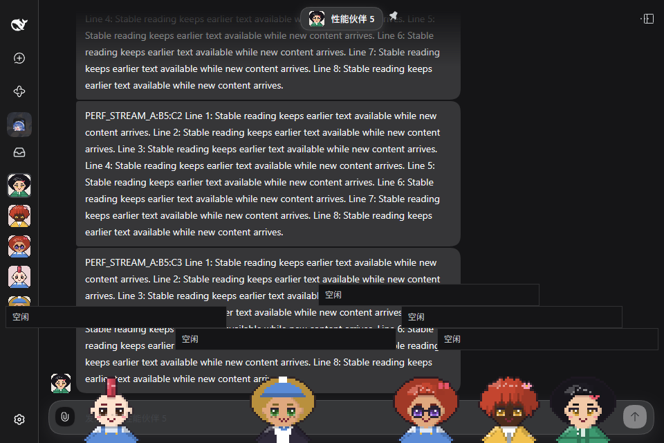
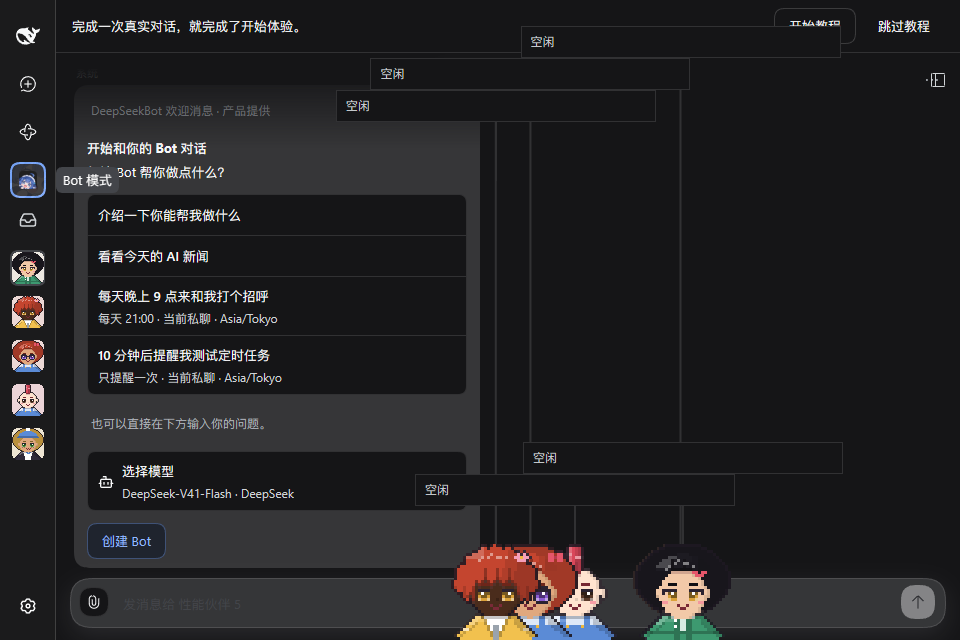
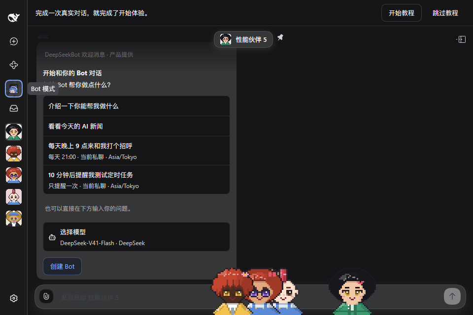
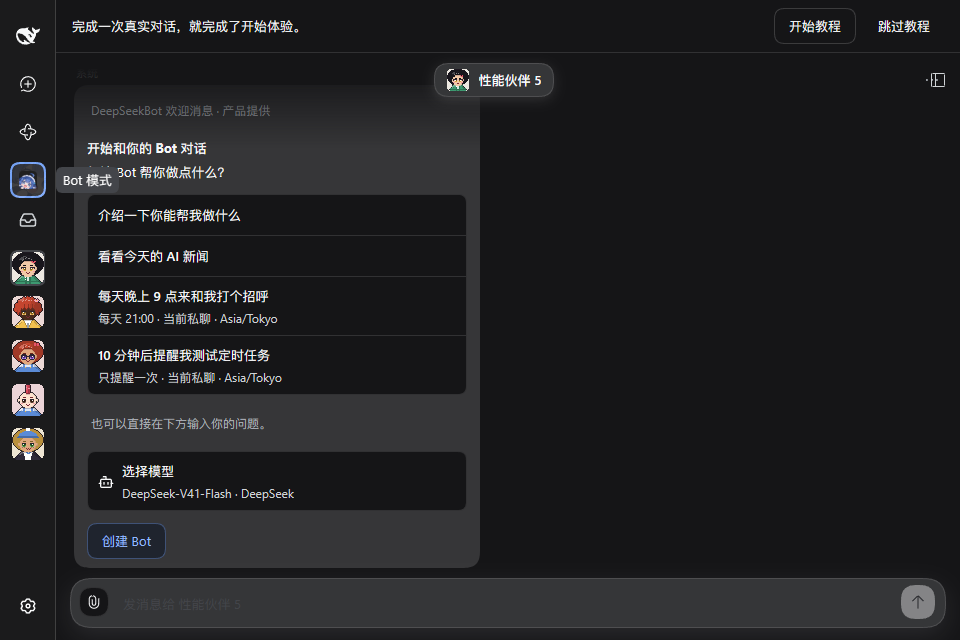
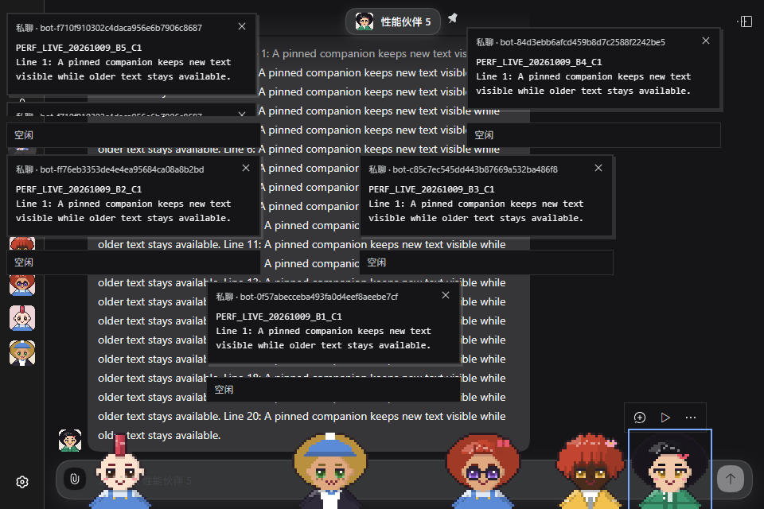
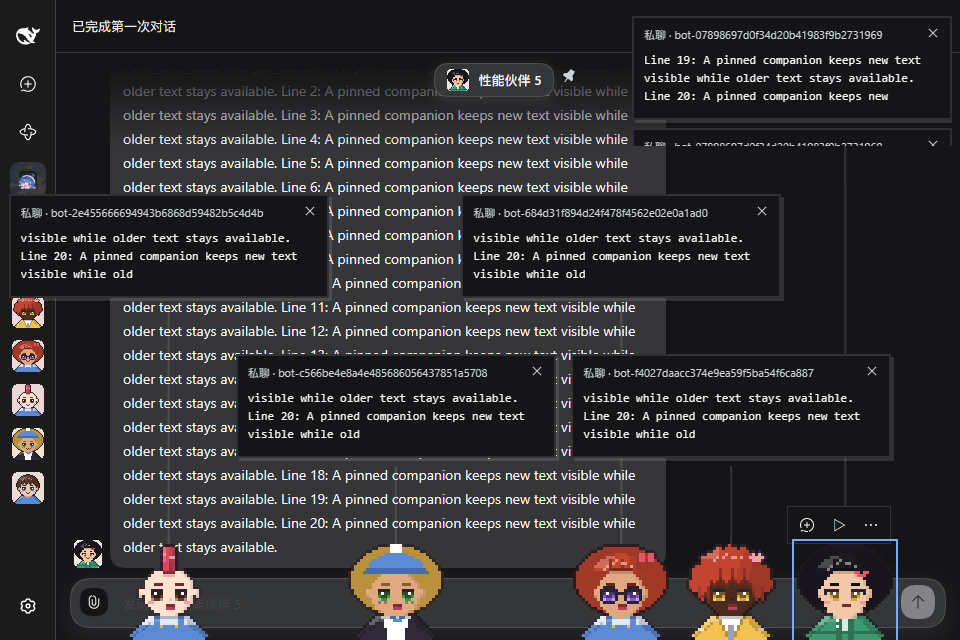
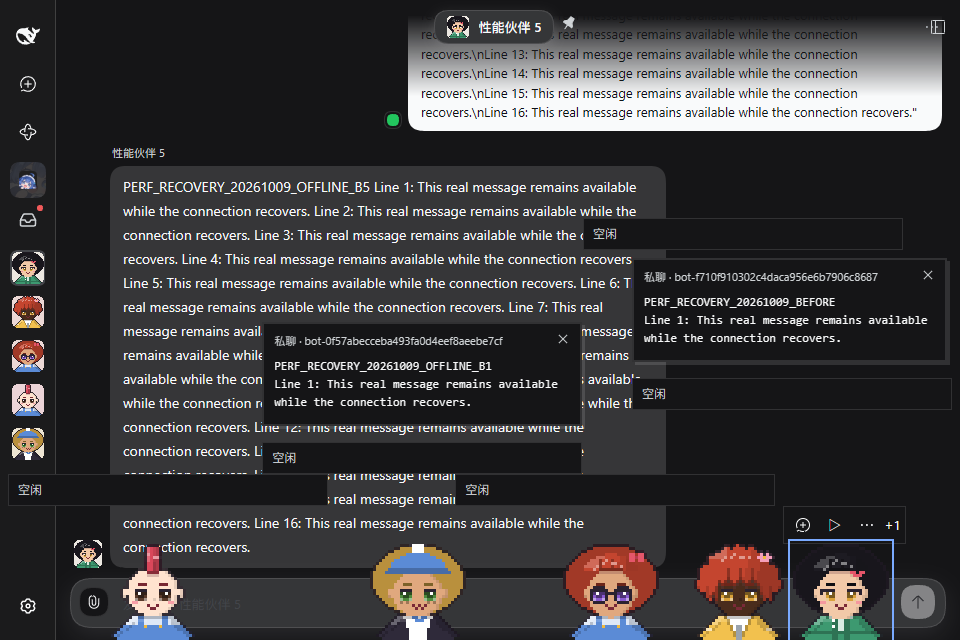
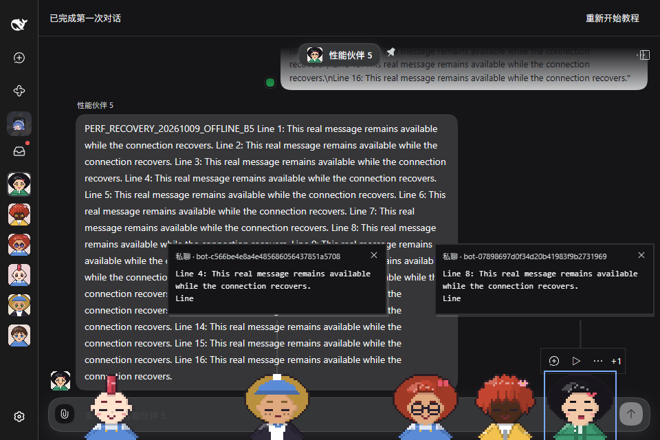
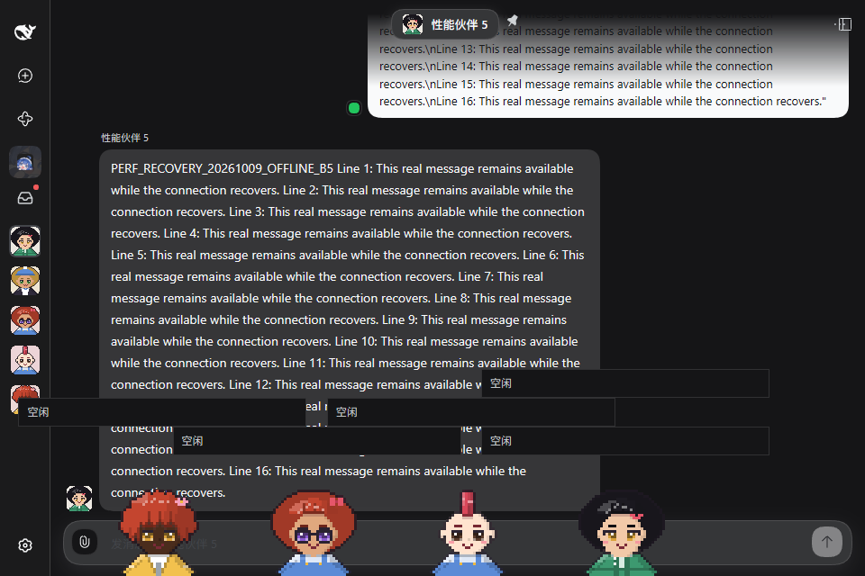
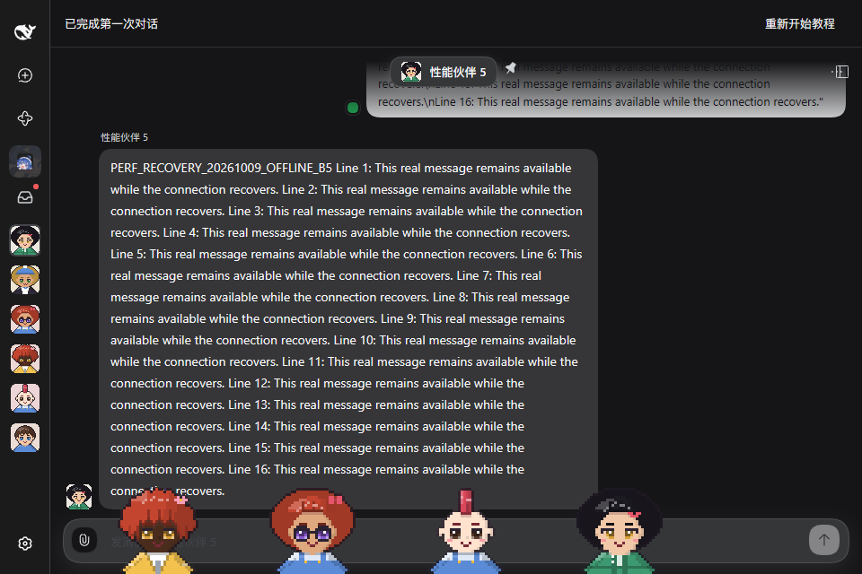

# Window Companion: five-companion performance checkpoint

[Issue #1167](https://github.com/BotHarness/DeepSeekBot/issues/1167), part of [specification #1135](https://github.com/BotHarness/DeepSeekBot/issues/1135). Recorded 2026-10-09 UTC. **Partial qualification: no performance budget or overall performance acceptance is claimed.**

This checkpoint records three foreground repetitions each of idle, roaming and drag/release, paired post-GC heap snapshots around ten pin/unpin cycles, and a later same-version/Profile walking pilot. It extends the earlier lifecycle-only observations to the later composed spring, anchor, approval, question and candidate-mouth implementation. It introduces no runtime change, pin cap or +N fold.

## Sources and controls

| Control                | Parent                                                                                                              | Candidate                                                                                                   |
| ---------------------- | ------------------------------------------------------------------------------------------------------------------- | ----------------------------------------------------------------------------------------------------------- |
| Host source            | `75a236a56942f75c3ebbbe84b88bde2e6fc3abcb`                                                                          | Composition `fc356883152ac5d86b11993216084dbda60be4d4`, integrating main `66d2767a`                         |
| Pixel Avatar           | Published 0.1.0                                                                                                     | Local packed 0.10.1, owner `ac9e25740e7ef33d1409b124d9bab23d16732ced`; unpublished                          |
| Installed Host changes | Clean parent checkout                                                                                               | Uncommitted QA-only packed dependency and Companion-only `speechMouthVersion: 2`; not a released Host build |
| Browser                | Chrome 154.0.8037.98, isolated headless                                                                             | Chrome 154.0.8037.98, isolated headless                                                                     |
| DSH / profiler         | Official 0.2.0-rc.1 / Chrome DevTools MCP 1.10.1                                                                    | Same                                                                                                        |
| Viewport / scale       | 960 × 640 / DPR 1                                                                                                   | Same                                                                                                        |
| Theme / locale         | Native dark / Chinese                                                                                               | Same; dark setting and native body attribute explicitly checked                                             |
| Test state             | 5 visible real PersonaBots, 0 message cards, all live and idle before workload; idle activity labels remain visible | Same companion/message-card state; candidate hides idle activity labels                                     |
| Other page state       | Roster 5; 4 saved test messages per DM                                                                              | Roster 6; 1 saved test message per DM; newer onboarding screen                                              |

Five canonical seeded recipes and their static portrait SHA-256 values match exactly across revisions; the per-Bot hashes are in [measurements.json](../assets/pr/1167-companion-performance/measurements.json). Both browser runs reported 16 logical processors and navigator.deviceMemory=32 GiB, a coarse browser value rather than physical RAM. Machine baseline: Windows 11 Pro 10.0.26200, Intel i5-12600KF, 63.8 GiB physical RAM. Other desktop workloads were not controlled. Three sequential repetitions per scenario are not randomized experiments, statistical equivalence or low-end-device qualification.

The candidate's original light-theme collection is retained privately and excluded from these tables. Inspection of its actual screenshot caught the mismatch; the candidate was repeated through the native dark-theme control. The parent screenshot verifies its dark theme. Candidate setup opened/closed native General settings; the parent was already dark. This additional setup difference, native-shell content, Channel histories, roster sizes, upstream application changes and Avatar versions prevent attribution of absolute listener or whole-page differences to a single Companion feature.

## Actual measured page state

These idle-state screenshots are state records, not a controlled visual before/after comparison: shell content differs as disclosed above. This pair was captured outside the timed traces; recording a screencast during profiling would add workload. The later stream-recovery protocol separately discloses its in-trace screenshot overhead.

## Frame observations

Each cell contains **parent / candidate**. Durations below come from trace bounds, not total CLI wall time. Full per-run counts, min/mean/p50/p95/p99/max and threshold counts are in the numerical artifact.

| Scenario |   Trace seconds | AnimationFrames | Frame wall p95 ms | Presentation interval p95 ms | Frame wall >50 ms |
| -------- | --------------: | --------------: | ----------------: | ---------------------------: | ----------------: |
| idle 1   | 15.423 / 15.460 |     1629 / 1633 |     9.671 / 9.624 |                9.801 / 9.752 |             0 / 0 |
| idle 2   | 15.087 / 15.086 |     1592 / 1594 |     9.686 / 9.664 |                9.809 / 9.784 |             0 / 0 |
| idle 3   | 15.083 / 15.098 |     1588 / 1594 |     9.704 / 9.705 |                9.848 / 9.864 |             0 / 0 |
| roam 1   | 15.081 / 15.103 |     1575 / 1578 |     8.875 / 8.952 |               9.697 / 16.180 |             0 / 0 |
| roam 2   | 15.102 / 15.891 |     1571 / 1577 |     9.010 / 8.905 |               9.720 / 16.253 |             0 / 0 |
| roam 3   | 15.086 / 15.092 |     1573 / 1577 |     8.921 / 8.864 |               9.703 / 16.189 |             0 / 0 |
| drag 1   | 14.820 / 15.244 |     1554 / 1601 |     9.705 / 9.740 |                9.844 / 9.887 |             0 / 0 |
| drag 2   | 14.845 / 15.182 |     1558 / 1587 |     9.720 / 9.704 |                9.832 / 9.817 |             0 / 0 |
| drag 3   | 14.792 / 14.950 |     1556 / 1572 |     9.730 / 9.715 |                9.876 / 9.839 |             0 / 0 |

The official DevTools AnimationFrames handler pairs actual begin/end frame IDs on the main-frame renderer thread. Partial boundary frames are excluded; duplicate presentation timestamps are collapsed. Quantiles use nearest rank independently for each run. Frame wall duration includes elapsed pipeline time: **it is neither CPU execution cost nor display FPS**. Presentation intervals are reported separately. There is no video-derived FPS or injected requestAnimationFrame measurement loop. Thresholds in the JSON are descriptive references, not agreed budgets.

Idle and roaming traces request 15 seconds with no page evaluation during the timed interval. Drag traces each contain three native MCP element drags, each followed by two seconds of settling; snapshot/input overhead is included. MCP's public drag tool does not provide a calibrated fast throw, held-direction reversal or controlled release velocity, so these traces do not qualify those physical edge cases. No sampled frame wall duration exceeded 50 ms in these runs; that bounded observation does not establish sustained-load performance or exclude regressions in unmeasured scenes.

**Cadence difference requiring follow-up:** roaming presentation-interval p95 is 9.697–9.720 ms in the parent and 16.180–16.253 ms in the candidate, despite similar AnimationFrame wall p95. Candidate roaming has 4 / 9 / 7 presentation intervals above 16.667 ms, compared with 0 / 0 / 0 in the parent; neither has an interval above 50 ms. These event intervals do not measure physical display FPS. The repeated difference is an observation to isolate, not evidence of statistical equivalence or an attributable Companion regression: shell/setup/history and upstream application changes differ. A controlled owning-feature comparison is still needed before deciding whether a correction is required.

## Same-document walking controls

A follow-up keeps all five companions mounted in the same document and changes only the existing native walking controls in order **0 → 1 → 5 → 5 → 1 → 0**. Each setting records approximately 15 seconds after a 2.5-second settle. Dark theme, Profile, source, viewport, recipes, card count and shell content stay fixed within this run. Before/after positions confirm that exactly the enabled number changed horizontal position; disabled companions remain in place. The physics phase is grounded during walking, so a rest phase label alone would not establish inactivity.

| Run         | Walking enabled | Changed horizontal position | Trace seconds | Frame wall p95 ms | Presentation interval p95 ms | Presentation intervals >16.667 ms |
| ----------- | --------------: | --------------------------: | ------------: | ----------------: | ---------------------------: | --------------------------------: |
| walkers-0-1 |               0 |                           0 |        15.432 |             9.789 |                        9.909 |                                 7 |
| walkers-1-1 |               1 |                           1 |        15.079 |             9.049 |                       16.816 |                               129 |
| walkers-5-1 |               5 |                           5 |        15.088 |             8.834 |                       16.186 |                                 1 |
| walkers-5-2 |               5 |                           5 |        15.093 |             8.900 |                       16.224 |                                10 |
| walkers-1-2 |               1 |                           1 |        15.090 |             9.222 |                       16.895 |                               136 |
| walkers-0-2 |               0 |                           0 |        15.093 |             9.665 |                        9.812 |                                 6 |

[cadence-controls.json](../assets/pr/1167-companion-performance/cadence-controls.json) contains the complete distributions. All-static controls return to roughly 9.8–9.9 ms presentation p95; one walking companion reaches roughly 16.8–16.9 ms and five roughly 16.2 ms. One moving companion is sufficient to reproduce this observation among five mounted companions; it does not worsen proportionally with walking count in these samples. This narrows the workload, but does not identify a faulty module or prove a regression against an otherwise identical parent build. No code fix or physical display-FPS conclusion is claimed. Two sequential samples per setting and uncontrolled desktop workloads remain limits. Both the collector and offline analysis complete, console errors are zero, and the task-owned browser is closed.

## Same-version, same-Profile walking pilot

This separate pilot compares pinned main `d55d82feedc0d31ced860b65b564b5f83869fae6` with #1173 source `50b44535a8180a138268c4f52a7fb5581f61de13`. Both install **formal Avatar 0.8.0** and use the **same durable DSH Profile**, five canonical Bot identities, recipes, static portrait hashes and DM message counts. It measures the #1173 feature range, including spring, sound and reading/visibility changes, rather than isolating an individual module. It does not measure the subsequently accepted formal 0.10.1 mouth adoption in [PR #1254](https://github.com/BotHarness/DeepSeekBot/pull/1254).

Both use the same Chrome 154.0.8037.98 / official MCP 1.10.1 / DSH 0.2.0-rc.1 configuration, native dark/Chinese, 960 × 640 / DPR 1. All five companions remain mounted and live. Native focus-visible and walking-button operations configure 0 → 1 → 5 → 5 → 1 → 0 walkers; native pointer hover and focus then move outside the companions, followed by 2.5 seconds settling. Each trace verifies zero message cards and reading companions, unchanged document identity, and actual horizontal movement above one CSS pixel matching the enabled count. No page evaluation runs during the timed interval.

The pilot requests **five seconds per sample**, with two sequential repetitions per count. A preceding 15-second main run saved a complete raw trace but official stop-tool analysis timed out; an earlier hover preflight also failed. Both attempts remain private and excluded. The shorter pilot is an additional protocol, not a replacement for the earlier 15-second samples or full qualification. Offline analysis uses the unchanged official chunked parser and only its unchanged Meta and AnimationFrames handlers, preserving dependency, frame-ID, bounds and main-renderer/thread guards. A cross-check on the unchanged earlier candidate walkers-0-1 trace reproduces every previously published frame statistic exactly. No vendor code or application instrumentation was changed.

Timing and threshold cells contain **pinned main / #1173**; enabled/actually-moved counts match in both revisions. Full distributions, canonical cohort hashes and asset checks are in [same-version-controls-pilot.json](../assets/pr/1167-companion-performance/same-version-controls-pilot.json).

| Sample      | Enabled / actually moved | Trace seconds | Frame wall p95 ms | Presentation interval p95 ms | Presentation intervals >16.667 ms |
| ----------- | -----------------------: | ------------: | ----------------: | ---------------------------: | --------------------------------: |
| walkers-0-1 |                    0 / 0 | 5.431 / 5.440 |     8.621 / 8.542 |                8.754 / 8.662 |                             0 / 1 |
| walkers-1-1 |                    1 / 1 | 5.088 / 5.203 |     7.848 / 7.933 |               8.395 / 13.949 |                             0 / 1 |
| walkers-5-1 |                    5 / 5 | 5.086 / 5.087 |     8.017 / 7.944 |               8.389 / 13.228 |                             2 / 8 |
| walkers-5-2 |                    5 / 5 | 5.091 / 5.105 |     8.861 / 9.268 |              16.666 / 18.433 |                           25 / 64 |
| walkers-1-2 |                    1 / 1 | 5.077 / 5.108 |   12.382 / 12.276 |              16.695 / 20.090 |                           53 / 61 |
| walkers-0-2 |                    0 / 0 | 5.101 / 5.098 |     8.589 / 8.569 |                8.715 / 8.753 |                             0 / 0 |

**The higher candidate walking presentation tails remain an observation requiring attribution.** Matching Avatar and Profile removes those earlier confounds, but does not identify spring, reading, CSS, SVG or GPU as its cause. Main's repeated walking samples also vary substantially. Parent then candidate and count order are fixed; other desktop workloads remain uncontrolled. Neither revision has a sampled frame-wall duration or presentation interval above 50 ms here. These short headless samples do not establish sustained-load support, statistical parity, physical display FPS or a performance pass. Both runs have zero console errors and close their owned browsers.

With matched Avatar versions, rebuilt client.js is 2,899,507 → 2,913,445 bytes (**+13,938**), gzip level 6 is 725,118 → 728,326 bytes (**+3,208**). These are the whole #1173 feature-range bundle costs, separate from frame observations; they are not the cost of SVG or one individual module.

The following final paused-state screenshots were captured outside the timed traces. Native positions reflect the preceding roaming; they are state records rather than pixel-aligned artwork comparisons.

| Pinned main, five paused                                                                                                                    | #1173, five paused                                                                                                                       |
| ------------------------------------------------------------------------------------------------------------------------------------------- | ---------------------------------------------------------------------------------------------------------------------------------------- |
|  |  |

## Main-renderer stage observations from the matched pilot

This offline analysis reuses exactly the twelve formal Avatar0.8.0/same-Profile pilot traces above; it adds no runtime sampling and does not describe the separate formal0.10.1 studies below. Only actual complete events on the previously verified main-frame renderer thread are selected. Wall duration and recorded thread duration are separate trace clocks, as described in [Chromium's trace reading guide](https://www.chromium.org/developers/how-tos/trace-event-profiling-tool/trace-event-reading/) and [DevTools trace types](https://chromium.googlesource.com/devtools/devtools-frontend/+/b88894b14f63f84c460f66cff8918b2b4d079eae/front_end/models/trace/types/TraceEvents.ts).

**Paint contains nested Paint events.** Five-walker parent samples contain 6,468 / 6,061 Paint events but only 588 / 551 outermost same-name events; candidate samples contain 3,546 / 3,016 but only 591 / 506 outermost events. Inclusive sums would count that nesting repeatedly. The table keeps only outermost intervals for each stage; every same-name overlap is fully contained, with zero partial overlaps. Different stage names can still contain each other and must never be added. All selected UpdateLayoutTree, Layout and Paint events have actual thread-duration fields; missing thread durations in other stages are counted in the artifact rather than imputed.

Cells contain **pinned main / #1173**, milliseconds per actual trace second. Paint thread duration is the recorded outermost tdur, not a CPU percentage or exclusive/self time.

| Sample      | UpdateLayoutTree wall ms/s | Layout wall ms/s |  Paint wall ms/s | Recorded Paint thread ms/s |
| ----------- | -------------------------: | ---------------: | ---------------: | -------------------------: |
| walkers-0-1 |            21.909 / 15.977 |    0.000 / 0.000 |    0.000 / 0.000 |              0.000 / 0.000 |
| walkers-1-1 |            48.456 / 33.895 |  24.876 / 24.495 |  55.769 / 75.387 |            53.681 / 70.365 |
| walkers-5-1 |            68.345 / 37.214 |  31.945 / 23.108 | 97.530 / 115.166 |          107.272 / 113.695 |
| walkers-5-2 |            68.676 / 37.166 |  32.560 / 23.040 | 91.677 / 120.683 |           99.077 / 121.556 |
| walkers-1-2 |            46.604 / 34.359 |  26.595 / 25.213 |  52.897 / 75.009 |            49.318 / 88.332 |
| walkers-0-2 |            21.530 / 21.754 |    0.000 / 0.000 |    0.000 / 0.000 |              0.000 / 0.000 |

Neither revision has a selected Layout or Paint event in either paused control; this bounded main-thread observation does not establish zero rendering work elsewhere. Moving samples show higher candidate outermost Paint wall totals, while five-walker candidate UpdateLayoutTree and Layout wall totals are lower. These differences do not identify spring, CSS, SVG or GPU as their cause. Some recorded thread totals exceed the corresponding wall totals; the clocks are retained separately, without clamping, and their precision is not qualified as CPU utilization.

[render-stage-times.json](../assets/pr/1167-companion-performance/render-stage-times.json) contains counts, missing-thread counts, same-name nesting, inclusive diagnostics and outermost wall/thread summaries for eight stage names across all twelve traces. These are whole-page main-renderer events, excluding attribution to particular shapes, JavaScript owners, raster workers, compositor and GPU processes. Fixed revision/count order, two short sequential samples and uncontrolled desktop workloads still preclude a causal regression claim. This narrows subsequent investigation; it does not justify a transform rewrite or runtime correction by itself.

## GPU interpretation

The frame/heap sections do not measure GPU utilization, GPU memory or power. A separate read-only attempt to inspect the profiler configuration's native chrome://gpu page was refused by the official tool's chrome: navigation rule; it produced no backend qualification and its owned browser was closed. No alternate navigation or raw-protocol override was used. The subsequent Windows process-counter collection below is a distinct measurement path, rather than an inference from heap or AnimationFrames.

### Formal 0.10.1: separate Windows GPU-process observations

This collection installs the accepted formal Avatar **0.10.1** and Companion speechMouthVersion2 at product source `a009678599dcc7913e0c3a26de00a856a71f2e7d`, documentation head `2ef1106a1d1431ed516d71d57475807582542b0a` ([PR #1254](https://github.com/BotHarness/DeepSeekBot/pull/1254)). It reuses the five canonical identities and saved recipe/portrait hashes above. The same real native Chat stays selected, dark/Chinese/960 × 640/DPR1, with zero cards, no reading and all mounted streams live. No new model output is requested. Native pin and focus-visible walking controls prepare 0 mounted → 1 paused → 5 paused → 5 walking → 5 paused. Actual moved counts are 0 / 0 / 0 / 5 / 0 in the same visible document. There is no simultaneous Chrome trace, screencast or page evaluation during counter collection.

Windows [Get-Counter](https://learn.microsoft.com/en-us/powershell/module/microsoft.powershell.diagnostics/get-counter?view=powershell-7.6) collects **GPU Engine / Utilization Percentage / CookedValue** at one-second intervals, retaining floating-point precision. The collector identifies exactly one GPU process inside the task-owned official MCP daemon's Chrome process tree, verifies its creation identity before/after each scene and across all scenes, and accepts only [valid PDH counter data](https://learn.microsoft.com/en-us/windows/win32/perfctrs/checking-pdh-interface-return-values). Missing/invalid counters fail the collection rather than becoming zero. Sixteen samples per scene discard the first as warm-up, leaving fifteen one-second windows. Each interval reports the **maximum across that process's engines**, consistent with Microsoft's [busiest-engine interpretation](https://devblogs.microsoft.com/directx/gpus-in-the-task-manager/); distinct engines are never summed.

| Actual scene            | Mounted / moved | Retained intervals | Mean busiest engine % | Peak busiest engine % |
| ----------------------- | --------------: | -----------------: | --------------------: | --------------------: |
| Before pinning          |           0 / 0 |                 15 |                 0.000 |                 0.000 |
| One paused companion    |           1 / 0 |                 15 |                 0.005 |                 0.026 |
| Five paused companions  |           5 / 0 |                 15 |                 0.005 |                 0.028 |
| Five walking companions |           5 / 5 |                 15 |                 3.105 |                 3.506 |
| Five paused again       |           5 / 0 |                 15 |                 0.006 |                 0.025 |

Full per-interval values, actual interval durations and individual engine distributions are in [formal-gpu-process.json](../assets/pr/1167-companion-performance/formal-gpu-process.json). At fifteen samples, nearest-rank p95 equals the sample maximum. These observations show driver-engine utilization increasing during five-companion movement and returning close to the static samples after native pause. They do not establish SVG as the source of the work, a GPU bottleneck, a frame-rate budget or absence of short GPU spikes.

The machine reports an installed NVIDIA GeForce RTX 3090 / driver32.0.16.1074 and Parsec Virtual Display Adapter / driver0.45.0.0. Active counter-LUID to adapter-caption mapping and the actual SVG raster/compositing backend are **not** verified; the absence of explicit software-angle/disable-GPU launch switches does not prove a hardware pipeline. Scope is the **whole owned Chrome GPU process**, including native DSH, rather than SVG alone, all Chrome processes or total device usage. One fixed-order headless run and one-second averaging do not qualify low-end devices, sustained loads or sub-second spikes. Active speaking/mouth changes, concurrent messages, drag/release, background return, GPU memory and power remain unmeasured by this collection. All counter/state guards pass, final console errors are zero and its owned browser is closed.

These actual DSH state images are outside collection windows; native positions differ after roaming. The final frame is paused, not an image of the measured walking interval.

| Before pinning                                                                                                            | Five paused after collection                                                                                                                 |
| ------------------------------------------------------------------------------------------------------------------------- | -------------------------------------------------------------------------------------------------------------------------------------------- |
|  |  |

Package statuses in the original comparison describe the capture time: its candidate used a local unpublished pack then. Later Human-authorized formal publication/adoption does not convert that historical workload into a formal-package measurement.

## Real concurrent output and expanded reading

Both final runs send five actual Human DM inputs through the owning Host. Four real PersonaBots each call channel_send once; the fifth calls it three times. Seven authored, committed Bot messages are verified against their canonical DMs before profiling. Actual message body hashes match exactly across revisions, each 1,715 characters. There is no injected feed, generated DOM card or replay of old output. Both use the same native dark 960 × 640/DPR1 page state and the same five saved appearances; the earlier application/history/roster comparison limits still apply.

Before new model inputs, a visible-character setup followed by actual Tab and Shift+Tab must return focus to the exact Bot5 character, satisfy focus-visible and enter reading; focus is then moved outside and the reading grace expires. The timed scene starts only after seven real cards render and at least two different Bots still show incomplete canonical text. It records ten seconds of collapsed reveal, then the same visible-character/Tab/Shift+Tab route to Bot5 and fifteen seconds of expanded reading. Bounded DOM observations and the input operations are included, so this is an interaction workload rather than an observation-free paint microbenchmark. Message delivery and reveal start times remain model-dependent despite matching body hashes.

| Revision  | Bots revealing at trace start | Trace seconds | AnimationFrames | Frame wall p95 / p99 / max ms | Presentation interval p95 / p99 / max ms | >50 ms frame wall / presentation interval |
| --------- | ----------------------------: | ------------: | --------------: | ----------------------------: | ---------------------------------------: | ----------------------------------------: |
| parent    |                             5 |        39.134 |            4134 |      11.510 / 12.249 / 27.910 |                 17.956 / 18.340 / 37.382 |                                     0 / 0 |
| candidate |                             5 |        40.885 |            4283 |      17.997 / 21.540 / 25.711 |                 26.952 / 28.152 / 37.047 |                                     0 / 0 |

The candidate has higher p95 frame wall and presentation intervals in this paired interaction sample. Matching message bodies does not match model arrival times, reveal progress, scrolling behavior or the intervening application changes. This is a follow-up observation, not an attributable owning-feature regression or evidence that the versions are equivalent. Neither sampled trace has a frame wall duration or presentation interval above 50 ms; that does not override the p95 difference or establish acceptance.

The candidate raw trace exceeds Node's single-string size limit. Offline analysis uses the official MCP chunked trace parser on the unchanged raw buffer, followed by the same unchanged DevTools frame handler; no events are filtered. The same parser reproduces the original parent statistics exactly. This is a parsing-method correction, not a new runtime sample.

| Recorded state                                    | Rendered cards | Cards exposed to accessibility | Reading companions |
| ------------------------------------------------- | -------------: | -----------------------------: | -----------------: |
| parent: collapsed-reveal-after-ten-seconds        |              7 |                              5 |                  0 |
| parent: expanded-reading-start                    |              7 |                              7 |                  1 |
| parent: expanded-reading-after-fifteen-seconds    |              7 |                              7 |                  1 |
| candidate: collapsed-reveal-after-ten-seconds     |              7 |                              5 |                  0 |
| candidate: expanded-reading-start                 |              7 |                              7 |                  1 |
| candidate: expanded-reading-after-fifteen-seconds |              7 |                              7 |                  1 |

Rendered-card counts include collapsed inert layers; they do not assert that every card is simultaneously readable or unobscured. Bot5's three-card expanded state is verified in both final runs. Both stay in the same document and visible throughout their trace; both final console checks are empty and owned browsers are closed. Full distributions, source versions, body hashes and actual state counts are in [concurrent-output.json](../assets/pr/1167-companion-performance/concurrent-output.json).

The first candidate attempt used script focus after mouse setup and failed the reading precondition: the current view deliberately requires focus-visible for keyboard entry. Its raw trace and failure remain private and excluded. A second attempt tried a hidden toolbar control as its starting focus target; that preflight failed before sending any new model input. Both failures are retained privately and excluded. The final protocol validates actual Tab followed by Shift+Tab from the visible character before sending any new model input, and both revisions were measured again with that route. No product interaction rule was relaxed to pass the test. One successful paired interaction sample does not establish sustained-load performance, low-end support or an accepted budget.

## Measured stream recovery and fresh Client startup

Both revisions use an actual loopback forwarding hop to the unchanged installed Host. It destroys and temporarily refuses only the native Companion SSE endpoint; other native requests and Host model execution continue normally. All five companions must actually become stale. Two new Bot messages are then committed to their canonical DMs while the feed is cut. Existing Bot5 reading remains active with its earlier real card; after forwarding resumes, Bot1 receives its message and Bot5 retains its reading card with one pending message. Fifteen seconds later, releasing reading admits that message. A five-second bounded count check observes exactly the three real cards, without duplicate delivery. The three actual body hashes and five saved appearances match across revisions.

The next trace starts before a full Client document reload with cache bypass. The document time origin must change, five persisted pins must become live again, and none of the old or just-created canonical messages may appear as cards or pending content for fifteen seconds. This measures a fresh Client document on a live Host and browser process. It does **not** qualify a cold browser process, Host restart, full-network outage or genuine hidden/background return.

| Revision / scene                   | Trace seconds | Frame wall p95 / p99 / max ms | Presentation interval p95 / p99 / max ms | >50 ms frame wall / interval |
| ---------------------------------- | ------------: | ----------------------------: | ---------------------------------------: | ---------------------------: |
| parent: reconnect-return           |        39.513 |      10.741 / 11.268 / 52.436 |                 17.953 / 18.307 / 82.975 |                        1 / 1 |
| parent: client-reload-no-replay    |        19.505 |      9.705 / 12.115 / 825.301 |                 9.831 / 18.058 / 839.908 |                        6 / 8 |
| candidate: reconnect-return        |        40.315 |      12.563 / 14.053 / 87.830 |                17.940 / 26.991 / 105.267 |                        1 / 1 |
| candidate: client-reload-no-replay |        18.997 |      9.742 / 14.152 / 720.509 |                 9.909 / 26.820 / 735.081 |                        9 / 9 |

| Revision  | Actual shared SSE streams destroyed | Return observed upper bound, seconds | Fresh Client live observed upper bound, seconds | Intentional connection errors | Post-reload console errors |
| --------- | ----------------------------------: | -----------------------------------: | ----------------------------------------------: | ----------------------------: | -------------------------: |
| parent    |                                   1 |                                5.049 |                                           3.562 |                             2 |                          0 |
| candidate |                                   1 |                                5.483 |                                           3.076 |                             2 |                          0 |

The upper bounds include tool dispatch and polling; they are not pure Client execution timings or accepted service-level targets. Navigation Timing, full distributions and state counts are in [recovery-startup.json](../assets/pr/1167-companion-performance/recovery-startup.json). All recorded states are foreground/visible. Shared-stream counts are actual transport connections, not one stream per companion. Bounded DOM checks, native focus operations and one reading-state screenshot are included in the recovery traces. The forwarding hop makes these a separate protocol from the earlier direct-origin samples; source/history/model-timing differences still prevent owning-feature attribution.

| Retained reading after real stream recovery | Parent                                                                                                                     | Candidate                                                                                                                        |
| ------------------------------------------- | -------------------------------------------------------------------------------------------------------------------------- | -------------------------------------------------------------------------------------------------------------------------------- |
| Native dark, 960 × 640                      |  |  |

| Fresh Client document, no history replay after fifteen seconds | Parent                                                                                                                 | Candidate                                                                                                                    |
| -------------------------------------------------------------- | ---------------------------------------------------------------------------------------------------------------------- | ---------------------------------------------------------------------------------------------------------------------------- |
| Native dark, 960 × 640                                         |  |  |

Two earlier attempts remain private and excluded: browser Offline left established SSE connections live; a short-message run reached correct reading recovery but its fixed-count oracle failed after normal automatic card expiry. The final paired protocol uses longer real output, keeping the observation within natural lifetime without changing product timers. All successful measurement browsers and loopback proxies are closed. Intentional connection failures are recorded separately from the post-reload console check. These bounded samples do not establish sustained-load support, absence of regressions or Human budget agreement.

## Formal 0.10.1: actual browser-process restart

Three separate official MCP browser-process restarts use accepted formal Avatar0.10.1 / speechMouthVersion2 at the same sourcea0096785 and documentation head2ef1106a as the GPU collection. A new dedicated task browser user-data directory first receives five real pins and native pause settings. Before each restart, every previous owned Chrome process must have exited. The new browser and GPU-process creation identities differ from bootstrap and from every other repetition. No profile data is synthesized or imported. The same dedicated browser directory, durable DSH Profile and live Host are reused; disk cache is not purged. This is a **fresh browser process with warm persistent storage/cache and Host**, not a Host/OS cold start.

An official trace starts on the new about:blank page before navigating to the actual DSH login route. Native DOM observations wait for the five saved pins, dark/Chinese/960 × 640/DPR1, all paused/live, no cards, pending or reading. Fifteen seconds later these conditions still hold in the same new document. Each repetition has zero console errors and its owned browser closes. Read-only owning Host queries afterwards confirm all five canonical identities, seeded recipes, portraits and existing DM message counts match the preceding GPU cohort; each DM already contains a real canonical message. No new model message or replay fixture is inserted.

| Repetition | Trace seconds | Frame wall p95 / p99 / max ms | Presentation interval p95 / p99 / max ms | >50 ms frame / interval |
| ---------- | ------------: | ----------------------------: | ---------------------------------------: | ----------------------: |
| 1          |        19.377 |       8.571 / 9.534 / 565.862 |                 8.722 / 11.913 / 579.730 |                   7 / 7 |
| 2          |        18.934 |      8.564 / 10.526 / 459.969 |                 8.707 / 15.506 / 475.041 |                   5 / 7 |
| 3          |        18.859 |       8.574 / 9.710 / 449.026 |                 8.703 / 15.653 / 458.285 |                   5 / 6 |

These distributions include navigation followed by fifteen seconds of idle. Their low overall p95 does **not** establish smooth startup: the actual long frames remain visible in the maximum/count columns. The unchanged official Meta+AnimationFrames parser requires one target main-frame renderer process/thread, matched begin/end frame IDs and contained events; all three recordings satisfy those checks. No video or synthetic requestAnimationFrame metric supplies these results.

| Repetition | Tool launch → live observed upper bound s | Navigation → live observed upper bound s | Navigation DOMContentLoaded end ms | Navigation load end ms | First contentful paint ms |
| ---------- | ----------------------------------------: | ---------------------------------------: | ---------------------------------: | ---------------------: | ------------------------: |
| 1          |                                    10.855 |                                    3.131 |                             94.900 |                862.300 |                   120.000 |
| 2          |                                    10.422 |                                    3.023 |                            116.900 |                746.800 |                   144.000 |
| 3          |                                    10.123 |                                    2.900 |                            106.500 |                720.500 |                   124.000 |

Tool upper bounds include daemon/browser dispatch, blank-page creation, resize, process identity query, trace setup, navigation and polling as applicable. The trace begins **after** browser creation and cannot measure launch execution. Navigation/paint entries have their native document time origin and are separate from the upper bounds; neither is an accepted service-level target. Bounded DOM checks during startup are included in trace overhead. Screenshots are taken after tracing, and no screencast runs during sampling.

All three raw trace metadata records agree on HeadlessChrome154, Chinese locale,16 logical cores, ANGLE/NVIDIA RTX3090 Direct3D11 renderer and driver32.0.16.1074; the trace also reports cpu-running-in-vm=1, without establishing the virtualization configuration. These are allowlisted **cold-trace metadata**, not a chrome://gpu inspection. They qualify the reported browser renderer context for this workload, without mapping the earlier Windows counter LUID to an adapter or attributing individual SVG rasterization/compositing work. Full native navigation/paint values, frame distributions and protocol guards are in [formal-browser-cold.json](../assets/pr/1167-companion-performance/formal-browser-cold.json); command lines, local paths, process identities and authentication data stay private.

| First restarted browser: no replay after fifteen seconds                                                                                    | Third restarted browser: no replay after fifteen seconds                                                                                    |
| ------------------------------------------------------------------------------------------------------------------------------------------- | ------------------------------------------------------------------------------------------------------------------------------------------- |
|  |  |

These images record actual mounted/live state, not an isolated visual before/after comparison or proof that every character is unobscured. This candidate-only three-run study has no matched parent browser-cold sample. Host cold start, genuine background return, sustained/low-end support, owning-seam regression attribution and Human budget agreement remain open.

## Current formal 0.10.0: incomplete revision-order study

A later collection compares common main bcae2205d7562f3eec1d9b2f5e20c1b4fbb5a9da with #1173 product source4072b9e6b8add5fa7cfab214b8a769c8220f1894 (evidence-only head aa74d85a), both using formal Avatar0.10.0 and pinned DSH0.2.0-rc.1. Five canonical Bots, seeded recipes, portrait hashes and a dedicated durable Profile match. Each run starts a fresh owned Host/browser, uses Chinese/dark/960×640/DPR1, mounts all five companions live without cards, and changes native walking controls 0→5→5→0 with 2.5-second settling and five-second requested traces. No page evaluation or screencast runs during a timed interval. The unchanged official Meta+AnimationFrames handlers parse actual traces; all included endpoint movement counts match enabled walkers. These are whole-page metrics, not isolated spring, sound or SVG costs.

The planned order was parent1→candidate1→candidate2→parent2. The last parent run stopped after one paused trace because the subsequent native control sequence left a companion in reading state. Its browser and exact Host closed; **the entire last run, including that paused trace, is excluded**. The twelve traces from the first three complete runs below are preliminary, unbalanced observations. They do not establish a completed order-balanced comparison or performance acceptance; no successful run is substituted for the failure.

The original setup counts differed: the first parent recorded zero messages per DM before opening Channels; later runs recorded one. A read-only canonical placement/source-event ledger after every owned Host stopped contains exactly one native system onboarding welcome per DM, all written by12:24:04.966Z, before the first timed precondition at12:26:22.470Z. This explains the setup mismatch and qualifies identical timed history for the included samples. Original setup metadata and the failed run remain private and unchanged; the report does not claim identical initial setup or a contemporaneous post-trace RPC count.

| Run         | Scene       | Enabled walkers | Trace seconds | Frame wall p95 ms | Presentation interval p95 ms |
| ----------- | ----------- | --------------: | ------------: | ----------------: | ---------------------------: |
| parent-1    | walkers-0-1 |               0 |         5.594 |             9.574 |                       10.162 |
| parent-1    | walkers-5-1 |               5 |         5.113 |            12.034 |                       16.819 |
| parent-1    | walkers-5-2 |               5 |         5.090 |            14.706 |                       16.939 |
| parent-1    | walkers-0-2 |               0 |         5.145 |             9.221 |                        9.389 |
| candidate-1 | walkers-0-1 |               0 |         5.571 |            10.053 |                       10.980 |
| candidate-1 | walkers-5-1 |               5 |         5.114 |            11.241 |                       18.567 |
| candidate-1 | walkers-5-2 |               5 |         7.411 |            12.213 |                       20.674 |
| candidate-1 | walkers-0-2 |               0 |         5.091 |             9.511 |                        9.785 |
| candidate-2 | walkers-0-1 |               0 |         5.619 |             9.008 |                        9.381 |
| candidate-2 | walkers-5-1 |               5 |         5.091 |            10.587 |                       21.407 |
| candidate-2 | walkers-5-2 |               5 |         5.477 |            12.266 |                       22.440 |
| candidate-2 | walkers-0-2 |               0 |         5.159 |             9.059 |                        9.435 |

The candidate walking presentation p95 remains higher across these four samples (18.567–22.440ms) than the two parent samples (16.819–16.939ms); candidate frame wall p95 is lower in these samples. Neither observation attributes the difference to a specific module or GPU work, and the interrupted order, uncontrolled desktop workload and differing natural trajectories prevent a causal conclusion. Retain both clock domains and investigate the owning seam before claiming the difference resolved.

The rebuilt parent Client is 2,977,184 bytes (739,836 gzip level6); candidate is 2,991,594 bytes (743,169 gzip level6), a delta of +14410 / +3333 bytes. This is the whole #1173 branch delta against common main, not the isolated price of one animation. Exact bundle hashes, complete frame distributions and exclusions are in [current-formal-incomplete.json](../assets/pr/1167-companion-performance/current-formal-incomplete.json). Canonical identities, login routes, raw traces and local process data stay private. No new visual or acoustic acceptance is inferred from this numerical collection.

## Post-GC heap and resources

Both revisions use the same official take_heapsnapshot procedure, which collects garbage before capturing the graph. Chrome also documents snapshot GC in its [heap snapshot guide](https://developer.chrome.com/docs/devtools/memory-problems/heap-snapshots). Each snapshot follows a 2.5-second settle, with all five live companions paused and no cards. Ten real existing pin/unpin button handlers observed mounted counts 5 → 4 → 5 per cycle, with 150 ms after each transition and a live-stream check before the second snapshot. This tests lifecycle disposal, not mouse usability.

| Observation, before → after ten cycles |                  Parent |               Candidate |
| -------------------------------------- | ----------------------: | ----------------------: |
| Whole-page graph bytes                 | 79,948,678 → 80,078,111 | 81,045,615 → 81,227,788 |
| V8 heap bytes                          | 29,200,884 → 29,350,928 | 28,988,144 → 29,223,976 |
| WindowCompanions                       |                   1 → 1 |                   1 → 1 |
| WindowCompanion                        |                   5 → 5 |                   5 → 5 |
| CompanionMotion                        |                   5 → 5 |                   5 → 5 |
| CompanionBubbles                       |                   1 → 1 |                   6 → 6 |
| Native EventSource                     |                   5 → 5 |                   5 → 5 |
| Native EventListener                   |               550 → 550 |               719 → 719 |
| Native V8EventListener                 |               493 → 493 |               637 → 637 |
| Detached nodes named bh-companion      |                   0 → 0 |                   0 → 0 |

Whole-page graph delta: parent **129,433 bytes**, candidate **182,173 bytes**. These graphs include native DOM and shell objects. They are not Companion-only retained bytes. Object self sizes and cross-snapshot IDs are not used as retained-memory evidence; capture disables HeapProfiler between snapshots. Absolute heap or graph growth alone does not establish a leak.

Candidate CompanionBubbles count reflects the current composition: one shared owner and five local per-view owners (`window-companions-view.tsx` and `window-companion-view.tsx`). Bounded official retaining-path queries inspect one WindowCompanions, WindowCompanion, CompanionMotion and CompanionBubbles instance per revision, at depth 16 / 50 nodes / 3 siblings. Observed paths include mounted React props/state and current DOM event handlers. The candidate bubble query initially returned no path at depth 16; a bounded depth 32 / 100-node follow-up returned a React hook-state path while still reaching depth, node and sibling caps. This is a partial path inspection, not an exhaustive retaining-root analysis. The detached Companion query returned no matches. Counts did not accumulate over these ten cycles; the narrow class queries and one-instance paths do **not** establish that every resource or the whole application is leak-free.

## Asset costs, separate from frame and heap costs

| Rebuilt client.js | Parent bytes | Candidate bytes | Delta bytes |
| ----------------- | -----------: | --------------: | ----------: |
| JavaScript        |    2,582,922 |       2,903,626 |    +320,704 |
| gzip level 6      |      654,047 |         726,168 |     +72,121 |

Bundle SHA-256 values are recorded in the JSON. This comparison includes intervening application and Avatar changes; the delta is not the isolated cost of spring physics, mouth shapes or any one feature PR. The earlier #1166-only delta (+5,070 JavaScript / +1,193 gzip bytes) remains a separate baseline in the issue.

## Repeatable protocol and remaining qualification

1. Build the exact sources and dependencies above, install through the repository's isolated DSH launcher, and verify the real authenticated Host. Keep the candidate packed package local; it is not npm release approval.
2. Create five real QA PersonaBots and DMs through the owning Host APIs; save canonical seeded appearances named companion-performance-1 through companion-performance-5. Confirm matching recipes and portraits, then pin through the actual Channel header controls.
3. Select the native dark theme. Set 960 × 640 / DPR 1 and Chinese locale. Confirm all five streams live, no work in progress and no cards. Pause walking via existing controls, clear reading focus, settle, and capture the first GC snapshot.
4. Run ten pin/unpin cycles as described above, verify mounted counts and live streams, pause/clear reading again, settle identically, and capture the second GC snapshot. Release analyzer caches between graphs.
5. Record three idle traces, enable walking for three roaming traces, then pause walking and record three native three-drag traces. Capture state and console observations outside the timed interval. Parse actual frame events and heap graphs, inspect bounded retainers, then close the task-owned browser and tabs.

Both final collectors and the retaining-path inspector closed their owned browsers; both final collectors recorded zero console errors. Raw traces, heaps, authentication links and runtime logs remain private because they can contain profile data. The committed numerical artifact is an explicit allowlist of non-secret summaries, not a raw dump.

| #1167 acceptance area                                          | Checkpoint status                                                                                                                                                                           |
| -------------------------------------------------------------- | ------------------------------------------------------------------------------------------------------------------------------------------------------------------------------------------- |
| Sources, device, repeated idle/roam/drag, separate asset costs | Recorded, subject to the disclosed whole-page comparison limits                                                                                                                             |
| Same-procedure ten-cycle heap and bounded resource inspection  | Recorded for this foreground load; not a leak-free guarantee                                                                                                                                |
| Concurrent real message reveal and expanded reading cost       | Recorded in one actual paired seven-message/keyboard-reading workload above; repeated/sustained qualification remains open                                                                  |
| Actual hidden/background → visible                             | Still unqualified: official MCP forces focused-page emulation; selecting another tab left visibilityState=visible. No synthetic hidden state was substituted                                |
| Bounded reconnect return, cold-start no-replay cost            | Paired Companion-feed loss/Client reload and three candidate formal0.10.1 browser-process restarts recorded; matched parent browser restart and Host/OS cold start remain unqualified       |
| Larger/sustained loads and supported-device envelope           | Not established by these short five-companion runs                                                                                                                                          |
| GPU cost and SVG attribution                                   | Fifteen one-second windows per scene recorded for the owned GPU process at formal0.10.1; backend/adapter mapping, active speech/concurrency and SVG-specific attribution remain unqualified |
| Human agreement on measured budgets                            | Pending; no threshold is accepted by this report                                                                                                                                            |

#1167 remains open. Follow-up measurements or a measured owning-module correction belong to their own reviewable change; this checkpoint does not authorize merging feature drafts or publishing the candidate Avatar package.
