# DSH_DECISION_TREE — 快速决策树

> **状态**：架构调研输入。可执行、渐进披露版本位于 `.agents/skills/dsh-plugin-dev/references/decision-tree.md`；若产品层示例与已接受 ADR 冲突，以 ADR 为准。
>
> 用途：遇到需求时，跟着问题选抽象。每个判断旁边都有例子。
> 术语：`DSH_CONTEXT.md` · 产品场景输入：`GROKBOT_ON_DSH_ARCHITECTURE.md`

怎么读：从上往下问自己「是不是这个情况？」；菱形里是白话问题，括号里是例子。

---

## 0. 总览：先选大类

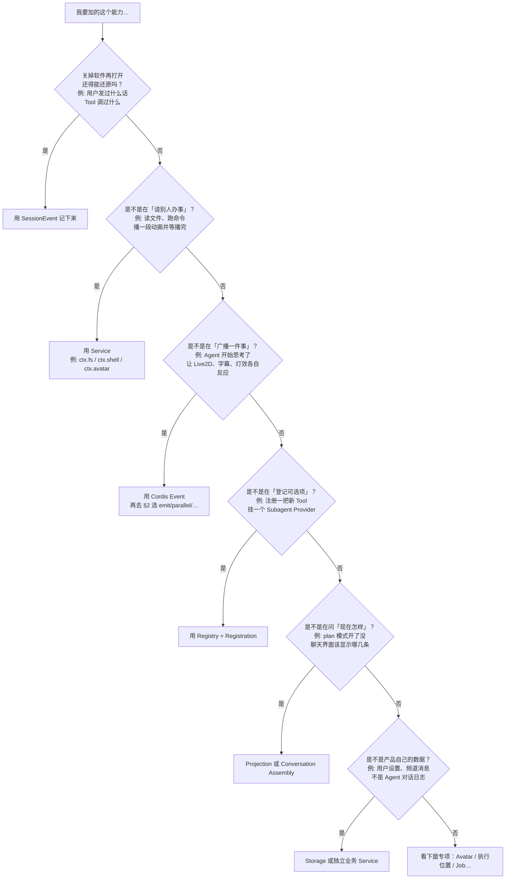

一句话对照：

| 你在干嘛                       | 用           | 例子                                           |
| ------------------------------ | ------------ | ---------------------------------------------- |
| 记账，以后能回放               | SessionEvent | `user/message`、`tool/call`                    |
| 请系统做事并拿结果             | Service      | `await ctx.shell.execute(...)`                 |
| 喊一声「出事了」，别人爱听不听 | Event        | `emit('agent/status', { status: 'thinking' })` |
| 往清单里加一项能力             | Registry     | `ctx.tools.register(readTool)`                 |
| 从历史算出「现在」             | Projection   | 当前是否 plan mode                             |

---

## 1. Event / Service / Registry 怎么分

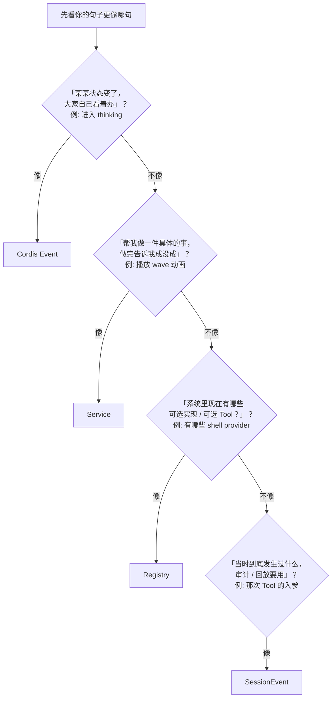

同一件事的两种写法（别混）：

| 场景                       | 别这样                           | 更合适                                       |
| -------------------------- | -------------------------------- | -------------------------------------------- |
| Agent 进入思考，角色换表情 | `await` 一个没人保证完成的 Event | `emit('agent/status', …)`，Avatar 插件自己听 |
| 必须挥完手再继续说话       | 只 `emit` 然后假设播完了         | `await ctx.avatar.playAnimation('wave')`     |
| 给 CodingBot 多一把 `bash` | 改全局硬编码 if                  | 在 CodingBot 的 Scope 里 `register`          |

---

## 2. 五种 Event：选哪一种

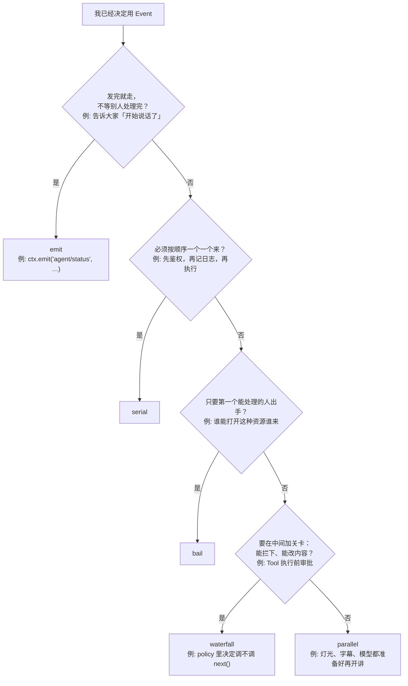

| 需求（白话）           | API         | 例子                      |
| ---------------------- | ----------- | ------------------------- |
| 喊一声就行             | `emit`      | 状态变成 `speaking`       |
| 所有旁听者都忙完再继续 | `parallel`  | 开讲前各插件预热          |
| 排队处理               | `serial`    | 有序中间件链              |
| 谁先接单谁干           | `bail`      | 选一个 provider / handler |
| 可审批、可改写、可否决 | `waterfall` | Tool 执行前的 policy      |

---

## 3. 记下来 / 当下通知 / 给 UI 看

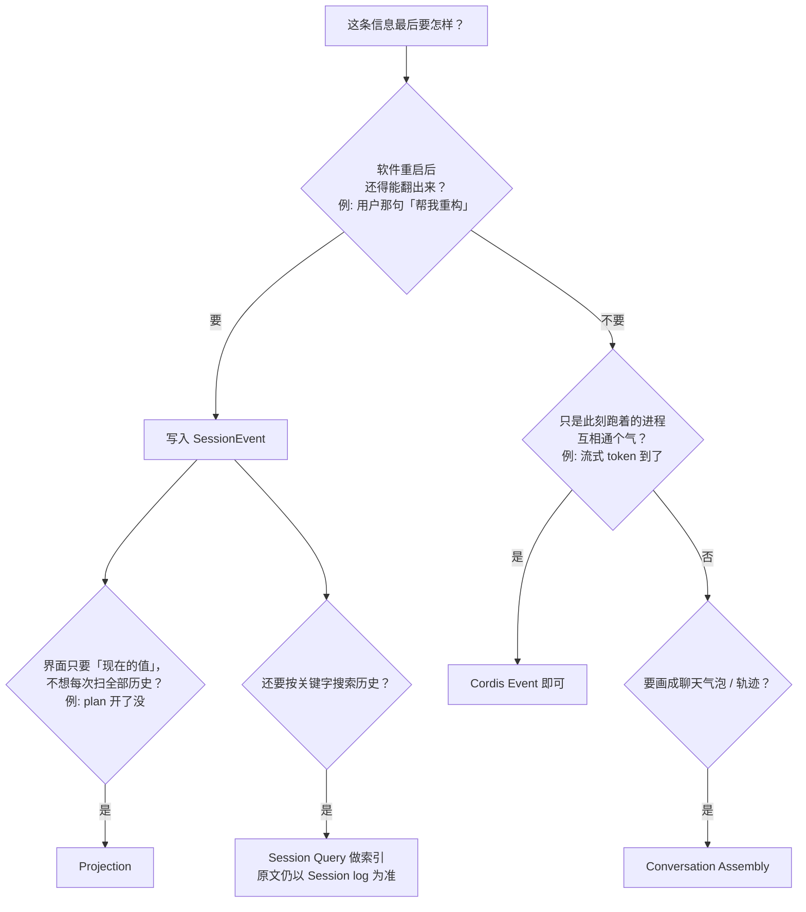

| 名字                  | 干什么               | 例子                                       |
| --------------------- | -------------------- | ------------------------------------------ |
| SessionEvent          | 永久事实             | `tool/call`、`turn/end`                    |
| `session/event`       | 刚写入时通知当前进程 | 投影更新、旁路监听                         |
| Projection            | 历史折成「现在」     | 当前 plan 开关                             |
| Conversation Assembly | 折成聊天 UI 结构     | 气泡、工具卡片                             |
| 动画 / 打字机效果     | 听 live Event        | `agent/status`，别拿 SessionEvent 当帧总线 |

---

## 4. Avatar / 角色反馈

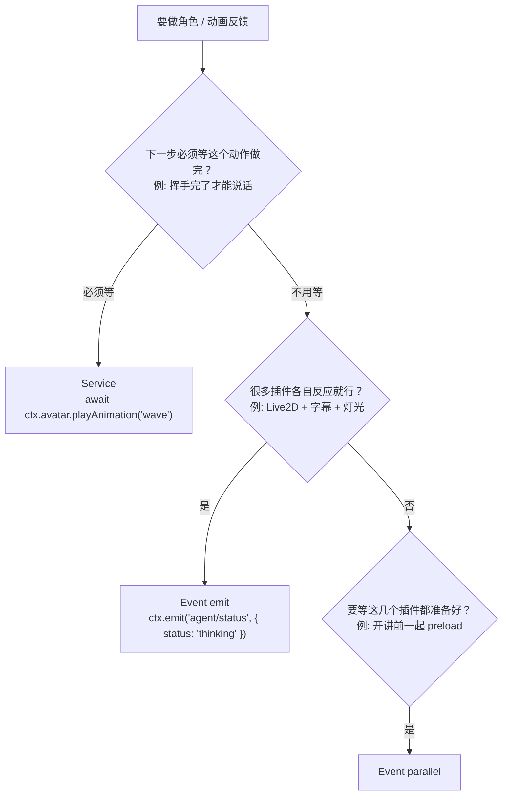

---

## 5. 命令跑在哪 / 要不要沙箱

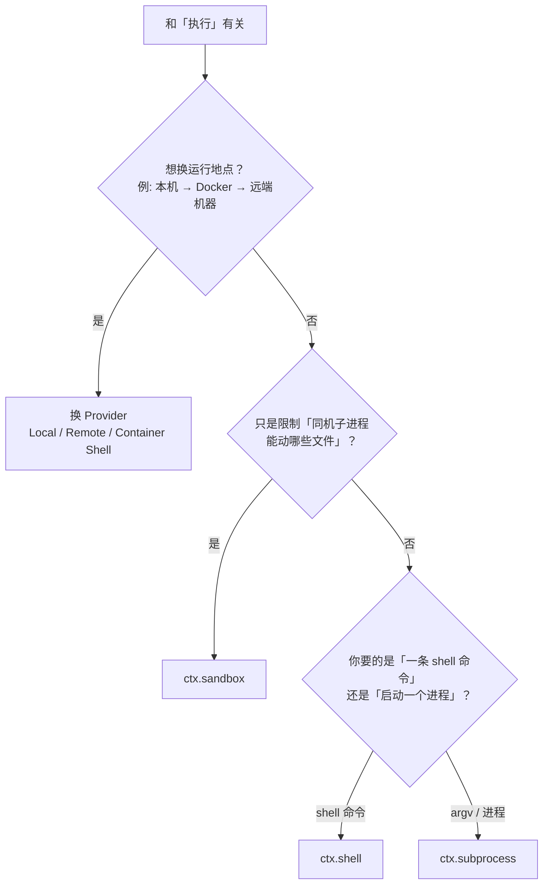

注意：Docker / 远端 / microVM = **换 Provider**，不是给 `ctx.sandbox` 再加一种实现。

---

## 6. 不同 Bot、不同限制

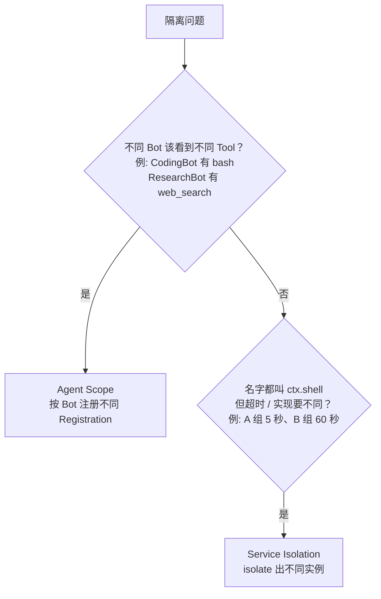

---

## 7. 长时间任务 vs 定时

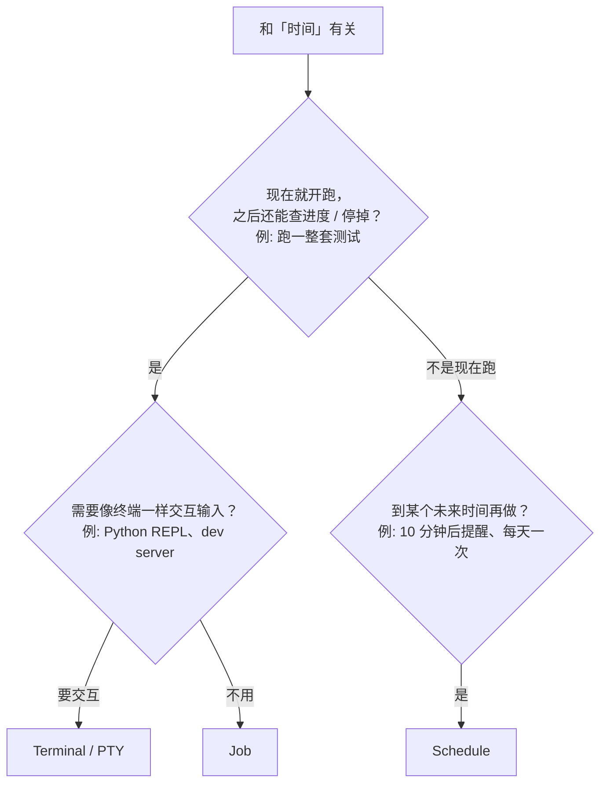

---

## 8. 子 Agent 怎么传话

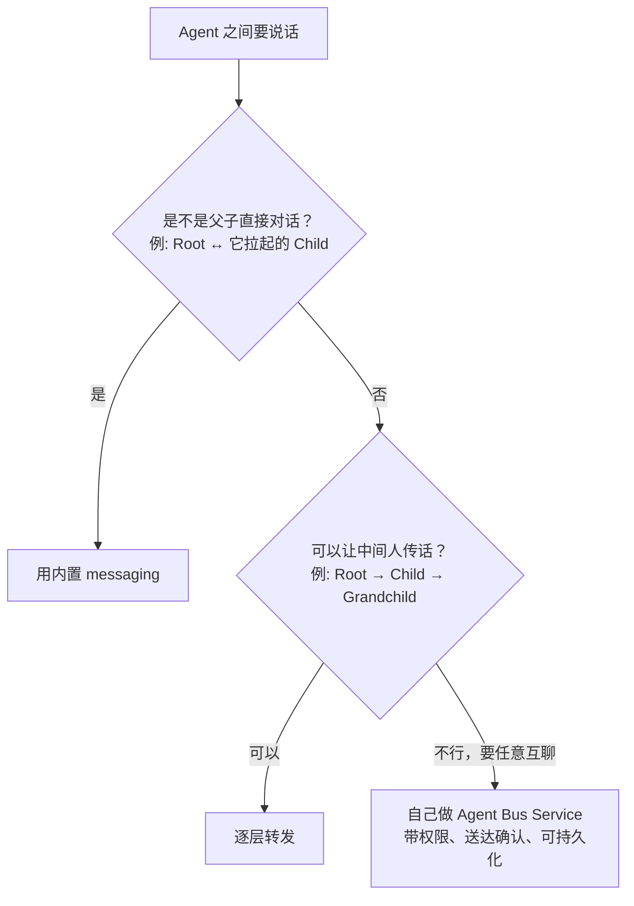

隔着 Session 传重要消息：**别**只靠进程内的 `emit`。

---

## 9. 数据放哪

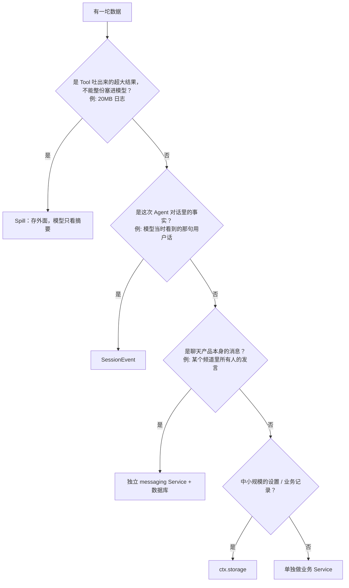

---

## 10. UI 插槽与怎么打包发布

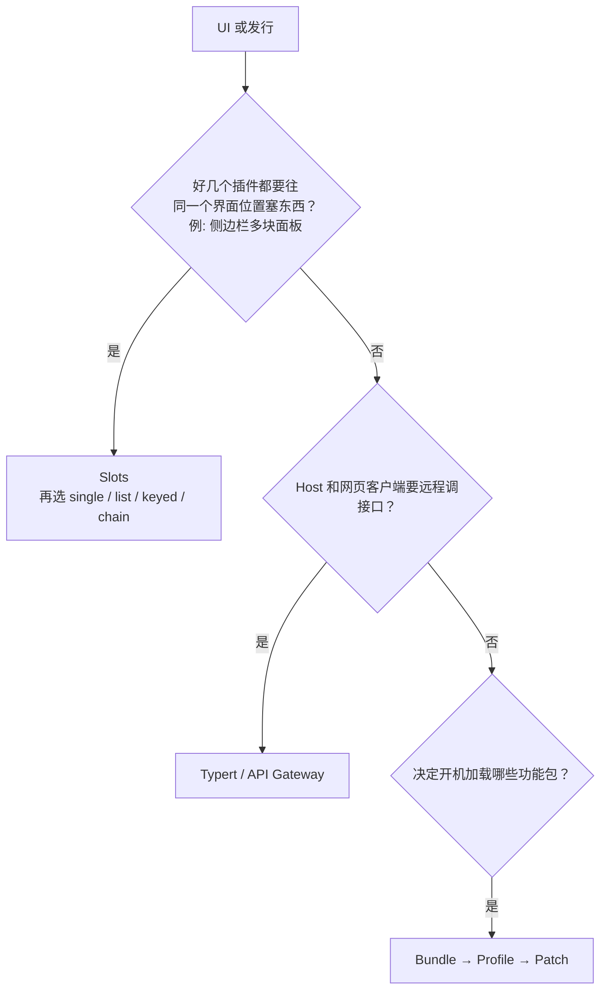

| Slot 类型 | 白话                   | 例子             |
| --------- | ---------------------- | ---------------- |
| `single`  | 只显示优先级最高的一个 | 默认主题         |
| `list`    | 大家并排都显示         | 工具栏按钮列表   |
| `keyed`   | 按 key 对号入座        | 按消息类型选卡片 |
| `chain`   | 按优先级问「你要接吗」 | 自定义渲染器     |

---

## 11. 一页速查

| 你想…                    | 用                     | 例子                       |
| ------------------------ | ---------------------- | -------------------------- |
| 喊一声，不等             | Event `emit`           | `agent/status = thinking`  |
| 等所有人准备好           | Event `parallel`       | 开讲前预热                 |
| 谁先接谁干               | Event `bail`           | 选 handler                 |
| 中间加审批 / 可改写      | Event `waterfall`      | Tool policy                |
| 请系统做事并拿结果       | Service                | `ctx.avatar.playAnimation` |
| 往清单加能力             | Registry               | 注册 Tool                  |
| 永久记下对话事实         | SessionEvent           | `tool/result`              |
| 问「现在开没开 plan」    | Projection             | 当前 plan 状态             |
| 不同 Bot 不同 Tool       | Agent Scope            | CodingBot + bash           |
| 同名 Service 不同配置    | Isolation              | 两个 `ctx.shell`           |
| 换本机 / 容器 / 远端     | 换 Provider            | Remote Shell               |
| 少打 LLM 来回批量干活    | Code Runtime           | 循环读 100 个文件          |
| 产品数据（非对话日志）   | Storage / 业务 Service | 用户设置                   |
| 搜历史对话               | Session Query          | FTS 索引                   |
| 大输出别撑爆上下文       | Spill                  | 大日志                     |
| 长任务 / 交互终端 / 定时 | Job / PTY / Schedule   | 测开、REPL、每天跑         |
| IM + Bot                 | messaging ≠ Session    | 频道消息 vs 模型所见       |
| UI 同一位置多插件        | Slots                  | 侧栏                       |
| 开机装哪些功能           | Profile / Bundle       | 发行组合                   |

---

## 12. 默认偏好（拿不准时按这个）

1. 「能做什么」用 Service/Tool；「准不准做」用 policy / waterfall / sandbox。
2. 要留档用 SessionEvent；当下通气用 Cordis Event。
3. 真源和搜索索引 / Projection 分开存。
4. 「在哪跑」换 Provider；「同机限文件」才用 sandbox。
5. 聊天产品消息和 Agent 对话日志分开。
6. 别什么协作都塞进 Event。
7. 插件卸掉时，它注册的东西应一起消失。
8. Profile 是功能组合，不是「用户账号」。
9. 「谁看得见哪些 Tool」和「同名 Service 用哪套实例」是两件事。
10. UI：远程边界用 Typert，聊天结构用 Conversation Assembly，插槽用 Slots。
