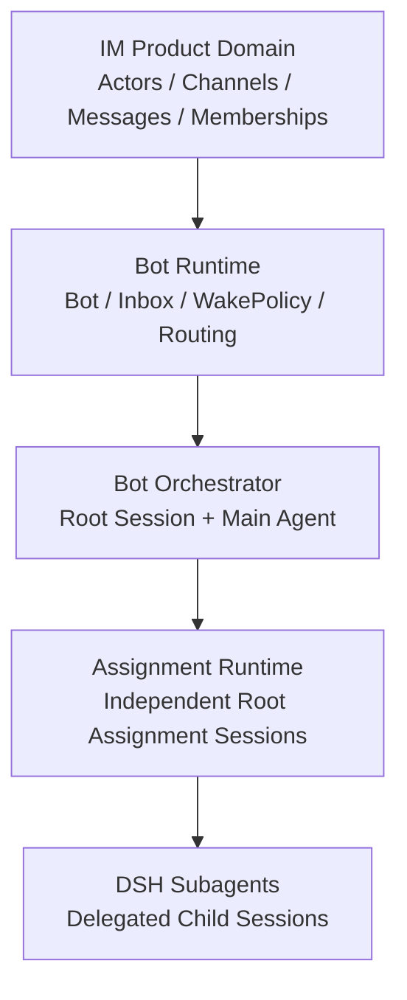
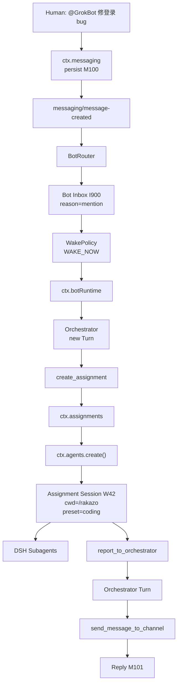

# GrokBot-like Multi-Agent IM on DeepSeek Harness

> **状态**：另一位架构师的 RFC 输入，保留用于追溯；它不是当前 BotHarness 的 normative architecture。经过 grill 后的产品术语以 `CONTEXT.md` 为准，整合架构以 living architecture 为准，取舍与理由以 `docs/adr/0035`–`0045` 为准；可复用的 DSH 模型已整理进 `dsh-plugin-dev` skill。
>
> **文档类型**：Architecture / Context / RFC Draft
> **目标**：在 DeepSeek Harness（DSH）上设计一个类似 GrokBot 的多人 IM + Bot Runtime。
>
> 核心原则：**Channel 是社交世界，Bot 是产品实体，Session 是 Agent 执行上下文。三者不要等同。**

---

# 1. Executive Summary

推荐把系统拆成四层：



推荐 Session 拓扑：

```text
Bot A
│
├── Orchestrator Root Session O
│   └── Orchestrator Agent
│
├── Assignment Root Session W1
│   └── Main Assignment Agent
│       ├── Subagent W1-A
│       └── Subagent W1-B
│
├── Assignment Root Session W2
│   └── Main Assignment Agent
│       └── Subagent W2-A
│
└── Assignment Root Session W3
    └── Main Assignment Agent
```

关键边界：

```text
Channel
≠ Bot
≠ Session
≠ Agent

Orchestrator Session
= Bot 的 control plane

Assignment Session
= 独立任务 / 项目 / Workspace 的顶层 DSH Session

Subagent Session
= Assignment Session 内部 delegated child Session
```

---

# 2. 为什么需要三层 Session

只用一个 Orchestrator Session 会导致：

```text
#coding 的 repo 上下文
#research 的论文上下文
DM 的私人任务
不同 Workspace
大量 Tool output
```

全部污染同一条长期 history。

而直接把所有任务做成 Orchestrator 的 Continuable Subagent，虽然 child 确实是独立 durable Session，但它仍然属于 **delegation tree**。

因此推荐：

```text
Product ownership graph:

Bot
├── Orchestrator Root Session
├── Assignment Root Session
├── Assignment Root Session
└── Assignment Root Session


DSH delegation graph:

Assignment Root Session
└── Subagent
    └── Subagent
```

这样：

- Orchestrator Session 保持“薄”；
- Assignment Session 承载真正任务上下文；
- Subagent 只负责 Assignment Session 内部任务拆解。

---

# 3. 三种通信网络

```text
NETWORK 1 — Product IM
Human ↔ Human
Human ↔ Bot
Bot ↔ Bot
via Channel / DM / ctx.messaging

NETWORK 2 — Bot Control Plane
Orchestrator ↔ Independent Assignment Sessions
via ctx.assignments

NETWORK 3 — DSH Delegation
Assignment Main Agent ↔ its Subagents
via ctx.subagents
```

不要混用：

```text
Bot A → Bot B
```

不是 Subagent communication，而是 IM peer communication。

而：

```text
Assignment Main Agent → Research Subagent
```

才是 delegation。

---

# 4. 产品领域模型

## 4.1 Actor

```ts
type Actor = { kind: 'human'; id: HumanId } | { kind: 'bot'; id: BotId };
```

## 4.2 Bot

```ts
interface Bot {
  id: BotId;
  name: string;

  persona: string;
  agentPreset?: string;

  orchestratorSessionId: SessionId;

  runtimeConfig: BotRuntimeConfig;
}
```

`BotId` 是产品 identity；`SessionId` 只是某个 DSH 执行历史 identity。

## 4.3 Channel

```ts
interface Channel {
  id: ChannelId;

  type: 'group' | 'dm';

  name?: string;
  createdAt: string;
}
```

DM 也统一建模成 Channel：

```text
Human ↔ Bot DM
Bot ↔ Bot DM
```

不需要另造一套 transport。

## 4.4 Membership

```ts
interface ChannelMembership {
  channelId: ChannelId;
  actorId: ActorId;
  role: 'owner' | 'member';
  joinedAt: string;
}
```

一个 Bot 可以加入多个 Channel：

```text
Bot N ↔ M Channel
```

## 4.5 Bot Channel Subscription

Membership 回答：

> Bot 在不在 Channel？

Subscription 回答：

> Bot 如何消费 Channel？

```ts
interface BotChannelSubscription {
  botId: BotId;
  channelId: ChannelId;

  mode: 'all' | 'mentions' | 'replies' | 'digest' | 'muted';

  wakePolicy?: WakePolicyConfig;
}
```

## 4.6 Message

```ts
interface ChannelMessage {
  id: MessageId;
  channelId: ChannelId;
  senderActorId: ActorId;

  content: MessageContent;

  replyTo?: MessageId;
  mentions: ActorId[];

  createdAt: string;

  causationId?: string;
  correlationId?: string;
  rootMessageId?: MessageId;
  botHopCount?: number;
}
```

`causationId` / `botHopCount` 用于防止多 Bot 无限互聊。

---

# 5. Bot Inbox 与 DSH Agent Inbox

这两层必须分开。

```text
Bot Inbox
= 产品级 mailbox
= 外部世界有哪些信息值得这个 Bot 考虑

Agent Inbox
= DSH execution queue
= 已决定交给某个 Agent 的 work 在何时进入 Turn/Step
```

Bot Inbox：

```ts
interface BotInboxItem {
  id: BotInboxItemId;
  botId: BotId;

  source: {
    kind: 'channel-message';
    channelId: ChannelId;
    messageId: MessageId;
  };

  reason: 'dm' | 'mention' | 'reply' | 'ambient' | 'bot-dm' | 'system';

  priority: 'low' | 'normal' | 'high' | 'urgent';

  state: 'pending' | 'deferred' | 'delivered' | 'consumed' | 'ignored';

  createdAt: string;
}
```

为什么不能只用 Agent Inbox：

- 普通 Channel 消息可能非常多；
- 需要 digest；
- 需要 dedupe；
- 需要 mute；
- 需要 priority；
- 需要 unread / consumed state；
- 需要 Bot offline / cold 时照常收信；
- 需要在真正送给模型前做聚合。

---

# 6. Wake Policy

WakePolicy 必须位于 Orchestrator 外面。

因为：

> 没醒的 Orchestrator 不能先运行 LLM 来决定自己是否要醒。

```text
Message
  ↓
Bot Inbox
  ↓
WakePolicy
  ↓
queue / wake / digest / ignore
```

推荐：

```ts
type WakeDecision =
  | { kind: 'wake-now' }
  | { kind: 'queue' }
  | { kind: 'digest'; deadline: string }
  | { kind: 'ignore' };
```

默认策略：

| 输入                     | 默认                    |
| ------------------------ | ----------------------- |
| Human → Bot DM           | wake-now                |
| Human @Bot               | wake-now                |
| Reply to Bot             | wake-now                |
| Bot → Bot DM             | wake-now / rate-limited |
| Ambient human message    | queue                   |
| Ambient bot message      | queue                   |
| Digest threshold reached | digest                  |
| Muted Channel            | ignore                  |

DSH Agent delivery 映射：

```text
WAKE_NOW
→ Agent.followup()

QUEUE_TURN
→ Agent.send(..., 'next-turn', false)

STEER_CURRENT
→ Agent.steer()

CONTEXT_ONLY
→ Agent.inject()
```

官方：
https://deepseek-harness.github.io/deepseek-harness/en/reference/subsystems/core

---

# 7. Orchestrator Session

Orchestrator 是 Bot 的 **control plane**。

## 负责

```text
处理 / 搜索 Bot Inbox
决定是否回复
决定是否创建或复用 Assignment Session
管理 Assignment Sessions
接收 Assignment reports
Bot-to-Human messaging
Bot-to-Bot messaging
高层 Goals
Channel social behavior
```

## 默认不负责

```text
长期编辑 Repo
运行大量 Bash
承载完整项目上下文
承载所有 Channel 原始历史
保存每个 Assignment Agent 的详细中间过程
```

生命周期：

```text
Orchestrator Session
≈ Bot lifetime

Orchestrator Agent
= 按需 live / resume
```

即：

```text
Bot 永久存在
≠ Agent JS object 永久驻留
```

---

# 8. Independent Assignment Session

这是本架构新增的关键概念。

```ts
interface AssignmentSession {
  botId: BotId;
  sessionId: SessionId;

  purpose: string;

  kind: 'ephemeral-task' | 'persistent-project' | 'channel-companion' | 'scheduled-monitor';

  source?: {
    channelId?: ChannelId;
    messageId?: MessageId;
    inboxItemIds?: BotInboxItemId[];
  };

  workspaceId?: WorkspaceId;
  agentPreset?: string;

  status: 'queued' | 'running' | 'waiting' | 'completed' | 'failed' | 'archived';

  createdAt: string;
  updatedAt: string;
}
```

注意：

```text
orchestratorSessionId
```

只是产品 ownership metadata。

不要等同于：

```text
SessionHeader.parentSession
```

Assignment Session 应该是 **独立 top-level DSH Session**。

---

# 9. 创建 Assignment Session

推荐 Tool 名：

```text
create_assignment
```

不要叫：

```text
create_worker_session
```

因为 `worker` 很容易和 Subagent 混淆。

内部使用 DSH：

```text
ctx.agents.create(...)
```

当前 DSH `ctx.agents.create()` 会创建 fresh Session + Agent，而且 `parentAgent` 是 optional。

因此：

```text
Orchestrator
    ↓
ctx.assignments.create()
    ↓
ctx.agents.create(parentAgent = undefined)
    ↓
Fresh Root Assignment Session
    ↓
Fresh Main Assignment Agent
```

官方：
https://deepseek-harness.github.io/deepseek-harness/en/reference/subsystems/core

---

# 10. Assignment Session + Workspace

如果任务属于某 Workspace：

```text
create_assignment({
  workspaceId: rakazo,
  purpose: "Fix authentication bug",
  agentPreset: "coding"
})
```

推荐：

```text
Workspace
    ↓ resolve path
ctx.agents.create(meta.cwd = workspace.path)
    ↓
Fresh Assignment Session
    ↓
workspace.attachSession(sessionId)
```

DSH Workspace 会校验 SessionHeader.cwd 与 Workspace canonical path 一致。

官方：
https://deepseek-harness.github.io/deepseek-harness/en/reference/subsystems/workspace

---

# 11. Assignment Session + Agent Preset

不同 Assignment Session 可以拥有不同能力：

```text
Orchestrator
preset = bot-orchestrator

Coding Assignment
preset = coding

Research Assignment
preset = research

Monitoring Assignment
preset = monitoring
```

因此每个 Assignment Session 都可以独立拥有：

```text
Workspace
Tools
Prompt Sections
Model / Provider options
Persona
Subagents
```

---

# 12. Assignment Session 内部 Subagents

这里直接使用 DSH 原生：

```text
ctx.subagents.startContinuable(...)
ctx.subagents.sendMessage(...)
ctx.subagents.listChildren(...)
```

例如：

```text
Assignment W1: Coding
│
└── Main Coding Agent
    ├── Research Subagent
    ├── Test Subagent
    └── Reviewer Subagent
```

这时 delegation 语义是正确的：

```text
Main Assignment Agent
→ delegate
→ child Agent
```

官方：
https://deepseek-harness.github.io/deepseek-harness/en/reference/subsystems/subagent

---

# 13. 建议新增的 Services

推荐至少新增四个产品层 Service：

```text
ctx.messaging
ctx.botInbox
ctx.botRuntime
ctx.assignments
```

可选：

```text
ctx.botDirectory
```

这些不是 DSH 当前内置能力。

---

# 14. `ctx.messaging`

IM Domain 的能力正门。

```ts
interface MessagingService {
  sendMessage(input: {
    actorId: ActorId;
    channelId: ChannelId;
    content: MessageContent;
    replyTo?: MessageId;
  }): Promise<ChannelMessage>;

  getMessage(input: { actorId: ActorId; messageId: MessageId }): Promise<ChannelMessage>;

  listMessages(input: {
    actorId: ActorId;
    channelId: ChannelId;
    before?: MessageId;
    limit: number;
  }): Promise<MessagePage>;

  searchMessages(input: {
    actorId: ActorId;
    query: string;
    channelIds?: ChannelId[];
  }): Promise<MessageSearchResult>;

  listChannels(input: { actorId: ActorId }): Promise<Channel[]>;
}
```

所有 API 带：

```text
actorId
```

因为 Tool visibility 不等于 authorization。

Provider 必须检查：

```text
Actor 是否属于 Channel
Actor 是否有 read/send 权限
```

---

# 15. `ctx.botInbox`

Bot 产品级 Mailbox。

```ts
interface BotInboxService {
  enqueue(input: {
    botId: BotId;
    source: BotInboxSource;
    reason: BotInboxReason;
    priority?: BotInboxPriority;
  }): Promise<BotInboxItem>;

  list(input: {
    botId: BotId;
    state?: BotInboxState[];
    reason?: BotInboxReason[];
    limit?: number;
  }): Promise<BotInboxPage>;

  get(input: { botId: BotId; itemId: BotInboxItemId }): Promise<BotInboxItem>;

  search(input: {
    botId: BotId;
    query?: string;
    channelId?: ChannelId;
    state?: BotInboxState[];
  }): Promise<BotInboxPage>;

  acknowledge(input: { botId: BotId; itemIds: BotInboxItemId[] }): Promise<void>;
}
```

---

# 16. `ctx.botRuntime`

负责：

```text
BotId
→ Orchestrator SessionId
→ live Agent / cold Session
→ Agent Inbox
```

```ts
interface BotRuntimeService {
  wake(botId: BotId): Promise<void>;

  deliver(input: {
    botId: BotId;
    stimulus: BotStimulus;

    mode: 'queue' | 'wake' | 'steer' | 'context';
  }): Promise<BotDeliveryReceipt>;

  status(botId: BotId): Promise<BotRuntimeStatus>;
}
```

内部：

```text
Bot Repository
    ↓
orchestratorSessionId
    ↓
ctx.agents.get(...)
    ↓
if cold → ctx.agents.resume(...)
    ↓
followup / steer / inject
```

---

# 17. `ctx.assignments`

负责 Bot 与独立 Assignment Root Sessions。

```ts
interface AssignmentRuntimeService {
  create(input: {
    botId: BotId;
    purpose: string;
    kind?: AssignmentKind;

    workspaceId?: WorkspaceId;
    agentPreset?: string;

    source?: AssignmentSource;
    initialMessage?: MessageContent;
  }): Promise<AssignmentSession>;

  list(input: { botId: BotId; status?: AssignmentStatus[] }): Promise<AssignmentSession[]>;

  get(input: { botId: BotId; sessionId: SessionId }): Promise<AssignmentSession>;

  send(input: {
    botId: BotId;
    sessionId: SessionId;
    message: MessageContent;

    delivery?: 'queue' | 'wake' | 'steer';
  }): Promise<AssignmentDeliveryReceipt>;

  report(input: { botId: BotId; sessionId: SessionId; report: AssignmentReport }): Promise<void>;

  stop(input: { botId: BotId; sessionId: SessionId }): Promise<void>;
}
```

`send()` 内部：

```text
authorize Bot ownership
    ↓
resolve owned Assignment Session
    ↓
Agent live?
    ├── yes
    └── no → ctx.agents.resume(...)
    ↓
Agent.followup / steer
```

不要用 `ctx.subagents.sendMessage()`，因为 Assignment Session 不是 Orchestrator 的 direct child subagent。

---

# 18. Messaging Events

Service 做 command/query。

Event 做 notification。

推荐：

```text
messaging/message-created
messaging/message-edited
messaging/message-deleted

bot-inbox/enqueued
bot-inbox/consumed

bot-runtime/activated
bot-runtime/slept

bot-work/created
bot-work/status-changed
bot-work/reported
bot-work/archived
```

例如：

```text
ctx.messaging.sendMessage()
        ↓
DB COMMIT
        ↓
emit messaging/message-created
```

不要用 Event 代替 `sendMessage()` 本身。

---

# 19. Message Router

```text
messaging/message-created
        ↓
BotRouter Plugin
        ↓
lookup memberships
lookup subscriptions
parse mentions / replies
classify sender
        ↓
fan-out BotInboxItems
```

示例：

```text
Alice in #agents:
@BotA 帮忙研究一下

Bot A:
mention → Inbox + wake

Bot B:
ambient → Inbox + queue

Bot C:
muted → no Inbox
```

---

# 20. Bot-to-Bot DM

Bot A / Bot B 是 peer actors。

因此：

```text
Bot A Orchestrator
    ↓
send_message_to_channel
    ↓
ctx.messaging
    ↓
DM Channel
    ↓
message-created
    ↓
Bot B Inbox
    ↓
WakePolicy
    ↓
Bot B Orchestrator
```

**不要**走：

```text
Subagent messaging
```

因为 Subagent 表达 parent-child delegation，不是 peer social messaging。

---

# 21. Orchestrator-only Tool Set

## Messaging

```text
send_message_to_channel
reply_to_message
get_channel_messages
search_channel_messages
list_channels
```

## Inbox

```text
list_inbox
get_inbox_item
search_inbox
ack_inbox_items
defer_inbox_items
```

## Assignment Control

```text
create_assignment
list_assignments
inspect_assignment
send_assignment_request
stop_assignment
```

Orchestrator 是 Bot social identity 的 owner。

---

# 22. Assignment Session Tool Set

典型：

```text
filesystem
bash
lsp
web
code-runtime
subagent
```

额外：

```text
report_to_orchestrator
```

默认不给：

```text
send_message_to_channel
search_entire_bot_inbox
create_assignment
arbitrary top-level work control
```

---

# 23. Subagent Tool Set

根据 Assignment Session 自己需要进一步 restrict。

例如：

```text
Researcher:
web
read

Coder:
read
write
bash
lsp

Reviewer:
read
grep
```

DSH `ctx.tools` 支持 scoped Tool registrations / restrictions。

官方：
https://deepseek-harness.github.io/deepseek-harness/en/reference/subsystems/tools

---

# 24. Assignment Session → Orchestrator

Assignment Agent 默认不直接发外部 Channel。

推荐：

```text
Assignment Agent
    ↓
report_to_orchestrator
    ↓
ctx.assignments.report()
    ↓
Orchestrator Inbox / stimulus
    ↓
Orchestrator Turn
    ↓
send_message_to_channel
```

理由：

```text
persona consistency
ACL
rate limit
moderation
social identity
audit
```

全部集中在 Orchestrator。

---

# 25. Limited Channel Access for Assignment Sessions

Assignment Session 可以有有限读取能力，例如：

```text
get_source_channel_messages
```

或者：

```text
search_channel_messages
```

但 Service side 强制：

```text
allowedChannelIds = AssignmentSession.source channel(s)
```

不要默认给：

```text
整个 Bot Inbox
所有 DM
所有 Channel
```

---

# 26. 防止 Bot 无限互聊

多 Bot 产品必须有 deterministic loop prevention。

建议 Message 保存：

```text
causationId
correlationId
rootMessageId
botHopCount
```

策略：

```text
Human @Bot
→ immediate wake

Bot DM
→ immediate but rate-limited

Bot @Bot
→ immediate but hop-limited

Bot ambient group message
→ queue only

botHopCount > N
→ no auto wake
```

再配合：

```text
per-channel bot rate limit
same-correlation cooldown
per-bot token budget
```

不要只依赖 prompt。

---

# 27. Persistence Boundaries

## DSH Session Persistence

保存：

```text
Agent execution history
SessionEvent log
```

当前官方 shipped provider 是 JSONL。

官方：
https://deepseek-harness.github.io/deepseek-harness/en/reference/subsystems/persistence

## IM Persistence

独立保存：

```text
Actors
Bots
Channels
Memberships
Subscriptions
Messages
Bot Inbox
AssignmentSession metadata
```

小规模可 SQLite。

大规模 / multi-node 可 Postgres。

---

# 28. 为什么 Channel Message 与 Session 中会重复出现

例如：

```text
Channel Message M123:
“帮我修这个 bug”
```

IM DB 保存它，因为：

```text
“这个 Channel 发生了什么？”
```

Orchestrator 真正看到它时，DSH Session 也应该记录 model-visible representation，因为：

```text
“这个模型当时看到了什么？”
```

两者 source of truth 不同，所以合理重复。

---

# 29. 不要把整个 Channel 自动复制到 Session

正确：

```text
Channel: 10000 messages
    ↓
Agent searches
    ↓
20 relevant messages
    ↓
Tool Result
    ↓
Session history
```

错误：

```text
Bot 是 Channel member
→ 自动把 Channel 全历史塞进 Orchestrator
```

Session 应记录模型实际看过的信息，不是理论可访问全集。

---

# 30. AgentHandle Ownership

DSH `ctx.agents.create()` / `resume()` 返回 `AgentHandle`，其 holder 拥有 live Agent teardown capability。

因此 Independent Assignment Sessions 最好由：

```text
AssignmentRuntime Plugin / Service
```

作为 structural runtime owner。

不要简单让：

```text
Orchestrator Agent scoped context
```

持有所有 Assignment Agent handles，否则 Orchestrator live Agent teardown 可能和 Assignment Agent lifecycle 不合理耦合。

官方：
https://deepseek-harness.github.io/deepseek-harness/en/reference/subsystems/core

---

# 31. Full End-to-End Flow



---

# 32. Scenario：Persistent Project Assignment Session

Assignment Session 不一定一次性。

例如：

```text
Project Alpha
```

长期拥有：

```text
Assignment Session A-project-alpha
kind = persistent-project
workspace = /repos/project-alpha
```

后续相关 Inbox：

```text
“Alpha build 又挂了”
```

Orchestrator 选择：

```text
send_assignment_request(A-project-alpha)
```

而不是重新新建。

建议 kind：

```text
ephemeral-task
persistent-project
channel-companion
scheduled-monitor
```

---

# 33. Proposed Package Split

一种可行拆包：

```text
dsh-bot-domain
  Bot / Actor types

dsh-messaging
  ctx.messaging definition

dsh-messaging-sqlite
  Messaging provider

dsh-bot-inbox
  ctx.botInbox

dsh-bot-router
  message-created → Bot Inbox

dsh-bot-runtime
  ctx.botRuntime

dsh-assignment-runtime
  ctx.assignments

dsh-tool-bot-messaging
  Orchestrator IM tools

dsh-tool-bot-inbox
  Orchestrator Inbox tools

dsh-tool-assignments
  Assignment Session control tools

dsh-tool-assignment-report
  Assignment Agent → Orchestrator report
```

---

# 34. MVP Roadmap

## MVP 1

```text
Actors
Channels
Messages
Membership
ctx.messaging
Bot Inbox
WakePolicy
Orchestrator
send_message_to_channel
```

先完成：

```text
Human @Bot
→ wake
→ Bot reply
```

## MVP 2

增加：

```text
ctx.assignments
create_assignment
list_assignments
inspect_assignment
send_assignment_request
stop_assignment
report_to_orchestrator
```

## MVP 3

Assignment Session 内接：

```text
DSH Subagents
```

## MVP 4

增加：

```text
Bot-to-Bot DM
multi-Bot group
digest
loop prevention
persistent project sessions
```

---

# 35. 关键名词定义

| 名词                 | 定义                                                     |
| -------------------- | -------------------------------------------------------- |
| Actor                | IM 中能发 / 收消息的 Human 或 Bot                        |
| Bot                  | 产品级长期 AI actor identity                             |
| Channel              | 独立 IM 社交空间；可以是 group 或 dm                     |
| Bot Inbox            | 产品级 mailbox，存尚待 Bot 判断的 stimuli                |
| Agent Inbox          | DSH Agent 的执行队列                                     |
| WakePolicy           | 决定 Inbox 是否 queue / wake / digest / ignore           |
| Orchestrator Session | Bot 长期 control-plane Session                           |
| Orchestrator Agent   | 当前驱动 Orchestrator Session 的 live Agent              |
| Assignment Session   | 独立任务 / 项目顶层 DSH Session                          |
| Assignment Agent     | Assignment Session 的 Main Agent                         |
| Subagent Session     | DSH 原生 delegated child Session                         |
| Service              | `ctx.<name>` 稳定 capability API                         |
| Provider             | Service 的具体 implementation                            |
| Consumer             | 使用 Service 的 Tool / Plugin / listener / other Service |
| Cordis Event         | runtime notification / interception extension point      |
| Tool                 | 面向模型的 capability adapter / Consumer                 |
| Agent Scope          | 控制 per-Agent registrations / Tool visibility           |
| Workspace            | DSH 稳定目录记录，Assignment Session 可绑定              |

---

# 36. DSH Native vs Proposed APIs

## DSH Native

```text
ctx.agents.create(...)
ctx.agents.resume(...)

Agent.send(...)
Agent.followup(...)
Agent.steer(...)
Agent.inject(...)

ctx.subagents.startContinuable(...)
ctx.subagents.sendMessage(...)
ctx.subagents.listChildren(...)

ctx.tools.register(...)
ctx.tools.restrict(...)

ctx.workspaceRegistry
Workspace.attachSession(...)

Session
SessionEvent
SessionPersistence
```

## Proposed Product-layer APIs

```text
ctx.messaging
ctx.botInbox
ctx.botRuntime
ctx.assignments

send_message_to_channel
search_channel_messages

list_inbox
search_inbox

create_assignment
list_assignments
inspect_assignment
send_assignment_request
stop_assignment
report_to_orchestrator
```

必须明确区分，避免把产品层设计误认为 DSH 已有 API。

---

# 37. 最终 Mental Model

```text
                          SOCIAL WORLD
                             │
               ┌─────────────┴─────────────┐
               │                           │
            Channels                    Messages
               │                           │
               └─────────────┬─────────────┘
                             ▼
                          Bot Inbox
                             │
                         WakePolicy
                             │
                             ▼
                    BOT CONTROL PLANE
                             │
                       Orchestrator
                       Root Session
                             │
                             ▼
                       ctx.assignments
                             │
           ┌─────────────────┼─────────────────┐
           ▼                 ▼                 ▼
        Assignment W1           Assignment W2           Assignment W3
       Root Session      Root Session      Root Session
           │                 │                 │
           ▼                 ▼                 ▼
       Main Agent        Main Agent        Main Agent
           │                 │                 │
           ▼                 ▼                 ▼
       Subagents         Subagents         Subagents
```

最重要的一句话：

> **Channel 是 Bot 所处的社会世界；Bot Inbox 是社会世界对 Bot 的输入缓冲层；Orchestrator 是 Bot 的控制平面；Assignment Session 是独立任务 / 项目的顶层上下文；Subagent 是 Assignment Session 内部的 delegated worker。**

---

# 38. Official DeepSeek Harness References

- DeepSeek Harness Architecture
  https://deepseek-harness.github.io/deepseek-harness/en/reference/

- Core / Agent Runtime
  https://deepseek-harness.github.io/deepseek-harness/en/reference/subsystems/core

- Sessions
  https://deepseek-harness.github.io/deepseek-harness/en/reference/subsystems/session

- Session Persistence
  https://deepseek-harness.github.io/deepseek-harness/en/reference/subsystems/persistence

- Scoped Registration
  https://deepseek-harness.github.io/deepseek-harness/en/reference/subsystems/scope

- Tools
  https://deepseek-harness.github.io/deepseek-harness/en/reference/subsystems/tools

- Subagents
  https://deepseek-harness.github.io/deepseek-harness/en/reference/subsystems/subagent

- Workspaces
  https://deepseek-harness.github.io/deepseek-harness/en/reference/subsystems/workspace
